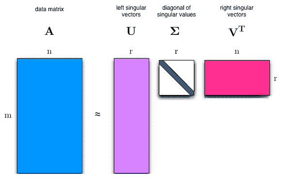

# 用 Tensorflow 2.0 进行奇异值分解

> 原文：<https://dev.to/mmithrakumar/singular-value-decomposition-with-tensorflow-2-0-4cnf>

**奇异值分解(SVD)** 提供了将矩阵分解成**奇异向量**和**奇异值**的另一种方法。奇异值分解使我们能够发现一些与特征分解揭示的信息相同的信息，然而，奇异值分解具有更广泛的适用性。每一个实矩阵都有一个奇异值分解，但特征值分解不一样。SVD 可以写成:

**A = UDV^T**

假设 **A** 是一个 *m x n* 矩阵，那么 **U** 被定义为一个 *m x m* 旋转矩阵， **D** 为一个 *m x n* 矩阵缩放&投影矩阵， **V** 为一个 *n x n* 旋转矩阵。

这些矩阵中的每一个都被定义为具有特殊的结构。矩阵 **U** 和 **V** 都被定义为正交矩阵 **U^T = U^(-1)和 V^T = V^(-1)** 。矩阵 **D** 被定义为对角矩阵。

沿着 **D** 对角线的元素被称为矩阵 **A** 的**奇异值**。 **U** 的列被称为**左奇异向量**。 **V** 的列被称为**右奇异向量**。

[](https://res.cloudinary.com/practicaldev/image/fetch/s--yi33NPOc--/c_limit%2Cf_auto%2Cfl_progressive%2Cq_auto%2Cw_880/https://raw.githubusercontent.com/adhiraiyan/DeepLearningWithTF2.0/master/notebooks/figures/fig0208a.png)T3】

```
# mxn matrix A svd_matrix_A = tf.constant([[2, 3], [4, 5], [6, 7]], dtype=tf.float32)
print("Matrix A: \n{}\n".format(svd_matrix_A))

# Using tf.linalg.svd to calculate the singular value decomposition where d: Matrix D, u: Matrix U and v: Matrix V d, u, v = tf.linalg.svd(svd_matrix_A, full_matrices=True, compute_uv=True)
print("Diagonal D: \n{} \n\nMatrix U: \n{} \n\nMatrix V^T: \n{}".format(d, u, v))

Matrix A:
[[2. 3.]
 [4. 5.]
 [6. 7.]]

Diagonal D:
[11.782492    0.41578525]

Matrix U:
[[ 0.30449855 -0.86058956  0.40824753]
 [ 0.54340035 -0.19506174 -0.81649673]
 [ 0.78230214  0.47046405  0.40824872]]

Matrix V^T:
[[ 0.63453555  0.7728936 ]
 [ 0.7728936  -0.63453555]] 
```

Enter fullscreen mode Exit fullscreen mode

```
# Lets see if we can bring back the original matrix from the values we have 
# mxm orthogonal matrix U svd_matrix_U = tf.constant([[0.30449855, -0.86058956, 0.40824753], [0.54340035, -0.19506174, -0.81649673], [0.78230214, 0.47046405, 0.40824872]])
print("Orthogonal Matrix U: \n{}\n".format(svd_matrix_U))

# mxn diagonal matrix D svd_matrix_D = tf.constant([[11.782492, 0], [0, 0.41578525], [0, 0]], dtype=tf.float32)
print("Diagonal Matrix D: \n{}\n".format(svd_matrix_D))

# nxn transpose of matrix V svd_matrix_V_trans = tf.constant([[0.63453555, 0.7728936], [0.7728936, -0.63453555]], dtype=tf.float32)
print("Transpose Matrix V: \n{}\n".format(svd_matrix_V_trans))

# UDV(^T) svd_RHS = tf.tensordot(tf.tensordot(svd_matrix_U, svd_matrix_D, axes=1), svd_matrix_V_trans, axes=1)

predictor = tf.reduce_all(tf.equal(tf.round(svd_RHS), svd_matrix_A))
def true_print(): print("It WORKS. \nRHS: \n{} \n\nLHS: \n{}".format(tf.round(svd_RHS), svd_matrix_A))
def false_print(): print("Condition FAILED. \nRHS: \n{} \n\nLHS: \n{}".format(tf.round(svd_RHS), svd_matrix_A))

tf.cond(predictor, true_print, false_print)

Orthogonal Matrix U:
[[ 0.30449855 -0.86058956  0.40824753]
 [ 0.54340035 -0.19506174 -0.81649673]
 [ 0.78230214  0.47046405  0.40824872]]

Diagonal Matrix D:
[[11.782492    0.        ]
 [ 0.          0.41578525]
 [ 0.          0.        ]]

Transpose Matrix V:
[[ 0.63453555  0.7728936 ]
 [ 0.7728936  -0.63453555]]

It WORKS.
RHS:
[[2. 3.]
 [4. 5.]
 [6. 7.]]

LHS:
[[2. 3.]
 [4. 5.]
 [6. 7.]] 
```

Enter fullscreen mode Exit fullscreen mode

矩阵 **A** 可以看作是线性变换。这个转换可以分解成三个子转换:

1.  旋转，
2.  重新缩放和投影，
3.  旋转。

这三个步骤对应于三个矩阵 **U、D 和 V**

让我们按顺序
看看这些转换是如何发生的

```
# Let's define a unit square svd_square = tf.constant([[0, 0, 1, 1],[0, 1, 1, 0]], dtype=tf.float32)

# a new 2x2 matrix svd_new_matrix = tf.constant([[1, 1.5], [0, 1]])

# SVD for the new matrix new_d, new_u, new_v = tf.linalg.svd(svd_new_matrix, full_matrices=True, compute_uv=True)

# lets' change d into a diagonal matrix new_d_marix = tf.linalg.diag(new_d)

# Rotation: V^T for a unit square plot_transform(svd_square, tf.tensordot(new_v, svd_square, axes=1), "$Square$", "$V^T \cdot Square$", "Rotation", axis=[-0.5, 3.5 , -1.5, 1.5])
plt.show()

# Scaling and Projecting: DV^(T) plot_transform(tf.tensordot(new_v, svd_square, axes=1), tf.tensordot(new_d_marix, tf.tensordot(new_v, svd_square, axes=1), axes=1), "$V^T \cdot Square$", "$D \cdot V^T \cdot Square$", "Scaling and Projecting", axis=[-0.5, 3.5 , -1.5, 1.5])
plt.show()

# Second Rotation: UDV^(T) trans_1 = tf.tensordot(tf.tensordot(new_d_marix, new_v, axes=1), svd_square, axes=1)
trans_2 = tf.tensordot(tf.tensordot(tf.tensordot(new_u, new_d_marix, axes=1), new_v, axes=1), svd_square, axes=1)
plot_transform(trans_1, trans_2,"$U \cdot D \cdot V^T \cdot Square$", "$D \cdot V^T \cdot Square$", "Second Rotation", color=['#1190FF', '#FF9A13'], axis=[-0.5, 3.5 , -1.5, 1.5])
plt.show()


 
```

Enter fullscreen mode Exit fullscreen mode

可以为每个矩阵找到上述子变换，如下所示:

*   **U** 对应于**a^t**的特征向量
*   **V** 对应 **A^T A** 的特征向量
*   **D** 对应的特征值 **A A^T** 或 **A^T A** 相同。

作为练习，试着证明这是事实。

也许 SVD 最有用的特性是，我们可以用它将矩阵求逆部分推广到非方矩阵，我们将在下一节中看到。

* * *

这是《用 Tensorflow 2.0 进行深度学习》一书《用 Tensorflow 2.0 进行线性代数》一章的第八节。

您可以阅读本节和以下主题:

02.01 —标量、向量、矩阵和张量
02.02 —乘法矩阵和向量
02.03 —单位矩阵和逆矩阵
02.04 —线性相关性和跨度
02.05 —范数
02.06 —特殊类型的矩阵和向量
02.07 —特征分解
02.08 —奇异值分解
02.09 —摩尔-彭罗斯伪逆
02

在[用 TF 2.0 深度学习:02.00-线性代数](https://www.adhiraiyan.org/deeplearning/02.00-Linear-Algebra)。你可以在这里获得这篇文章和本章[其余部分的代码。Google Colab 和 Jupyter Binder 中笔记本的链接在](https://github.com/adhiraiyan/DeepLearningWithTF2.0)[笔记本](https://www.adhiraiyan.org/deeplearning/02.00-Linear-Algebra)的末尾。