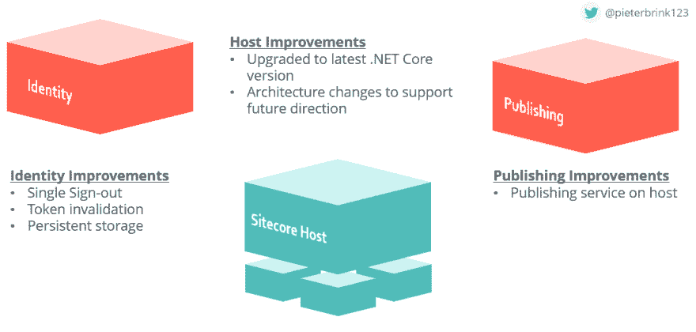

# sitecore 9.2–创新亮点

> 原文：<https://dev.to/sitecore/sitecore-9-2-innovation-highlights-10fn>

每个版本都包含几项创新。我想重点介绍针对不同目标受众的 3 项创新。我将为前端开发人员介绍一些内容，为后端开发人员介绍一些内容，最后为经常使用 Sitecore 编辑工具的人介绍一些内容。

## Sitecore JSS

Sitecore JSS 是我们在过去版本中的主要创新之一，我们将继续在无头领域投资和创新。

同 9.2； **JSS 和 SXA** 将无缝合作，选项包括:

*   支持多站点的数据源管理，
*   跨页面和网站重用演示文稿，以及
*   企业级应用治理、管理和搭建。

简而言之，您的 JSS 应用现在将能够受益于 SXA 提供的所有平台增强。这将使您能够在同一个平台实例中构建 JSS 应用程序以及一个或多个 SXA 站点。

**支持 Sitecore 表单**

在 9.2 版本中，您现在可以显示在 JSS 应用程序的 Sitecore 表单模块中设计的表单。您可以提交表单数据并为每个表单触发适当的自动化。当然，像所有 JSS 功能一样，我们确保保留完整的平台功能。

## Sitecore 主机

正如在 2018 年 Sitecore 研讨会上提到的，我们一直在寻求标准化我们在所有新微服务中处理常见活动的方式。

我们已经建立了一系列处理这些活动的组件，比如日志记录、配置、插件管理等等。

去年，在 2018 年 Sitecore 研讨会上，我们介绍了 Sitecore 主机的概念。Sitecore Host 标准化了微服务架构，该架构将成为平台内所有这些常见功能的核心。这很好，因为这意味着我们将在整个平台上实现一致性，一种日志记录方法，一种配置方法，等等。这意味着您不必为每个微服务学习不同的技术和方法，让您的生活变得更加简单。

### Sitecore 主机更新

座谈会后，我们继续努力在 Sitecore 主机。我们不仅更新了到**33党库**包括**的最新版本。网芯**。我们也一直在努力改进针对主机构建的服务。

### Sitecore 身份服务改进

Sitecore 身份服务是我们在 9.1 版本中推出的第一个在 Sitecore 主机上运行的服务，我们在 9.2 版本中做了一些新的改进。我们已经实现了**单点登录**，所以如果你退出我们的一个系统，那么你将退出所有系统。我们已经实现了**令牌失效**，以确保访问令牌在用户注销时过期。

最后，我们还添加了用户和访问令牌的**持久存储**,以确保用户在身份服务重启时不会被注销。

### 现有微服务的迁移

但这还不是全部！我们已经提到，不仅未来的服务将在主机上运行，而且我们希望将现有的微服务也迁移到主机上，这就是我们正在做的事情。

从 9.2 开始，发布引擎也将基于主机。这意味着它极大地改进了这项服务的安装和维护。此外，这更好地将服务与平台的其余部分结合起来。

对于我们基于微服务的未来来说，这些都是好消息！

## 地平线

转向最终用户的最后一项创新。Horizon 是 web 内容管理的下一代体验。

Horizon 的进展如何？我们与合作伙伴、MVP 和 UX 研究团队进行了多次预演。我们收到了诚实的反馈和非常积极的反馈，这些反馈证实了我们走在正确的道路上。

有了 9.2 就到了下一阶段。我们将根据您的意见重点添加新的特性、功能和改进。

我们也扩展了眼界；

*   **插件基础设施**允许**可扩展性**。
*   **扩展 API 网关**接收**自定义数据**。
*   可能对**自定义**的**编辑解决方案**。

在下一阶段，我们将继续反馈循环、预览和开发，直到 Horizon 的初始发布。

本文是 [9.2 博客系列的一部分。](http://www.pieterbrinkman.com/category/sitecore/sitecore-9-2/)

帖子[Sitecore 9.2——创新亮点](http://www.pieterbrinkman.com/2019/08/05/sitecore-9-2-innovation-highlights/)最先出现在 PieterBrinkman.com[的](http://www.pieterbrinkman.com)上。