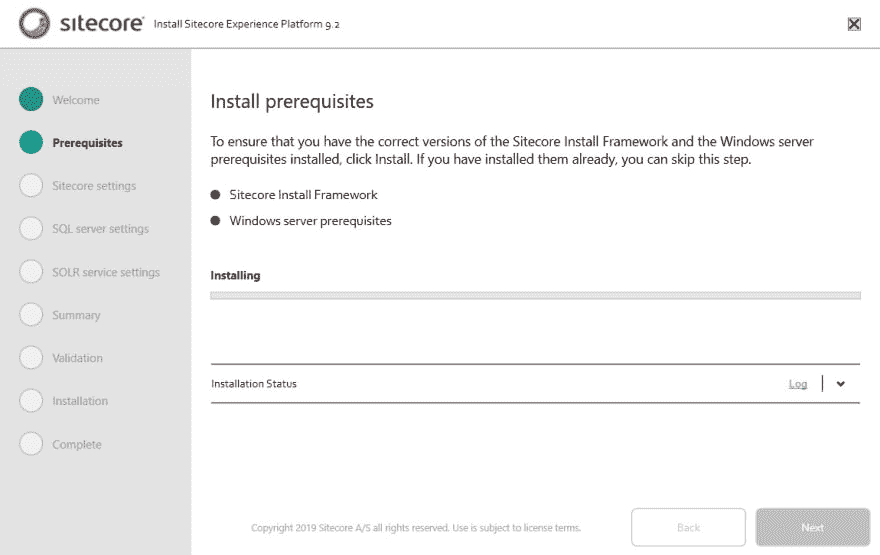
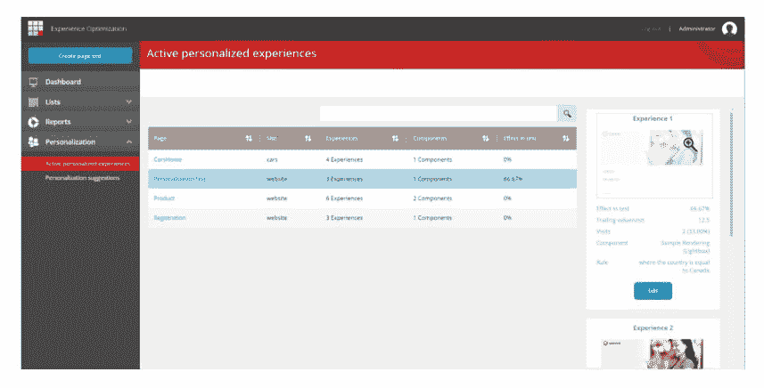

# sitecore 9.2–上市时间亮点

> 原文：<https://dev.to/sitecore/sitecore-9-2-time-to-market-highlights-54hm>

在之前的一篇博客文章中，我写了 Sitecore 策略如何有三个投资支柱，以及这如何影响你作为开发者的日常工作。我们已经介绍了[创新](https://dev.to/pieterbrink123/sitecore-9-2-innovation-highlights-1gdd-temp-slug-4952724)，让我们深入探讨一下我们即将推出的上市时间改进所能带来的效率。

Sitecore 9.2 包含许多效率改进，但与上一节一样，我选择了 3 个关键领域，它们将帮助您更高效地完成工作，并加快我们共同客户的上市时间。帮助您更快启动和运行的功能，提高不同实现之间标准化的功能，以及帮助营销人员日常工作的功能。

## Sitecore 安装助手(SIA)

随着 Sitecore 9 的发布，我们引入了 Sitecore 安装框架(SIF)，一种安装 Sitecore 的新方法。SIF 对于 it 和 DevOps 来说都是很棒的，可以自动安装 Sitecore。我们还收到反馈，我们需要为本地开发提供更简单的安装体验，并为技术水平较低的用户提供快速启动实例的选项。

在 Sitecore 9.2 中，我们将发布 Sitecore 安装助手(SIA)。SIA 将是一个用户界面，将帮助您安装 Sitecore，目前的版本是 XP0 而已。它面向非技术用户和临时开发人员，帮助他们更快入门。

它是 SIF 的包装器，所以它仍然使用 JSON 配置+ SIF 任务的所有功能。

然而，第一个版本是专门针对 XP0 的，所以它不是每个人都喜欢的自定义 SIF 模板，但它将在几个版本中实现。

## 主动个性化报告

个性化很好，但是你如何跟踪你的解决方案中所有的个性化规则呢？你如何预览你的规则？大型解决方案的个性化维护可能很困难。有了主动个性化报告，就不再是这样了。

活动个性化报告将是查找您的站点上运行的所有个性化的单一位置。它可以方便地设置新的个性化设置，还可以预览和编辑现有的个性化设置。

9.2 中的三个上市时间改进将为您带来更快、更简单的安装，通过优化 Helix 指南提高实现标准化，并为您提供一种更简单的方式来管理您在站点上设置的个性化。

我相信你们都同意，这些功能将帮助您和您的客户以更有效的方式执行日常工作，并为您提供一个机会，让您专注于工作中有趣的事情，并开始创新，为您的客户增加商业价值。

本文是 [9.2 博客系列的一部分。](http://www.pieterbrinkman.com/category/sitecore/sitecore-9-2/)

帖子[Sitecore 9.2–上市时间亮点](http://www.pieterbrinkman.com/2019/08/08/sitecore-9-2-time-to-market-highlights/)首先出现在 PieterBrinkman.com[的](http://www.pieterbrinkman.com)上。