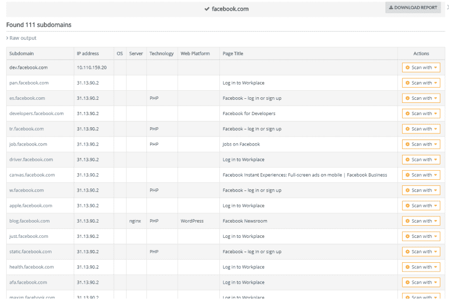
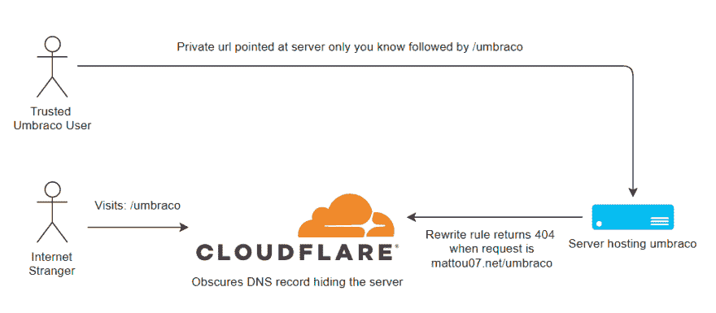
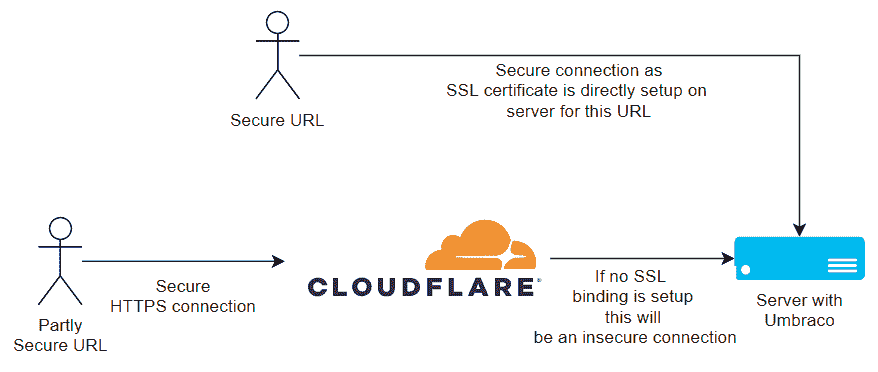
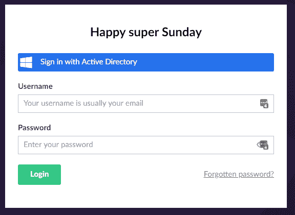

# 保护您的 Umbraco 后台办公室的六种方法

> 原文：<https://dev.to/mattou07/six-ways-to-secure-your-umbraco-back-office-36f6>

这篇文章的目的是为你的 Umbraco 后台登录页面提供额外的安全保障。通过增加更多的安全层，您可以让怀有恶意的人更难进入您的 Umbraco 后台。以下是防止这种情况发生的六种方法，从显而易见到更加专业的方法开始。

### 1。使用安全密码或密码管理器

这是非常明显的一点，避免使用常见的短语或单词作为密码，如著名的“password1234”或“keepout”，“qwerty”等。有些似乎是一个聪明的想法，容易记住，但可能已经在一个密码破解者会使用的常见密码的猜测列表中。理想情况下，您的密码应该是一组随机的字符，例如:3NUg%3SW！zn756D 或 C^gh53M9gkGgkWx.理想情况下，你登录的所有东西都应该有一个这样的随机密码。

看看，[haveibeenpwned.com](https://haveibeenpwned.com/)你只需输入你的电子邮件地址，他们就会给你提供一份包含指定电子邮件的遭受数据库泄露的网站列表。如果您的任何其他在线帐户与您在列表中使用的网站使用相同的密码，请尽快更改它！

但是你怎么能记住并管理所有这些密码呢？通过使用密码管理器，如 [Lastpass](https://lastpass.com/) 或 [Dashlane](https://www.dashlane.com/) ，如果你想要一些不同的东西，还有很多管理器。比如 [Keepass](https://keepass.info/) 一个密码管理器，它不是一个在线服务，而是一个你安装的开源应用。

### 2。不要使用电子邮件地址或“admin”作为管理员帐户的用户名

尽量避免使用您的个人电子邮件，“admin”或“[admin@yourdomain.com](mailto:admin@yourdomain.com)”作为您的管理员帐户的用户名。使用一些更晦涩的东西会让别人更难登录，因为他们现在必须猜测你的用户名和密码。

### 3。IP 通过重写规则(技术)限制您的后台

或许你有一个**静态 IP 地址**？也许在你的办公室，或者在你自己的个人或工作 VPN(虚拟专用网络)上。您可以使用 web 配置中的重写规则来限制对后台办公室的访问。像这样:

```
<rule name="RestrictBackOffice" enabled="true" patternSyntax="Wildcard" stopProcessing="true"> 
<match url="*" />
<conditions> 
<add input="{URL}" pattern="/Umbraco/*" /> 
<add input="{URL}" pattern="/Umbraco/surface/*" negate="true" /> 
<add input="{REMOTE_ADDR}" pattern="Your-IP" negate="true"/> 
<add input="{REMOTE_ADDR}" pattern="Another-IP" negate="true"/> 
<add input="{REMOTE_ADDR}" pattern="127.0.0.1" negate="true"/> 
<add input="{HTTP_X_FORWARDED_FOR}" pattern="Your-IP" negate="true"/> 
<add input="{HTTP_X_FORWARDED_FOR}" pattern="Another-IP" negate="true"/> 
<add input="{HTTP_X_FORWARDED_FOR}" pattern="127.0.0.1" negate="true"/> 
</conditions> 
<action type="CustomResponse" statusCode="404" statusReason="File or directory not found." statusDescription="The resource you are looking for might have been removed, had its name changed, or is temporarily unavailable." /> 
</rule> 
```

用您的静态 IP 地址填写**您的-IP** 和/或**另一个-IP** 。不要用仪表板 **127.0.0.1** 拆卸该状态！指定输入**{远程 ADDR}** 和 **{HTTP_X_FORWARDED_FOR}** 允许规则查看请求中的 IP 地址。

该规则将查看请求中的整个 url，并查找发送到 **/umbraco/*** 的任何内容。然后，它检查请求是否来自规则中指定的 IP，127.0.0.1 是向自身发出请求的站点。然后，当请求不符合我们的条件时，我们返回 404 状态代码。

我们另外允许对 **Umbraco/surface** 控制器的任何请求，你可以在这里阅读更多关于 surface 控制器[的信息。如果你的网站有自己的 Umbraco API 控制器，你需要像我们允许 surface 控制器一样允许它们。](https://our.umbraco.com/documentation/reference/routing/surface-controllers)

避免使用商业 VPN 的静态 IP 地址，因为 IP 地址是与他人共享的。

### 4。通过未知的 URL/域访问您的后台办公室(技术)

也许你没有一个安全的静态 IP 地址可以使用(或者你有，请随意将提示 3 和 4 合并在一起)，你可以限制后台只在不同的 url 上打开。如果你有一个空闲的域可以用来访问你的后台，但是我会避免设置一个子域，因为这些可以从外部查询，例如下面是我为脸书找到的一些子域:

[](https://res.cloudinary.com/practicaldev/image/fetch/s--m0qX9RmM--/c_limit%2Cf_auto%2Cfl_progressive%2Cq_auto%2Cw_880/https://mattou07.net/media/1021/facebook-subdomains.png)

重点是避免在您的主 umbraco 站点域的子域上这样做。

如果你在 azure web 应用上托管你的站点，它已经有了自己的 url。它通常具有格式**web app-name**. azure websites . net。如果您的主站点 url 使用 azure web app 的 CNAME 记录，也可以使用公共 DNS 检查器站点来查询它。

然而，如果你在你的网站上使用 [Cloudflare](https://www.cloudflare.com/) ，他们也会通过隐藏 URL 指向的位置来掩盖这一点。不管怎样，即使有人找到了你的 azure 网址，这仍然是另一个需要克服的障碍。只为查看 Umbraco 登录页面！

下面是相同的 IP 限制重写规则和 URL/域限制一起:

```
<rule name="RestrictBackOffice" enabled="true" patternSyntax="Wildcard" stopProcessing="true"> 
<match url="*" />
<conditions> 
<add input="{URL}" pattern="/Umbraco/*" /> 
<add input="{HTTP_HOST}" negate="true" pattern="^subdomain\.domain\.net$" /> 
<add input="{HTTP_HOST}" negate="true" pattern="^another-domain\.com$" />
<add input="{URL}" pattern="/Umbraco/surface/*" negate="true" /> 
<add input="{REMOTE_ADDR}" pattern="Your-IP" negate="true"/> 
<add input="{REMOTE_ADDR}" pattern="Another-IP" negate="true"/> 
<add input="{REMOTE_ADDR}" pattern="127.0.0.1" negate="true"/> 
<add input="{HTTP_X_FORWARDED_FOR}" pattern="Your-IP" negate="true"/> 
<add input="{HTTP_X_FORWARDED_FOR}" pattern="Another-IP" negate="true"/> 
<add input="{HTTP_X_FORWARDED_FOR}" pattern="127.0.0.1" negate="true"/> 
</conditions> 
<action type="CustomResponse" statusCode="404" statusReason="File or directory not found." statusDescription="The resource you are looking for might have been removed, had its name changed, or is temporarily unavailable." /> 
</rule> 
```

通过使用 **{HTTP_HOST}** 输入并设置**取反为真**，我们可以说如果请求来自特定的域，就让它通过。

没有 IP 限制的例子:

```
<rule name="RestrictBackOffice" enabled="true" patternSyntax="Wildcard" stopProcessing="true"> 
<match url="*" />
<conditions> 
<add input="{URL}" pattern="/Umbraco/*" /> 
<add input="{HTTP_HOST}" negate="true" pattern="^subdomain\.azurewebsites\.net$" /> 
<add input="{HTTP_HOST}" negate="true" pattern="^another-domain\.com$" />
<add input="{URL}" pattern="/Umbraco/surface/*" negate="true" /> 
</conditions> 
<action type="CustomResponse" statusCode="404" statusReason="File or directory not found." statusDescription="The resource you are looking for might have been removed, had its name changed, or is temporarily unavailable." /> 
</rule> 
```

下面的图表概括了使用 Cloudflare 时的情况:

[](https://res.cloudinary.com/practicaldev/image/fetch/s--cWYVtlu3--/c_limit%2Cf_auto%2Cfl_progressive%2Cq_auto%2Cw_880/https://mattou07.net/media/1023/access-umbraco-via-dif-url.png)

### 5。不要使用 Cloudflare SSL 通过不安全的 URL 访问后台

如果您正在利用 Cloudflare 的免费 SSL，并且服务器上没有 SSL 绑定设置。我会避免通过您的主域访问后台，因为 SSL 证书只保护您和 Cloudflare 之间的连接。不能保证有人在监听 Cloudflare 和托管您站点的 web 服务器之间的未加密流量。如果你正在使用 Azure web app 或 VPS，通过 azurewebsites.net 域或直接指向 VPS 的域使用 **SSL 绑定**访问后台会更安全，因为如前所述，你是通过 web 服务器上的 SSL 证书直接连接到你的站点的。

如果你想避免为 SSL 付费或使用你的 azure web app azurewbesites.net URL，你可以通过 [letsencrypt](https://letsencrypt.org/) 获得免费的 SSL 证书。

[](https://res.cloudinary.com/practicaldev/image/fetch/s--Ka4sGzw_--/c_limit%2Cf_auto%2Cfl_progressive%2Cq_auto%2Cw_880/https://mattou07.net/media/1024/secure-connection.png)

### 6。使用 Azure Active Directory 登录到您的后台

如果您已经为您的组织使用 Azure AD，您也可以配置 Umbraco 使用它。这就把认证的责任推给了微软，而让 Umbraco 专注于提供你的内容。有了 Azure AD，你可以通过 Azure 添加另一层额外的安全层来实施 MFA(多因素身份验证)。参见 [Shannon Deminick](https://twitter.com/Shazwazza) 的这篇文章进行设置:[https://shazwazza . com/post/configuring-azure-active-directory-log in-with-um braco/](https://shazwazza.com/post/configuring-azure-active-directory-login-with-umbraco/)。

[](https://res.cloudinary.com/practicaldev/image/fetch/s--_nJwg6gt--/c_limit%2Cf_auto%2Cfl_progressive%2Cq_auto%2Cw_880/https://mattou07.net/media/1022/active-directory-login.png)

### 感谢你来到这里！

我希望这篇文章对你有用，也希望它能为你提供更多的工具来保护你的 Umbraco 后台。如果对你有用，或者你注意到帖子中有问题，请随时联系我们。