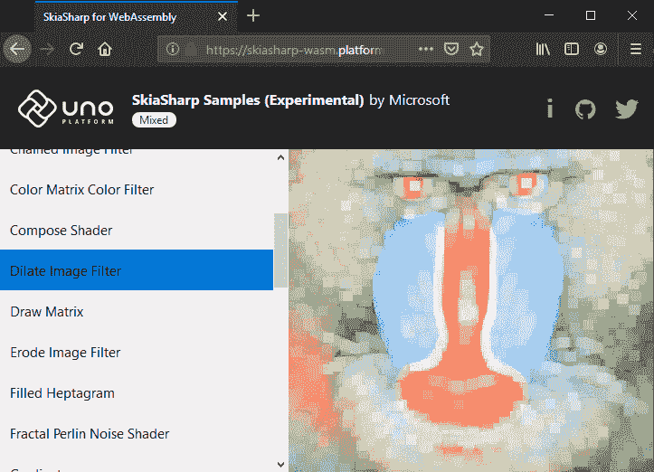

# SkiaSharp 通过 Uno 平台支持 WebAssembly

> 原文：<https://dev.to/uno-platform/skiasharp-support-for-webassembly-via-uno-platform-18pg>

**今天，我们自豪地宣布，Uno 平台现已通过 [Uno 为 SkiaSharp 提供初步支持。SkiaSharp.Views](https://www.nuget.org/packages/Uno.SkiaSharp.Views) 软件包，刚刚发布到 NuGet。**

Skia 是一个开源的 2D 图形库，它提供了跨各种硬件和软件平台的通用 API。它是谷歌 Chrome 和 Chrome OS、Android、Mozilla Firefox 和 Firefox OS 以及许多其他产品的图形引擎。

前往 skiasharp-wasm.platform.uno 查看 Skia，uno 平台和 WebAssembly 使用 mono 的 AOT 引擎一起工作。为了获得最佳体验，我们建议使用台式电脑和您最喜欢的浏览器的最新金丝雀版本，因为[规范正在建设中](https://github.com/WebAssembly/spec)，对 WebAssembly 的支持正在迅速改善。

[](https://github.com/unoplatform/uno/blob/1e6ba858631c52ecd3469c395fbda637422eaf3e/doc/blog/Assets/201906-skiasharp-demo.png?raw=1)

你可以在 [unoplatform/Uno 找到](https://github.com/unoplatform/Uno.SkiaSharp)[skiasharp-wasm . platform . Uno](https://skiasharp-wasm.platform.uno/)的源代码。SkiaSharp 。在内部，这个应用程序使用 [SkiaSharp](https://github.com/mono/SkiaSharp) ，一个绑定到[P/Invoke Skia API](https://github.com/mono/SkiaSharp/blob/master/binding/Binding/SkiaApi.cs#L96-L97)的. NET 和一个[自定义 Skia build](https://github.com/mono/skia) 来提供 [C API 以允许。NET 互操作](https://github.com/mono/skia/blob/xamarin-mobile-bindings/include/c/sk_canvas.h#L18)。

在`Uno.SkiaSharp.Views`包中，你会发现对 [SKXamlCanvas](https://docs.microsoft.com/en-us/dotnet/api/skiasharp.views.uwp.skxamlcanvas?view=skiasharp-views-uwp-1.68.0) UWP 控件的支持，该控件支持在 XAML 视觉树的特定部分使用 Skia 绘图。您可以通过在我们的样本库中使用[这个样本](https://github.com/nventive/Uno.Samples/tree/master/UI/SkiaSharpTest)来试验`SKXamlCanvas`。或者，您可以用下面的 XAML 和代码来测试一下。

XAML:

```
\<Grid Background="{ThemeResource ApplicationPageBackgroundThemeBrush}"\> \<skia:SKXamlCanvas x:Name="test" PaintSurface="OnPaintSurface" /\> \</Grid\> 
```

后面的代码:

```
private void OnPaintSurface(object sender, SKPaintSurfaceEventArgs e) { // the canvas and propertiesvar canvas = e.Surface.Canvas; // get the screen density for scalingvar display = DisplayInformation.GetForCurrentView(); var scale = display.LogicalDpi / 96.0f; var scaledSize = new SKSize(e.Info.Width / scale, e.Info.Height / scale); // handle the device screen densitycanvas.Scale(scale); // make sure the canvas is blankcanvas.Clear(SKColors.Yellow); // draw some textvar paint = new SKPaint { Color = SKColors.Black, IsAntialias = true, Style = SKPaintStyle.Fill, TextAlign = SKTextAlign.Center, TextSize = 24 }; var coord = new SKPoint( scaledSize.Width / 2, (scaledSize.Height + paint.TextSize) / 2); canvas.DrawText("SkiaSharp", coord, paint); } 
```

## 我们如何让 SkiaSharp 与 WebAssembly 一起工作

我们首先证明在自定义互操作层上运行完整的 SkiaSharp API 是可能的，因为 Mono 不支持正确的 WebAssembly 动态链接。在我们最初使用 CanvasKit 的实验中，用户体验非常慢，但是很有效。

感谢开源的奇迹，我们能够与 Mono 团队合作修复动态链接，它使 [Windows 计算器的计算引擎能够移植到 WebAssembly](https://platform.uno/a-piece-of-windows-10-is-now-running-on-webassembly-natively-on-ios-and-android/) 。获得动态链接也是使 Skia 能够被编译成 WebAssembly 并被使用的关键。NET 代码通过 P/Invoke。

为了实现这一点，我们使用了 Skia 引擎的[分支，它增加了对 CanvasKit 和 SkiaSharp 的 C API 的支持，同时禁用了所有的 Javascript 支持。这是必需的，因为](https://github.com/unoplatform/skia)[双基础 API 不能导出到 JavaScript](https://github.com/emscripten-core/emscripten/commit/ccaf4e74fa9abf51cff8d1d4823f0b4d84bf3eab) 。就 SkiaSharp 而言，这基本上使 Skia 模块看起来像一个 dll。

幸运的是，Mono 很好地支持开箱即用的静态链接，它使我们能够将 Skia 引擎直接嵌入到[Skia sharp-wasm . platform . uno](https://skiasharp-wasm.platform.uno/)中，这是一个由 Mono AOT 通过 Uno 编译的 WebAssembly 应用程序。考虑到这项技术是多么前沿，我们对 Mono 现在*的响应速度印象深刻。*

 *## 前路漫漫

在我们认为对 Skia 的支持是完全的之前，还有几个问题没有解决:

**首先**，我们需要 fork SkiaSharp 来启用 WebAssembly 支持，因为 native interop 层的特殊性，值得注意的是因为 [`Marshal.GetFunctionPointerForDelegate`](https://docs.microsoft.com/en-us/dotnet/api/system.runtime.interopservices.marshal.getfunctionpointerfordelegate?view=netframework-4.8) 还不支持， [emscripten 的`addFunction`](https://emscripten.org/docs/porting/connecting_cpp_and_javascript/Interacting-with-code.html) 函数指针特性[暂时需要用到](https://github.com/unoplatform/Uno.SkiaSharp/blob/uno/binding/SkiaSharp.Wasm/ts/SkiaSharpCanvasKit.ts#L21-L32)。

我们[正在与 SkiaSharp 团队](https://github.com/mono/SkiaSharp/issues/876)合作，添加一个可调整的互操作层，使 WebAssembly 支持能够在运行时插入，允许适当支持使用包，如 [`SkiaSharp.Extended`](https://www.nuget.org/packages/SkiaSharp.Extended) ，而不需要被 WebAssembly 支持。

**其次**，函数导出方面的 WebAssembly 细节需要一组非常具体的预定义方法(在 mono-wasm 中这里声明了[)。在某种程度上，修改现有的 Skia C API 签名以匹配那些“已知的”方法是可能的，但并不是对所有的方法都是如此。这就是为什么 Skia 实现中仍然缺少一些方法，需要调整以使用结构而不是参数，并避免更新要支持的 Mono 运行时。](https://github.com/mono/mono/blob/8d80ccc897c678d7bdae645ca8629b0c5cc0b667/mono/mini/m2n-gen.cs#L30)

**最后**，我们将增加对 GPU 加速的 OpenGL 后端的支持，这将极大地提高性能，因为目前只有软件渲染引擎可用。

你可以通过[关注这个 GitHub 问题](https://github.com/unoplatform/uno/issues/1116)的进展。

让我们知道你的想法！

* * *

*如果你是 Uno 平台的新手，并且不知道如何开始，我们已经创建了一个分步指南，让你从零到一个小型的、在 WebAssembly、iOS 和 Android 上完全工作的应用程序—[现在就开始！](https://platform.uno/docs/articles/getting-started-tutorial-1.html)T3】*

通过 Uno 平台 SkiaSharp 支持 WebAssembly 的帖子[最早出现在](https://platform.uno/skiasharp-support-for-webassembly-via-uno-platform/) [Uno 平台](https://platform.uno)。*