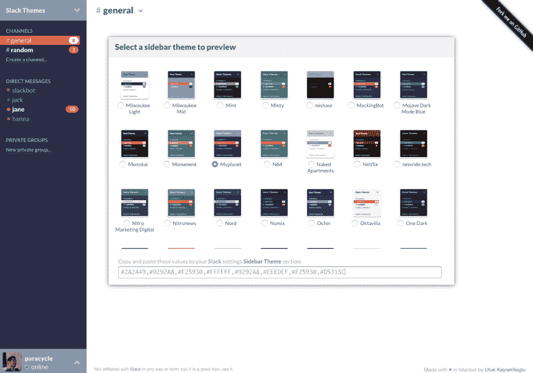

# 宽松工作区主题自定义

> 原文：<https://dev.to/codingcatdev/slack-workspace-theme-customization-1fha>

> 原帖:[https://ajonp.com/blog/slack-workspace-theme-customization/](https://ajonp.com/blog/slack-workspace-theme-customization/)

# 空闲工作区主题定制

[https://www.youtube.com/embed/vbtncEcoO9o](https://www.youtube.com/embed/vbtncEcoO9o)

## 如何定制你的 slack 主题

[正式延期单据](https://get.slack.help/hc/en-us/articles/205166337-Customize-your-Slack-theme)

## SlackThemes.net

> AJonP 不是由 Slack 赞助的，slackthemes.net 也不是。但是我们都认为它是一个伟大的工具！

[SlackThemes.net](https://slackthemes.net/#/myplanet)

