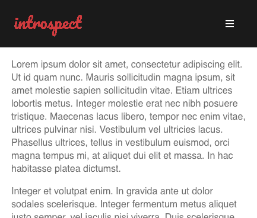
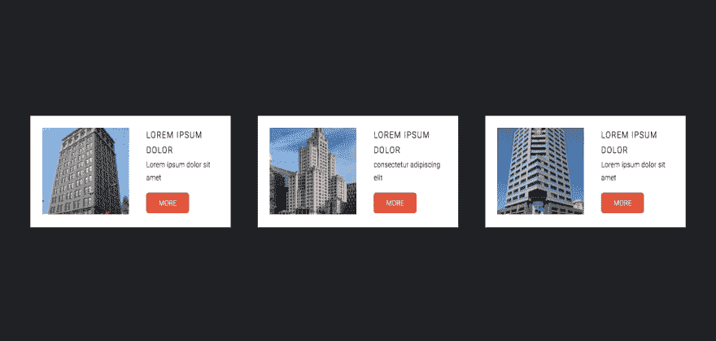
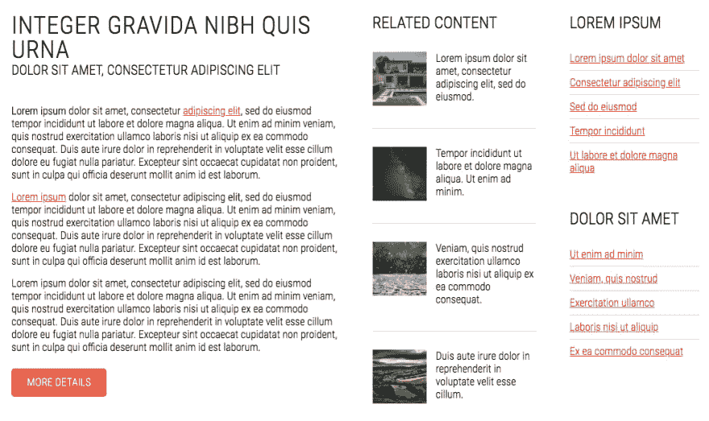

# 滑动时间轴，简单导航，图像上传|模块周一 44

> 原文：<https://dev.to/tyrw/slider-timeline-simple-nav-image-uploader-module-monday-44-952>

## 下面的一切都是开源的

它可以在任何网站、web 应用程序或其他任何地方免费使用。开发人员在 Anymod 上创建并分享了数百个这样的网站。

单击一个 mod 来查看它及其源代码。

## 时间轴滑块

向游客介绍你丰富的历史。
[查看 mod](https://anymod.com/mod/slider-timeline-barrkl?preview=true)
  

## 自省导航条

一个基于模板的内省团队的深色导航条。
[查看 mod](https://anymod.com/mod/collapsible-nav-with-sidebar-alrrnn?preview=true)
  

## 暗卡章节

带有图像和链接的响应部分。
[查看 mod](https://anymod.com/mod/cards-on-dark-background-raoodk?preview=true)
  

## [图像上载程序](#image-uploader)

从文件、URL、相机、Dropbox、脸书、Instagram 或谷歌搜索上传。
[查看 mod](https://anymod.com/mod/cloudinary-image-upload-widget-nkklnn?preview=true)
  

## 内容栏

文本和链接的预样式、响应栏。
[查看 mod](https://anymod.com/mod/content-links-orddnk?preview=true)
  

* * *

我每周一从社区[这里](https://dev.to/tyrw)贴出新的 mods 我希望你觉得它们有用！

快乐编码✌️