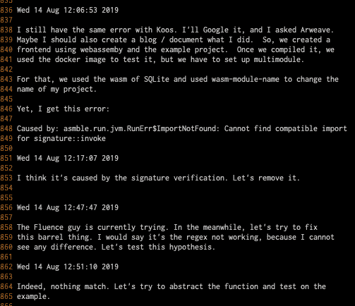

# 放慢编码速度

> 原文：<https://dev.to/lcoenen/slow-down-to-code-faster-3cj>

我写得越多，就越容易慢下来。奇怪的是，这让我编码更快，效率更高。

作为一个自学成才的人，我有一种近乎附加的个性，我倾向于大量使用退格键。测试一些东西，发现错误，修复它，重复。然后，总有那么一刻，我被卡住了，我的挫折感也随之增长。随着我越来越深入隧道效应，我经常试图在几分钟内测试数百个解决方案，但很快就放弃了，并尝试其他方法。然后，我唯一的出路就是出去散步，只是在我放松的时候回来工作，并意识到解决方法就是这么简单。

 
我不会是第一个也不会是最后一个受此折磨的人。当我从大学转向科技行业时，我必须适应。以下是一些帮助我组织实践并成为更好的程序员的事情:

## 番茄工作法

人类的大脑(或者至少是我的)只能专注于一件事半个小时。番茄工作法是一种基于这一事实的时间管理方法。这个想法很简单——番茄工作法是一个工作单元，通常由 25 分钟的迭代和 5 分钟的休息组成。如果你在吃番茄红素的时候注意力不集中，你应该取消它，重新开始。不要说谎，当我对一个项目充满热情时，相反的情况往往会发生在我身上——我往往会忽略停顿，最终筋疲力尽。尽管如此，我的一个主要优势是你可以把它和你的项目管理联系起来，并专注于手头的任务。例如，为什么不用[针叶林](https://taiga.io/)故事点来估算一个特定任务需要的时间呢？

## 编码日志

我没有像高中班上的其他同学一样开始攻读计算机科学学士学位，而是去攻读心理学硕士学位，其中一个主要原因是那里的幼儿园教育方式。他们有作业，上课时不能说话，强制出席，等等。但最糟糕的是，他们写道。编码。考试。他们必须用好的纸笔来实现算法。我绝不会那么做。

但是当我知道我想编码为离开，我意识到我是多么错误。当面对一个比我的即时注意力广度更大的问题时，我迷失了。解决办法？一支好的纸笔。我开始做一个*编程日志*。每当我陷入困境时，我不是用不同的方式尝试同样的事情，而是开始采用一种诊断方法。*什么问题？*。它从何而来？。我该如何测试呢？。*来测试一下*。*它能解决问题吗？*。*还可能是什么问题？*...诸如此类。通过记录我尝试的每一件事，我让自己专注于手头的问题，可以更加系统化——总之，可以更快地解决问题。

## 慢下来，不要再碰这个该死的退格键了

没错。我经常提醒自己要做的一件事，对我来说是无价的帮助，就是简单地让*慢下来*。在你按回车键或点击之前，花点时间深呼吸。在编写代码之前，重新检查两次变量的名称。看着你的整个屏幕，在你输入一个单词之前花一秒钟。这极大地改善了我的错误率。这减少了我花在查找错别字上的时间，也减少了我问自己到底忘了什么的时间。还有*总之*，这会让你更有效率。