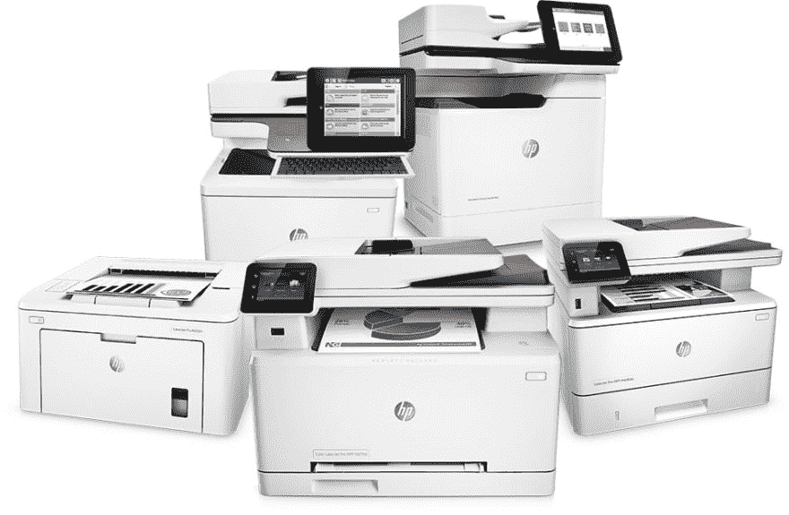

# 为印刷品编写 CSS 的小建议

> 原文：<https://dev.to/vlasterx/small-advice-for-writing-the-css-for-the-print-4mc7>

[](https://res.cloudinary.com/practicaldev/image/fetch/s--pd_WhoOS--/c_limit%2Cf_auto%2Cfl_progressive%2Cq_auto%2Cw_880/https://thepracticaldev.s3.amazonaws.com/i/3iloaeec70grxqs76tnh.jpeg)

在我正在做的一个项目中，我最近有机会再次为印刷品写风格。作为一名网页设计师，我明白每种媒体都有其独特的属性和挑战，我们需要通过设计来克服。

在设计印刷品时，我们需要考虑这种媒介的几个要求:

*   世界上最常用的打印机仍然是单色的，因为它们具有成本效益。
*   最常用的纸张颜色是白色，有两种可能的格式 A4 或信纸大小
*   我们需要节约纸张，只打印必要的文字
*   最小的可读字体大小在 10pt-12pt 之间，但是考虑到可访问性，它可能需要更大，至少 14pt。
*   纸不是互动的。这听起来可能很傻，但我们已经来到了现代世界，我们主要是将信息从数字世界转移到纸上，所以我们必须适应这一点。

考虑到这些需求，我们可以为打印调整我们的用户界面。既然标题上说这是一个小建议，我就长话短说:

*   所有文本都应该转换成黑色，因为我们是在白纸上打印。如果颜色是一个要求，那么任何文本颜色必须与白纸相比有足够的对比度。如果你遵循网页设计的可访问性规则，那么你就已经设置好了。[辅助功能级别 AA](https://webaim.org/resources/contrastchecker/) 要求普通文本的对比度至少为 4.5:1，大文本的对比度至少为 3:1。
*   背景应该是简单的白色，没有任何图像，梯度或颜色。
*   隐藏所有在纸上不起作用的不必要的 UI 元素。这些通常是动态表单，搜索表单，社交分享按钮，动态菜单，横幅，视频，声音部件等。
*   对于更复杂的网站，如果您从打印中排除了足够多的元素，您可能还想为剩余的元素创建新的简化网格。
*   某些元素在两页之间拆分时可能看起来很奇怪。可以通过使用 CSS 规则[内插](https://developer.mozilla.org/en-US/docs/Web/CSS/break-inside)、[前插](https://developer.mozilla.org/en-US/docs/Web/CSS/break-before)和[后插](https://developer.mozilla.org/en-US/docs/Web/CSS/break-after)来纠正这个问题。不幸的是，这些规则在除了 Chrome(新版 IE)之外的所有浏览器上都很好用，所以你可能需要[稍微调整一下](https://stackoverflow.com/questions/7706504/page-break-inside-doesnt-work-in-chrome/12386608)。
*   打印锚点(链接)时，它们将显示为带下划线的文本。为了解决这个问题，我用 CSS 创建了一个小的解决方案，其中 href 属性打印在锚文本旁边。看起来是这样的:

```
@media print {
  a {
    &:after {
      content: "[" attr(href) "]";
      color: black;
      margin: 0 0 0 5px;
    }
  }
} 
```

Enter fullscreen mode Exit fullscreen mode

当应用于此 HTML 时

```
<a href="https://www.duckduckgo.com">Best search engine</a> 
```

Enter fullscreen mode Exit fullscreen mode

纸上的结果将是

```
Best search engine [https://www.duckduckgo.com] 
```

Enter fullscreen mode Exit fullscreen mode

* * *

我希望这些建议能帮助你创造更好的印刷风格。

你有什么更好的印刷风格？