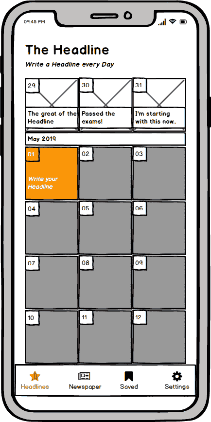
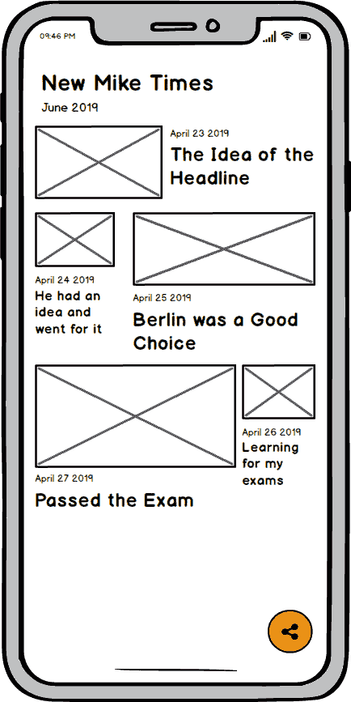
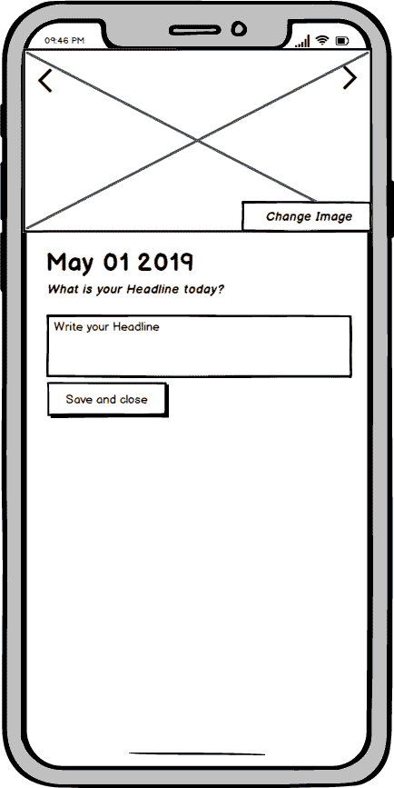

# 次要项目想法#2 -标题

> 原文：<https://dev.to/binconsole/small-side-project-ideas-2-the-headline-3iak>

这个应用程序是一个简单的日志。每天写一个标题，然后用它创建一份你可以分享的数字报纸(标题/每日图片)。

### 对这个项目的更多想法:

*   创建一个动画报纸作为电影，用户可以保存。
*   为一个项目创建多个空间，如工作空间、私人空间。