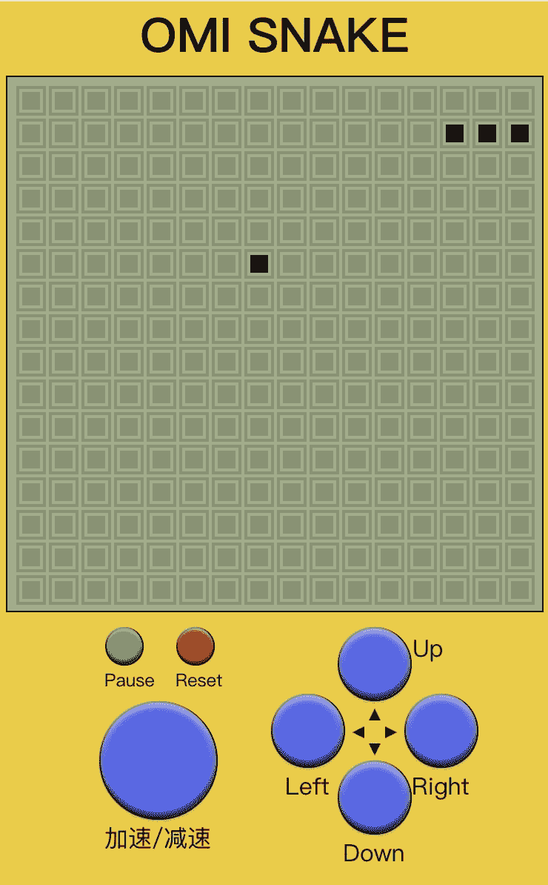
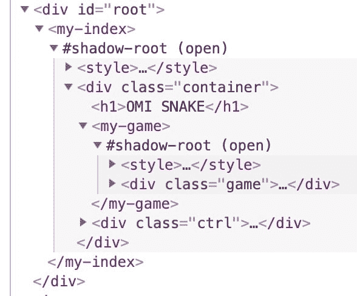
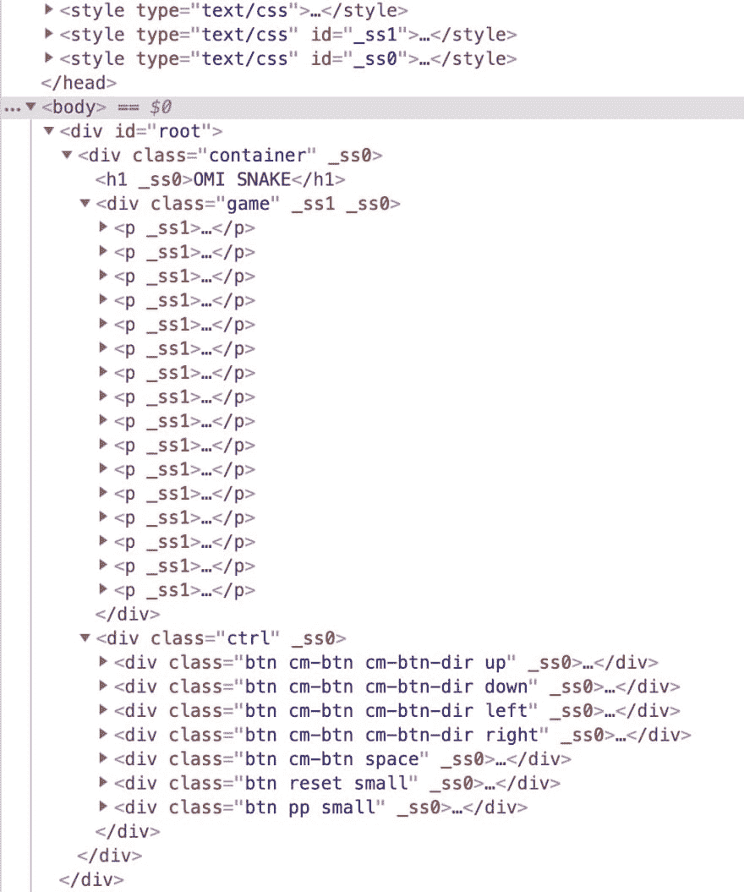

# 用 Omi 和 MVP 架构的 Web 组件制作吃蛇游戏

> 原文：<https://dev.to/dntzhang/snake-eating-game-making-with-web-components-of-omi-and-mvp-architecture-206>

[](https://res.cloudinary.com/practicaldev/image/fetch/s--_FMr9CvM--/c_limit%2Cf_auto%2Cfl_progressive%2Cq_auto%2Cw_880/https://thepracticaldev.s3.amazonaws.com/i/vuz6nkhvlwf02tvlwp3h.png)

其实我用 react，preact，vue 和 [omi 框架](https://github.com/Tencent/omi)开发这个游戏，发现 omi 的开发体验是最好的，[源码](https://github.com/Tencent/omi/tree/master/packages/omi-snake)真的很工整。让我带你一步一步地开发这个简单的游戏。

*   [触摸在线演示(手机)](https://tencent.github.io/omi/packages/omi-snake/build/)

阅读这篇文章，你可以了解到:

*   前端领域驱动设计的集成
*   CSS 的 rpx 单元的基本原理
*   利用 Omi 开发吃蛇游戏
*   理解 MVC、MVP、MVVM 模式
*   用 DOM 写小游戏(不是画布)
*   游戏主帧率和局部帧率控制
*   Omi 商店系统

### 领域模型设计

*   提取主要实体，如(蛇，游戏)
*   从实体上总结具体的业务属性方法
    *   蛇
    *   包含运动方向、身体属性
    *   包含移动和转向方法
    *   比赛
    *   包含结束暂停状态，地图，分数，帧率，游戏主角，食物
    *   包含开始游戏，暂停游戏，结束游戏，生产食物，重置游戏等。
*   在实体属性方法之间建立链接
    *   游戏中唯一的主角是蛇。
    *   蛇吃食物，游戏分数增加
    *   食物消失了。游戏又负责生产食物。
    *   蛇撞到墙或者撞到自己，游戏结束。
*   核心循环逻辑
    *   判断有无食物，无食物制作一个(低帧率)
    *   snake 与其自身之间的碰撞检测
    *   蛇和障碍物之间的碰撞检测
    *   蛇和食物之间的碰撞检测
    *   蛇形运动

### 蛇类

```
class Snake {
  constructor() {
    this.body = [3, 1, 2, 1, 1, 1]
    this.dir = 'right'
  }

  move(eating) {
    const b = this.body
    if (!eating) {
      b.pop()
      b.pop()
    }

    switch (this.dir) {
      case 'up':
        b.unshift(b[0], b[1] - 1)
        break
      case 'right':
        b.unshift(b[0] + 1, b[1])
        break
      case 'down':
        b.unshift(b[0], b[1] + 1)
        break
      case 'left':
        b.unshift(b[0] - 1, b[1])
        break
    }
  }

  turnUp() {
    if (this.dir !== 'down')
      this.dir = 'up'
  }
  turnRight() {
    if (this.dir !== 'left')
      this.dir = 'right'
  }
  turnDown() {
    if (this.dir !== 'up')
      this.dir = 'down'
  }
  turnLeft() {
    if (this.dir !== 'right')
      this.dir = 'left'
  }
} 
```

蛇的转身有一个逻辑，就是不能往反方向退。比如它是向左移动，不能直接右转。因此在`turnUp`、`turnRight`、`turnDown`、`turnLeft`中有相应的条件判断。

### 游戏类

```
import Snake from './snake'

class Game {
  constructor() {
    this.map = []
    this.size = 16
    this.loop = null
    this.interval = 500
    this.paused = false
    this._preDate = Date.now()
    this.init()
  }

  init() {

    this.snake = new Snake

    for (let i = 0; i < this.size; i++) {
      const row = []
      for (let j = 0; j < this.size; j++) {
        row.push(0)
      }
      this.map.push(row)
    }
  }

  tick() {

    this.makeFood()
    const eating = this.eat()
    this.snake.move(eating)
    this.mark()

  }

  mark() {
    const map = this.map
    for (let i = 0; i < this.size; i++) {
      for (let j = 0; j < this.size; j++) {
        map[i][j] = 0
      }
    }

    for (let k = 0, len = this.snake.body.length; k < len; k += 2) {
      this.snake.body[k + 1] %= this.size
      this.snake.body[k] %= this.size

      if (this.snake.body[k + 1] < 0) this.snake.body[k + 1] += this.size
      if (this.snake.body[k] < 0) this.snake.body[k] += this.size
      map[this.snake.body[k + 1]][this.snake.body[k]] = 1
    }
    if (this.food) {
      map[this.food[1]][this.food[0]] = 1
    }
  }

  start() {
    this.loop = setInterval(() => {
      if (Date.now() - this._preDate > this.interval) {
        this._preDate = Date.now()
        if (!this.paused) {
          this.tick()
        }
      }
    }, 16)
  }

  stop() {
    clearInterval(this.loop)
  }

  pause() {
    this.paused = true
  }

  play() {
    this.paused = false
  }

  reset() {
    this.paused = false
    this.interval = 500
    this.snake.body = [3, 1, 2, 1, 1, 1]
    this.food = null
    this.snake.dir = 'right'
  }

  toggleSpeed() {
    this.interval === 500 ? (this.interval = 150) : (this.interval = 500)
  }

  makeFood() {
    if (!this.food) {
      this.food = [this._rd(0, this.size - 1), this._rd(0, this.size - 1)]
      for (let k = 0, len = this.snake.body.length; k < len; k += 2) {
        if (this.snake.body[k + 1] === this.food[1]
          && this.snake.body[k] === this.food[0]) {
          this.food = null
          this.makeFood()
          break
        }

      }
    }
  }

  eat() {
    for (let k = 0, len = this.snake.body.length; k < len; k += 2) {
      if (this.snake.body[k + 1] === this.food[1]
        && this.snake.body[k] === this.food[0]) {
        this.food = null
        return true
      }
    }
  }

  _rd(from, to) {
    return from + Math.floor(Math.random() * (to + 1))
  }
} 
```

您可以看到，上面的代码使用了一个 16*16 的二维数组来存储蛇、食物和地图信息。蛇和食物占据 1 格，其余 0 格。

```
[
  [0, 0, 0, 0, 0, 0, 0, 0, 0, 0, 0, 0, 0, 0, 0, 0],
  [0, 0, 0, 0, 0, 0, 0, 0, 0, 0, 0, 0, 0, 0, 0, 0],
  [0, 0, 1, 1, 1, 0, 0, 0, 0, 0, 0, 0, 0, 0, 0, 0],
  [0, 0, 0, 0, 1, 1, 0, 0, 0, 0, 0, 0, 0, 0, 0, 0],
  [0, 0, 0, 0, 0, 0, 0, 0, 0, 0, 0, 0, 0, 0, 0, 0],
  [0, 0, 0, 0, 0, 0, 0, 0, 0, 0, 0, 0, 0, 0, 0, 0],
  [0, 0, 0, 0, 0, 0, 0, 0, 0, 0, 0, 0, 0, 0, 0, 0],
  [0, 0, 0, 0, 0, 0, 0, 0, 0, 0, 0, 0, 0, 0, 0, 0],
  [0, 0, 0, 0, 0, 0, 0, 1, 0, 0, 0, 0, 0, 0, 0, 0],
  [0, 0, 0, 0, 0, 0, 0, 0, 0, 0, 0, 0, 0, 0, 0, 0],
  [0, 0, 0, 0, 0, 0, 0, 0, 0, 0, 0, 0, 0, 0, 0, 0],
  [0, 0, 0, 0, 0, 0, 0, 0, 0, 0, 0, 0, 0, 0, 0, 0],
  [0, 0, 0, 0, 0, 0, 0, 0, 0, 0, 0, 0, 0, 0, 0, 0],
  [0, 0, 0, 0, 0, 0, 0, 0, 0, 0, 0, 0, 0, 0, 0, 0],
  [0, 0, 0, 0, 0, 0, 0, 0, 0, 0, 0, 0, 0, 0, 0, 0],
  [0, 0, 0, 0, 0, 0, 0, 0, 0, 0, 0, 0, 0, 0, 0, 0]
] 
```

所以它代表一条五长的蛇和一种食物。你能在上面的格子里找到它吗？

### 游戏面板渲染

```
import { define, rpx } from 'omi'

define('my-game', ['map'], _ => (
  <div class="game">
    {_.store.data.map.map(row => {
      return <p>
        {row.map(col => {
          if (col) {
            return <b class='s'></b>
          }
          return <b></b>
        })}
      </p>
    })}
  </div>
), rpx(require('./_index.css'))) 
```

带有`s`类的单元格为黑色，如食物、蛇身，其余的将为灰色背景。`['map']`表示对`store.data`的依赖。`map`更新会自动更新视图。

### Ctrl 和游戏面板渲染

```
 import { define, rpx } from 'omi'
import '../game'

define('my-index', ['paused'], ({store}) => (
  <div class="container">
    <h1>OMI SNAKE</h1>

    <my-game></my-game>

    <div class="ctrl">
      <div class="btn cm-btn cm-btn-dir up" onClick={store.turnUp}><i></i><em></em><span>Up</span></div>
      <div class="btn cm-btn cm-btn-dir down" onClick={store.turnDown}><i></i><em></em><span>Down</span></div>
      <div class="btn cm-btn cm-btn-dir left" onClick={store.turnLeft}><i></i><em></em><span >Left</span></div>
      <div class="btn cm-btn cm-btn-dir right" onClick={store.turnRight}><i></i><em></em><span >Right</span></div>
      <div class="btn cm-btn space" onClick={store.toggleSpeed}><i></i><span >加速/减速</span></div>
      <div class="btn reset small" onClick={store.reset}><i ></i><span >Reset</span></div>
      <div class="btn pp small" onClick={store.pauseOrPlay}><i></i><span >{store.data.paused ? 'Play' : 'Pause'}</span></div>
    </div>
  </div>

), rpx(require('./_index.css'))) 
```

### 定义门店

```
import Game from '../models/game'

const game = new Game
const { snake, map } = game

game.start()

export default {
  data: {
    map
  },
  turnUp() {
    snake.turnUp()
  },
  turnRight() {
    snake.turnRight()
  },
  turnDown() {
    snake.turnDown()
  },
  turnLeft() {
    snake.turnLeft()
  },
  pauseOrPlay() {
    if (game.paused) {
      game.play()
    } else {
      game.pause()
    }
  },
  reset() {
    game.reset()
  },
  toggleSpeed() {
    game.toggleSpeed()
  }
} 
```

您会发现这个存储是瘦的，只负责将视图动作传递给模型，并自动将数据从模型映射到视图。

### 帧速率控制

如何控制主帧率和局部帧率？一般来说，我们认为 60 FPS 是流畅的，所以我们在计时器之间有 16 ms 的间隔。核心周期的计算量越小，越接近 60 FPS:

```
this.loop = setInterval(() => {
  //
}, 16) 
```

但是有些计算不需要 16 秒计算一次，降低了帧率，所以可以记录最后一次执行时间来控制帧率:

```
this.loop = setInterval(() => {
    //60 FPS
  if (Date.now() - this._preDate > this.interval) {
    //1000/this.interval FPS
    this._preDate = Date.now()
    if (!this.paused) {
      //Core Loop Logic
      this.tick()
    }
  }
}, 16) 
```

你可以使用基于`requestAnimationFrame`的 [raf-interval](https://github.com/dntzhang/raf-interval) 而不是`setInterval`来提高性能:

```
this.loop = setRafInterval(() => {
  //60 FPS
  if (Date.now() - this._preDate > this.interval) {
    //1000/this.interval FPS
    this._preDate = Date.now()
    if (!this.paused) {
      //Core Loop Logic
      this.tick()
    }
  }
}, 16) 
```

### 文件目录描述

```
├─ build           //Compiled files for production environments
├─ config
├─ public
├─ scripts
├─ src
│  ├─ assets
│  ├─ components    //Components that store all view of pages
│  ├─ models        //Store all models
│  ├─ stores        //Store all store
│  └─ index.js      //The entry file will be built into index.html 
```

那么 MVC，MVP 还是 MVVM？

从吃蛇源代码可以看出，视图(组件)和模型是分离的，没有相互依赖的关系。但是在 MVC 中，视图依赖于模型，耦合度太高，导致视图的可移植性大大降低，所以一定不是 MVC 架构。

[](https://res.cloudinary.com/practicaldev/image/fetch/s--FecDFsmK--/c_limit%2Cf_auto%2Cfl_progressive%2Cq_auto%2Cw_880/https://thepracticaldev.s3.amazonaws.com/i/q1nh605gymbrlcx4iz8o.png)

在 MVP 模式下，视图不直接依赖模型，Presenter 负责完成模型和视图的交互。MVVM 和 MVP 很相似。viewModel 扮演 Presenter 的角色，提供 UI 视图需要的数据源，而不是直接让 View 使用 Model 的数据源。这大大提高了视图和模型的可移植性，比如使用 Flash、HTML、WPF 对同一模型进行渲染切换，比如对同一视图使用不同的模型。只要模型和视图模型映射得好，视图就可以很少改变或者不改变。

从 snake 源代码中我们可以看到，Presenter (stores)的数据属性是直接用来在 View (components)中渲染的。数据属性来自 Model(模型)的属性，Model 和 ViewModel 之间没有映射。所以它一定不是 MVVM 建筑。

所以上面这条蛇属于 **MVP** ！它只是 MVP 的一个进化版本，因为 M 中的`map`变化会比 View 更加定制化，从 M - > P - > V 的循环是自动化的，代码中没有逻辑。简单声明依赖:

```
define('my-game', ['map'] ... 
```

这也避免了 MVVM 最大的问题:M-to-VM 映射的开销。

您也可以更改商店中的数据，它会自动更新视图:

```
 pauseOrPlay = () => {
    if (game.paused) {
      game.play()
      //auto update view
      this.data.paused = false
    } else {
      game.pause()
      //auto update view
      this.data.paused = true
    }
  } 
```

因为:

```
define('my-index', ['paused'], ... 
```

### 进化 MVP 优势

1.  复用性

模型和视图之间的解耦，模型或视图的一方改变，Presenter 界面不变，另一方改变是不必要的，因此模型层的业务逻辑具有良好的灵活性和可重用性。

1.  灵活性

Presenter 的数据更改会自动映射到视图，使 Presenter 变瘦，视图是被动视图。并且基于演示者的数据可以使用任何平台、任何框架、任何技术来呈现。

1.  易测性

如果视图和模型之间存在紧密耦合，那么在模型和视图的同步开发完成之前，不可能测试其中的一个。出于同样的原因，视图或模型的单元测试也很困难。现在，MVP 模式解决了所有问题。在 MVP 模式下，视图和模型之间没有直接的依赖关系，开发人员可以通过注入模拟对象来测试其中的任何一个。

### CSS rpx 单位

Rpx (responsive pixel)是 wxss 在微信小程序中发明的一个单元:可以根据屏幕的宽度进行适配。将屏幕宽度设置为 750 rpx。比如 iPhone 6 上，屏幕宽度 375 px，750 物理像素，750 rpx = 375 PX = 750 物理像素，1 rpx = 0.5 PX = 1 物理像素。

| **装置** | **rpx 到 px(屏幕宽度/750)** | 像素到像素(750/屏幕宽度) |
| --- | --- | --- |
| iPhone5 | 1rpx = 0.42px | 1px = 2.34rpx |
| iPhone6 | 1rpx = 0.5px | 1px = 2rpx |
| iPhone6 Plus | 1rpx = 0.552px | 1px = 1.81rpx |

Rpx 单元非常有利于前端开发的整体工作流程，因为设计师的设计稿是按照 750 的宽度设计的，所以前端页面可以直接使用草图导出尺进行 rpx 布局。

Rpx 也可以用于 web 开发。

### rpx 原理

因为设备宽度只能在运行时知道，所以 rpx 到 px 的映射需要在运行时动态计算。

```
export function rpx(css) {
  return css.replace(/([1-9]\d*|0)(\.\d*)*rpx/g, (a, b) => {
    return (window.innerWidth * Number(b)) / 750 + 'px'
  })
} 
```

### HTML 结构截图

[](https://res.cloudinary.com/practicaldev/image/fetch/s--Lj5pau16--/c_limit%2Cf_auto%2Cfl_progressive%2Cq_auto%2Cw_880/https://thepracticaldev.s3.amazonaws.com/i/4ryelf5j96901eslhb7o.png)

### 兼容性

支持所有现代浏览器的后两个版本，包括 Chrome、Safari、Opera、Firefox 和 Edge。此外，还支持 Internet Explorer 11。

Edge 和 Internet Explorer 11 需要 web 组件聚合填充。

如果想兼容 **IE8+** ，在 package.json:
中在线修改

```
 "alias":  {  "omi":  "omio"  } 
```

> Omio - Omi 适用于具有相同 Omi API 的旧浏览器(IE8+)

omio 的 HTML 结构截图:

[](https://res.cloudinary.com/practicaldev/image/fetch/s--3iKCCI1X--/c_limit%2Cf_auto%2Cfl_progressive%2Cq_auto%2Cw_880/https://thepracticaldev.s3.amazonaws.com/i/xybe65boq7qabfbjj3i2.png)

### 链接

*   [游戏源代码](https://github.com/Tencent/omi/tree/master/packages/omi-snake)
*   [Omi Github](https://github.com/Tencent/omi)
*   [Omi 商店系统](https://tencent.github.io/omi/site/docs/index.html#/store?index=1&subIndex=8)