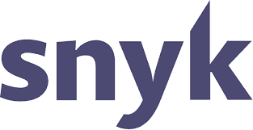

# Snyk 安全审查

> 原文：<https://dev.to/wagslane/snyk-security-review-2ho4>

莱恩·瓦格纳

我们最近将 [Snyk](https://snyk.io/) 集成到了 Qvault 中，以此来更好地了解 Qvault 代码库中的已知漏洞。Snyk 已经为我们修补了 lodash 中的一个[关键漏洞，这使得我们可以在几天前发布](https://snyk.io/blog/snyk-research-team-discovers-severe-prototype-pollution-security-vulnerabilities-affecting-all-versions-of-l) [lodash](https://github.com/lodash/lodash) 官方修复之前继续发布新版本。

我们不能说 Snyk 对于商业应用程序来说是否是一个划算的工具，但是他们通过提供免费集成对开源社区的支持是值得花几分钟来设置的。

他们的[快速启动页面](https://app.snyk.io/signup)允许开发者集成他们的 github 库，然后使用命令行工具来检测和应用任何补丁到他们的代码。

<figure> 

<figcaption>Snyk 徽章</figcaption>

</figure>

我们在我们的 [github repo](https://github.com/q-vault/qvault) 中添加了一个徽章，根据 Snyk 的说法，它几乎实时地显示 Qvault 代码是否包含任何已知的漏洞。如果您对开放源代码感兴趣，并且正在寻找一种保护代码安全的方法，Snyk 是您应该研究的一个工具。