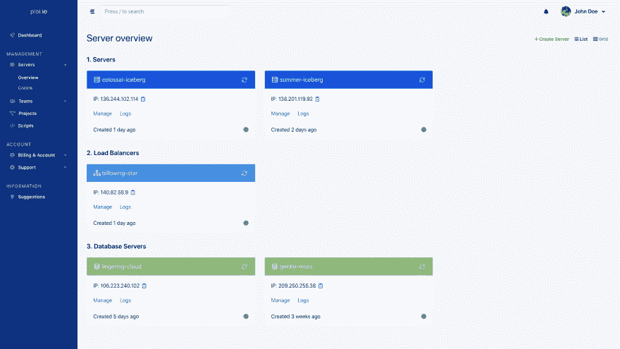
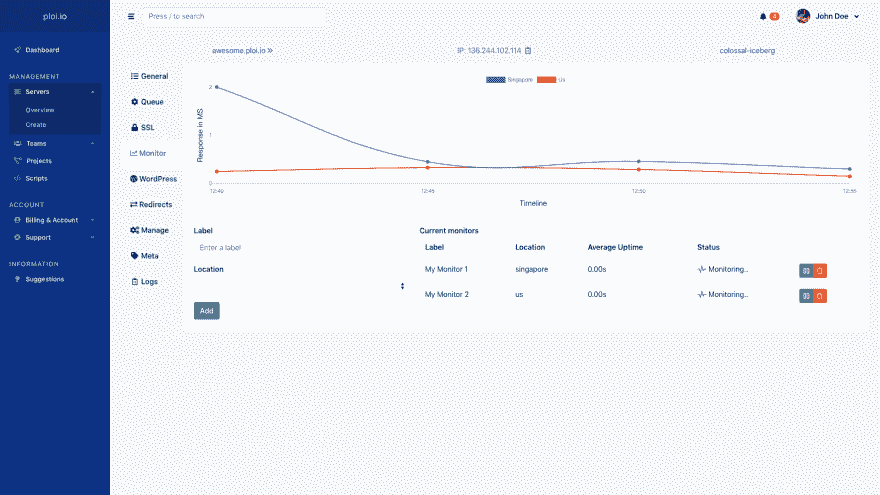
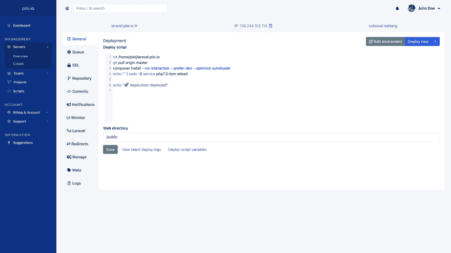

# 所以我重新命名了我的 SaaS，去掉了这个标志💪

> 原文：<https://dev.to/dennis_smink/so-i-rebranded-my-saas-and-ditched-the-logo-5ed7>

我很久以前就有了将我的 SaaS ploi.io 更名的想法，但最大的问题是我是一名核心后端开发人员，不擅长设计。

幸运的是，我有一个设计师朋友，他帮我为 ploi 建立了一个全新的品牌:天哪，这是一个挑战吗💙

我们曾经有绿色，但我总是喜欢蓝色超过绿色。这让我觉得它现在是一个更完整的产品。

随着前端的重新设计和品牌重塑，我们不能离开面板(这是整个应用程序中最重要的部分)。

所以我们也彻底检查了它！(标题中的图片和这篇文章下面的更多截图)

哦，我们也在寻找产品！

总结变化；

*   抛弃我们的标志(所有文字现在)
*   将品牌颜色从#62A6A6 更改为#1853DB
*   完全重新设计的前端网站
*   完全颠覆了面板设计
*   更改登录、注册和密码忘记页面
*   添加了代码编辑器突出显示
*   将站点和服务器导出到 1 个常规搜索栏
*   API 中增加了许多新特性(服务器创建仍在进行中& changelog 页面即将到达[https://developers . ploi . io](https://developers.ploi.io)
*   能够导出个人用户数据以查看我们保存的内容
*   速度改进面板
*   错误修复面板

我真的很好奇，想听听大家对品牌重塑和新设计的看法，告诉我吧！

