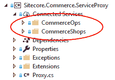

# 那么什么是 Sitecore 呢？商务。服务代理？

> 原文：<https://dev.to/robearlam/so-what-is-the-sitecore-commerce-serviceproxy-172j>

因此，如果你一直在浏览 Sitecore Experience Commerce 8 . 2 . 1 和最新发布的 Sitecore Experience Commerce 9 提供的 SDK，你应该会注意到它包含了一个名为 *Sitecore 的项目。Commerce.ServiceProxy* ，那么它是什么，什么时候需要使用它？

## 为什么需要 Sitecore。Commerce.ServiceProxy 项目？

为了证明这一点，我将引用我正在开发的产品比较模块。现在，这个模块的代码被分成引擎和店面两部分。该引擎有一个新的实体，它包含一个可销售项目的列表，并引入了一个新的控制器来更新该列表，并返回列表中的可销售项目。

现在，当用户与店面交互创建、更新和查看他们的比较集合时，店面代码将调用这些控制器端点。很好，这听起来很简单，我创建了引擎代码，并使用 Postman 测试一切正常，然后开始编写店面代码。除非您很快遇到问题，否则所有的实体和控制器都是在。引擎中使用的 NETCore 项目，因为这是针对。NETCore 我们不能在店面项目中引用这个。

那么，我如何引用我从店面代码中创建的那些实体和控制器端点呢？

这就是 Sitecore。Commerce.ServiceProxy 项目进来了！

## 那么它是如何工作的呢？

服务代理充当引擎代码和店面代码之间的中间人，允许您从店面代码引用引擎中定义的类型和控制器端点。

它通过使用[OData Connected Services](https://marketplace.visualstudio.com/items?itemName=laylaliu.ODataConnectedService)&codegen 来实现这一点。当您将项目添加到您的解决方案中时，您会看到它包含两个连接的服务-*commerce ops*&*commerce shop*。

其中每个都连接到引擎上的元数据端点，并使用返回的数据生成实体和控制器的副本，其格式可以被您的 storefront 项目引用。

因此，一旦您生成了代理，您就可以在您的店面项目中引用该项目，并拥有对所有引擎实体的完全访问权

现在，您可以访问您的店面项目中的所有引擎实体，但是扩展引擎并确保您的定制包含在代理中的过程是什么呢？

## 更新服务代理

所以你已经为自己构建了一个插件，类似于我上面提到的产品比较插件，现在你想在店面中访问它。您需要遵循什么流程来设置它？

你需要遵循几个步骤，但总的来说这是一个非常简单的过程:

1.  从 SDK 构建你的引擎版本，包括你的超级插件。
2.  部署引擎，或者从 VS 运行以确保它在端口 5000 上运行。
3.  添加 Sitecore。从 SDK 到解决方案的 Commerce.ServiceProxy 项目
4.  在 VS2017 中，展开 ServiceProxy 项目中的 Connected Services 文件夹
5.  对于每个服务(CommerceOps & CommerceShops)，右键单击它们并选择*Update OData Connected Service*——这将命中引擎的元数据数据端点，并为每个服务重新构建生成的代码文件。
6.  在您的 Storefront 项目中引用更新的 ServiceProxy 项目，并开始使用您的自定义引擎实体。

就这样，您现在有了在引擎中运行的自定义插件，它的实体和控制器端点通过代理暴露给店面。多么简单啊！

## 其他点

如果需要，您可以更改连接的服务，以从不同的 url 更新它们的 codegen 文件，例如，如果您想要在不同的端口甚至在不同的机器上一起访问引擎。为此，如果您在 VS 中展开连接的服务，您将在文件夹中看到一个同名的 JSON 文件，它包含 URL，您可以更改它以匹配您需要的位置。

如果你想了解更多关于连接服务的信息，我写了另一篇关于在 VS2015 和 VS2017 中使用代理的区别的文章，你可以在这里阅读。