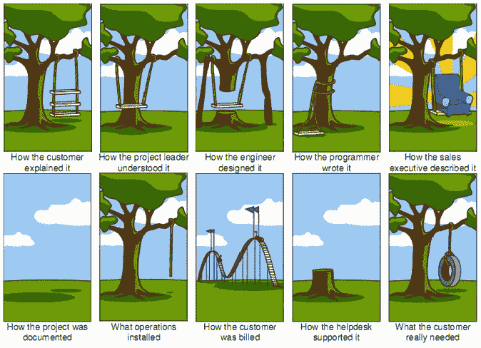

# 所以你想推出一款产品？首先你需要一个想法。

> 原文：<https://dev.to/turnerj/so-you-want-to-launch-a-product-first-you-need-an-idea-5ib>

*[Unsplash 上 AbsolutVision 的封面照片](https://unsplash.com/photos/82TpEld0_e4)*

如果你和我一样，在为别人工作时，你会有一种挠不到的痒感。也许你对所展示的工作类型不太感兴趣。也许你因为长时间维护遗留系统而感到疲惫不堪。至少，你想创造一些新的东西，并向全世界展示。

我不是医生，但是...听起来你已经有了创业精神。🤔

你可能对使用“企业家”这个词有所保留。我觉得“企业家”在某些圈子里被认为是一个有点脏的词——这个词被一些人用来描述“梦想家”和那些没有现实基础的牵强的计划。然而在现实中，它只是众多术语中的一个，如“创造者”、“发明家”等，用来描述某人为实现一个想法而付出的艰辛努力。

企业家/创造者/发明家以及他们对想法的执行是成功故事的重要组成部分，但是不管你听到什么，想法本身仍然扮演着重要的角色。惊人地执行一个坏主意不会让它变得更好。也就是说，糟糕地执行一个好主意并不是成功之路。虽然听起来显而易见，伟大想法的伟大执行总是会有最好的结果。

你是如何想出一个主意的呢？你怎么知道这个想法很棒？我的朋友说我的想法很棒，我如何获得数百万美元的种子资金？

## 最好的想法始于一个问题，而不是一个解决方案。

也许要记住的第一件事是不要试图把一个问题硬塞给你拼凑的解决方案。不要只是说“我做了一个很酷的东西，现在我想卖掉它成为百万富翁”，因为你可能会失望。

例如，优步的联合创始人加勒特·坎普(Garrett Camp)意识到了优步的价值，他花了 800 美元(T3)雇了一名私人司机在 T2 开了一夜车。

问题之所以重要，是因为它们有助于你识别客户和确定市场规模。如果你的问题是你一个人独有的，那你就有了一个糟糕的开始。如果你的问题发生在那些千载难逢地做 Y 和 Z 的同时做 X 的人身上，同样不太实际，因为它太过 T2 化和不太频繁。问题的频率和严重性的结合有助于指导解决问题的重要性。

一个合理的后续问题是:我如何找到一个问题来帮助提出一个想法？

老实说，想想你每天都在做什么。想想你不喜欢的事情和你认为可以做得更好的事情。想想你在这些方面的技能，以及你能做出什么贡献。如果“我对私人司机的成本不满意”帮助创造了优步，那么下一个如此简单的伟大想法是什么？

现在你可能有一个问题和解决它的想法...

## 我的朋友/家人/优步司机都说我的想法很神奇！

我不想让你失望，但是除非他们是你的目标受众，否则不要全信。

我并不是说他们的反馈完全无关紧要，但是他们可能太了解你了，以至于不会在反馈中提出批评，或者他们对你的了解还不足以让他们在意。你不想陷入这样一个陷阱，即一切都是惊人的，你一路向上去启动，它却摔了个嘴啃泥。

如果你还没有推出，你会想和潜在客户交谈，看看他们是否真的有问题。提出一个简化版的解决方案，看看是否能引起他们的共鸣。不要只和一个潜在客户尝试，要和尽可能多的人尝试。

我认为有一个流行的图表可以很好地解释这个问题。

你对问题和解决方案的理解可能是第一排的任何一个秋千。如果顾客真的只需要第二排的最后一次挥杆，你可能会错过目标——这就是为什么与顾客交谈至关重要。你的朋友/家人/优步司机可能不会帮你指出正确的方向，除非他们是你的客户！

图表显示客户解释问题是第一次挥杆，但这是好主意和好执行的艺术。好点子解决客户问题。良好的执行防止了图中所有的坏例子。

## 总结

想法很重要。伟大的想法来自问题。问题可能来自你在日常生活中做的任何事情。向潜在客户确认你的问题。

做完这一切后，现在你可以开始实施你的想法了！

