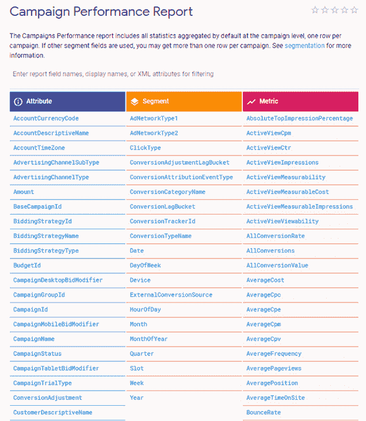
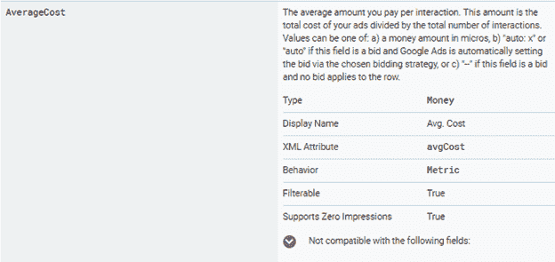
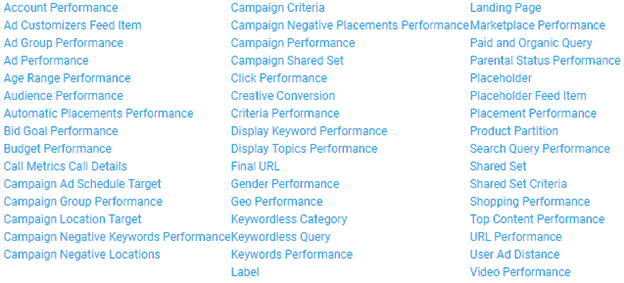
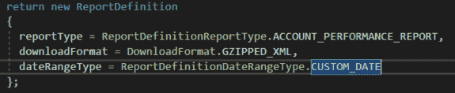
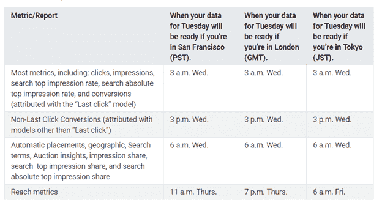
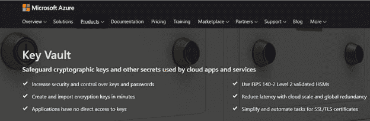
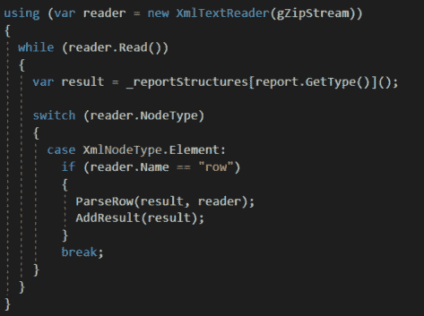

# 所以，你想做一个报告申请

> 原文：<https://dev.to/dealeron/so-you-want-to-make-a-reporting-application-f2m>

假设你是一个潜在的新企业主，你准备开设一个全新的面向客户的企业。开业那天你把一切都做得很完美，但是没人出现。你错过了任何生意的一个关键部分，广告。现代企业需要在本地，更重要的是在网上开展业务。谷歌、必应和脸书是一些大公司，它们提供服务来帮助像你们这样的企业完成这项任务。

有了直观的在线界面和支持，广告商将能够扩大他们的在线存在及其对其业务的影响。对于更懂技术的人来说，还有其他途径来构建定制工具、仪表板等等。这些途径被称为 **API 的**或**应用程序接口**，它们可以成为让你的业务发挥最大价值的非常强大的工具。在本文中，让我们关注三大广告公司之一及其独特的 API 平台。

大多数广告报告 API 都遵循一套基本的标准。在你涉足之前，让我们制定一些谷歌(和其他在线平台)的运营标准:

*   文档是一个强大的工具，利用它。当试图从一个 API 中获取数据时，有很多东西需要解开。诸如发现报告是如何分段的，或者如何访问报告的所需字段或其中包含的数据类型等问题。

*   用户收到的数据通常基于报告。数字如何显示给用户，这涉及到大量的相关性、规则和第一方知识。它可以在运行基本报告时简化一点逻辑，但会使定制计算变得困难。

*   数据在一天中的特定时间是最新鲜的。有些数据不是也不可能是活的。平台通常有一个固定的时间，他们可以保证数据是新鲜的。如果需要高度精确的结果，就必须了解这些时间并进行计划。

*   连接和认证可能会很棘手。API 对公众开放，数据需要保护。要连接到它们，需要执行多个步骤来确保隐私。通常，这些保护措施包括使用 OAuth2、不记名令牌和大量生成的密钥。

*   数据并不总是您可以使用的格式。数据可以通过多种不同的方式在线传输。JSON 是一种非常简单但功能强大的格式，API 使用它向您返回数据。有时数据需要从 excel 文档或一些专有的数据结构中提取出来。

## 文档

使用任何新技术的第一步是阅读任何可用的文档。API 可能非常复杂，开发人员依赖它来知道请求什么以及如何请求。使用一个没有好文档的 API 和一个有好文档的 API 就像白天和黑夜一样。Google Ads 幸运地落在了“天”的一端:干净的文档，不仅指定了数据如何分段，还指定了报告中可以请求的字段，甚至是返回文件中要查找的数据类型和属性名。

<figure>

<figcaption>Clean definition of attributes, segments and metrics on the Google Ads Campaign Performance Report</figcaption>

</figure>

<figure>

<figcaption>Very informative breakdown of the AverageCost field on the Campaign Performance Report</figcaption>

</figure>

## 报告基础数据

Google Ads 将 Google 搜索引擎结果、YouTube 视频指标和 Google AdSense 结合到一个功能丰富的 web 应用程序和 API 中。大量的可用数据可能会让人不知所措。对于刚刚开始在该平台上开发的开发人员来说，这可能会更加困难。Google Ads 通过提供大量现成的报告解决了这个问题。

<figure>

<figcaption>A list of the reports offered by Google Ads</figcaption>

</figure>

因此，下一个问题是“我如何将这些报告放入我的代码中？”谢天谢地，答案很简单。通常，开始下载这些报告需要大量的样板代码。谷歌通过创建和分发针对谷歌广告平台定制的软件包，大大简化了这一步骤。

一旦安装了软件包，开发人员就可以生成一个请求，指定报告类型、列、日期范围、返回的文件类型和其他特定的请求信息。一旦发送，Google Ads API 将会以请求消费的格式发回一个文件。拥有这种级别的灵活性为开发人员提供了一个支持其报告的坚实基础。

<figure>

<figcaption>Basic C# report request definition</figcaption>

</figure>

## 新鲜数据

处理实时广告数据的一个常见方面是数据有多新。从事数据库工作的开发人员对新鲜数据的概念并不陌生。如果数据是最新的可用数据，则被视为“新鲜”数据。离数据发布的时间越远，数据就越陈旧。为了获得尽可能准确的图片，了解您正在提取的数据类型以及提取时间非常重要。

<figure>

<figcaption>For more information about Google Ad metrics, visit https://support.google.com/google-ads/answer/2544985?hl=en</figcaption>

</figure>

## 认证

当在网上与任何人或任何事合作时，安全性是一个大问题，API 也不例外。在允许在 API 中查询数据之前，Google Ads 需要四条信息。第一个是*开发者令牌*。这与一个开发者账户相关联，谷歌用它来追踪开发者是谁，以及他们拥有什么级别的访问权限。新开发人员从基本开发人员访问开始，必须向 Google 发送一个应用程序以获得完全开发人员访问权限。接下来的两条信息，即**客户端 id** 和**客户端秘密**，是一对指定数据来自哪个账户的 id。id 很容易找到，但是必须为该帐户生成密码。最后，*刷新令牌* *是另一个生成的令牌，它具有有限的寿命，必须定期重新生成。一旦组装了所有这些令牌，就可以成功地从 API 请求数据。点击[此处](https://developers.google.com/adwords/api/docs/guides/first-api-call)可找到逐步演练。

当使用授权令牌时，您永远不希望将它们存储在代码本身中。任何可以访问您的代码库的人都可以访问您的令牌。那么，在哪里可以存储这些令牌，以便仍然可以在代码中访问它们呢？Azure KeyVault 或其他基于云的平台等产品是解决这一问题的绝佳方案。当需要更新您的更新令牌时，只需在云中更换即可，非常快速简单。

<figure>

<figcaption>For more information about Azure KeyVault, visit https://azure.microsoft.com/en-us/services/key-vault/</figcaption>

</figure>

## 数据格式

在线传输数据有多种方式。JSON、CSV、制表符分隔只是现代 API 用来响应数据请求的一些常见格式。谷歌广告让你可以选择如何返回你的数据。然而，数据是返回的关键是以一致的格式获取数据，以便您的代码使用和处理。例如，如果您希望将活动报告中的数据存储到数据库中，您可能希望请求 CSV 格式的数据，然后将该数据转换为数据库对象并将其保存到数据库中。

<figure>

<figcaption>Sample code for reading a gZip file from the Google Ads API</figcaption>

</figure>

## 只有开头

考虑这些标准只是进入互联网广告 API 平台世界的起点。任何面临业务的大客户都有从这些平台获取数据的既得利益，以及这些数据如何帮助他们发展业务。作为一个知道如何与这些 API 交互的开发人员，理解它们的怪癖对任何开发人员来说都是一个很大的好处。