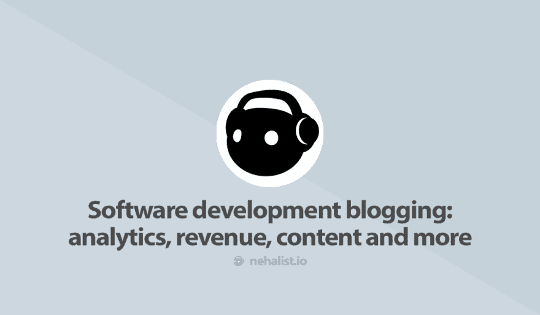
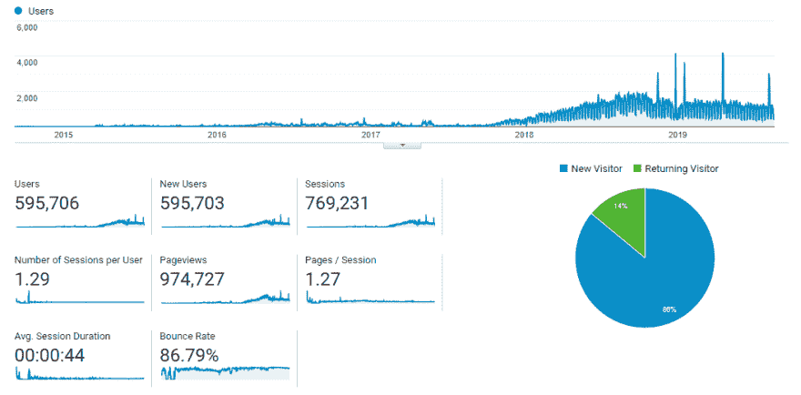
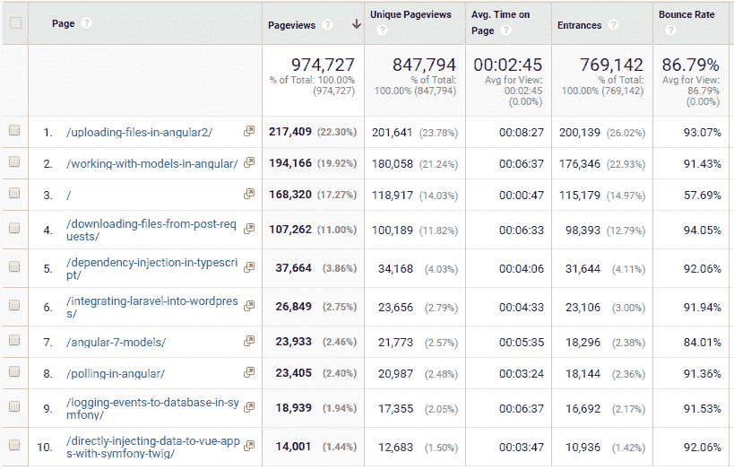
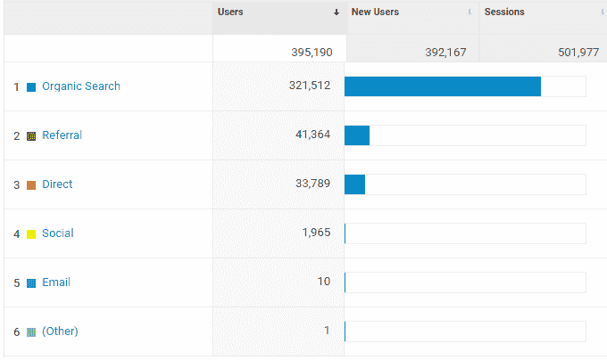
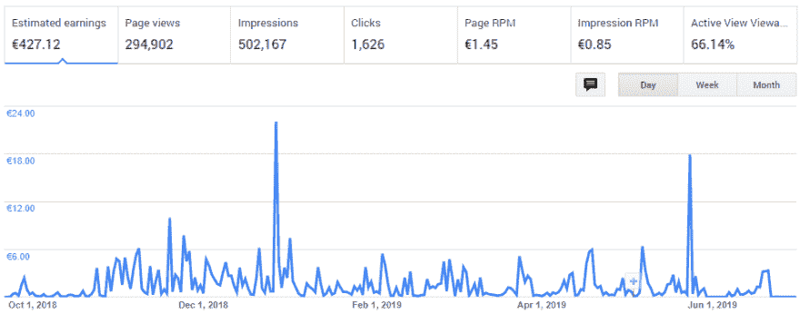
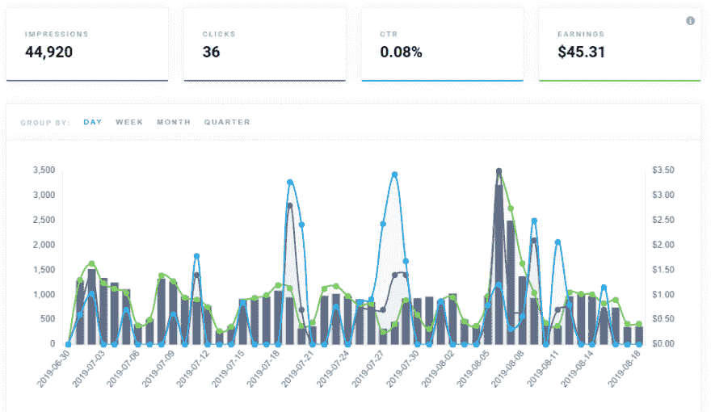

# 软件开发博客:分析、收入、内容等等

> 原文：<https://dev.to/nehalist/software-development-blogging-analytics-revenue-content-and-more-4jio>

今年夏天，我的博客已经上线四年了，是时候分享一些数据和想法了。

## 前言

在深入研究数字之前，我们需要记住一些事情:

*   我已经多次忽略了我的博客。这不是我引以为豪的事情——但是对于这篇文章来说，知道这一点很重要。四年来，我只发表了大约 50 篇文章。
*   本文将只讨论 2014 年 9 月注册的 **nehalist.io** 域名。

这篇文章会让你对“我的博客在编程方面做得如何”有所了解。

## 分析学

让我们从我的分析账户中的一些数字开始。到目前为止，我的博客已经吸引了近 60 万用户，产生了近 100 万的浏览量。

> 对于一个主要提供指南的博客来说，高跳出率是很正常的。人们搜索一个问题，找到博文，阅读文章，然后离开。

### 站点内容

事实上，我最受欢迎的内容是指南，这并不奇怪——我关于在 Angular 上传文件的[和在 Angular](https://nehalist.io/uploading-files-in-angular2/) 与模特一起工作的[的指南产生了我总流量的 40%左右。](https://nehalist.io/working-with-models-in-angular)

这两个指南(都发表于 2017 年 9 月)是第一个真正提升我的数字的帖子；在发布帖子之前，我每天的访问量约为 20 到 50 次，而在谷歌施展了魔法并对帖子进行索引后，我的访问量超过了每天 100 次。

这些帖子的出现并不纯粹是运气；当时我不得不处理这些帖子中描述的问题，并且没有在网上找到一个简洁的解决方案。知道没有特定主题的资源确实帮助这些帖子吸引了许多访问者。

### 采集

> 2018 年 7 月至 2019 年 7 月的统计数据

了解人们如何访问你的博客是一个非常重要的因素。就我而言——我的大多数帖子都是帮助人们解决具体问题的指南——难怪我的大部分流量都来自有机搜索:

## 广告收入

从你的博客中赚钱的一个简单方法是投放广告。在我的情况下，我想支付这个博客所需的费用(大约每月 30 美元)。

### 站长

我从 2018 年 10 月到 2019 年 7 月跑 AdSense。在那段时间里，我大约。300，000 次页面浏览，产生约 430:

通过这种方式，我平均每月能赚到近 50 欧元。

### 碳广告

随着我的重新设计在 2019 年 7 月发布，我转向了[碳广告](https://www.carbonads.net/)。

如图所示，到目前为止，我已经用碳赚了 45 美元(在近 2 个月内)。

你可能想知道为什么自从我转向碳排放后，平均收入下降了；但重要的是要记住，我对 AdSense 的态度更加积极。我运行了文章内广告、提要广告和一个侧边栏广告，而自从我换成了 Carbon，我每页只运行一个广告。

### AdSense 还是碳广告？

最后，这一部分引出了一个问题:你应该使用 AdSense 还是 Carbon 广告？

获得 AdSense 许可肯定更容易，因为 Carbon 广告只接受邀请。其他一切都取决于你在寻找什么:

*   AdSense 允许更多的收入，因为你的页面上有多个广告。
*   碳广告看起来不错。不是那种典型的*“你看我，我是广告！!"*外观——这是一种低调的外观，丝毫不会影响读者。
*   碳广告是针对设计师和开发商。

因为我经营广告来支付我的博客费用，我肯定可以每月少花几块钱。作为回报，我增加了很多读者体验，显示的广告是专门针对阅读我博客的人的——我想这是一个公平的交易。

## 内容

我在博客上面临的最大挑战之一是创建合适的内容。有人关心如何在 React 中创建一个阅读进度条吗？有人对这个帖子里显示的数字感兴趣吗？这个世界还需要另一篇关于优化 TypeScript 应用程序的帖子吗？

这些问题不断在我脑海中出现，现在依然如此。但对我个人来说，我找到了一个简单的答案:只要我喜欢写这些东西*和*，它们确实符合我博客的计划(这是技术/编程相关的东西)，它们完全可以写。

有些帖子，比如我写的关于 TypeScript 中[依赖注入的帖子，是因为那天我完全不知道该写什么。即使在我发表了这篇文章之后，我仍然确信:没有人会关心 DI 是如何在幕后工作的。我喜欢创建它，但我不认为有人会关心这样一个话题。但是你猜怎么着？这是我博客上阅读量第五高的帖子。](https://nehalist.io/dependency-injection-in-typescript/)

另一方面，我关于[硒测试](https://nehalist.io/selenium-tests-with-mocha-and-chai-in-javascript)的帖子是相反的:我确信这个帖子是*的下一个大帖子，它至少产生了我的 Angular 帖子所产生的流量。出版几天后，我意识到:事实并非如此。它得到的反馈很少甚至没有，直到今天也很少有人阅读。*

但是，对我来说，重点是:没那么重要。我喜欢写它们。

我喜欢更好地理解这些事情——不管《邮报》做得有多“好”。至少对我来说，这就是写博客的意义:只要你喜欢你所做的事情，就没有什么不好——即使你的帖子可能不会产生你期望的数量。

谈到内容，我唯一尝试遵循的规则是:

> 你是在为你的读者写作，而不是为你自己。

我大概可以写很多关于我的车，我的猫，我最近的假期，等等。-但这不是这篇博客的重点。人们来这里是为了阅读关于科技的书籍——所以这就是我想要传达的。

### 寻找话题

前一段时间，我很难找到合适的话题来写。

如果你有一个要写的想法，你可能要做的第一件事就是研究这个主题。很多时候，我会发现很多关于同一个主题的结果，我会问自己“这真的值得写吗？”。但是答案很简单:每个人都有自己的风格，每个程序员都知道不同的事情——即使当涉及到他们的内容时，他们可能会部分重叠。我喜欢用一种非常简单的方式来思考这个问题:*许多事物的独特之处在于它们被传达的方式，而不在于它们是什么*。脸书是在社交网络已经存在之后创建的，堡垒之夜是在 PUBG 已经是人数众多的皇家阿尔法战的时候建立的，Vue 是在 React 之后创建的，等等。通常情况下，后来的事情不会更糟，有时甚至会更好，因为你可能会从之前获得的知识中受益。

你的下一篇文章可能不会是下一个价值数十亿美元的东西——但我想你明白了；仅仅因为有一个关于某个主题的帖子，不应该阻止你写同样的主题。用你自己的知识和写作风格调味，你的帖子仍然是独一无二的。

另一件对我帮助很大的事情是维护一个内容想法列表。每当我的大脑有一个想法的时候，我就把它写下来——这样我每天会有 2 - 3 个想法。其中一些可能永远不会成为帖子——但每当我想写一篇帖子，但一时没有主意时，我可以看看我的智能列表，选择一个主题。

### 内容分布

没有人阅读，写作几乎毫无价值。

不管怎样，人们需要被告知你已经做了一件事。我已经习惯了立即在 Twitter 上分享我的帖子。

一些帖子(主要是指南)也在 Reddit 上分享。在 Reddit 上分享是获得读者的一个好方法——但也必须小心。Reddit 对自我推销有严格的限制，所以不要夸大其词，否则你会被封杀。

> 如果你想在 Reddit 上分享你的帖子，同时考虑“分享的好时机”,那么稍后看看 Reddit 的[,它会告诉你什么时候发帖更有可能获得关注。](https://dashboard.laterforreddit.com/analysis/)

我真正认为有价值的帖子都分享在[黑客新闻](https://news.ycombinator.com/)上。到目前为止，我的帖子没有一篇出现在首页，而且在几分钟内就消失在第二页以上。这真的很难做到——但如果你能做到，你的流量可能会爆炸。

我只在[媒体](https://medium.com/@nehalist)上交叉发布我的内容。主要原因是我被邀请去两家大的出版社，在那里我的每篇文章都能接触到更多的读者。交叉帖子不会在发布初始帖子后立即发布，而是在一两天后发布，以保持帖子的势头至少几天。

(显然我也在 dev.to 上交叉发布；但是这个帖子是在那之前写的)

## 结论

如果你想开一个编程博客，你需要记住一些事情:

*   如果你主要针对具体问题发布指导，你的跳出率可能会很高。
*   写你喜欢的和想写的东西(同时记住你的读者)
*   拥有一个内容分发策略无疑有助于接触更多的人和发展你的品牌。
*   广告可能会覆盖你博客的费用，但是仅仅靠广告是不可能致富的(除非你每天都有大量的访问者)。如果你想从你的编程博客中赚钱，创建付费课程或提供某种软件即服务可能更有利可图。
*   不要过多考虑某件事是否值得写。有些帖子会得到更积极的反馈，而有些帖子几乎不会被注意到。有些帖子会比其他的好。也许这个更好，也许不是。如果你喜欢创建它们，甚至可能学到了一些东西，一切都很好。

* * *

如果你喜欢这篇文章，请留下❤，在 Twitter 上关注我，订阅我的时事通讯。本帖原载于 2019 年 8 月 13 日 [nehalist.io](https://nehalist.io/software-development-blogging-analytics-revenue-content-and-more) 。