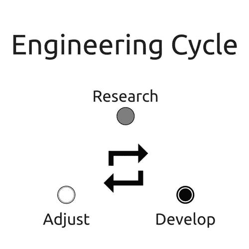
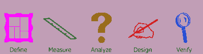

# 作为感知风险的软件质量

> 原文：<https://dev.to/mcloide/software-quality-as-perceived-risk-45dc>

## 第一部分

去年，我花了大量的时间讲授软件工程以及有助于一致和可靠的软件开发的 3 条工程核心路径。

### 工程周期

[](https://res.cloudinary.com/practicaldev/image/fetch/s--mCT-o4dq--/c_limit%2Cf_auto%2Cfl_progressive%2Cq_auto%2Cw_880/https://miro.medium.com/max/500/1%2AZvmOfTchtUa8-0k2C1l1Nw.png)

谈论软件和工程就是谈论过程、开发周期和故障排除，最终只有一个目标:质量。

但是有一个警告，什么是软件质量或者更好的软件质量如何被测量？事实是没有办法量化软件的质量，我所说的量化是指没有办法应用诸如六适马这样的东西来度量软件的质量。

不涉及很多细节，特别是因为我不是 6σ黑带，六适马是一个连续的过程来定义一件事:在一个制造事件中，只有百万分之六的零件可以包含缺陷。

[](https://res.cloudinary.com/practicaldev/image/fetch/s--4SmWDDw5--/c_limit%2Cf_auto%2Cfl_progressive%2Cq_auto%2Cw_880/https://upload.wikimedia.org/wikipedia/commons/thumb/e/ea/DMADVWebdingsI.png/400px-DMADVWebdingsI.png)

https://en.wikipedia.org/wiki/Six_Sigma DMADV

考虑任何制造商，例如钉子制造商，有可能测量出在生产的一百万个钉子中只有 6 个有缺陷。这意味着生产过程得到了优化，在生产过程中没有实际测量到的损失。

除了 6σ之外，还有其他全球公认的质量认证，如 ISO 9001 认证。

不幸的是，就我所知，软件没有同样的方法。自从软件开发成为一种职业和一门科学以来，软件质量就一直以感知质量来衡量。

对于一个 web 应用程序，你可以定义它覆盖了 70%的单元测试，70%的用户接受了它，QA 成功地捕获了 99%的逻辑错误，应用程序遵循了最佳的编码实践和标准或者我们当前的时间，但是没有办法量化这些数字，没有办法说一百万行代码中只有 6 行有缺陷。不幸的是，它不是这样工作的。

如果你向任何愿意投资的人展示你的软件想法，合乎逻辑的问题是确定软件有多好，这样人们可以衡量投资的风险，以及随后的投资回报(另一篇文章的主题)。

在制造行业，一名车间工程师可以找到首席执行官，肯定地说:我们获得了 ISO 和 6 适马认证，在过去的 300 天里，我们没有发生一起事故。不用给出很多数字，就等同于确认生产过程中没有任何损失，因此风险小，利润高(不相关)。

当同样的问题被问到一个软件时，通常的回答是基于百分比，尽管他们给出了一些量化软件质量的基础，但并没有给出真正的保证。单元测试覆盖了 70%的代码，这到底意味着什么？首先，如果没有对什么是单元测试的解释，向投资者或商业人士解释这一点是不可能的。

面对这个问题，合乎逻辑的下一步是统计成功的部署，统计有多少错误，统计有多少关键或高优先级的错误，统计有多少修补程序。总是有量化软件质量的需要，但是仍然没有一个单一的方法可以被全世界接受。

### 衡量软件质量成为问题。

在作为一名软件工程师的多年工作中，以及它所经历的所有不断变化的阶段中，软件在质量上有所提高，但是仍然没有完全度量，这导致我们接受或感知风险。

[](https://res.cloudinary.com/practicaldev/image/fetch/s--ibcwjTlf--/c_limit%2Cf_auto%2Cfl_progressive%2Cq_auto%2Cw_880/https://www.text911ct.oimg/phone_en.png) 
911 文本—谷歌图片搜索

考虑一个正在开发拨打 911 电话的软件的团队，该团队如何报告该软件将一直工作？

软件是无法量化的，呈现百分比是相当难解释的，魔术作为一种解释是行不通的，唯一留下来呈现的是感知风险。

感知风险是一种意外行为发生的可能性，在软件中，它主要出现在部署前会议上。

它被认为是可感知的风险，因为你不能量化软件质量的原因，因此，为了确定软件的质量，你要确定关于软件开发和测试的所有信息是否会产生问题，以及发生问题的概率有多高。

### 风险评估

例如，在一个按照标准进行了 70%单元测试的软件中，由质量团队进行了全面测试，问题是在将软件部署到生产环境中的风险是什么，发生意外行为(注意这不一定是 bug)的可能性是多少。

对此通常的回答是:最低、相当高或很高。

如果我们考虑一下 911 电话的情况，因为没有办法量化软件的质量，所以最好的办法是确定软件不工作的风险，或者更好地说，是感知的软件不工作的风险。最后，重要的是，无论发生什么情况，所有的电话都要从 911 到达调度中心。这个场景是电信行业的真实场景，正如该行业的任何人所说，这是一个命悬一线的场景，以便呼叫更好地到达调度。

直到有一天，我们可以得到类似 6 适马的软件质量，风险评估或感知风险可能是软件工程师在软件质量方面能够给出的唯一足够好的度量。

## 第二部分

现在我们知道了问题，如何解决它，这样我们就可以最终量化软件应用程序的质量。

为了首先量化质量，我们需要定义什么是质量，这涉及到一系列的认知。例如，丰田卡罗拉和起亚远舰是等效的汽车，因此，它们具有相似的质量，但丰田总是被认为具有更高的质量，原因通常是难以理解的，当由客户与制造商解释时。

作为一名司机，我喜欢我的起亚远舰，我知道我很难将远舰作为一辆更好的车卖给现在或以前的丰田车主。如果两辆车质量相似，为什么一辆被认为比另一辆好？这个问题的答案很简单:人类不是处理二进制逻辑的机器，我们的决策中有很多情感。

质量是一个感知的问题，对于每个受众产品所有者、客户和投资者来说都是不同的，尽管会给出不同的信息，但他们最终必须确认你的软件应用程序是有质量的。

产品所有者对质量的感知与风险有关。如果应用程序在生产中的风险较低，这意味着它的技术债务成本较低，从而有更多的时间开发新功能。虽然我把风险和技术债务联系在一起，但事实是风险管理需要考虑很多其他因素。单元测试、技术债务、复杂性、产生 bug 的可能性等等。

真正重要的是风险越高，技术性债务的几率就越高，因此成本也就越高的数学关联。

从客户的角度来衡量质量必须每天进行。这是通过它产生的技术支持电话的数量和流失率(客户停止订阅你的应用程序的比率)来实现的。

一个客户流失率低、技术支持电话数量少的应用程序意味着它的成功率高，因此质量高。技术支持电话耗费时间，大量的电话将耗费更多的个人时间，这意味着可以用于特定改进的成本现在被用于生产问题的支持(技术债务)。高流失率意味着应用程序的日均订阅量会大幅下降，这对应用程序产生的收入有直接影响。

有趣的部分是为投资者衡量质量。如果你熟悉《鲨鱼池》等电视节目，你会知道所有投资者问的都是同一个问题:风险是什么，当前的增长是什么。问这个问题是为了让他们能够成功地衡量 ROI(投资回报)。

当你向投资者推销你的应用程序时，你可以成功地发展它，你将主要向他提供流失率和当前利润，这是它变得困难的地方。

当应用程序启动时，很难获得大笔投资或投资者的加入(并不是说不可能)，这使得负责该应用程序的团队成为第一投资者，但当试图进行二次投资以实现增长时，您必须提供数据，这意味着:

*   到目前为止，该应用程序的总收入是多少
*   总体客户获得量(订阅量)是多少
*   未来 5 年的预计客户获取量是多少
*   当前的流失率是多少(与我们对客户测量的流失率相同)

有了所有这些，人们可以从工程团队之外的角度使用以下方法来量化质量:

```
    Average Net profit vs Churn rate

```

其中，平均净利润是已经从损失中扣除的平均收益额，流失率是订阅损失的百分比。

高平均净利润和低流失率相当于一个成功的软件应用，也相当于一个高质量的产品。

对于工程团队来说，第一部分提到的所有要点都是确保高质量产品最不必要的。

这些文章首次发表于:

*   [https://bit.ly/2rzaFsn](https://bit.ly/2rzaFsn)
*   [https://bit.ly/2Zfu7dE](https://bit.ly/2Zfu7dE)