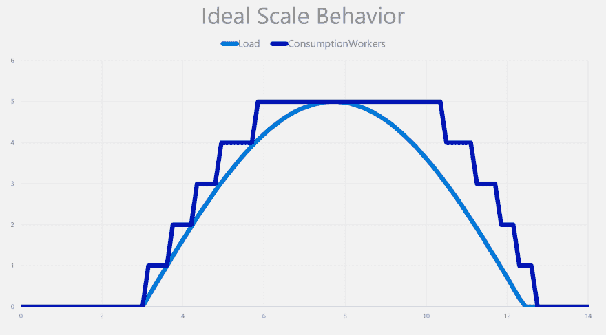
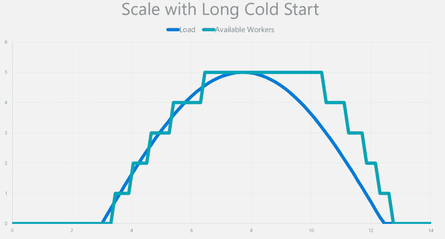
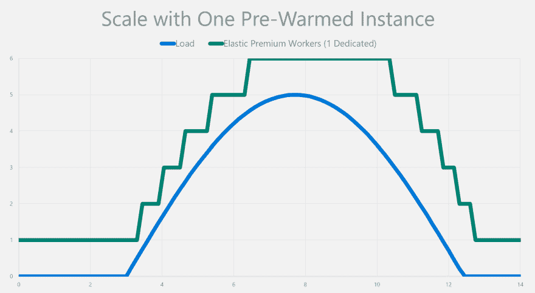

# 解决冷启动扰乱无服务器的定义，没关系

> 原文：<https://dev.to/azure/solving-cold-start-disturbs-serverless-definition-and-it-s-okay-1hhn>

当你看到 Azure 函数时，你会发现它是实现应用程序弹性伸缩的一个很好的方式。你只需为你使用的东西付费，你有一个免费的配额，他们允许你在这个模型上构建整个应用程序。

Azure Functions 免费的全部原因在于它的链接计划。叫`Consumption Plan`。虽然 Azure Functions 是一个应用程序模型，但消费计划是无服务器的 T2 发挥作用的地方。你给我们你的应用，你不关心服务器。

无服务器的主要卖点之一是能够扩展到 0。它允许你只为你使用的东西付费，这对每个人都是双赢的。

这看起来有点像下图。

### 关于冷启动

当应用程序第一次在服务器上加载时，会发生冷启动。幕后发生的事情如下所示。

1.  云收到对您的应用程序的请求，并开始为它分配服务器
2.  服务器下载您的应用程序
3.  云将最初收到的请求转发给应用程序
4.  应用程序堆栈加载并初始化成功运行代码所需的内容
5.  您的应用程序加载并开始处理请求。

每当您的应用程序从 0 变为 1 或者云向外扩展时，都会发生这种工作流。

这整个过程是必不可少的，因为 Azure 无法在不阻止其他应用程序在相同服务器上运行的情况下保持服务器一直运行。

请求最初到达和被服务器处理之间的时间可能超过 500 毫秒。如果需要几秒钟呢？你如何解决这个问题？

### 高级功能

Azure 高级功能是解决这个问题的最好方法。它打破了无服务器的定义，因为您无法扩展到 0。但是，它确实提供了处理大量负载所需的弹性横向扩展。

就提高性能而言，这种最少的一个实例是一天中最重要的。这个实例上已经有您的应用程序；Azure Functions 运行时已经准备好处理你的应用了。

拥有一个永久实例可以省去处理请求所需的大部分较长的步骤。它有效地消除了冷启动问题，如下所示。

你什么时候会使用高级功能？当你的应用不能冷启动时。不是每个应用程序都需要这个功能，我完全同意。如果消费计划符合你的需求，继续使用，冷启动不是问题。

如果您是无法承受应用程序冷启动时间的客户之一，同时仍然需要服务器的爆发，那么高级功能就是为您准备的。

### 资源

我已经快速浏览了基本功能，我认为它解决了无服务器的一个重要问题。更多的功能来自高级功能。我留了一个文档链接，以防你想一个人看完。

*   [Azure 高级功能](https://docs.microsoft.com/azure/azure-functions/functions-premium-plan?WT.mc_id=devto-blog-marouill#features)