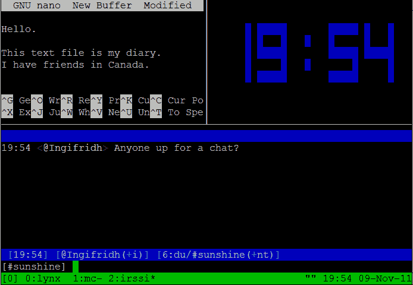
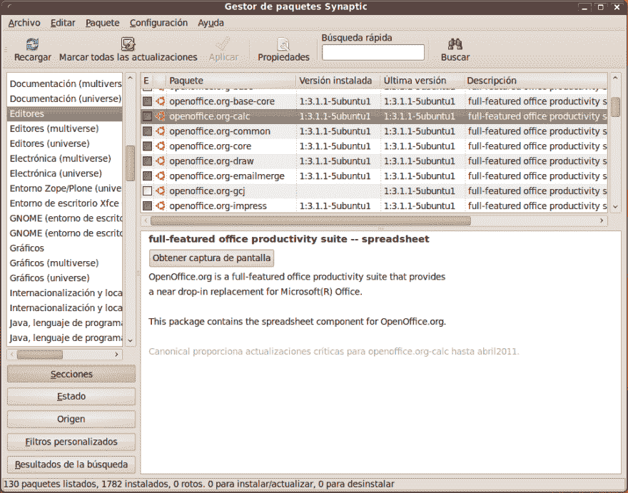
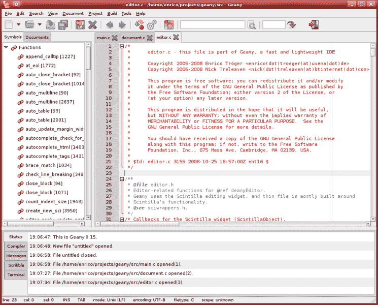
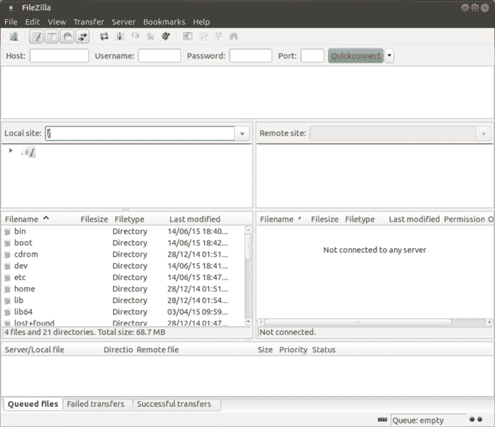
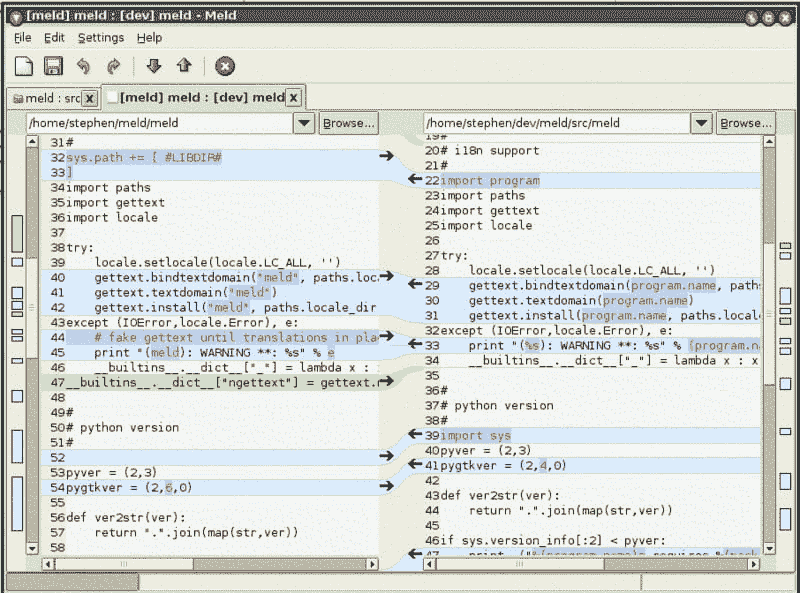

# 一些很棒的 Linux 工具让你的科技生活更简单

> 原文：<https://dev.to/prahladyeri/some-awesome-linux-tools-to-make-your-tech-life-easier-4h3p>

今天早上我看到了这篇精彩的帖子，我想为什么不写一篇关于我作为日常驱动程序在 linux 机器上使用的各种工具的新帖子呢。

[](/antjanus) [## 我最喜欢的 Linux 工具

### 安东宁 j .(他们/他们)6 月 12 日 195 分钟阅读

#linux #productivity #tools](/antjanus/my-favorite-linux-tools-12be)

这些工具或命令并不完全属于我的“最爱”类别，而是属于“必须拥有”或“面包和黄油”类别。换句话说，其中一些是在 linux 上工作绝对必要的，至少对我来说是这样。这些包括 CLI 和桌面的！

# tmux

第一个想到的是`tmux`，一旦你开始使用 Linux，终端复用就不是你可以长期不使用的东西了！

[](https://res.cloudinary.com/practicaldev/image/fetch/s--1zHZTwlZ--/c_limit%2Cf_auto%2Cfl_progressive%2Cq_auto%2Cw_880/https://upload.wikimedia.org/wikipedia/commons/5/50/Tmux.png)

# 字典

`dict`是另一个伟大的例子。我们经常在互联网上遇到新词，我发现在我的终端上运行`dict <word>`比打开一个新标签并在谷歌上搜索关键词要容易得多。安装就像 ubuntu 上的`sudo apt install dict dictd dict-wn`一样简单。

# 突触

`synaptic` package manager 是另一个很棒的工具。虽然如果你已经知道要安装什么包的话,`apt install`很容易使用，但是`synaptic`在一些普通的事情上帮了你很多，比如搜索和排序包的依赖关系，修复损坏的包，重新加载库等等。

比起像 snap 和 flatpak 这样的现代垃圾，我更喜欢 T2 经典的 T3 方式的 T0 和 T1。snap 和 flatpack 并没有走向一个标准的包管理器，而是像创可贴一样解决了标准化问题！

[](https://res.cloudinary.com/practicaldev/image/fetch/s--GJ-zi-7q--/c_limit%2Cf_auto%2Cfl_progressive%2Cq_auto%2Cw_880/https://upload.wikimedia.org/wikipedia/commons/e/eb/Gestor_de_paquetes_Synaptic_Ubuntu_9.10_es.png)

# 吉亚尼

`geany`是一个轻量级程序员的编辑器，它是 Linux 世界的`notepad++`！最重要的是，geany 几乎不会占用你几十兆的内存，所以你也可以在老机器上运行它。

[](https://res.cloudinary.com/practicaldev/image/fetch/s--qxy5v3G3--/c_limit%2Cf_auto%2Cfl_progressive%2Cq_auto%2Cw_880/https://upload.wikimedia.org/wikipedia/commons/thumb/b/b0/Geany_Main.png/745px-Geany_Main.png)

# filezilla

如果您想通过 ftp/sftp/ftps 协议将文件传输到远程服务器，在 linux 世界中可能没有比 filezilla 更好的工具了。它已经在 ubuntu repos 上正式发布，只差`apt install`一步了。

[](https://res.cloudinary.com/practicaldev/image/fetch/s--B-ZdjGVc--/c_limit%2Cf_auto%2Cfl_progressive%2Cq_auto%2Cw_880/https://upload.wikimedia.org/wikipedia/commons/thumb/9/95/FileZilla_3.7.3.png/694px-FileZilla_3.7.3.png)

# 报告情况

对于 linux 桌面来说，这就好比是 windows 世界的无可比拟。你可以递归地比较任何两个文本文件或整个文件夹的修改，并通过简单的拖放来编辑它们。`meld`对程序员特别有用。

[](https://res.cloudinary.com/practicaldev/image/fetch/s--nchD-jME--/c_limit%2Cf_auto%2Cfl_progressive%2Cq_auto%2Cw_880/https://upload.wikimedia.org/wikipedia/commons/thumb/3/30/Meld_file1.png/800px-Meld_file1.png)

# 神奇塑形器

在 linux 世界中，使用这个[鲜为人知的命令行工具](https://github.com/magnific0/wondershaper)，你实际上可以对你桌面上的应用设置带宽使用限制(不是开玩笑！).

例如，要在您机器的 WiFi 接口上设置 4 mbps 的上传限制和 8 mbps 的下载限制，您只需运行以下命令:

```
sudo wondershaper -a wlp4s0 -u 4096 -d 8192 
```

Enter fullscreen mode Exit fullscreen mode