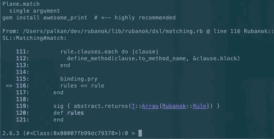

# 吸收宝石，还是第一次收养的故事

> 原文：<https://dev.to/evilmartians/sorbetting-a-gem-or-the-story-of-the-first-adoption-3j3p>

**注** : *这篇文章是在第一次公开发布冰糕(2019-06-20)几天后写的。如果你是在那件事发生几个月后读到这篇文章的，这里描述的大部分事情可能已经不再相关了。*

Stripe 终于开源了他们期待已久的 Ruby 静态类型检查器— [Sorbet](https://sorbet.org) 。自从[首次宣布](https://twitter.com/darkdimius/status/1002049138366730240)以来，我已经等了一年多了。

老实说，我不太喜欢类型注释，或者更准确地说，我是“我讨厌类型注释”的一方。

> 【AMR】@ amrabdelwahab

但是作为 Ruby 社区的一员，我很高兴看到这样的事情发生:这是 Ruby 本身的**巨大飞跃(特别是，与其他*进化特性*如 [~~流水线~~操作符](https://twitter.com/a_matsuda/status/1139110957450375168))相比)。条纹队做得很好👍！**

看了布兰登的[第一印象](https://dev.to/baweaver/a-scoop-of-sorbet-first-impressions-f30)(强烈推荐去看看)，我决定试试冰糕，把它融入我的一颗宝石。

> **TL；dr** 型检查器效果很好，但不理想；标注难看；工具还有许多不足之处。

## [鲁巴诺克](https://github.com/palkan/rubanok)遇上冰糕

我决定在这个实验中使用 [`rubanok`](https://github.com/palkan/rubanok) :就代码量和元编程而言，这是我最简单的选择。

> 你可以在这里找到*领养*公关:【https://github.com/palkan/rubanok/pull/5】T2。

### `bundle exec srb init`

采用的第一阶段是将`sorbet` gem 添加到捆绑包中，并生成所有需要的文件(阅读更多内容并查看此过程的截图[此处](https://dev.to/baweaver/a-scoop-of-sorbet-first-impressions-f30))。

可惜不太顺利:

```
$ bundle exec srb init

👋 Hey there!

...

Traceback (most recent call last):
    15: from /ruby/gems/2.6.0/gems/sorbet-0.4.4280/bin/srb-rbi:232:in `<main>'
         ...
     3: from /ruby/gems/2.6.0/gems/sorbet-0.4.4280/lib/gem_loader.rb:553:in `require'
     2: from /ruby/gems/2.6.0/gems/rspec-rails-3.8.2/lib/rspec-rails.rb:4:in `<top (required)>'
     1: from /ruby/gems/2.6.0/gems/rspec-rails-3.8.2/lib/rspec-rails.rb:6:in `<module:RSpec>' /ruby/gems/2.6.0/gems/rspec-rails-3.8.2/lib/rspec-rails.rb:8:in `<module:Rails>':
     uninitialized constant Rails (NameError) 
```

RSpec Rails 在其代码中引用了`Rails`常量，但在代码中的任何地方都不需要`rails`(它应该在[这里的某个地方](https://github.com/rspec/rspec-rails/blob/master/lib/rspec-rails.rb))。

据我所知，Sorbet *评估*为你的包构建`.rbi`配置的每个文件，它不知道如何处理这样的异常。

那是应该在`rspec-rails`端解决的边缘案例(要不要开个 PR？).

关于可选依赖项，也有一个类似的未决问题。

添加`rails`作为开发依赖有助于解决这个问题(老实说，不要问为什么🤷‍♂️).

之后，项目目录中出现了一个新文件夹`sorbet/`，里面有一堆 [`.rbi`文件](https://sorbet.org/docs/rbi) :

```
$ find sorbet -type f | wc -l
      55 
```

正如[文档所建议的](https://sorbet.org/docs/rbi#a-note-about-vendoring-rbis)，你应该把这个目录放到你的版本控制系统中。即使类型签名没有那么*重*(比如说像`node_modules/`)，我希望这个[以后能有所改变](https://sorbet.org/docs/rbi#rbis-within-gems)。`rubanok`的 *raw* 大小(w/o `.git/`)增加了 2.1MB，从 124KB 增加到约 2.2MB

### `bundle exec srb tc`

当您第一次运行类型检查命令时，您应该不会看到任何错误:

```
$ bundle exec srb tc
No errors! Great job. 
```

这是因为默认情况下，Sorbet 会将`# typed: false`魔法注释添加到所有源文件中。这个[严格级别](https://sorbet.org/docs/static#file-level-granularity-strictness-levels)只检查关键问题(常量、语法、无效签名)。

[渐进类型检查](https://sorbet.org/docs/gradual#what-is-a-gradual-type-system)意味着通过将`# typed: false`改为`# typed: true`(或者甚至是`# typed: strong`)来逐步让你的源代码知道类型。

### 问题 1。不支持的功能。

我从启用核心 Rubanok 类的类型检查开始— [规则](https://github.com/palkan/rubanok/blob/v0.1.3/lib/rubanok/rule.rb) :

```
$ be srb tc
lib/rubanok/rule.rb:62: Method Rubanok::Rule#empty? redefined without matching argument count. Expected: 0, got: 1 https://srb.help/4010
    62 |    def empty?(val)
            ^^^^^^^^^^^^^^^
    lib/rubanok/rule.rb:56: Previous definition
    56 |        def empty? 
```

那就奇怪了；我没有重复的方法定义，RuboCop 可以很容易地捕捉到这一点。是什么让冰糕这么想的？这:

```
using(Module.new do
  refine NilClass do
    def empty?
      true
    end
  end

  refine Object do
    def empty?
      false
    end
  end
end)

def empty?(val)
  return false unless Rubanok.ignore_empty_values

  val.empty?
end 
```

看起来 Sorbet 不能识别匿名模块，并把它们的内容作为“父”模块的内容。希望这是一个简单的解决方案，也是一个很好的初步贡献:

# [ 评论为 #1010](https://github.com/sorbet/sorbet/issues/1010#issuecomment-504709824) 

[](https://github.com/DarkDimius) **[DarkDimius](https://github.com/DarkDimius)** commented on [<time datetime="2019-06-23T00:56:24Z">Jun 23, 2019</time>](https://github.com/sorbet/sorbet/issues/1010#issuecomment-504709824)

谢谢你用一个伟大的复制者做了一个伟大的问题报告！对于那些有兴趣做出贡献的人来说，这应该非常容易修复:[https://github . com/sorbet/sorbet/blob/master/DSL/class new . cc](https://github.com/sorbet/sorbet/blob/master/dsl/ClassNew.cc)已经在处理`Class.new`，它还应该处理`Module.new`。

[View on GitHub](https://github.com/sorbet/sorbet/issues/1010#issuecomment-504709824)

请注意，这个问题与细化本身无关(尽管我认为它们根本不被支持，而且短期内也不会被支持)。

我通过将精化移出规则类来快速修复这个问题。但是代价是什么呢？这使得我们不太清楚为什么以及在哪里需要这种改进。代码变得有点复杂。这仅仅是开始...

### 问题二。[流量敏感性的局限性](https://sorbet.org/docs/flow-sensitive#limitations-of-flow-sensitivity)

在切换了另一个职业的`# typed: true`、[位面](https://github.com/palkan/rubanok/blob/v0.1.3/lib/rubanok/plane.rb)之后，我发现了另一个有趣的案例:

```
$ bundle exec srb tc
lib/rubanok/plane.rb:50: Method <= does not exist on NilClass component of T.nilable(Class) https://srb.help/7003
    50 |          if superclass <= Plane
                     ^^^^^^^^^^^^^^^^^^^
  Autocorrect: Use `-a` to autocorrect
    lib/rubanok/plane.rb:50: Replace with T.must(superclass)
    50 |          if superclass <= Plane
                     ^^^^^^^^^^

lib/rubanok/plane.rb:51: Method rules does not exist on Class component of T.nilable(Class) https://srb.help/7003
    51 |            superclass.rules.dup
                    ^^^^^^^^^^^^^^^^

lib/rubanok/plane.rb:51: Method rules does not exist on NilClass component of T.nilable(Class) https://srb.help/7003
    51 |            superclass.rules.dup
                    ^^^^^^^^^^^^^^^^
  Autocorrect: Use `-a` to autocorrect
    lib/rubanok/plane.rb:51: Replace with T.must(superclass)
    51 |            superclass.rules.dup
                    ^^^^^^^^^^ 
```

“违反”代码:

```
def rules
  return @rules if instance_variable_defined?(:@rules)

  @rules =
    if superclass <= Plane
      superclass.rules.dup
    else
      []
    end
end 
```

这是个 bug 吗？不要这么想:据我所知，`superclass`返回`nil`的唯一情况是`BasicObject`。或者如果我们重新定义`.superclass`方法😜

建议的解决方案——使用`T.must(superclass)`——并不是一个很好的选择:我不希望我的代码仅仅为了满足类型系统而使用肮脏的代码。

我试着用另一种方式让冰糕开心——通过*打开*的`superclass`值:

```
def rules
  return @rules if instance_variable_defined?(:@rules)

  @rules =
    if superclass && superclass <= Plane
      superclass.rules.dup
    else
      []
    end
end 
```

这没有任何效果——仍然是同样的错误。我又试了一次:

```
def rules
  return @rules if instance_variable_defined?(:@rules)

  @rules =
    if superclass
      if superclass <= Plane
        superclass.rules.dup
      else
        []
      end
    else
      []
    end
end 
```

还是一样:(最后一次尝试(我以为):

```
def rules
  return @rules if instance_variable_defined?(:@rules)

  x = superclass
  @rules =
    if x
      if x <= Plane
        x.rules.dup
      else
        []
      end
    else
      []
    end
end 
```

几乎管用:

```
$ bundle exec srb tc
lib/rubanok/plane.rb:53: Method rules does not exist on Class https://srb.help/7003
    53 |              x.rules.dup
                      ^^^^^^^
Errors: 1 
```

但是为什么它不能从`x <= Plane`检查中推断出超类呢？
如果您查看[影响冰糕流敏分型的结构的完整列表](https://sorbet.org/docs/flow-sensitive#limitations-of-flow-sensitivity)，您会发现只有`Class#<`受支持，而`Class#<<`不受支持🤷‍♂️

好的。让我们用`x < Plane`代替`x <= Plane`(这实际上是一个突破性的改变:有人可以在`Rubanok::Plane`类本身上定义全局规则，这不是一个好主意，但是...).

### 问题三。签名与模块。

为规则和平面添加签名非常顺利(LOC 从 159 增加到 196)。我不需要修改任何代码。

然后我打开了 DSL 模块的类型检查，[映射](https://github.com/palkan/rubanok/blob/v0.1.3/lib/rubanok/dsl/mapping.rb)和[匹配](https://github.com/palkan/rubanok/blob/v0.1.3/lib/rubanok/dsl/matching.rb)。

这些模块实现了特定的 Rubanok 转换并扩展了`Rubanok::Plane`类。

第一个问题发生在一个非常标准的 Ruby 代码上。下面是一个简化的例子:

```
class Rule
  sig do
      params(
        fields: T::Array[Symbol],
        activate_on: T::Array[Symbol]
      ).void
    end
  def initialize(fields, activate_on: fields)
    # ...
  end
end

module Mapping
  def map(*fields, **options, &block)
    rule = Rule.new(fields, options)
  end
end 
```

这段代码引发了以下类型错误:

```
$ be srb tc
lib/rubanok/dsl/mapping.rb:25: Passing a hash where the specific keys are unknown to a method taking keyword arguments https://srb.help/7019
    25 |        rule = Rule.new(fields, options)
                       ^^^^^^^^^^^^^^^^^^^^^^^^^ 
```

似乎是合法的:不允许传递任意的散列作为已知的关键字参数。

让我们尝试使用[形状](https://sorbet.org/docs/shapes) :
为`#map`方法添加一个签名

```
sig do
  params(
    fields: Symbol,
    options: {
      activate_on: T::Array[Symbol]
    },
    block: T.proc.void
  ).returns(Rule)
end
def map(*fields, **options, &block)
  rule = Rule.new(fields, options)
end 
```

(期待地)没帮上忙:

```
$ bundle exec srb tc
./lib/rubanok/mapping.rb:34: Passing a hash where the specific keys are unknown to a method taking keyword arguments https://srb.help/7019
    34 |    rule = Rule.new(fields, options)
                   ^^^^^^^^^^^^^^^^^^^^^^^^^
  Got T::Hash[Symbol, {activate_on: T::Array[Symbol]}] originating from:
    ./lib/rubanok/mapping.rb:33:
    33 |  def map(*fields, **options, &block)
                           ^^^^^^^^^ 
```

这个`Got T::Hash[Symbol, {activate_on: T::Array[Symbol]}]`看起来很可疑。它在哪里找到了带有符号键的散列？不知道。

我放弃并复制了`#map`方法的关键字:

```
sig do
  params(
    fields: Symbol,
    activate_on: T::Array[Symbol],
    block: T.proc.void
  )
  .returns(T::Array[Rubanok::Rule])
end
def map(*fields, activate_on: fields, &block)
  rule = Rule.new(fields, activate_on: activate_on)
  # ...
end 
```

这对我来说似乎不对:现在我需要考虑在三个不同的地方保持这些签名同步(类型检查器在这里肯定会有帮助)，有可能我会丢失这个非常重要的默认值`activate_on: fields`(类型检查器在这里没有帮助)。

如果你知道如何在不改变代码本身的情况下添加签名，请留下评论！

模块的第二个问题涉及到这样一个事实，即它们仅仅是为了扩展`Rubanok::Plane`类；因此，他们“知道”一些关于 Plane API 的事情并使用它。例如，他们使用`#rules`方法:

```
def map(*fields, activate_on: fields, &block)
  rule = Rule.new(fields, activate_on: activate_on)
  # ...
  rules << rule
end 
```

冰糕不知道我们的意图。因此，它报告了这个错误:

```
lib/rubanok/dsl/mapping.rb:38: Method rules does not exist on Rubanok::DSL::Mapping https://srb.help/7003
    38 |        rules << rule 
```

我在文档中找不到任何与这种情况类似的东西，只有致力于[接口](https://sorbet.org/docs/abstract)的部分被证明是有用的:我将模块标记为`abstract!`，并定义了一个*抽象* `#rules`方法:

```
sig { abstract.returns(T::Array[Rubanok::Rule]) }
def rules
end 
```

它使这个错误消失了。额外收获:看看移除或重命名`Plane.rules`方法会发生什么:

```
$ bundle exec srb tc
lib/rubanok/plane.rb:36: Missing definition for abstract method Rubanok::DSL::Mapping#rules https://srb.help/5023
    36 |    class << self ^^^^^
    lib/rubanok/dsl/mapping.rb:47: defined here
    47 |      def rules
              ^^^^^^^^^ 
```

### 问题四。元编程。

元编程使 Ruby 成为如此强大的语言(也让我爱上了 Ruby)。

> 没有元编程的 Ruby 不是 Ruby。

另一方面，这也是静态类型检查如此棘手的原因之一。我不期望类型检查器如此聪明，知道如何处理任何元数据；我只需要用一种*规范的*方式来处理下面描述的情况。

由模块提供的`#match`方法生成动态方法，依赖于几个平面实例方法:

```
define_method(rule.to_method_name) do |params = {}|
  clause = rule.matching_clause(params)
  next raw unless clause

  apply_rule! clause.to_method_name, clause.project(params)
end 
```

冰糕不喜欢:

```
$ bundle exec srb tc
lib/rubanok/dsl/matching.rb:106: Method raw does not exist on Rubanok::DSL::Matching https://srb.help/7003
     106 |          next raw unless clause
                         ^^^

lib/rubanok/dsl/matching.rb:108: Method apply_rule! does not exist on Rubanok::DSL::Matching https://srb.help/7003
     108 |          apply_rule! clause.to_method_name, clause.project(params)
                    ^^^^^^^^^^^^^^^^^^^^^^^^^^^^^^^^^^^^^^^^^^^^^^^^^^^^^^^^^
Errors: 3 
```

添加抽象方法的技巧没有奏效(因为我们需要添加实例方法，而不是单独的方法)。

重新生成[隐藏定义](https://sorbet.org/docs/rbi#the-hidden-definition-rbi) *也不起作用。

我没有发现比在 repo 中添加自定义 RBI 文件更好的东西:

```
# sorbet/meta.rbi

# typed: true

module Rubanok::DSL::Matching
  sig { returns(T.untyped) }
  def raw
  end

  sig { params(method_name: String, data: T.untyped).returns(T.untyped) }
  def apply_rule!(method_name, data)
  end
end 
```

又一次黑客攻击。“够了，”我想，甚至没有尝试为 [Rails 控制器集成](https://github.com/palkan/rubanok/blob/v0.1.3/lib/rubanok/rails/controller.rb)问题启用类型检查。

*我试图用一个更简单的例子来检验隐藏定义是如何工作的:

```
# typed: true

class A
  def x
    "y"
  end

  define_method(:xx) do
    x * 2
  end
end 
```

运行完`bundle exec srb rbi hidden-definitions`后，我在`sorbet/hidden-definitions/hidden.rbi`中发现了下面一行:

```
class A
  def xx(); end
end 
```

于是，冰糕找到了这个`define_method`。而且，不知什么原因，还把`# typed: true`改成了`# typed: false`。翻回来之后，我得到:

```
$ bundle exec srb tc

lib/rubanok/a.rb:9: Method x does not exist on T.class_of(A) https://srb.help/7003
     9 |    x * 2
            ^
    lib/rubanok/a.rb:4: Did you mean: A#x?
     4 |  def x
          ^^^^^
Errors: 1 
```

正如我们从错误消息中看到的，Sorbet 将`#xx`视为一个类方法。有一个相关的未决问题: [#64](https://github.com/sorbet/sorbet/issues/64) 。

### 问题五。运行时检查。

到目前为止，我只试图通过静态检查，但没有尝试运行代码:

```
$ bundle exec rspec

NameError:
  uninitialized constant Rubanok::Rule::T 
```

对，我们的代码中有签名，但还没有加载。

我将`require "sorbet-static"`行添加到主项目文件中。而我有点惊讶:

```
$ bundle exec rspec

LoadError:
  cannot load such file -- sorbet-static 
```

我的错:我以为你可以不用运行时检查就使用冰糕，这就是 [`sorbet-static` gem](https://github.com/sorbet/sorbet/tree/v0.4.4215.20190617153517-1dd6f9bcd/gems/sorbet-static) 的作用。

> 事实证明，如果代码中有签名，就无法避免`sorbet-runtime`。

我开始更加讨厌类型注释:我不想给 gem 增加额外的依赖，即使类型检查的开销< 10%(仍然超过 0%):

> 德米特里·彼得拉什科@ darkdimius[@ cm _ Richards](https://twitter.com/cm_richards)[@ sorbet _ ruby](https://twitter.com/sorbet_ruby)[@ _ solnic _](https://twitter.com/_solnic_)[@ stripe](https://twitter.com/stripe)我们在生产中运行。我们测量开销。如果开销是>= CPU 时间的 7%，我们就分页。2019 年 6 月 20 日 21 点 08 分[](https://twitter.com/intent/tweet?in_reply_to=1141815076615147520)[](https://twitter.com/intent/retweet?tweet_id=1141815076615147520)1[](https://twitter.com/intent/like?tweet_id=1141815076615147520)2

好的。让我们玩这个游戏到最后。

添加了`sorbet-runtime`之后，我可以运行代码，甚至发现了一个“问题”:

```
$ bundle exec rspec

Failure/Error: rules << rule RuntimeError:
  You must use `.implementation` when overriding the abstract method `rules`.
    Abstract definition: Rubanok::DSL::Matching at /Users/palkan/dev/rubanok/lib/rubanok/dsl/matching.rb:119
    Implementation definition: #<Class:Rubanok::Plane> at /Users/palkan/dev/rubanok/lib/rubanok/plane.rb:53 
```

为什么静态分析没有抓到这个？

**UPD:** 使用 [`T::Sig::WithoutRuntime.sig`](https://github.com/sorbet/sorbet/blob/ac53390a9a17e1563e815875abe74ef6a0342385/gems/sorbet-runtime/lib/types/sig.rb#L8-L17) 代替`sig`写签名可以“禁用”运行时检查。而且不可能把`extend T::Sig`写成`extend T::Sig::WithoutRuntime`😄

### 问题#6。调试。

我是 [`binding.pry`](https://github.com/deivid-rodriguez/pry-byebug) 的重度用户。

当我调试带有类型签名的代码时，我发现很难*进入*方法:

[](https://res.cloudinary.com/practicaldev/image/fetch/s--CVntHRtA--/c_limit%2Cf_auto%2Cfl_progressive%2Cq_66%2Cw_880/https://thepracticaldev.s3.amazonaws.com/i/bqnuakatobw18sip8dz9.gif)

你能找到原方法藏在哪里吗？

## 结论，或者只是开始

冰糕是过去几年里发生在 Ruby 身上最重要的事情之一。

但还远远没有带来发展的快乐。你可以帮助它变得更好:试一试，报告[问题](https://github.com/sorbet/sorbet/issues)或者说“谢谢！”给它背后的人(例如[德米特里·彼得拉什科](https://twitter.com/darkdimius)和[保罗·塔尔詹](https://twitter.com/ptarjan))。

我会用冰糕吗？

有可能，是的。但是只能以下面描述的方式。

在将所有签名添加到代码库之后(*完全采用*)，**我希望能够将它们转储到`.rbi`文件**中，并清理代码库。因此，我的 Ruby 代码保持不变:不那么冗长，可读性更好。

这应该既不破坏静态检查，也不破坏运行时检查，也就是说，如果加载了`sorbet-runtime`，运行时检查将被激活，否则不会。静态检查应该工作，因为存在 RBI 文件。

我现在只谈图书馆的发展。

**P.P.S.** 我想试着*也采用* [陡](https://github.com/soutaro/steep)并把这个过程与上面描述的过程进行比较。看看我更喜欢哪个吧。

* * *

阅读更多关于 https://evilmartians.com/chronicles 的文章！