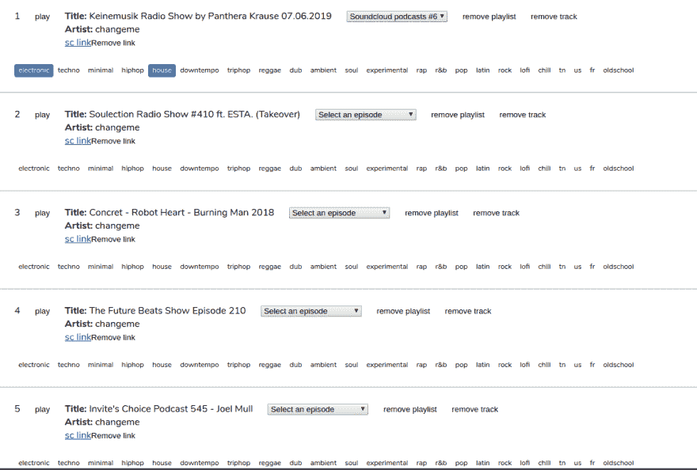

# Soundcloud 播客

> 原文：<https://dev.to/imtoofar/soundcloud-podcasts-4a07>

如果你碰巧在 Soundcloud 上有你喜欢的订阅列表，你可能会喜欢这个故事，永远不要错过精彩的音乐。当我想在博客上管理音乐播放列表，但不知何故又想让事情自动化一点时，就有了这个想法。我在 Soundcloud 上注册了一个应用程序，用他们的 API 来获取最新的音乐。最终结果是这样一个播放列表:

[](https://res.cloudinary.com/practicaldev/image/fetch/s--XlOHBkI8--/c_limit%2Cf_auto%2Cfl_progressive%2Cq_auto%2Cw_880/https://thepracticaldev.s3.amazonaws.com/i/gim265a9j03kdi5ewkyz.png)

让我们看看你如何用你的偏好做同样的事情。

* * *

## 获取订阅

首先，您需要调用 SC API 来获取以下数据。您可以通过点击/me/followers 处的 url 来完成此操作。

```
async function getFollowings() {
  let followings = []
  async function build (href) {
    const options = href || {
      url: `/me/followings`,
      baseURL: SC_BASE_URL,
      method: 'GET',
      params: {
        oauth_token: TOKEN,
        limit: 200,
        linked_partitioning: 1
      }
    }

    const response = await axios(options)

    followings = followings.concat(...response.data.collection)

    process.stdout.write('.')

    if (response.data.next_href) {
      await build(response.data.next_href)
    }

    return null
  }

  await build()

  return followings
} 
```

## 获取行迹

然后，循环遍历先前获取的 follow 并相应地获取它们的轨迹。您将获得从特定日期开始的曲目列表。

```
async function getTracks (id) {
  const fromDate = new Date()
  fromDate.setDate(fromDate.getDate() - 7)

  const response = await axios({
    url: `/users/${id}/tracks`,
    baseURL: SC_BASE_URL,
    method: 'GET',
    params: {
      'oauth_token': SC_API_TOKEN,
      'created_at[from]': fromDate,
    }
  })

  process.stdout.write('.')

  return response.data
} 
```

## 把它们堵在一起

您可以再次过滤轨道，只保留具有特定时间长度的轨道(在这种情况下，是长音乐播客或专题节目)。

```
getFollowings()
  .then((users) => users.map(u => u.id))
  .then((ids) => {
    console.log('Followings count', ids.length)
    return Promise.all(ids.map((id) => {
      return getTracks(id)
    }))
  }).then((tracks) => {
    const merged = [].concat(...tracks)
    return _.uniqBy(merged, 'id')
      .filter(t => t.duration > 40 * 60 * 1000 
        && t.playback_count > 1000
        && t.comment_count > 10
      )
      .filter(t => helpers.filterVideosByTitle(t.title))
  }) 
```

仅此而已。如果你有兴趣了解更多，请访问我在 https://stolenbeats.com 的博客，不要犹豫。