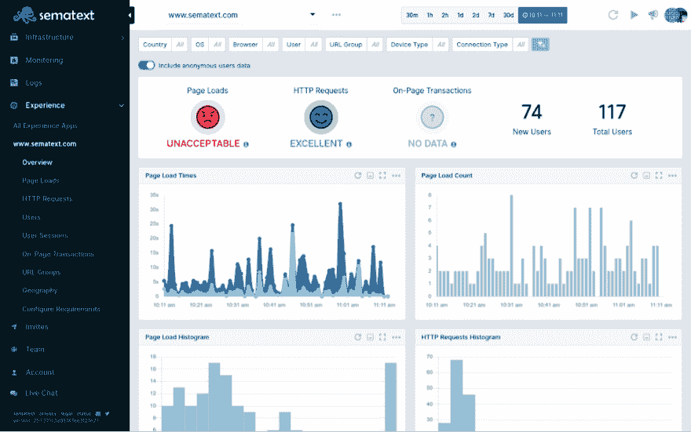
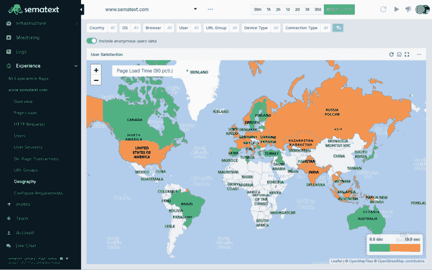

# SPA 跟踪和监控:如何通过 RUM(真实用户监控)构建更好的单页面应用程序

> 原文：<https://dev.to/sematext/spa-tracking-monitoring-how-to-build-better-single-page-applications-through-rum-real-user-monitoring-na0>

你知道吗，如果你的网站加载时间超过 3 秒，大约有一半的用户会离开。优化您的网站或 webapp 以获得卓越性能始终是任何基于软件的企业的重要目标。

但是，近年来生态系统发生了变化。智能手机正在接管。开发人员需要建立网站，并针对这些较小的设备进行性能优化。

不过，这不仅仅是性能的问题。

用户体验，简称 UX，似乎是很少有人获得的黄金图腾。它有许多面，从你将首次与你的登录页面互动的用户转变为付费客户的方式，到你的 web 应用程序为付费客户提供的易用性，或者界面看起来如何合乎逻辑。

在本教程中，我将解释真实用户监控(也称为最终用户监控)的原则如何帮助构建和优化您的单页面应用程序，以及您如何轻松配置[免费监控单页面应用程序](https://sematext.com/experience)。我们走吧！

## 有什么好的单页应用程序的例子？

一个好的单页面应用程序必须在所有设备上运行良好，速度极快。它需要通过预渲染动态路线有很大的搜索引擎优化。在为全球客户提供快速页面加载服务时，它应该具有响应性和可靠性。

但是，你怎么知道你的客户是否满意，你怎么知道用户在试用你的产品之前是否会反弹？

您可以通过跟踪交互和交易，同时使用[真实用户监控](https://en.wikipedia.org/wiki/Real_user_monitoring)解决方案来监控性能和用户行为。查看[流行工具和解决方案](https://sematext.com/blog/real-user-monitoring-tools/)的列表。

让我们深入了解什么是真正的用户监控和单页面应用程序监控，以及如何使用它来改进单页面应用程序。

## 什么是真实用户监控？

随着越来越多的客户端逻辑，网站和网络应用变得越来越复杂。这极大地提高了 UX，但是增加了代码的复杂性和重量。我们已经到了只监控后端是不够的地步。为了确保最佳的用户体验，您还需要监控整个客户端。

真实用户监控的目标是在最终用户体验受到网站/webapp 性能和意外崩溃影响时，实时检测异常情况。当你的顾客面对贫穷的 UX 时，你需要得到通知！查看[这份真实用户监控指南](https://sematext.com/guides/what-is-real-user-monitoring/)获得更详细的演练。

在与你的网站互动的同时，洞察你的客户有多开心，可以让你在减少客户流失和高跳出率方面处于领先地位。

凭借检查单个会话和深入页面级统计数据的能力，您可以鸟瞰客户在与您的网站或 webapp 交互时所面临的情况。跟踪页面负载、HTTP 请求、页面资源、UI 交互和页面上的事务对于了解客户的满意和失望都是至关重要的。

有大量的真实用户监控解决方案可供选择，在下一节中，我将带您体验 Sematext 的使用。要了解关于该工具的更多信息，请查看此。如果你正在开始一个副业项目，它有一个不错的[免费等级](https://sematext.com/pricing/#experience)，如果你已经有一个业务，它还有一个 **30 天的专业等级免费试用**。

## 如何监控单页应用

真实用户监控的唯一目的是确保最终用户获得更好的体验。它不仅限于提高 web 应用程序的性能，还能帮助您提高用户的整体满意度。

单页应用程序监控对于您监控浏览器中执行的几乎任何东西都是至关重要的。您可以洞察性能、页面加载时间、HTTP 响应时间等等。这让你可以通过*他们的眼睛*实时看到你的用户所看到的。

### 为什么要监控单页应用？

页面加载、资源加载和 HTTP 请求的延迟都可能导致您的用户变得沮丧，并最终流失，导致您失去业务。这就是为什么通过不同的会话来跟踪每个用户的体验非常重要，这些会话提供了关于访问了哪些页面、页面是硬加载还是软加载、触发了哪些 HTTP 请求、使用了哪种设备以及最终加载时间如何受所有这些因素影响的宝贵见解。

这里列出了单页应用的重要因素和挑战，最终用户监控可以在这些方面提供帮助:

#### 1。搜索引擎优化

单页应用在 SEO 方面天生就很糟糕，因为它们使用 JavaScript 来加载数据和内容。这意味着抓取你的网站并为搜索引擎索引数据的机器人没有任何 HTML 可以索引，因为它是在用户在浏览器中加载 SPA 后生成的。要解决这个问题，您可以使用服务器端呈现或预呈现动态 SPA 路由，并生成静态 HTML。

#### 2。表演

众所周知，单页面应用程序是快速响应的网站，因为它们动态加载内容，而无需重新加载 HTML 页面。但是，您永远不知道您的用户在浏览 SPA 时会有什么样的体验。如果初始的*硬*负载太长，或者如果一些路由存在耗时 HTTP 请求的瓶颈。

#### 3。使局部化

真实用户监控为您提供了用户地理位置的完整概览。您知道关于页面负载和全世界用户满意度的每个细节。根据这一分析，将您的水疗中心本地化为使用您拥有最多客户的语言是一个惊人的优势。

#### 4。安全性

通过在与您的 SPA 交互时跟踪用户及其会话，您可以识别真实和虚假用户，从而潜在地隔离恶意意图。

#### 5。错误和崩溃报告

错误时有发生，你的单页应用程序可能会崩溃，这都是生活的一部分。但是，**你**需要知道这个！不要依赖你的用户告诉你。他们宁愿停止使用你的产品也不会告诉你。当 JavaScript 让你失望时，真正的用户监控会在你背后看着你。

### 单页面应用监控与静态网站监控有何不同？

监控单页 app 和静态网站原则上是完全一样的，除了一个重要的区别。单页面应用可以有**硬页面和软页面负载**。路由与单页面应用程序一起工作的原理是通过使用 JavaScript 动态地改变页面，而不需要重新加载根 HTML 页面。这是一个软重载，需要一个额外的配置监视器来监听 routeChange 事件。硬重装很简单。当用户第一次登陆你的 webapp 时，当初始 HTML 页面被加载时，就会发生这种情况。

Sematext Experience 涵盖了所有的基础，包括跟踪单页应用程序的路径变化，以便您准确地知道哪些页面是硬加载或软加载的，以及页面呈现的行为。它支持每一个主要的单页面应用框架或库，如 Angular，Vue.js，Ember.js 和 React，但也是任何使用 **HTML5 pushState** 或 **Hashchange** 的框架的默认配置设置。

[](https://res.cloudinary.com/practicaldev/image/fetch/s--vmG41DC8--/c_limit%2Cf_auto%2Cfl_progressive%2Cq_auto%2Cw_880/https://sematext.com/wp-content/uploads/2019/09/RUM-supported-libraries.png)

将真实用户监控添加到 webapp 的方式非常简单。

### 为单页应用程序添加真实用户监控

以下是将真实用户监控添加到单页应用程序的步骤列表:

**1。**首先， **[在 Sematext](https://sematext.com/docs/experience/getting-started/)** 中创建体验 App **。不要忘记启用*网站使用单页面架构*切换。**

[](https://res.cloudinary.com/practicaldev/image/fetch/s--O1tuLJXb--/c_limit%2Cf_auto%2Cfl_progressive%2Cq_auto%2Cw_880/https://sematext.com/wp-content/uploads/2019/09/create-RUM-app.png)

**2。**然后，**将体验脚本添加到你的根 HTML 文件的`<head>`**

```
<script type="text/javascript">
  (function(e,t,r,n,a){var c=[];e[a]=function(){c.push(arguments)};
  e[a].queue=c;var s=t.createElement(r);s.async=1;s.src=n;
  var u=t.getElementsByTagName(r)[0];u.parentNode.insertBefore(s,u)})
  (window,document,"script","//cdn.sematext.com/rum.js","strum");
</script> <script type="text/javascript">
  strum('config', {
    token: 'YOUR_TOKEN',
    receiverUrl: 'https://rum-receiver.sematext.com'
  });
</script> 
```

Enter fullscreen mode Exit fullscreen mode

**3。**最后，**将`routeChange`事件监听器添加到您的单页面应用程序的配置**中。根据您使用的单页应用程序框架或库，有具体的说明。选择适合你的。

### 做出反应

```
import React from 'react';
import { createBrowserHistory as createHistory } from 'history';
const history = createHistory();
history.listen((location, action) => {
  if (action !== 'REPLACE') {
    strum('routeChange', window.location.href);
  }
})
export default function App() {
  return (
    <Router history={history}>
      ...
    </Router>
  );
} 
```

Enter fullscreen mode Exit fullscreen mode

### 有角 2+

```
import { Component, OnInit } from '@angular/core';
import { Router, NavigationStart } from '@angular/router';

@Component({ selector: 'app', templateUrl: 'app.component.html' })
export class AppComponent implements OnInit {
  constructor(private router: Router) {}
  ngOnInit() {
    this.router.events.subscribe(event => {
      if (event instanceof NavigationStart) {
        strum('routeChange', event.url);
      }
    });
  }
} 
```

Enter fullscreen mode Exit fullscreen mode

### Angular.js

```
$scope.$on('$routeChangeStart', function () {
  strum('routeChange', window.location.href);
}); 
```

Enter fullscreen mode Exit fullscreen mode

### vista . js

```
<template>
  <div id="app">
    <router-view/>
  </div>
</template>

<script>
  export default {
    name: 'app',
    watch: {
      $route() {
        strum('routeChange', document.location.href);
      }
    }
  }
</script> 
```

Enter fullscreen mode Exit fullscreen mode

### Ember.js

```
import EmberRouter from '@ember/routing/router';
import { on } from '@ember/object/evented';​

EmberRouter.reopen({
  doInformAboutRouteChange: on('didTransition', function() {
    strum('routeChange', window.location.href);
  }),
});
export default Router; 
```

Enter fullscreen mode Exit fullscreen mode

### 使用页面上的事务来跟踪用户体验

有了上面的配置，除了定制的[页面上的事务](https://sematext.com/docs/experience/on-page-transaction/)之外，一切都准备好了。如果你想衡量对你理解你的客户行为很重要的定制事件，这些是很棒的。也许你想在你的用户通过注册流程时跟踪交易，或者他们的进展如何。您可以对页面上的事务做任何您想做的事情。尽情发挥你的想象力吧！

### 可视化用户体验

完成配置并有数据流入后，您可以可视化指标并开始制定业务决策，以改善用户体验，从而提高客户的满意度。

[](https://res.cloudinary.com/practicaldev/image/fetch/s--huGQefae--/c_limit%2Cf_auto%2Cfl_progressive%2Cq_auto%2Cw_880/https://sematext.com/wp-content/uploads/2019/09/RUM-dashboard.png)

除了显而易见的，你还可以根据用户生活在世界的哪个部分来可视化用户满意度。地理数据对于了解和优化您希望进入的市场至关重要。

[](https://res.cloudinary.com/practicaldev/image/fetch/s--kKD01lM0--/c_limit%2Cf_auto%2Cfl_progressive%2Cq_auto%2Cw_880/https://sematext.com/wp-content/uploads/2019/09/RUM-geographic-dashboard.png)

## 包装监控单页应用

给你的客户他们应得的体验。不要让性能问题引起混乱。不要再依赖你的顾客告诉你哪里出了问题！当问题发生时，立即进行诊断。转化更多的销售并提高您的单页应用程序的性能。

使用 Sematext Experience 这样的真实用户监控工具，可以让你清楚地了解谁在使用你的 web 应用程序，数据来自真实用户以及他们与你的产品交互时的会话。利用这一点，找到他们遇到的隐藏问题，以保持高用户满意度。

今天的互联网状况要求闪电般的网络应用程序，在移动设备上的加载速度和在桌面上一样快。留住那些在手机上随意浏览网页时偶然发现你的产品的顾客。让他们想回来报名。

回到本文开头的问题，**你知道吗，如果加载时间超过 3 秒，访问你网站的一半用户就会离开。**好了，现在你知道了。不要让自己成为那些甚至在客户登陆你的网站之前就失去客户的人之一！

您知道您的网站或 webapp 在不同浏览器和地区、不同设备上的加载速度吗？有了真正的用户监控解决方案，你就知道了。

你可以在这里查看 sema text，或者如果你想聊天，就在 [Twitter](https://twitter.com/adnanrahic) 上给我发消息。

希望你们喜欢读这篇文章，就像我喜欢写这篇文章一样。如果你喜欢它，请随意分享，让更多的人看到这个教程。下次见，保持好奇，玩得开心。