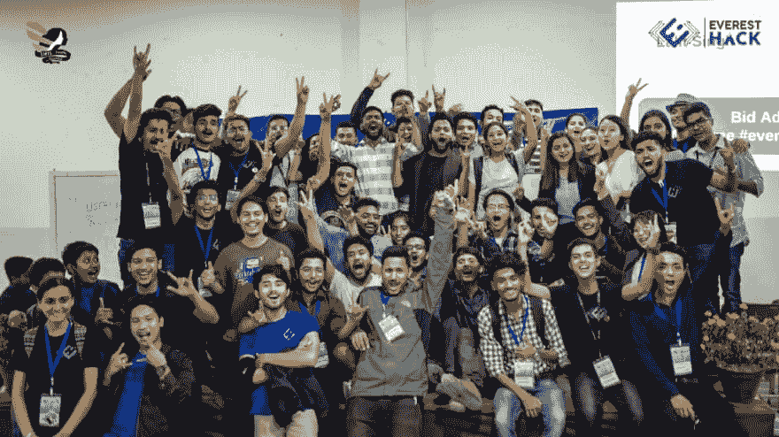
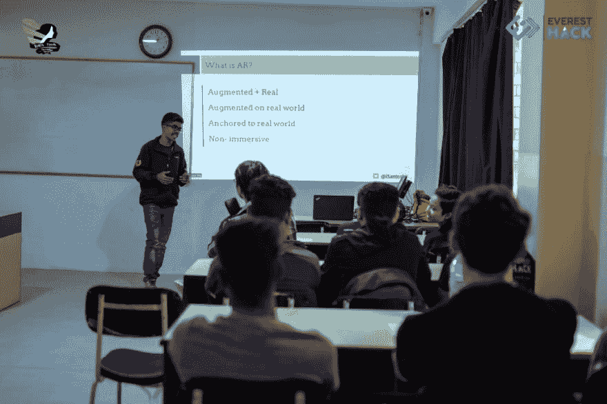
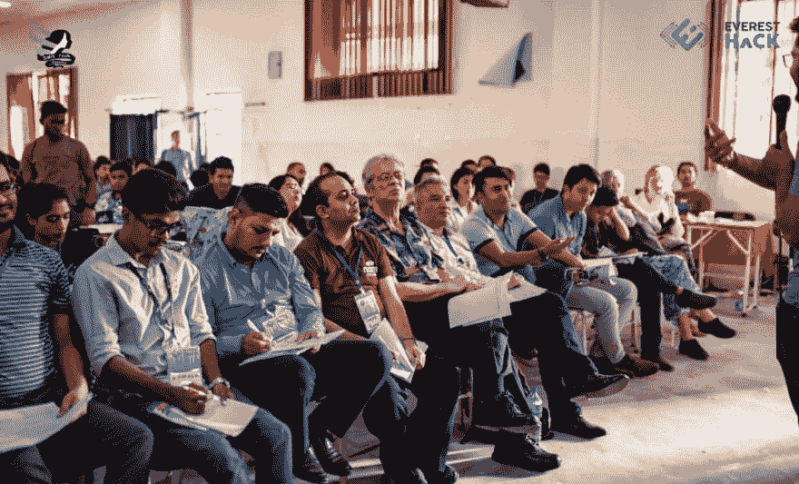
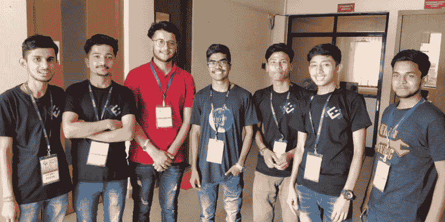

# 在加德满都珠穆朗玛峰演讲

> 原文：<https://dev.to/devcer/speaking-at-everest-hack-kathmandu-155l>

<figure> 

<figcaption>与珠峰黑客团队</figcaption>

</figure>

几周前，我刚从一个精彩的黑客马拉松回来，终于有时间和大家分享我的经历。

两周前，我受邀在尼泊尔加德满都举行的 2019 年珠穆朗玛峰黑客大会上发表演讲。我对这个黑客马拉松感兴趣有两个原因，黑客马拉松一直是我的事情，指导和看到开发人员将他们的想法变成 MVP 是令人兴奋的。其次，这个城市离家不远，这将是我第一个要演讲的邻国。

我在网上讲过 [WebXR: VR/AR。](https://docs.google.com/presentation/d/1C_ZZPFDEMGS_yYQBa6FzNHha1u1xVZePFAq41YaPTyU/edit?usp=sharing)尽管我说了多少次网络虚拟现实，人们还是想再次听到同样令人兴奋的事情。这次的谈话有所不同，我在会议中加入了更多的演示和现场编码，试图用代码澄清他们的问题，向他们展示我制作的每个演示的代码。由于这是一次黑客马拉松，我想人们会更喜欢看它的实际操作，而不是我讲故事。这一切应该在 30 分钟内发生。

<figure> 

<figcaption>谈 WebXR:Web 上的 VR/AR/MR</figcaption>

</figure>

但是，在这次会议结束时，我学到了一些新的东西。我的演讲进行到一半时，更多的是一个故事，我问参与者是想看一些代码还是想让我继续这个故事，但令我惊讶的是，大约 80%的参与者选择了故事，其余的选择了故事+代码。我总是错误地认为与会者希望看到更多的代码、更多的演示、更多的动作而不是故事，但也许我一直都是错的。这也可能取决于观众，但我从未想过这是一个选项。后来我也被邀请担任黑客马拉松的评委。

<figure> 

<figcaption>最后一轮裁判</figcaption>

</figure>

大多数参与者都是学生，每个人都对进入开源领域并为现实世界做出贡献感到好奇。我和他们中的许多人进行了许多有趣的谈话。一路上我交了很多朋友，在黑客马拉松期间和之后我都玩得很开心。作为一个内向的人，我很难在第一天进入对话，但像往常一样，我能够应付第二天。

<figure> 

<figcaption>带着一群志愿者</figcaption>

</figure>

尼泊尔是一个美丽的国家，有许多寺庙、佛塔和美丽的风景。如果你来自一个繁忙/拥挤的城市，比如海得拉巴，你会在山谷中感受到精神上的共鸣。它也比我的祖国便宜。大多数餐馆/小贩都接受印度货币，所以对我来说管理货币相当容易。
**事实:**尼泊尔使用不同的历法，比我们的印度历法早 56 年零 8 个月。我一片空白，不知道第一次收到出租车服务账单的日期。

总的来说，这是一次令人惊讶的黑客马拉松，尽管是第一次，但这些人做得非常好。

希望下次能再回来。结束。