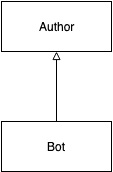
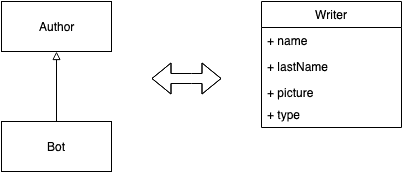

# 特例模式

> 原文：<https://dev.to/apium_hub/special-case-pattern-3dcp>

## 不要让你的特例增加你的代码复杂性:特例模式

在我们的日常生活中，我们的应用程序正在运行，突然需要一个新的需求。所以我们开始输入更多的代码来适应新的请求。如果我们没有足够的注意力就开始打字，我们可能会增加更多的复杂性。在此之前，有时重新审视**设计模式**可能会帮助你找到一个更好的解决方案，完全符合你的需求，并[避免一些可能的 bug](https://dev.to/apium_hub/cypress-framework-the-swiss-army-knife-for-your-tests-1kgf-temp-slug-7176475)或与新代码相关的问题。

**一个例子:博客应用**

让我们从一个运行中的博客开始，它有两个用例(我们不关心其他的):

*   BlogPostApplicationService
    *   创建博客文章(标题、文本、作者 Id、日期)
    *   按日期列出所有帖子
*   AuthorApplicationService
    *   列出所有作者(名字、姓氏、图片)

我们的 PO 要求一项新功能:一些文章将由抓取机器人自动创建。

*   这个机器人将创建新的文章
*   这些文章将在列出所有文章时出现
*   机器人不会有个人资料页面

有什么问题？每篇文章都需要一个 authorId，bot 不是作者。

解决方案:我们的第一个方法可能是将 authorId 设置为可选的。这样，当 bot 创建一篇新文章时，它不需要设置任何 authorId。

这个解决方案不太合适。为了适应特定的问题(我们没有 authorId 的情况)，我们修改了我们领域的一个重要规则(每篇文章都应该有一个作者)。此外，由于 authorId 是可选的，我们必须检查它在几个地方是否为空(我们一遍又一遍地重复相同的代码–>因此我们正在生成一个重复的日志)。

此外，当编写查询来获取所有带有作者信息的帖子时，必须使用左连接(不是内连接)，因为 bot 条目不会返回任何作者数据。

[](https://gsas.io)

我们可以想出的另一个解决方案是:在我们的代码中用一个常量定义机器人(例如 0。这样做我们可以避免 authorId 为 all(现在所有条目都有一个作者)，但是这个常量 id 在我们的域中没有任何意义。不管怎样，我们最终会用充满`if ($authorId === BOT_ID)`的代码来适应特定的情况(再次到处都是湿的)。这也不是最佳解决方案。

通过这些简单的解决方案，我们增加了代码的复杂性，以适应特定的情况。我们在代码中添加了几个空值检查，我们已经知道空值会发生什么(参见著名的十亿美元错误)。此外，当我们在这里和那里做同样的检查时，我们应该注意到一种难闻的气味。是时候看看是否有一种模式可以帮助我们解决这个问题了。

### 特例模式

为特殊情况提供特殊行为的子类。作者马丁·福勒([https://martinfowler.com/eaaCatalog/specialCase.html](https://martinfowler.com/eaaCatalog/specialCase.html))

[](https://res.cloudinary.com/practicaldev/image/fetch/s--3cgff4Sd--/c_limit%2Cf_auto%2Cfl_progressive%2Cq_auto%2Cw_880/https://apiumhub.com/wp-content/uploads/2019/08/image1.png)

这种模式非常符合我们的问题。想法是创建一个名为 bot 的 Author 子类来处理我们的特殊情况:我们的 Bot 应该能够作为作者写一篇文章，但有自己的规范，例如我们不会显示它的个人资料页面。这是一个很好的解决方案，因为我们的代码不需要修改(Bot 已经是作者了)

一旦我们发现了一个合适的模式，我们如何在我们的项目中实现它呢？

### 单表继承

将类的继承层次表示为单个表，该表包含各种类的所有字段的列。作者马丁·福勒([)https://Martin Fowler . com/eaaCatalog/singletableinheritage . html](https://martinfowler.com/eaaCatalog/singleTableInheritance.html))

[](https://res.cloudinary.com/practicaldev/image/fetch/s--LM0ml3Wr--/c_limit%2Cf_auto%2Cfl_progressive%2Cq_auto%2Cw_880/https://apiumhub.com/wp-content/uploads/2019/08/image2.png)

我们如何在数据库中实现这种继承？关系数据库不支持继承，但是我们可以通过实现继承的 ORMs 来使用它(例如在[教义](https://www.doctrine-project.org/projects/doctrine-orm/en/2.6/reference/inheritance-mapping.html#single-table-inheritance)中)。

使用**单表继承**，不同的类(在我们的例子中是 Author 和 Bot)被映射到一个单表，该表有一个列(图中的“type”)，它定义了每个条目的类的类型。当我们检索该条目时， **ORM** 会将该条目映射到它自己的实体，对我们隐藏最终的实现。

**让我们一起实现它**

使用原则，我们创建了一个写表器，用于存储机器人和作者。

```
/**
 * @ORM\Table(name="writer")
 * @ORM\Entity()
 * @InheritanceType("SINGLE_TABLE")
 * @DiscriminatorColumn(name="type", type="string")
 */

class Author
{
    protected $id;
    protected $name;
    protected $lastName;
    protected $picture;
}

/**
 * @ORM\Entity()
 */

class Bot extends Author
{
} 
```

我们可以添加一个数据库迁移，在我们的系统中创建一个具有预定义 id 的 bot 用户:

```
$bot = new Bot("BOT_ID", "Bot", "", ""); 
```

从现在开始，bot 将使用这个常量 ID(“BOT _ ID”)，我们前面详述的问题已经解决:

*   在我们的代码中不再有“如果作者为空”的检查
*   当查询数据库时，所有条目都有一些有效的作者数据。

为了告诉客户作者之间的区别，在将实体映射到 dto 时，我们可以很容易地添加一个标志:

```
class AuthorDto
{
    public $id;
    public $firstName;
    public $lastName;
    public $picture;
    public $system = false;
}

class BotUserDto extends AuthorDto
{
    public $system = true;
} 
```

如果系统是真的，前端可以避免添加一个链接到我们的要求不需要的机器人配置文件。

**结论**

我们已经避免了我们的应用程序的一个真正的特例增加了我们的代码复杂性(伴随着它带来的错误和风险),并且通过使用一些模式，我们的代码看起来更干净。最后但同样重要的是，我们还避免了与可空性相关的问题(至少在这种情况下)。

帖子[特例图案](https://apiumhub.com/tech-blog-barcelona/special-case-pattern/)最早出现在 [Apiumhub](https://apiumhub.com) 上。