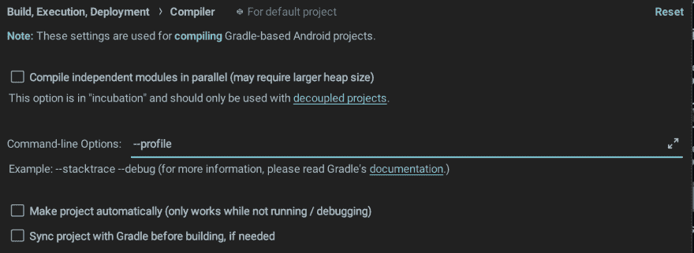
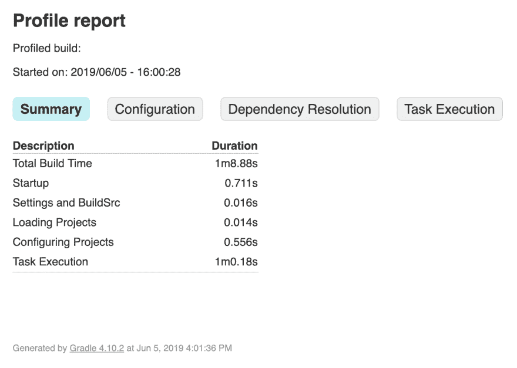
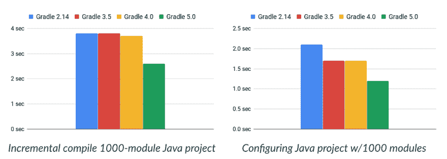
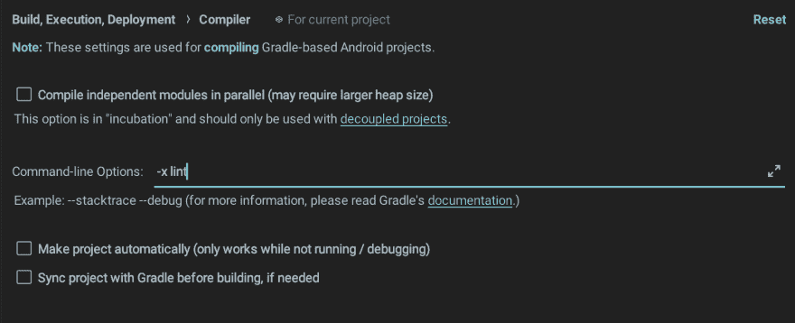
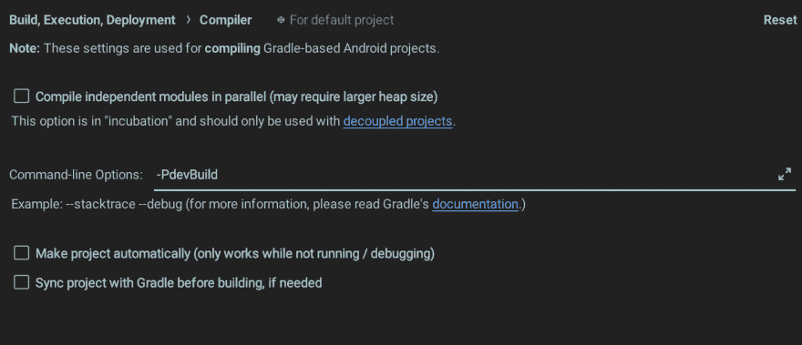
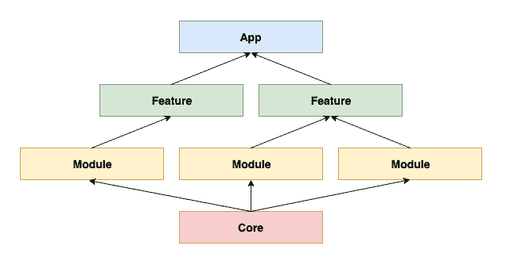
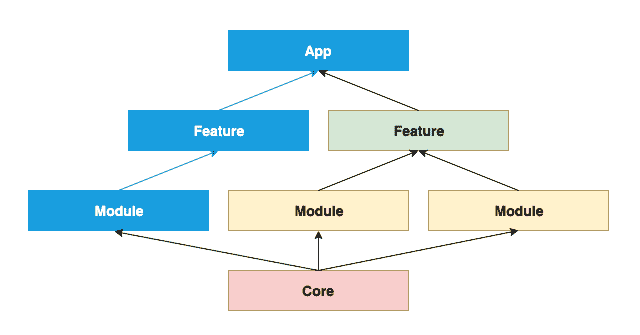
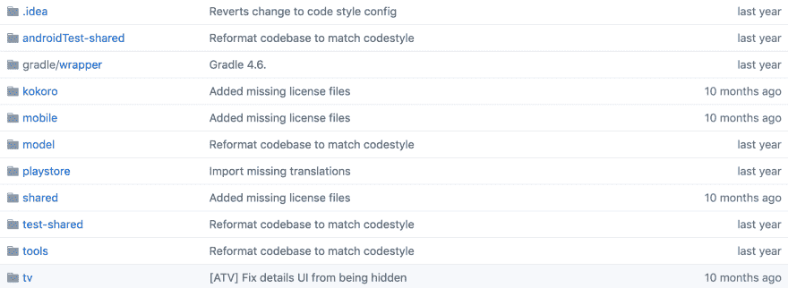

# 加快您的 Android 项目的梯度建设！

> 原文：<https://dev.to/joshuamdeguzman/speed-up-your-android-project-s-gradle-builds-1366>

## 简介

较慢的项目构建时间可能会导致较低的生产率。较低的生产率是企业的损失。在本文中，我提供了一个配置列表，以及加速 Android 项目 Gradle 构建的技巧。

> 免责声明:一些提示将包括估计，这些估计可能不完全符合您的项目的构建时间改进。有几个因素会影响评估——包括但不限于，您的项目的架构、编写的测试数量、lint 检查、当前的 gradle 配置、您的计算机的硬件规格，等等。

也就是说，我希望这个列表能提高你的整个团队在构建优秀应用时的生产力！

## 改善您的项目构建时间

### 1。侧写侧写侧写！

描述你的身材，数字不会说谎。由于我们可能有不同的项目架构、测试和编写代码的方式，所以最好你总是**对你自己的构建**进行概要分析——最好是对你所做的每个优化配置变更进行概要分析。当调用 Gradle task 时，您可以在命令行上直接传递`--profile`。

比如`./gradlew assembleDebug --profile`。

或者，当在 Android Studio 上运行项目时，您可以将它添加到 Preferences 下的命令行选项中。

[](https://res.cloudinary.com/practicaldev/image/fetch/s--XGNxsZOQ--/c_limit%2Cf_auto%2Cfl_progressive%2Cq_auto%2Cw_880/https://user-images.githubusercontent.com/20706361/59161162-90b50c80-8b11-11e9-8eea-1c341ce19403.png)

这是使用`--profile`运行任务后的示例报告。

[](https://res.cloudinary.com/practicaldev/image/fetch/s--v_ZH6ot5--/c_limit%2Cf_auto%2Cfl_progressive%2Cq_auto%2Cw_880/https://user-images.githubusercontent.com/20706361/59161163-90b50c80-8b11-11e9-8b31-4a34374b55ae.png)

### 2。始终使用最新的安卓 Gradle 插件

Gradle 团队发布了更新版本的 Gradle，编译和构建速度更快。在撰写本文时，目前可用的最新版本是 Gradle 5.4.1。

注意，较新的版本变化可能会引入**不必要的编译错误**或**兼容性问题**，请确保在升级您的 Gradle 时查看并遵循[迁移指南](https://docs.gradle.org/5.0/userguide/upgrading_version_4.html)。

[](https://res.cloudinary.com/practicaldev/image/fetch/s--v06FNi3b--/c_limit%2Cf_auto%2Cfl_progressive%2Cq_auto%2Cw_880/https://blog.joshuadeguzman.me/asseimg/improve-gradle-build/step_1_gradle_5.png) 
<small>图片来自[https://gradle.org/whats-new/gradle-5/](https://gradle.org/whats-new/gradle-5/)</small>

估计这将减少 20-25%的构建时间。

更多关于 [Gradle 5](https://gradle.org/whats-new/gradle-5/) 的变化在这里。

### 3。避免传统的多指数

#### multi dex 简介

Android 构建架构有一个限制 **65，536 个方法引用**，又名 **64K 限制**，一旦单个 [Dalvik](https://source.android.com/devices/tech/dalvik/) 可执行文件或 DEX 文件达到限制，就会遇到构建错误。引入 Multidex 是为了帮助你避开 64K 的限制。

要支持 multidex，只需添加并设置`multiDexEnabled`到`true`即可。

```
android {
    defaultConfig {
        ...
        minSdkVersion 21
        targetSdkVersion 28
        multiDexEnabled true
    }
} 
```

Enter fullscreen mode Exit fullscreen mode

如果您的`minSdkVersion`设置为 20 或更低，那么您必须添加支持库。

```
android {
    defaultConfig {
        ...
        minSdkVersion 15
        targetSdkVersion 28
        multiDexEnabled true
    }

    dependencies {
        implementation 'com.android.support:multidex:1.0.3'
    }
} 
```

Enter fullscreen mode Exit fullscreen mode

然而，这个项目设置将使您的构建与**遗留的多索引**一起运行。

#### 遗留多分支

当您在启用 multidex 的情况下构建项目，并且`minSdkVersion`设定为 20 或更低时，会出现传统 multidex。在这方面，干净的和增量的构建要慢得多。

解决这个问题的最简单的方法是为开发创建一个构建变体。这样，您现在可以在您的测试设备上运行一个隔离的构建变体，而不用担心遗留的 multidex。

```
android {
    defaultConfig {...}
    buildTypes {...}
    sourceSets {...}
    productFlavors {
        // Create a separate build variant for development which has a minSdkVersion of 21
        dev {
            ...
            minSdkVersion 21
        }

        prod {...}
    }
} 
```

Enter fullscreen mode Exit fullscreen mode

估计这将减少 5-10%的构建时间。

更多关于 [multidex](https://developer.android.com/studio/build/multidex) 的信息。

### 4。开发时禁用 lint 检查

> 注意:依我看，我只建议那些拥有较低规格计算机，并且在开发过程中对 lint 检查没有严格要求的团队采取这一步骤。

如果 lint 检查，特别是如果你的项目很大，每次构建、**再想想**至少要占用你 30%的时间**。您可能只想在创建 diff 时运行 lint 检查，例如运行一个脚本，将 lint 检查指定为创建 diff 之前要执行的任务之一。**

备选方案 1。禁用`gradle.properties`上的皮棉检查。**不推荐**当您在 **CI** 中运行构建时，您可能想要**为您的**发布构建**启用** lint 检查。

```
gradle=build -x lint 
```

Enter fullscreen mode Exit fullscreen mode

选项 2。当使用 Android Studio 运行您的项目时，在 Preferences 下的命令行选项中传递`-x lint`。

[](https://res.cloudinary.com/practicaldev/image/fetch/s--sxPtgP8I--/c_limit%2Cf_auto%2Cfl_progressive%2Cq_auto%2Cw_880/https://user-images.githubusercontent.com/20706361/59161158-901c7600-8b11-11e9-8f22-1e53a7fb21f3.png)

选项 3。执行 Gradle 任务时，通过命令行传递`-x lint`。

比如`./gradlew assembleDebug -x lint`。

### 5。禁用多 APK 生成

谷歌 Play 商店允许我们为特定的设备配置发布多个 apk。`splits` block 允许我们配置多个 APK 支持。

这是多 APK 支持的示例配置。

```
android {
    splits {
        density {
            enable true
            exclude 'ldpi', 'xxxhdpi'
            compatibleScreens 'small', 'xlarge'
        }
    }
} 
```

Enter fullscreen mode Exit fullscreen mode

但是，我们不需要在开发过程中生成多个 apk。

```
if (project.hasProperty('devBuild')) {
    // Prevent multi apk generation on development
    splits.abi.enable = false
    splits.density.enable = false
} 
```

Enter fullscreen mode Exit fullscreen mode

> Gradle 针对`Project`实例执行项目的构建文件来配置项目。

注意，您必须将`-PdevBuild`添加到您的命令中，以触发带有项目实例属性检查的块。

比如`./gradlew assembleDebug -PdevBuild`。

或者，当您使用 Android Studio 运行您的项目时，在 Preferences 下的命令行选项中传递它。

[](https://res.cloudinary.com/practicaldev/image/fetch/s--tyNpq-43--/c_limit%2Cf_auto%2Cfl_progressive%2Cq_auto%2Cw_880/https://user-images.githubusercontent.com/20706361/59161157-8f83df80-8b11-11e9-9a0c-c338f2eca278.png)

估计这将减少 5-10%的构建时间。

更多关于[多个 apk](https://developer.android.com/google/play/publishing/multiple-apks)的信息。

### 6。包括最少的资源

避免编译没有测试的不必要的资源。包括但不限于附加的语言本地化和屏幕密度资源。

对于开发，您可以通过指定一种语言资源或屏幕密度来优化项目构建时间。

```
android {
    productFlavors {
        dev {
            ...
            resConfigs ("en", "xxhdpi")
        }
    }
} 
```

Enter fullscreen mode Exit fullscreen mode

### 7。禁用 PNG 处理

Android 会在每次你构建应用时执行**自动图像压缩，不管它是发布还是调试构建类型。通过优化发布版本的映像，它有助于减少应用的大小，但是当你在开发时，它会**减慢项目构建时间**。**

*更新:自 Android Studio 3.0 Canary 5 发布后即可使用。*

默认情况下，PNG 处理对于发布版本是启用的，对于调试版本类型是禁用的。

```
android {
    buildTypes {
        release {
            // Disables PNG crunching on RELEASE build type
            crunchPngs false // Enabled by default for RELEASE build type
        }
    }
} 
```

Enter fullscreen mode Exit fullscreen mode

对于旧版本的插件

```
android {
    aaptOptions {
        cruncherEnabled false
    }
} 
```

Enter fullscreen mode Exit fullscreen mode

更多关于 [crunchPngs](https://google.github.io/android-gradle-dsl/current/com.android.build.gradle.internal.dsl.BuildType.html) 的内容。

### 8。明智地配置 DexOptions

Gradle 为您提供了一个用于配置 dex 选项的 DSL 对象。可以配置的选项之一是`preDexLibraries`。您可以选择是否希望项目对库进行预索引。注意这可以**提高增量构建**，但是**会减慢你的干净构建**。

如果您希望启用它，您可以这样做。

```
android {
    dexOptions {
        preDexLibraries true
    }
} 
```

Enter fullscreen mode Exit fullscreen mode

根据您的开发工作流程偏好进行明智的配置。对 CI 构建进行清理构建时，应禁用。

### 9。仅在需要时使用 Crashlytics

每次构建，Crashlytics **总是生成唯一的构建 ID** 。您可以通过禁用 Crashlytics 插件来加速您的调试构建。

```
android {
    buildTypes {
        debug {
            ext.enableCrashlytics = false
        }
    }
} 
```

Enter fullscreen mode Exit fullscreen mode

接下来，在初始化调试构建时，在运行时禁用该工具包。

```
val crashlytics = Crashlytics.Builder()
                .core(CrashlyticsCore.Builder().disabled(BuildConfig.DEBUG).build())
                .build()
Fabric.with(this, crashlytics) 
```

Enter fullscreen mode Exit fullscreen mode

但是，如果您需要在调试构建中使用 Crashlytics，您仍然可以通过防止它在每次构建时使用自己唯一的构建 ID 更新应用程序资源来改进您的增量构建。

```
android {
    buildTypes {
        debug {
            ext.alwaysUpdateBuildId = false
        }
    }
} 
```

Enter fullscreen mode Exit fullscreen mode

更多关于 [Crashlytics 构建工具](https://docs.fabric.io/android/crashlytics/build-tools.html)的信息。

### 10。使用静态依赖版本

您必须在`build.gradle`中为您的依赖项声明静态或硬编码的版本号。**你应该避免**动态依赖，用加号(+)表示，否则你可能会遇到意想不到的版本更新。动态依赖声明也**减缓了你的构建**，因为它继续在线检查更新。

```
android {
    dependencies {
        // What you should not do
        // implementation "androidx.paging:paging-runtime:2.+"

        // What you should do
        implementation "androidx.paging:paging-runtime:2.1.0"
    }
} 
```

Enter fullscreen mode Exit fullscreen mode

### 11。启用生成缓存

**默认情况下，不启用构建缓存**。要使用构建缓存，您可以在执行 Gradle 任务时通过在命令行上传递`--build-cache`来调用它。

比如`./gradlew assembleDebug --build-cache`。

您还可以在您的`gradle.properties`文件上配置构建缓存。

```
org.gradle.caching=true // Add this line to enable build cache 
```

Enter fullscreen mode Exit fullscreen mode

据估计，这将使您的完全干净构建速度提高 3 倍，增量构建速度提高 10 倍！

### 12。配置 JVM 的堆大小

Gradle 守护程序现在以 512MB 的堆启动，而不是 1GB。默认情况下，这种配置可能最适合较小的项目。但是如果您有一个**大型项目**，您应该通过在您的`gradle.properties`文件中设置`org.gradle.jvmargs`属性来更新堆大小。

这是默认配置。

```
org.gradle.jvmargs=-Xmx512m "-XX:MaxMetaspaceSize=256m" 
```

Enter fullscreen mode Exit fullscreen mode

如果您想为较大的项目将堆大小更新为 2GB。

```
org.gradle.jvmargs=-Xmx2g -XX:MaxMetaspaceSize=512m -XX:+HeapDumpOnOutOfMemoryError -Dfile.encoding=UTF-8 
```

Enter fullscreen mode Exit fullscreen mode

此外，当 JVM 执行 Gradle 构建(例如 Gradle 守护进程启动)时，您需要设置正确的`file.encoding`属性。在本例中，我们将其设置为 UTF-8。

更多关于 Gradle 的默认内存设置。

### 13。模块化您的项目

模块化您的项目代码库允许 Gradle build 系统**只编译您修改的模块**并缓存那些输出用于将来的构建。

这里有一个项目模块化的快速概述。

[](https://res.cloudinary.com/practicaldev/image/fetch/s--qpZC2NGh--/c_limit%2Cf_auto%2Cfl_progressive%2Cq_auto%2Cw_880/https://user-images.githubusercontent.com/20706361/59161159-901c7600-8b11-11e9-81c0-7beeeef3ab8c.png)

构建系统如何基于模块特定的更改来编译项目。

[](https://res.cloudinary.com/practicaldev/image/fetch/s--2hXhnV0N--/c_limit%2Cf_auto%2Cfl_progressive%2Cq_auto%2Cw_880/https://user-images.githubusercontent.com/20706361/59161160-901c7600-8b11-11e9-9997-79a47f7f0692.png)

我推荐模块化不仅仅是因为模块重用，或者优化构建时间，还因为它可以支持最新的安卓动态功能和 T2 即时应用。

这里有一篇 Joe Birch 写的关于 Android 应用模块化的文章。

这是 Nikita Koslov 写的一篇关于模块化如何提高你的 Android 应用程序构建时间的详细文章。

### 14。亚军:永远在线的守护进程，并行构建执行，按需配置。

#### Gradle 守护进程

默认情况下，Gradle 守护进程是启用的，但是如果您正在管理的当前项目在每次构建时都禁用了守护进程，这让您很恼火——您可能希望通过启用它来更新配置。

```
org.gradle.daemon=true 
```

Enter fullscreen mode Exit fullscreen mode

#### 并行构建执行

只有当您的项目模块化时，此配置才有效。它将允许您充分利用计算机中的处理资源。

```
org.gradle.parallel=true 
```

Enter fullscreen mode Exit fullscreen mode

更多关于[并行执行](https://docs.gradle.org/current/userguide/multi_project_builds.html#sec:parallel_execution)。

#### 按需配置

如果你有一个多项目构建，并且有[个解耦的项目](https://docs.gradle.org/current/userguide/multi_project_builds.html#sec:decoupled_projects)，你将从这个配置中获益——注意，它是多项目的，而不仅仅是一个模块化的项目。

下面就拿谷歌 I/O 2018 安卓应用来做个例子吧。

[](https://res.cloudinary.com/practicaldev/image/fetch/s--JIi5J9gn--/c_limit%2Cf_auto%2Cfl_progressive%2Cq_auto%2Cw_880/https://user-images.githubusercontent.com/20706361/59161161-90b50c80-8b11-11e9-917d-fdd5bf6d1c93.png) 。

注意项目结构，它包括各种项目，如`mobile`和`tv`。按需配置将尝试仅配置与请求的任务相关的项目(例如，**仅配置请求的任务的** `mobile`)。

> 注意:按需配置特性还在酝酿中，所以并不是每个构建都能保证正确工作。

更多关于[按需配置](https://docs.gradle.org/current/userguide/multi_project_builds.html#sec:configuration_on_demand)的信息。

### 结论

让你的团队了解最新的 Gradle 版本，并留意可能的 API 弃用。始终对您的构建进行概要分析，并根据您获得的结果相应地调整配置。

有了这些提示，我希望你能显著提高你的团队的生产力，并帮助彼此再次做出伟大的应用！

如果你有问题或建议，欢迎在下面评论或在我的 twitter [@devjdg](https://twitter.com/devjdg) 上问我。

编码快乐！