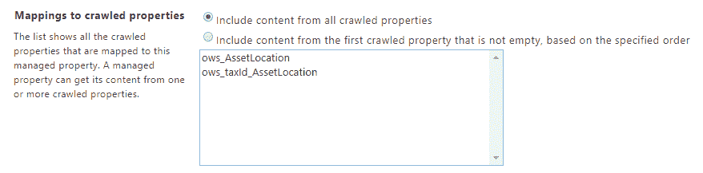
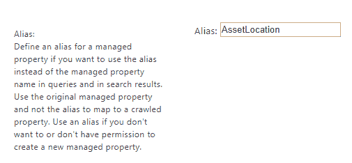
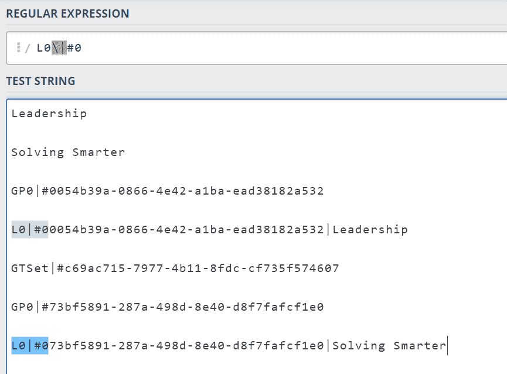
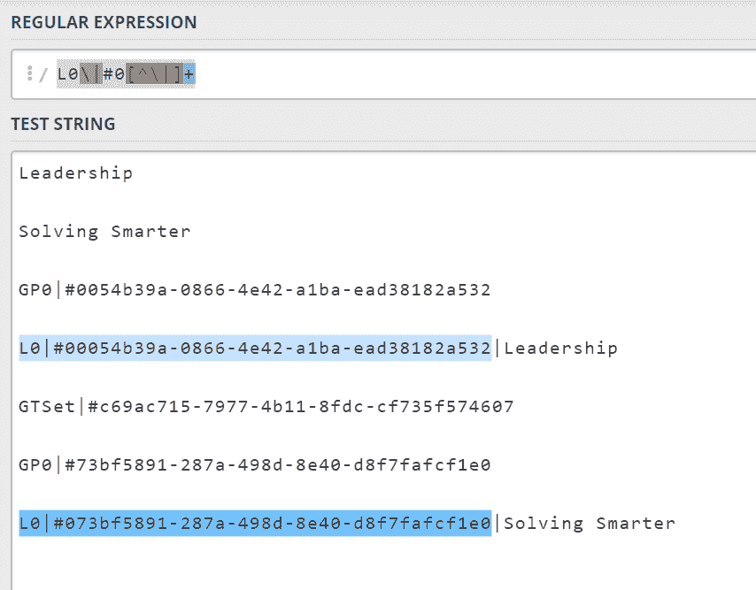
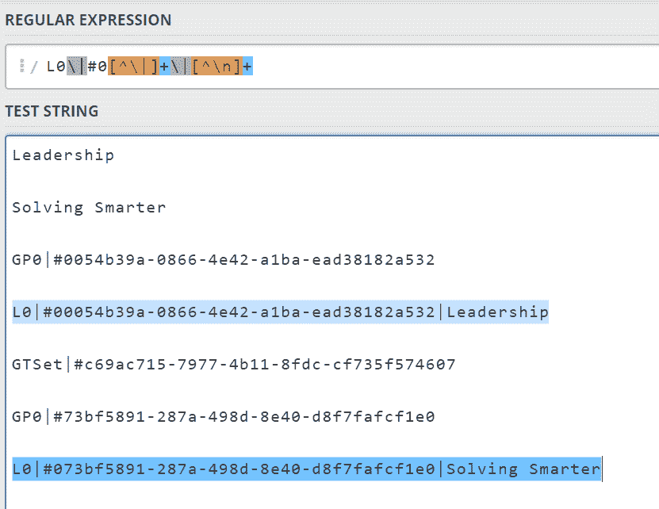
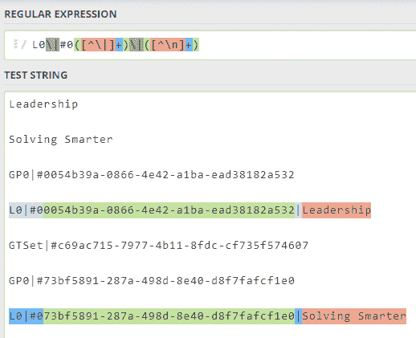
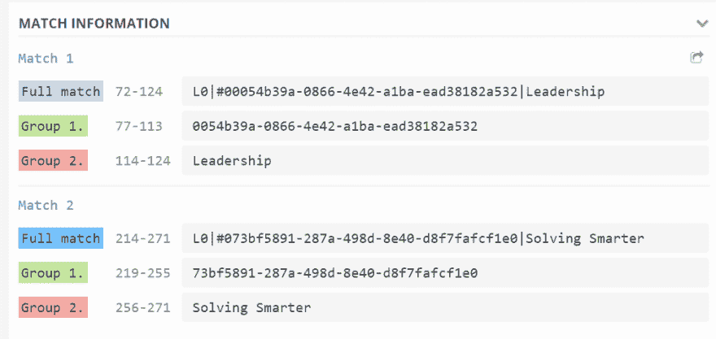

# SPFx 开发人员:在 SharePoint 搜索结果中使用 MMS 值

> 原文：<https://dev.to/droopytersen/spfx-developer-working-with-mms-values-in-sharepoint-search-results-4g1f>

在本文中，我将展示如何使用 Sharepoint 搜索服务通过 MMS 列进行查询。然后如何在代码中处理原始搜索结果值，以便对其执行进一步的逻辑(例如:按标记类别分组)。

## 托管属性设置

假设...

*   您已经创建了托管元数据网站栏
*   您已经用该网站栏标记了一些项目
*   您已经给了搜索服务时间来抓取标记的内容。

要通过我们的 MMS 列进行查询，我们需要在 SharePoint 管理中心设置搜索管理属性。

```
https://YOURTENANT-admin.sharepoint.com/_layouts/15/searchadmin/ta_listmanagedproperties.aspx?level=tenant 
```

找到并“编辑”在您设置 MMS 网站栏时自动创建的托管属性。它应该命名为 like，`owstaxIdCOLUMN_NAME`。

一旦您进入托管资产的编辑屏幕，我们需要:

1.  使其“可搜索”、“可查询”和“可检索”
2.  映射已爬网属性
3.  设置别名

我们通常映射多个爬行属性，一个仅用于术语标签，一个用于完整的序列化术语(GUID、标签、术语集等...).

[](https://res.cloudinary.com/practicaldev/image/fetch/s--rrPpQDNM--/c_limit%2Cf_auto%2Cfl_progressive%2Cq_auto%2Cw_880/https://thepracticaldev.s3.amazonaws.com/i/effcd8h9i36ety4wjtd0.PNG)

我们通常还会设置一个与网站栏内部名称相匹配的别名。这使得搜索 KQL 查询更具可读性。

[](https://res.cloudinary.com/practicaldev/image/fetch/s--iuqIf4_J--/c_limit%2Cf_auto%2Cfl_progressive%2Cq_auto%2Cw_880/https://thepracticaldev.s3.amazonaws.com/i/cnjx6g1vmir0iikfygkq.PNG)

## 按彩信值搜索

您可以使用 SharePoint 搜索服务 REST api 来查询数据。在 [Skyline](https://www.skylinetechnologies.com/) ，我们使用 [SPScript](https://spscript.com/#/search) 库来帮助我们调用 SharePoint Rest 端点。

如果我们有一个别名为`AssetLocation`的托管属性，我们可以使用
查询项目

```
import SPScript from "spscript"

async function fetchByAssetLocation(location: string) {
  let ctx = SPScript.createContext();
  let queryText = "AssetLocation:" + location;
  let queryOptions: any = {
    selectProperties: ["AssetLocation", "Path", "Title"],
  };
  let searchResponse = await ctx.search.query(queryText, queryOptions);
  return searchResponse.items;
} 
```

## 解析搜索结果彩信值

假如...

*   托管属性设置正确
*   标记有彩信值的数据已被爬网
*   我们已经明确要求搜索服务通过`selectproperties`查询选项返回我们的托管属性

我们应该会看到我们的搜索结果项包含我们的 MMS 列的数据，格式如下。

*这里有一个标记为两个类别的项目，领导力和解决问题的智慧*

```
Leadership

Solving Smarter

GP0|#0054b39a-0866-4e42-a1ba-ead38182a532

L0|#00054b39a-0866-4e42-a1ba-ead38182a532|Leadership

GTSet|#c69ac715-7977-4b11-8fdc-cf735f574607

GP0|#73bf5891-287a-498d-8e40-d8f7fafcf1e0

L0|#073bf5891-287a-498d-8e40-d8f7fafcf1e0|Solving Smarter 
```

我们需要的数据都在，但是有点乱。它只是一根巨大的绳子。如果我们想使用带标签的术语来执行代码中的任何逻辑(例如:根据标签对项目进行分组)，我们需要解析这个原始字符串。

这就是正则表达式派上用场的地方。我总是被 Regex 吓倒，所以我非常依赖 https://regex101.com。

下面是我用来构建一个正则表达式来解析原始搜索结果 MMS 字符串的思路。

以“L0”开头的每一行都包含术语 Guid 和术语 label。我只想瞄准那些线条。每个“L0”行都是这样的格式:

```
L0|#0<TERM_GUID>|<TERM_LABEL> 
```

构建正则表达式...

首先瞄准该行的开头，`LG|#0`。

*   `|`是一个特殊字符，所以我们必须用反斜杠对其进行转义。
*   我们添加了`/g`标志，这样就可以获取所有的匹配，而不是在找到第一个匹配时就停止。

```
let regex = /L0\|#0/g 
```

[](https://res.cloudinary.com/practicaldev/image/fetch/s--sye93j-Z--/c_limit%2Cf_auto%2Cfl_progressive%2Cq_auto%2Cw_880/https://thepracticaldev.s3.amazonaws.com/i/per8758wzt5t82hbixvn.PNG)

下一步抓取直到下一个“|”字符的所有内容。

*   `[^\|]`的意思是*不是`|`而是*的人物
*   添加一个`+`，意味着*如果像前面描述的那样，一行中有多个字符，则抓取所有字符*。

```
let regex = /L0\|#0[^\|]+/g 
```

[](https://res.cloudinary.com/practicaldev/image/fetch/s--M6x3nRi4--/c_limit%2Cf_auto%2Cfl_progressive%2Cq_auto%2Cw_880/https://thepracticaldev.s3.amazonaws.com/i/woqy7yvggmbv1jg75eq8.PNG)

为了得到行尾，我们期望有一个`|`和一个术语标签。

*   `\|[^\n]+`表示查找管道，然后抓取所有不是换行符的字符，`\n`

```
let regex = /L0\|#0[^\|]+\|[^\n]+/g 
```

[](https://res.cloudinary.com/practicaldev/image/fetch/s--zfeXPCfG--/c_limit%2Cf_auto%2Cfl_progressive%2Cq_auto%2Cw_880/https://thepracticaldev.s3.amazonaws.com/i/tx6fe3nmya09d7kpooea.PNG)

最后要做的事情是将“groups”添加到我们的正则表达式中，以便对于每个匹配，我们可以快速获得匹配的术语 Guid 和术语标签部分。

*   要添加组，我们只需用括号将正则表达式的一部分括起来

```
let regex = /L0\|#0([^\|]+)\|([^\n]+)/g 
```

[](https://res.cloudinary.com/practicaldev/image/fetch/s--KEkp26aW--/c_limit%2Cf_auto%2Cfl_progressive%2Cq_auto%2Cw_880/https://thepracticaldev.s3.amazonaws.com/i/4kg47n2npyqj4yxw0fat.PNG)
[T6】](https://res.cloudinary.com/practicaldev/image/fetch/s--bGeBgzq8--/c_limit%2Cf_auto%2Cfl_progressive%2Cq_auto%2Cw_880/https://thepracticaldev.s3.amazonaws.com/i/9mpiabjasbcsnjom1zcf.PNG)

现在我们有了一个工作的正则表达式，我们可以编写一个 javscript 函数来对原始字符串值执行正则表达式。

对于每个匹配，我们想要创建一个新的形状为`{ id, label }`的“Term”对象。

```
function parseSearchResultMMSValue(value) {
  if (!value) return [];
  let regex = /L0\|#([^\|]+)\|([^\n]+)/g;
  let terms = [];
  let match;
  // repeatedly call 'exec' until we don't have anymore matches
  while ((match = regex.exec(value))) {
    // once we have a match, get at the group for the id and the label
    // index 0 is the full match, group1 is the guid, group2 is the label
    terms.push({
      id: match[1],
      label: match[2],
    });
  }
  return terms;
} 
```