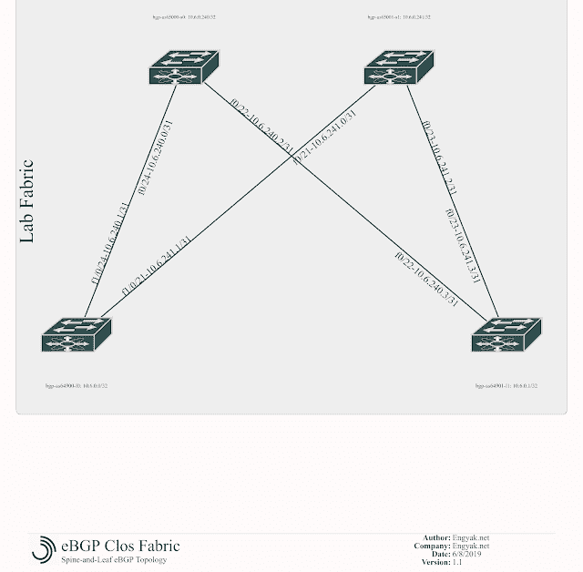

# 书脊和树叶的实际应用

> 原文：<https://dev.to/ngschmidt/spine-and-leaf-practical-applications-ebgp-3n5h>

## 概述

首先，这是参考图( [YAML](https://raw.githubusercontent.com/ngschmidt/labfabric-diagram/master/ebgp-clos-fabric.yml) ):

[](https://1.bp.blogspot.com/-7bOB2_FI1u8/XPviMfs2akI/AAAAAAAAAok/OhUid4BIueEqD4fsDWBtuDgbEizHsxujQCLcBGAs/s1600/eBGP%2BClos%2BFabric%2B%25281%2529.png)

### 关于难度的假设

我在运营商领域之外遇到的大多数人都被 BGP 吓到了，因为它的范围确实令人印象深刻。这里，我们将 BGP 的使用分为两类:

*   iBGP:这里所有节点都有相同的自治系统号。这种部署模式非常复杂，因为 BGP 的主要环路预防机制是一个字符串，其中包含该路由的所有自治系统号，可以说是将每个条目都视为一个“跳”。
*   eBGP:每个设备都有自己的 ASN。通过简单地读取 AS-Path 就可以很容易地防止循环。

**eBGP 并不是很难学。**

这是值得的，因为 BGP 在数据中心网络中有相当大的优势，这是对可靠性的强调。

我不打算在这里深入探讨 BGP 但是可以推荐一些关于这个主题的真正优秀的资源:

*   [BGP:使用边界网关协议构建可靠的网络，作者 Iljitsch van Beijnum](http://shop.oreilly.com/product/9780596002541.do)
*   几乎所有纳比克科恰良人写的东西

### BGP 与 OSPF、EIGRP 等 IGP 有何不同？

首先，我们必须检查 BGP 和 IGP 之间的一些关键差异:

*   IGP 是基于多播的，并且动态生成对等体。BGP 是基于 TCP 的，需要静态定义的对等体(注意:您可以定义一个[动态范围](https://www.cisco.com/c/en/us/td/docs/ios-xml/ios/iproute_bgp/configuration/xe-3sg/irg-xe-3sg-book/irg-dynamic-neighbor.html)，这在以后的例子中会很有价值)
*   EIGRP 有一个区域，OSPF 通常支持多达 16 个区域，而无需特定的硬件。BGP 支持 65，536 个双字节 ASN，即 4，294，967，295 个
*   IGP 被设计成信任它们的路由协议对等体来防止环路，而 BGP 被设计成控制路由广告
*   IGP(当然不是 IS-IS)只支持基于 IP 的地址族，而 MP-BGP 可以支持任何数量的定义为“网络层可达性信息”的单元，使其可以以多种方式扩展，如 [EVPN](https://blog.ipspace.net/2018/05/what-is-evpn.html) 或[分段路由](https://www.segment-routing.net/)，甚至 [MPLS](https://en.wikipedia.org/wiki/Multiprotocol_Label_Switching) 。这里的关键主题是 BGP 的行为更像一个分布式数据库，而不是路由协议通常的行为。
*   IGPs 值快速再收敛，而 BGP 值**可靠**再收敛。这是一个缓慢的过程，但是非常容易改变。

### 应用概念

在受控环境中，如 Clos 结构，eBGP 很容易设置、排除故障和维护。所以让我们开始吧！

首先，我们用适当的 AS 和邻居配置 spines。看起来这里发生了很多事情，但这仅仅是因为我们正在运行两个地址家族:IPv4 和 IPv6:

```
bgp-as65000-s0#conf tEnter configuration commands, one per line. End with CNTL/Z.bgp-as65000-s0(config)#router bgp 65000 bgp log-neighbor-changes neighbor 10.6.240.1 remote-as 64900 neighbor 10.6.240.1 update-source FastEthernet0/24 neighbor 10.6.240.3 remote-as 64901 neighbor 10.6.240.3 update-source FastEthernet0/22 neighbor FD00:6:240::2 remote-as 64900 neighbor FD00:6:240::2 update-source FastEthernet0/24 neighbor FD00:6:240::6 remote-as 64901 neighbor FD00:6:240::6 update-source FastEthernet0/22 maximum-paths 2 ! address-family ipv4 neighbor 10.6.240.1 activate neighbor 10.6.240.3 activate no neighbor FD00:6:240::2 activate no neighbor FD00:6:240::6 activate maximum-paths 2 no auto-summary no synchronization exit-address-family ! address-family ipv6 neighbor FD00:6:240::2 activate neighbor FD00:6:240::6 activate exit-address-familybgp-as65001-s1#conf tEnter configuration commands, one per line. End with CNTL/Z.bgp-as65001-s1(config)#router bgp 65001 bgp log-neighbor-changes neighbor 10.6.241.1 remote-as 64900 neighbor 10.6.241.1 update-source FastEthernet0/21 neighbor 10.6.241.3 remote-as 64901 neighbor 10.6.241.3 update-source FastEthernet0/23 neighbor FD00:6:241::2 remote-as 64900 neighbor FD00:6:241::2 update-source FastEthernet0/21 neighbor FD00:6:241::6 remote-as 64901 neighbor FD00:6:241::6 update-source FastEthernet0/23 maximum-paths 2 ! address-family ipv4 neighbor 10.6.241.1 activate neighbor 10.6.241.3 activate no neighbor FD00:6:241::2 activate no neighbor FD00:6:241::6 activate maximum-paths 2 no auto-summary no synchronization exit-address-family ! address-family ipv6 neighbor FD00:6:241::2 activate neighbor FD00:6:241::6 activate exit-address-family 
```

然后是叶子:

```
bgp-as64900-l0#conf tEnter configuration commands, one per line. End with CNTL/Z.bgp-as64900-l0(config)#router bgp 64900 bgp log-neighbor-changes neighbor 10.6.240.0 remote-as 65000 neighbor 10.6.240.0 update-source FastEthernet1/0/24 neighbor 10.6.241.0 remote-as 65001 neighbor 10.6.241.0 update-source FastEthernet1/0/21 neighbor FD00:6:240::1 remote-as 65000 neighbor FD00:6:240::1 update-source FastEthernet1/0/24 neighbor FD00:6:241::1 remote-as 65001 neighbor FD00:6:241::1 update-source FastEthernet1/0/21 maximum-paths 2 ! address-family ipv4 neighbor 10.6.240.0 activate neighbor 10.6.241.0 activate no neighbor FD00:6:240::1 activate no neighbor FD00:6:241::1 activate maximum-paths 2 no auto-summary no synchronization exit-address-family ! address-family ipv6 neighbor FD00:6:240::1 activate neighbor FD00:6:241::1 activate exit-address-familybgp-as64901-l1#conf tEnter configuration commands, one per line. End with CNTL/Z.bgp-as64901-l1(config)#router bgp 64901 bgp log-neighbor-changes neighbor 10.6.240.2 remote-as 65000 neighbor 10.6.240.2 update-source FastEthernet0/22 neighbor 10.6.241.2 remote-as 65001 neighbor 10.6.241.2 update-source FastEthernet0/23 neighbor FD00:6:240::5 remote-as 65000 neighbor FD00:6:240::5 update-source FastEthernet0/22 neighbor FD00:6:241::5 remote-as 65001 neighbor FD00:6:241::5 update-source FastEthernet0/23 maximum-paths 2 ! address-family ipv4 neighbor 10.6.240.2 activate neighbor 10.6.241.2 activate no neighbor FD00:6:240::5 activate no neighbor FD00:6:241::5 activate maximum-paths 2 no auto-summary no synchronization exit-address-family ! address-family ipv6 neighbor FD00:6:240::5 activate neighbor FD00:6:241::5 activate exit-address-family 
```

现在，我们可以验证所有对等体都使用了两个堆栈:

```
bgp-as65000-s0#show ip bgp sumBGP router identifier 10.6.0.240, local AS number 65000BGP table version is 1, main routing table version 1Neighbor V AS MsgRcvd MsgSent TblVer InQ OutQ Up/Down State/PfxRcd10.6.240.1 4 64900 23 23 1 0 0 00:20:39 010.6.240.3 4 64901 19 18 1 0 0 00:17:04 0bgp-as65000-s0#show bgp ipv6 unicast summaryBGP router identifier 10.6.0.240, local AS number 65000BGP table version is 1, main routing table version 1Neighbor V AS MsgRcvd MsgSent TblVer InQ OutQ Up/Down State/PfxRcdFD00:6:240::2 4 64900 13 12 1 0 0 00:10:17 0FD00:6:240::6 4 64901 9 9 1 0 0 00:06:30 0 
```

我们仍然有一个问题-没有收到前缀！让我们通过向所有相关设备添加网络语句来解决这个问题。在演示设备中，网络语句必须与广告完全匹配。

接口不需要网络语句，因为在这种情况下，组播不用于对等点发现:

```
bgp-as64900-l0(config)#router bgp 64900bgp-as64900-l0(config-router)#address-family ipv4bgp-as64900-l0(config-router-af)#network 10.6.0.0 mask 255.255.255.255 
```

完成后，我们将看到更多的路由——注意，必须在所有适用网络的主干上重复上述步骤，以确保端到端的可达性。这个硬件似乎不支持 IPv6 的 ECMP。

```
bgp-as64900-l0#show ip bgp sumBGP router identifier 10.6.0.0, local AS number 64900BGP table version is 13, main routing table version 138 network entries using 936 bytes of memory9 path entries using 468 bytes of memory8/4 BGP path/bestpath attribute entries using 1120 bytes of memory6 BGP AS-PATH entries using 144 bytes of memory0 BGP route-map cache entries using 0 bytes of memory0 BGP filter-list cache entries using 0 bytes of memoryBGP using 2668 total bytes of memoryBGP activity 16/0 prefixes, 22/1 paths, scan interval 60 secsNeighbor V AS MsgRcvd MsgSent TblVer InQ OutQ Up/Down State/PfxRcd10.6.240.0 4 65000 47 47 13 0 0 00:40:51 410.6.241.0 4 65001 47 45 13 0 0 00:40:03 4bgp-as64900-l0#show bgp ipv6 unicast summaryBGP router identifier 10.6.0.0, local AS number 64900BGP table version is 10, main routing table version 108 network entries using 1128 bytes of memory12 path entries using 912 bytes of memory8/4 BGP path/bestpath attribute entries using 1120 bytes of memory6 BGP AS-PATH entries using 144 bytes of memory0 BGP route-map cache entries using 0 bytes of memory0 BGP filter-list cache entries using 0 bytes of memoryBGP using 3304 total bytes of memoryBGP activity 16/0 prefixes, 22/1 paths, scan interval 60 secsNeighbor V AS MsgRcvd MsgSent TblVer InQ OutQ Up/Down State/PfxRcdFD00:6:240::1 4 65000 44 43 10 0 0 00:37:56 5FD00:6:241::1 4 65001 43 43 10 0 0 00:37:18 6bgp-as64900-l0#show ipv6 roIPv6 Routing Table - Default - 11 entriesCodes: C - Connected, L - Local, S - Static, U - Per-user Static route B - BGP, R - RIP, D - EIGRP, EX - EIGRP external ND - Neighbor Discovery O - OSPF Intra, OI - OSPF Inter, OE1 - OSPF ext 1, OE2 - OSPF ext 2 ON1 - OSPF NSSA ext 1, ON2 - OSPF NSSA ext 2LC FD00:6::/128 [0/0] via Loopback0, receiveB FD00:6::1/128 [20/0] via FE80::216:C8FF:FE04:4742, FastEthernet1/0/24B FD00:6::240/128 [20/0] via FE80::216:C8FF:FE04:4742, FastEthernet1/0/24B FD00:6::241/128 [20/0] via FE80::223:4FF:FE42:F3C1, FastEthernet1/0/21C FD00:6:240::/126 [0/0] via FastEthernet1/0/24, directly connectedL FD00:6:240::2/128 [0/0] via FastEthernet1/0/24, receiveB FD00:6:240::4/126 [20/0] via FE80::216:C8FF:FE04:4742, FastEthernet1/0/24C FD00:6:241::/126 [0/0] via FastEthernet1/0/21, directly connectedL FD00:6:241::2/128 [0/0] via FastEthernet1/0/21, receiveB FD00:6:241::4/126 [20/0] via FE80::223:4FF:FE42:F3C1, FastEthernet1/0/21L FF00::/8 [0/0] via Null0, receivebgp-as64900-l0#show ip roCodes: C - connected, S - static, R - RIP, M - mobile, B - BGP D - EIGRP, EX - EIGRP external, O - OSPF, IA - OSPF inter area N1 - OSPF NSSA external type 1, N2 - OSPF NSSA external type 2 E1 - OSPF external type 1, E2 - OSPF external type 2 i - IS-IS, su - IS-IS summary, L1 - IS-IS level-1, L2 - IS-IS level-2 ia - IS-IS inter area, * - candidate default, U - per-user static route o - ODR, P - periodic downloaded static routeGateway of last resort is not set 10.0.0.0/8 is variably subnetted, 8 subnets, 2 masksC 10.6.0.0/32 is directly connected, Loopback0B 10.6.0.1/32 [20/0] via 10.6.240.0, 00:12:49C 10.6.240.0/31 is directly connected, FastEthernet1/0/24B 10.6.0.240/32 [20/0] via 10.6.240.0, 00:10:03C 10.6.241.0/31 is directly connected, FastEthernet1/0/21B 10.6.0.241/32 [20/0] via 10.6.241.0, 00:07:40B 10.6.240.2/31 [20/0] via 10.6.240.0, 00:08:47B 10.6.241.2/31 [20/0] via 10.6.241.0, 00:07:40 
```

我已经把基本配置贴在这里了。