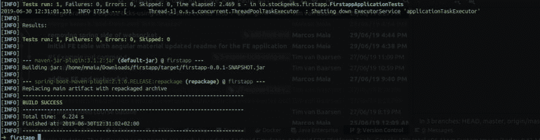
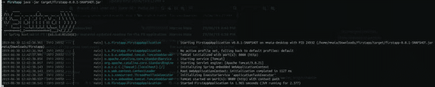
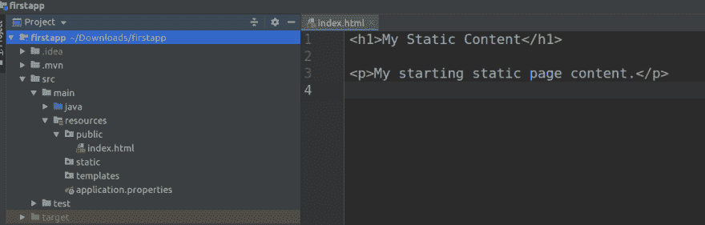

# Spring Boot -速成班

> 原文：<https://dev.to/thegroo/spring-boot-crash-course-21nm>

这篇文章的目标是让你能够运行你的第一个 Spring Boot 应用程序，因为我这里的大部分文章都要求你从那里开始。

默认情况下，Spring boot 是一个应用了许多自以为是的配置的框架，这使得它成为在 Java 生态系统中开始开发的一个非常简单的框架，它还对测试提供了很好的支持，对 [Kotlin 提供了很好的支持](https://kotlinlang.org/docs/reference/)尽管我建议谨慎使用，并在生产中大量使用服务器端来运行 Kotlin 项目之前等待，但对于 Android 开发来说，Kotlin 是目前推荐使用的语言。

使用 Spring Boot，不需要 XML 配置，这使得创建和运行 Spring/Java 应用程序变得非常容易，缺点是您需要理解它的约定才能确切地知道发生了什么，尤其是在解决问题时。

这真的很棒，它还提供了许多在实际项目中需要的功能，包括非常有用和节省时间的非功能。

要创建一个 Spring Boot 应用程序，最简单的方法是使用一个与你最喜欢的 IDE 集成的插件，或者去 Spring Boot 初始化网站，在那里创建你的初始应用程序。它很容易使用，并提供了来自 [Spring](https://spring.io/) 生态系统的大量可能的组合。

让我们创建并运行我们的第一个 Spring Boot 应用程序，如果您没有安装 java 8 或 java 11，请查看我的[上一篇文章](https://dev.to/thegroo/basic-setup-for-some-tutorials-51m),在那里您可以找到关于运行我的博客文章中的示例项目所需的所有设置的指导，包括这篇文章。现在，打开 [Spring Initializr](https://start.spring.io/) 网站，按照以下步骤操作:

1.  `Project:`肚子
2.  `Language:` Java
3.  `Spring Boot:`选择最新版本，目前是`2.1.6`
4.  项目元数据
    *   `Group:` io.stockgeeks
    *   `Artifact:`第一步
    *   选择
        *   `Name:`第一步
        *   我和 Spring Boot 的第一个项目
        *   `Package Name:` io.stockgeeks.firstapp
        *   `Packaging:`罐子
        *   `Java:` 11
5.  `Dependencies:`搜索并添加`Spring Web Starter`，确保它在选定的依赖项下。

点击`Generate the Project`绿色大按钮，下载 zip 文件，保存到你喜欢的位置。用你喜欢的压缩工具解压 zip 文件。

[](https://res.cloudinary.com/practicaldev/image/fetch/s--EOaP6T5m--/c_limit%2Cf_auto%2Cfl_progressive%2Cq_auto%2Cw_880/https://thepracticaldev.s3.amazonaws.com/i/cx4vi7s65t26oiamyuxx.png)

现在让我们运行它。确保你已经安装了 [Java 11 和 maven】。](https://dev.to/thegroo/basic-setup-for-some-tutorials-51m)

导航到解压 zip 文件的文件夹并检查其中的文件，您应该有一个`pom.xml`文件，它是您项目的 maven 父 pom。如果您使用的是 IDE，现在您可以在其中加载这个文件夹，它应该会将它识别为一个 maven 项目，但是现在，我们将使用命令行运行该应用程序。

下载依赖项，编译它并使用 maven 生成一个可执行的 jar 文件:

`mvn clean package`

您应该会看到一条构建成功的消息，如下图所示:

[](https://res.cloudinary.com/practicaldev/image/fetch/s--gVfF9Aes--/c_limit%2Cf_auto%2Cfl_progressive%2Cq_auto%2Cw_880/https://thepracticaldev.s3.amazonaws.com/i/smqrg6ub7m80ylyq8m9x.png)

现在您已经创建了一个`target`文件夹，这个文件夹是在构建过程中完全生成的，您可以随时删除它。确保将它添加到您的`.gitignore`文件中，因为您根本不想提交该文件夹的内容，在该文件夹中，您还可以找到由构建和打包过程生成的所有编译和打包的结构。

如果您列出目标文件夹的内容，您应该会看到一个名为`firstapp-0.0.1-SNAPSHOT.jar`的文件，这是包含您的可执行应用程序的文件，它有一个嵌入 java 的 [Web 服务器](https://en.wikipedia.org/wiki/Web_server)，默认情况下是 [Apache Tomcat](http://tomcat.apache.org/) ，但是您也可以[选择其他的](https://docs.spring.io/spring-boot/docs/current/reference/html/howto-embedded-web-servers.html)。

使用 maven 和 spring boot 插件:

`mvn spring-boot:run`

或者使用 java 运行生成的 jar 文件:

`java -jar target/firstapp-0.0.1-SNAPSHOT.jar`

一旦您看到消息:`Tomcat started on port(s): 8080 (http)`您的 Spring Boot 应用程序正在运行。

[](https://res.cloudinary.com/practicaldev/image/fetch/s--utSZr-2c--/c_limit%2Cf_auto%2Cfl_progressive%2Cq_auto%2Cw_880/https://thepracticaldev.s3.amazonaws.com/i/5jfglxtrmvw0l7y74t3h.png)

最后，让我们添加一个 [REST](https://en.wikipedia.org/wiki/Representational_state_transfer) 端点和一个静态 HTML 页面。

## 添加端点和默认静态页面

#### index.html

创建一个名为`public`的文件夹，并在`/src/main/resources/public`下添加一个包含您想要的任何内容的 index.html 页面。

[](https://res.cloudinary.com/practicaldev/image/fetch/s--Lw6nREu0--/c_limit%2Cf_auto%2Cfl_progressive%2Cq_auto%2Cw_880/https://thepracticaldev.s3.amazonaws.com/i/89b9xn6dkqwrkr6ipy7z.png)

Spring Boot 自动添加要提供的公共文件夹内容，它还默认启用资源下的其他路径:

*   /META-INF/resources/
*   /资源/
*   /静态/
*   /公共/

#### 休息终点

现在让我们创建最简单的 REST 端点，在有 FirstappAplication.java 定义的同一个包级别上创建一个 java 类，在我的例子中是包 io.stockgeeks.firstapp，调用它:`HelloSpringRest.java`

增加以下内容:

```
package io.stockgeeks.firstapp;

import org.springframework.stereotype.Controller;
import org.springframework.web.bind.annotation.GetMapping;

import javax.websocket.server.PathParam;

@Controller
@RequestMapping("/api")
public class HelloSpringRest {

  @GetMapping("/hello")
  public String hello(@PathParam("name") String name) {
    return "Hello, " + name;
  }
} 
```

Enter fullscreen mode Exit fullscreen mode

用 spring 创建 REST 端点只需要一些注释和几行 java 代码。

`@Controller`注释向 Spring Boot 声明这是一个 Spring 管理的组件，`@RequestMapping("api")`为添加到该类的端点准备 REST 端点根上下文，并将它们映射为“/api”，@GetMapping("/hello ")注册上下文“/hello”以接收 HTTP GET 请求，最后@PathParam("name ")用关键字“name”注册 GET 调用的查询字符串。

#### 构建并运行

像以前一样，任何时候您想从命令行运行，您可以构建并运行:`mvn clean package && mvn spring-boot:run`。

现在导航到: [http://localhost:8080](http://localhost:8080) ，您应该会看到刚刚创建的静态 index.html 页面。

要测试 REST 端点，您可以将浏览器指向[http://loca host:8080/API/hello？name=Spock](http://locahost:8080/api/hello?name=Spock) 或者使用 curl: `curl -X GET http://locahost:8080/api/hello?name=Spock`

## 搞定

您已经创建了一个 Spring Boot 应用程序和一个静态页面和 REST 端点。这篇文章的目标是让你能够轻松地创建 Spring Boot 应用程序，我将在以后的文章中提到这一点，因为这里的大多数文章都需要有一个 Spring Boot 应用程序作为起点。

> 如果你想看源代码，并且没有遵循上述步骤，你可以用`git clone git@github.com:stockgeeks/firstapp.git`克隆[这个 post 项目回购](https://github.com/stockgeeks/firstapp)

## 参考文献

[用 Spring Boot 提供静态内容](https://spring.io/blog/2013/12/19/serving-static-web-content-with-spring-boot)

[Spring Boot 休息指南](https://spring.io/guides/gs/rest-service/)

标题图片由[吴仪](https://unsplash.com/@takeshi2?utm_source=unsplash&utm_medium=referral&utm_content=creditCopyText)在 [Unsplash](//www.unsplash.com) 上拍摄