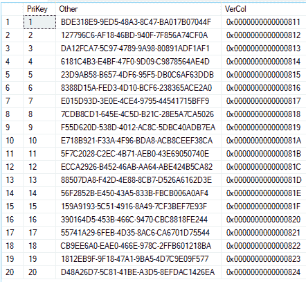
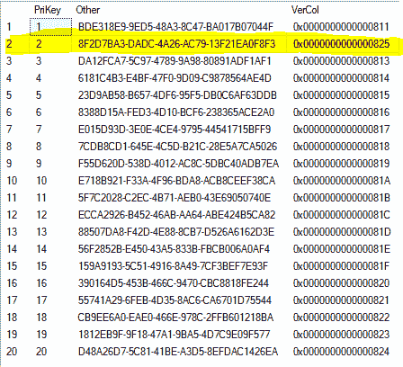

# SQL Server 行版本

> 原文：<https://dev.to/joelowrance/sql-server-row-versions-4bef>

[`rowversion`](https://docs.microsoft.com/en-us/sql/t-sql/data-types/rowversion-transact-sql?view=sql-server-2017) 数据类型实现起来很简单，但是提供了一些强大的功能。

考虑下面的情况，我们创建了一对简单的表。

```
CREATE TABLE ExampleTable2 (PriKey int PRIMARY KEY, Other uniqueidentifier, VerCol rowversion) ;  
GO
insert into ExampleTable2(PriKey, Other)
values 
(1, newid()),
(2, newid()),
(3, newid()),
(4, newid()),
(5, newid()),
(6, newid()),
(7, newid()),
(8, newid()),
(9, newid()),
(10, newid())
GO
CREATE TABLE ExampleTable3 (PriKey int PRIMARY KEY, Other uniqueidentifier, VerCol rowversion) ;  
GO
insert into ExampleTable3(PriKey, Other)
values 
(11, newid()),
(12, newid()),
(13, newid()),
(14, newid()),
(15, newid()),
(16, newid()),
(17, newid()),
(18, newid()),
(19, newid()),
(20, newid()) 
```

正如我们所见，`VerCol`列填充了顺序数据。请注意，该值是数据库中的**序列，而不是表**

[](https://res.cloudinary.com/practicaldev/image/fetch/s--mr9FoF3t--/c_limit%2Cf_auto%2Cfl_progressive%2Cq_auto%2Cw_880/https://testedwithf5.github.io/asseimg/rowversion_1.PNG)

如果我们更新一行

```
update ExampleTable2 set Other = NEWID() where PriKey = 2 
```

我们可以看到`VerCol`被自动更新为序列中的下一个数字。

[](https://res.cloudinary.com/practicaldev/image/fetch/s--X17BG1UE--/c_limit%2Cf_auto%2Cfl_progressive%2Cq_auto%2Cw_880/https://testedwithf5.github.io/asseimg/rowversion_2.png)

在我想到的两个场景中，它的用处是显而易见的。第一种情况是，一个用户正在编辑另一个用户也正在编辑的记录。如果用户 A 保存了记录，`VerCol`将被更新。当用户 B 保存记录时，我们可以对照用户 B 正在处理的记录检查该列的值，并通过警告数据过期来阻止保存操作。

第二个场景是关于批处理作业和/或数据导出。如果 CustomerA 和 CustomerB 偶尔会请求导出自他们上次请求以来已更改的数据，我们可以在导出时提供数据和`Max(VerCol)`。当他们下一次要求一组新的数据时，我们可以简单地添加说明`where VerCol > 0x00000 00000000824`的标准。