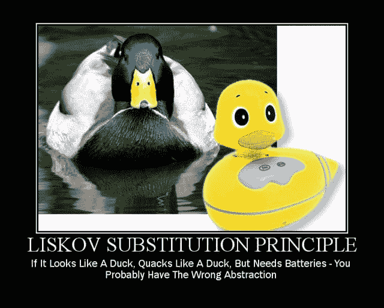

# 正方形延伸长方形——如何不继承一塌糊涂

> 原文：<https://dev.to/stillwondering/square-extends-rectangle-how-not-to-inherit-a-mess-157l>

## 简介

继承是面向对象编程(OOP)最基本的构件之一。同时，这也是最容易被滥用的特性之一。不正确应用继承的症状包括但不限于:

*   类图过于复杂，难以理解
*   测试相当困难
*   没有广泛的嘲笑，单元测试实际上是不可能的
*   对象包含调用它们没有意义的方法

前面的内容读起来像是软件和源代码的不良属性的列表，甚至可以进一步扩展。为了避免上述问题，有必要正确理解什么是继承。

在下面的文章中，我们将探索继承的基础。我们将看看底层方面，以及通用编程语言是如何实现和支持它的。此外，我们将讨论使用继承所产生的问题以及减轻这些问题的方法。

## 继承方面

当问*为什么*我们使用继承时，首先想到的答案是*代码重用*。事实上，继承是避免重复代码的可行工具。然而，它经常被简化为代码重用。这是不正确的。

继承(由大多数编程语言实现)包括两个方面:*子类化*和*子类化*。在下文中，我们将看看什么是上述方面，以及它们如何与继承相关联。

### 子类型

类型由其对应的公共接口定义。这意味着我们只考虑方法签名，而不关心实现。

如果类型`B`的公共接口匹配类型`A`的公共接口，那么类型`B`就是类型`A`的子类型。此外，子类型的行为和含义必须与超类型的行为和含义相匹配。

说到计算机和机器，*行为*和*意为*是有问题的概念。计算机不可能可靠地确定两种算法是否表现出相同的行为(T4 停顿问题的结果)。因此，计算机无法验证子类型关系。

让我们考虑下面的例子。

```
<?php

interface Stack
{
    public function push($value);
    public function pop();
} 
```

`Stack`是一个类型，它的公共接口由方法`push`和`pop`组成。但不是这样。`Stack`这个名字是有含义的。考虑下面的实现:

```
<?php

class AwesomeStack implements Stack
{
    private $value;

    public function push($value)
    {
        $this->value = $value;
    }

    public function pop()
    {
        return $this->value;
    }
} 
```

`AwesomeStack`是`Stack`的子类型吗？

对此的回答是**否**。当`AwesomeStack`和`Stack`的公共接口匹配时，`AwesomeStack`与`Stack`的含义不匹配。堆栈意味着`AwesomeStack`不具备的后进先出行为。

然而，计算机不能决定这一点。源代码不包含任何关于隐含后进先出行为的信息。子类型只能由程序员验证。

> 子类型描述了一个对象应该做什么。
> 子类型保留了父类型的*，意为*。

### 子类化

子类是通过重用相应超类的所有实现细节来构建的。它与含义或行为无关，因为子类使用超类的源代码。

子类关系由语言关键字或通过语法(C#中的`extends`、`:`符号)来定义，...).因此，计算机有子类的概念，并且能够验证关系。

有人可能认为子类化意味着子类型化，因为子类化重用了包含公共接口的超类的源代码。然而，定义一个不是子类型的子类是非常容易的:

```
<?php

class ThingA
{
    public function sayHello()
    {
        echo "hello\n";
    }

    public function doThat()
    {
        echo "that\n";
    }
}

class ThingB extends ThingA
{
    public function doThat()
    {
        echo "this\n";
    }
} 
```

`ThingB`是由`extends`关键字定义的`ThingA`的子类。然而，它不是`ThingA`的子类型，因为它不保留父类型的含义。

原因是`ThingB`覆盖了从`ThingA`继承的方法`doThat`。行为发生变化，这违反了有效子类型的要求。

> 子类化描述了*如何构造*一个对象。

## 换人的问题

替换是指互换使用不同的类型。

```
A a = new A();
B b = new B();

a = b; 
```

问题是:我们能否将类型为`B`的对象赋给类型为`A`的变量？

让我们看看这在大多数支持继承的编程语言中是如何实现的。替换的有效性是基于子类关系来确定的。因此，当且仅当`B`是`A`的子类时，如上所示的变量赋值`a = b`才有效。

考虑到计算机无法确定子类型，基于子类化确定正确的替换是唯一可行的选择。然而，我们遇到了一个大问题。只有当两个对象的行为相同时，用一个对象替换另一个对象才有意义。这意味着应该只允许基于子类型的替换。

总结一下我们的困境:

> 替换应该基于子类型进行验证，但是计算机只能检查子类关系。

但是有什么东西可以帮助我们确定子类型关系是否正确吗？还好有！

## 利斯科夫替代原理——固体中的 L

> 设φ(*x*)是关于 t 类型的对象 *x* 的一个可证明的性质，那么φ(*y*)对于 S 类型的对象 *y* 应该为真，其中 S 是 t 的子类型

利斯科夫替代原理(LSP)的原始措辞并不真正直观和易于理解，所以让我们重新措辞:

> 如果 S 是 T 的子类型，那么 T 类型的对象可以用 S 类型的对象替换，而不改变程序的任何期望的属性。

这个原则似乎很明显。只有在保证应用程序不会有不同的行为或完全崩溃时，用对象替换对象才有意义。但是，请注意，该原则是严格语义的，不考虑语法问题。

如前所述，计算机无法验证行为和意义。因此，LSP 通常是不可判定的。但是我们(和计算机)如何保证 LSP 成立呢？

大多数编程语言对子类型的方法签名施加限制:

*   方法参数的*逆变*
*   返回类型的*协方差*

子类型中方法参数的逆变意味着继承方法的参数可能是原始参数类型的超类型。反过来，子类型中返回类型的协方差意味着继承方法的返回类型可能是原始返回类型的子类型。

本质是这样的:前置条件不能在一个子类型中被强化，后置条件也不能被弱化。假设我们有代码调用类型为`T`的对象的方法，我们想用类型为`S`的对象替换它。类型`S`的方法需要接受类型`T`接受的一切，而*可能*接受更多(前提条件不能加强)。相反，类型`S`的方法不能返回比类型`T`更多的内容，但是*可以比*返回更少的内容(后置条件不能被削弱)。

如果这些约束中的任何一个不成立，使用该变量的代码将会中断。要么我们把值传递给`S`它根本无法处理。Or `S`返回周围代码不期望的值。

然而，我们仍然不知道类型为`S`的对象的行为是否匹配类型为`T`的对象的行为。这就是我们作为开发人员发挥作用的地方。我们需要问自己:LSP 支持我们试图建立的继承关系吗？计算机不能从我们这里拿走这个。

## 行动号召

*   在应用继承之前要三思。LSP 成立吗？
*   接受这样的事实，即使编译器/解释器认为代码是正确的(语义和语法的差异)，代码也可能是错误的
*   了解代码重用的替代方案:*组合*
*   如果不确定:不要害怕问

毕竟，这一切都可以归结为:

[](https://res.cloudinary.com/practicaldev/image/fetch/s--XKeRzdyf--/c_limit%2Cf_auto%2Cfl_progressive%2Cq_auto%2Cw_880/https://www.tomdalling.cimg/posts/lsp.jpg)

## 来源

*   [https://www . cs . bgu . AC . il/~ oods 122/wiki . files/L10 . pdf](https://www.cs.bgu.ac.il/%7Eoosd122/wiki.files/l10.pdf)
*   [https://en.wikipedia.org/wiki/Halting_problem](https://en.wikipedia.org/wiki/Halting_problem)
*   [https://stack ify . com/solid-design-lis kov-substitution-principle/](https://stackify.com/solid-design-liskov-substitution-principle/)
*   [https://en.wikipedia.org/wiki/Liskov_substitution_principle](https://en.wikipedia.org/wiki/Liskov_substitution_principle)