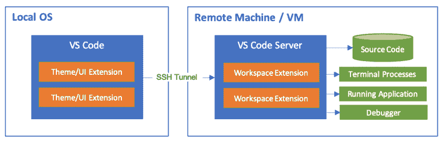
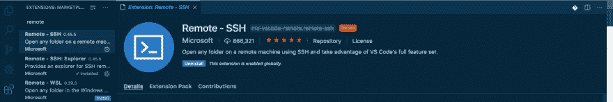
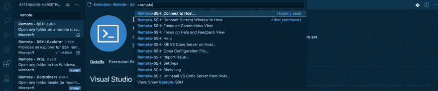
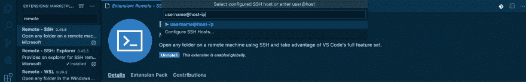
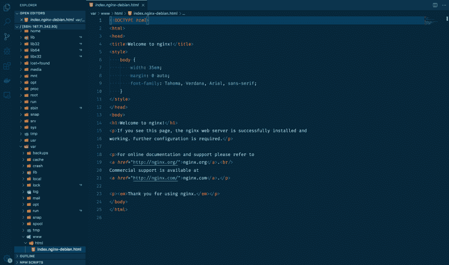

# 在 1 分钟内在 VsCode 上 SSH 到远程服务器

> 原文：<https://dev.to/sharkdevs/ssh-to-remote-server-on-vscode-in-1-minute-100k>

最近，我在做一个数字海洋的项目。我想在本地 Visual studio 代码中提取并访问那里的文件夹。虽然 解决了这个问题，但我想提供一种直接的方式将远程服务器拉至您的 Vs 代码。

> 本文假设您的 ssh 已经配置好了，您想要做的就是在本地获取远程服务器。

### 第一步:安装远程-SSH 扩展

在 VsCode 上，导航到扩展并安装`Remote-SSH`

### 第二步:配置 SSH

I .打开 Vscode 命令托盘(cmnd+shift+P)并键入`Remote`。你会看到一个下拉菜单，里面有几个选项。点击`Remote-SSH: connect to host`

二。在提供的输入框中，以格式`username@hostname` ie `root@127.0.0.1`将主机名插入 ssh to，然后单击它下面突出显示的选项。
T3T5】

三。在下一步中插入您的密码，Vscode 将完成其余的配置。

### 最后:

要打开您的文件夹，导航至`Files > open > file`
或者，您可以点击文件浏览器打开您想要访问的文件夹。
T3T5】

来自鲨鱼的快乐编码🦈