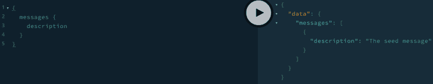
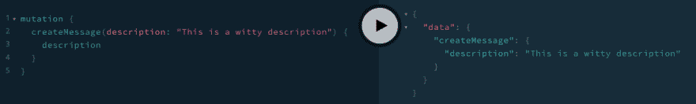

# 用 NestJS 建立一个 Node.js 服务器，包括 TypeScript 和 GraphQL

> 原文：<https://dev.to/aryanjnyc/stand-up-a-node-js-server-with-nestjs-including-typescript-and-graphql-fao>

最近发现了 NestJS，瞬间爱上了。这是我喜欢 Angular 的一切(包括 TypeScript、固执己见的文件结构、模块、装饰器和依赖注入)。此外，它支持 GraphQL。

## 开始之前

本教程不适合初学者。它不会涵盖节点基础知识。如果你想了解 Node 和 Express 是如何工作的，我制作了[一系列视频，其中我创建并部署了一个基本的时间戳微服务](https://www.youtube.com/playlist?list=PL3cz80ehFCan4ph_96mDMCJuJ-bRMq9Yd)。此外，它不会涵盖 GraphQL 的基础知识。

我根据这篇博文制作了一个视频教程。我建议阅读这篇博文，并观看视频，因为它们相辅相成。

[https://www.youtube.com/embed/JA7d-UUGqk0](https://www.youtube.com/embed/JA7d-UUGqk0)

本教程使用`nest-cli`6 . 6 . 4 版本，写于 2019 年 9 月 18 日。如果有任何东西过时或报告任何错误/屏蔽，请随时[给我发推文](https://twitter.com/AryanJabbari)。

如果在任何时候你觉得迷失了，你可以看看这个代码的最终形式[。](https://github.com/AryanJ-NYC/nestjs-graphql-tutorial)

## [【aryanj-NYC】](https://github.com/AryanJ-NYC)/[【nesjs-graph QL 教程】](https://github.com/AryanJ-NYC/nestjs-graphql-tutorial)

### 请参见下面的自述文件

所有这些问题都解决了，让我们开始吧！

## NestJS 入门

NestJS 是一个 Node.js 框架，与 TypeScript 和纯 JavaScript 都兼容。它带有开箱即用的[防护罩](https://docs.nestjs.com/guards)、[管道](https://docs.nestjs.com/pipes)和[拦截器](https://docs.nestjs.com/interceptors)支架。这使得它易于使用，但极其强大。

首先，安装 NestJS CLI。这允许您轻松地创建一个新的 NestJS 项目。

```
npm i -g @nestjs/cli
nest new my-node-project 
```

其中`my-node-project`是您的节点项目的名称。如果你安装了 NPM 和纱线，NestJS 会询问你的偏好。如果项目创建正确，您应该有一个新创建的项目，其结构如下:

```
.
├── README.md
├── nest-cli.json
├── package.json
├── src
│   ├── app.controller.spec.ts
│   ├── app.controller.ts
│   ├── app.module.ts
│   ├── app.service.ts
│   └── main.ts
├── test
│   ├── app.e2e-spec.ts
│   └── jest-e2e.json
├── tsconfig.build.json
├── tsconfig.json
├── tslint.json
└── yarn.lock 
```

现在进入该目录，运行新创建的节点服务器:

```
cd my-node-project
npm run start:dev 
```

去 [http://localhost:3000](http://localhost:3000) (默认)打你的“Hello World！”端点。

## 洒在 GraphQL 上

[GraphQL](https://graphql.org/) 是一种用于 API 的查询语言。NestJS 使用他们自己的`GraphQLModule`(从`@nestj/graphql`导入)，它是 [Apollo](https://www.apollographql.com/) GraphQL 服务器的包装器。

在我们开始之前，让我们删除即将不用的文件(用于“Hello World！”端点)。更具体地说，请删除`src/app.controller.ts`、`src/app.service.ts`，以及它们对应的测试文件。

要开始使用 GraphQL 和 NestJS，请安装必要的依赖项:

```
npm i --save @nestjs/graphql apollo-server-express graphql-tools graphql 
```

安装好这些软件包后，在`/src/app.module.ts` :
中注册`GraphQLModule`

```
import { Module } from '@nestjs/common';
import { GraphQLModule } from '@nestjs/graphql';
import { join } from 'path';

@Module({
  imports: [
    GraphQLModule.forRoot({
      definitions: {
        path: join(process.cwd(), '/src/graphql.schema.d.ts'),
        outputAs: 'class',
      },
      typePaths: ['./**/*.graphql'],
      resolverValidationOptions: {
        requireResolversForResolveType: false,
      },
    }),
  ],
})
export class AppModule {} 
```

我知道，我知道。我扔给你们的变化太多了。NestJS GraphQL 文档在解释这些变化方面做得非常出色。这是我的看法。

### [graphqlmodule . forroot()](#graphqlmoduleforroot)

这将向服务器注册`GraphQLModule`。`.forRoot()`方法接受一个`options`对象作为参数。

### 定义

`@nestjs/graphql`包从 GraphQL 模式中自动生成 TypeScript 定义(参见`typePaths`)。我们使用`definitions`对象来配置`path`来保存类型定义。默认情况下，GraphQL 类型被转换为[接口](https://www.typescriptlang.org/docs/handbook/interfaces.html)。我个人更喜欢《T4》中的[职业](https://www.typescriptlang.org/docs/handbook/classes.html)。

### 键入路径

`typePaths`告诉`GraphQLModule`在项目中的什么地方寻找 GraphQL 文件。

### 解决验证选项

当运行服务器而`resolverValidationOptions.requireResolversForResolveType`不等于 false 时，我得到一个类似于[这个](https://github.com/apollographql/apollo-server/issues/1075)的警告。因此，它是假的(就目前而言)。

好吧，回到 GraphQL。将`src/schema.graphql`添加到您的项目中，如下所示:

```
type  Message  {  id:  Int!  description:  String!  }  type  Query  {  messages:  [Message]!  }  type  Mutation  {  createMessage(description:  String!):  Message!  } 
```

重启你的节点服务器，进入[http://localhost:3000/graphql](http://localhost:3000/graphql)你会看到一个 graph QL 游乐场。当然，您尝试运行的任何查询或变异都会导致错误，因为我们还没有编写解析器。

### 用 NestJS 编写 GraphQL 解析器

让我们编写第一个 GraphQL 解析器。首先，创建一个新的 NestJS 模块:

```
nest generate module messages 
```

这将把`MessagesModule`导入到`AppModule`中，并创建一个新的`src/messages`目录，您的消息解析器的业务逻辑将驻留在这个目录中(参见我所说的关于 NestJS 的模块化？).

现在，让我们创建解析器。我们将创建一个名为`messagesThatReallyShouldBeInADb`的虚拟变量，它将作为我们的数据库，存储所有消息和一个返回所有消息的 GraphQL 查询。在`src/messages/messages.resolver.ts` :

```
import { Resolver, Query } from '@nestjs/graphql';

@Resolver()
export class MessagesResolver {
  // this is just for demonstration purposes
  // do NOT do this in real-life
  // this is meant as a substitute for a database
  messagesThatReallyShouldBeInADb = [
    { id: 0, description: 'The seed message' },
  ];

  @Query()
  messages() {
    return this.messagesThatReallyShouldBeInADb;
  }
} 
```

注意 NestJS 提供给我们的装饰器(`Resolver`和`Query`)。这自动映射到我们在`src/schema.graphql`中声明的`messages`查询。我们现在必须将这个解析器提供给`MessagesModule`。在`src/messages.module.ts` :

```
import { Module } from '@nestjs/common';
import { MessagesResolver } from './messages.resolver';

@Module({
  providers: [MessagesResolver],
  exports: [MessagesResolver],
})
export class MessagesModule {} 
```

进入[http://localhost:3000/graph QL](http://localhost:3000/graphql)，刷新页面，运行消息查询:

```
{  messages  {  description  }  } 
```

如果一切正常，您应该看到种子消息:
[](https://res.cloudinary.com/practicaldev/image/fetch/s--_wIfM5zi--/c_limit%2Cf_auto%2Cfl_progressive%2Cq_auto%2Cw_880/https://thepracticaldev.s3.amazonaws.com/i/z4wpz4cac4xae68tic6m.png)

现在让我们给`src/messages/messages.resolver.ts`加上`createMessage`突变。记住[解析器类型签名有四个参数`(parent, args, context, info)`](https://www.apollographql.com/docs/apollo-server/data/data/#resolver-type-signature) 。NestJS 为每个参数提供了装饰器。对于这个特定的变异，我们使用`@Args()`装饰器，并传递给它我们想要访问的参数的名称(`description` ):

```
import { Mutation, Resolver, Query, Args } from '@nestjs/graphql';

@Resolver()
export class MessagesResolver {
  // this is just for demonstration purposes
  // do NOT do this in real-life
  // this is meant as a substitute for a databse
  messagesThatReallyShouldBeInADb = [
    { id: 0, description: 'The seed message' },
  ];

  @Query()
  messages() {
    return this.messagesThatReallyShouldBeInADb;
  }

  @Mutation()
  createMessage(@Args('description') description: string) {
    const id = this.messagesThatReallyShouldBeInADb.length;
    const newMessage = { id, description };
    this.messagesThatReallyShouldBeInADb.push(newMessage);
    return newMessage;
  }
} 
```

在解析器中添加了变异之后，让我们返回到我们的 GraphQL 平台，位于[http://localhost:3000/graph QL](http://localhost:3000/graphql)并创建一些消息:

```
mutation {
  createMessage(description: "This is a witty description") {
    description
  }
} 
```

应该会成功返回:

[](https://res.cloudinary.com/practicaldev/image/fetch/s--_aDZbInN--/c_limit%2Cf_auto%2Cfl_progressive%2Cq_auto%2Cw_880/https://thepracticaldev.s3.amazonaws.com/i/1kvxaix9eof604o7y13m.png)

请随意使用我们的新变体创建一些消息，并查询所有消息。

## 结论

这样，您现在就有了一个配有 GraphQL 的 NestJS 服务器、一个简单的 GraphQL 模式和一个用于该模式的简单解析器(配有一个查询和变异)。如果您做的一切都正确，那么`messages`查询和`createMessage`变异应该像在这个[演示服务器](https://enigmatic-journey-72826.herokuapp.com/graphql)中一样工作。同样，如果你迷路了，想看完整的演示项目，请查看[我的 GitHub 库](https://github.com/AryanJ-NYC/nestjs-graphql-tutorial)。

下一步是将数据库添加到这个堆栈中。Prisma 是一个了不起的解决方案，它为我们提供了额外的 GraphQL 和数据库工具。在本系列的下一期文章中，我们将深入探讨如何使用 Prisma 来保存我们的消息。

如果你喜欢这篇文章，请支持我，在 [Twitter](https://twitter.com/AryanJabbari) 、 [YouTube](https://www.youtube.com/c/thewebdevcoach) 和 [GitHub](https://github.com/AryanJ-NYC) 上关注我。