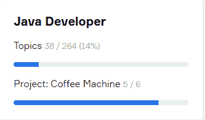
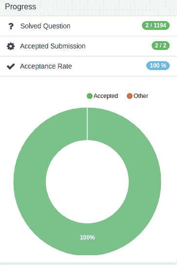

# 我成为软件工程师之旅的开始-第 0 周

> 原文：<https://dev.to/ddbull/start-of-my-journey-to-becoming-software-engineer-week-0-48me>

## [T1】简介](#intro)

你好！我叫道伦，26 岁，来自哈萨克斯坦的阿特劳。婚姻幸福，我有一个 10 个月大的非常棒的女儿！我在家乡的诺名大学获得了石油工程的本科学位，在过去的三年里我一直是一名化学工程师。

今年夏天，我意识到我不喜欢目前的职业，不想用余生去追求自己根本不喜欢的东西。我确实意识到，软件工程并不总是有趣和令人兴奋的项目，但像其他工作一样，也有日常和无聊的任务。但是我做的最有趣的事也能为你赚钱的是编码！

在高中(8-9 年前),我在编程竞赛中表现不错——leet code 类型，主要是数学和算法。甚至和我的团队在高中生中赢得了一些国际比赛(我的一个队友目前在谷歌工作)。但是高中毕业后，除了大学里的几门编程课程，我就没怎么写过代码了。上个月我又开始编程，主要是前端，还从 Coursera 获得了 2 个 Python 入门课程的证书。目前，我喜欢 Java，并试图学习后端的东西。

我是在阅读某个俄罗斯人的每周日记时受到启发的，他在全职工作的同时，从低薪的销售工作转行到没有编程背景的前端开发人员。从第一周开始，他就发布详细的周报告和下周的计划。4-5 个月后，他得到了第一份工作，是初级前端开发人员。看到他简单简短的每周报告和一段时间以来的进步，我个人在网上看到了成千上万篇关于最终结果的文章。他用来记录旅程的网站非常受欢迎，但不是 IT 相关的。他很少得到评论。我认为这个网站更合适，欢迎您的评论和反馈！:)

## 目标

**长期:**以软件工程师的身份合法移民美国/加拿大
**中期:**获得 Oracle Java 程序员 SE I 认证- *我需要设定截止日期*
**短期:**完成杜克大学的《Java 编程与软件工程基础》课程共 5 门课程，*我目前获得了前两门课程的经济资助*

### 待办事项 9 月 17 日至 23 日(第一周)

**1)日常体育锻炼**
**2)每天在 leetcode**
**上解决 1 个问题 3)完成第 1 周-课程# 1 JavaScript、HTML 和 CSS 的编程基础**
**4)完成第 1 周-课程#2 Java 编程:用软件解决问题**
**5)完成 JetBrains Academy 上的 CoffeeMachine 项目**
**6)完成 JetBrains Academy 上的一个更简单的项目**

我在 JetBrains 学院的最新进展:

我目前在 leetcode.com 的进展*(昨天注册)*:

我轮流工作，28 天轮班，28 天非轮班。我目前轮班，每天可以学习 5-6 个小时。我想每天学习 10-12 个小时，但是现实生活中的事情现在不允许这样做。我不想一开始就很沉重，然后半途而废，这就是为什么第一周的待办事项清单如此的轻而短

很抱歉上面的混乱，我希望我的第一篇文章看起来有有趣的图片和智能电子表格，但如果我的目标是这样，我会永远推迟它:)