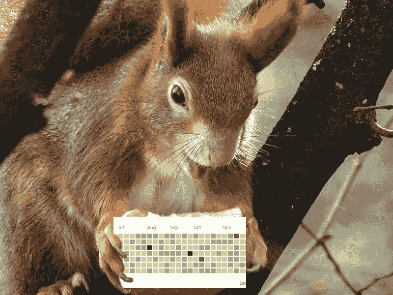
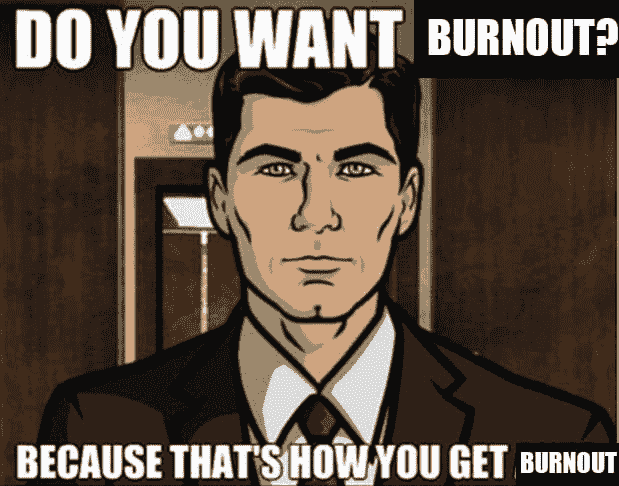

# 在项目中保持动力:一种范式转变

> 原文：<https://dev.to/ctrlshifti/staying-motivated-when-working-on-projects-a-paradigm-shift-3kp4>

自从我开始我的技术生涯以来，拿起项目，狂热地工作，然后几周后完全忘记它们已经成为我的一个问题。我经常把自己比作科技版的西西弗斯——只不过我的运动量要少得多。

最近，我开始着手一个我非常热爱的项目。我想不出还有什么比完成它更让我开心的了。

问题？我至少要花半年时间才能完成。如果我能专注一件事半个月以上，我就很幸运了。

我决定，我热爱这个项目的想法，终于做一些真正的关于我的动机问题。通常的自助文章这次不会成功。

我预约了一个治疗师，完全期待着以 120%的动力结束疗程。动力会从我身体的每一个毛孔中渗出。我所有的程序员朋友都会说“是的，那是 Kat，她是有动力的人”。在一位专业人士的帮助下——从他漂亮的沙发和墙上的证书来看，他不像我，是一个真正的成年人——我解开了永恒的、坚定不移的动力的秘密。

当然，我没有。但是我得到了很多其他的建议，在采纳了这些建议之后，我肯定在我的开发习惯上看到了更好的结果。

在这篇文章中，我将整理我得到的大部分建议，这样你就可以在不花 100 美元的情况下获得治疗的好处。你可以以后再谢我。

所以第一步是...

### 拥抱无聊

问题不仅仅是在项目开始后我失去了动力，而是在最初的挑战后我开始对项目感到厌倦。我对无聊的厌恶是如此强烈，以至于我不想继续下去。我*可能*动力通过它——我只是真的，真的不想。

不幸的是，无聊是一个计时器，从你写下第一行代码的那一刻开始计时。你无法阻止它。你是一个程序员，无聊就要来找你了。

虽然我断言成为一名程序员不是一种个性类型，但我们都有一个共同点:我们寻求新奇。我们喜欢使用闪亮的新技术。但是有光泽的东西的问题是，当你把脏手放在它们上面的时候，它们就不再有光泽了。如果你和我一样，一旦某件事让你厌烦，你就会停止工作。

但是如果你这样做——我知道你会这样做——你就是在为失败给你的大脑布线。通过避免无聊，你没有锻炼你的大脑处理无聊的能力——这会产生一个反馈循环，让你在下次遇到无聊时更加害怕。

唯一的办法就是拥抱它。下一次，一些事情开始让你厌烦，把它看作是进步的标志，而不是跳到一个新的项目。第一次尝试并不容易，但随着时间的推移，尽管厌倦，你会学会茁壮成长。就像动力曾经离开一样，一旦你开始看到你努力工作的所有成果，它最终会回来的。

与此同时，你可以通过以下方式减缓即将到来的无聊...

### 改变方向

除非你的项目很小——在这种情况下，你为什么还没有完成呢？-那么它可能不止有一个组成部分。

比如我目前在做 gamedev。当我做了太多编码后，我会切换到 3D 建模。然后我会休息一段时间去做世界建设，然后写作，然后再回到编码。

花些时间考虑一下如何将您的项目分成不同但可并行的组件。把它们分开，从现在最让你兴奋的开始，稍后再回到其他的。

这样做的好处是，同时处理组件可以让你拖延足够长的时间来获得一些结果。一旦你有了结果，当你在不可避免的黑暗中慢慢爬行时，回顾这些结果将成为你的第一资产。像一只小编码松鼠一样，储存进步为冬天做准备(冬天是无聊的)。

T3】

既然您已经将项目分割成不同的组件，接下来您可以做的是...

### 用能让你兴奋的组件替换不能让你兴奋的组件

如果你知道你的项目中有你害怕的部分，看看你是否能重做它。也许你可以用一个更新鲜、更令人兴奋的框架来代替。花些时间去探索更有趣的做事方式吧！

一旦你在你的项目上工作了一段时间，你就会积累动力。气势惊人！这是一种令人陶醉的感觉。所以当我说-

的时候你可能会恨我

### 扼杀你的动力

你认为我想写这篇博文吗？当然不。我要去打比赛，该死的。不要打扰我。

我得到的最违背直觉、最令人恼火的建议是，告诉我要扼杀我的动力，经常中断我的项目。但是我的动力是一根拐杖。我非常不确定自己是否有能力继续致力于一个项目，以至于当我得到任何动力的时候，我会尽一切可能不放弃。我熬夜，推脱朋友，放弃其他承诺。

T3】

当然，我们都知道那会给你带来什么。虽然你可以从无聊中获得力量，但你不能从疲惫中获得力量。当你发现自己过于沉迷时，从你的项目中抽身去做其他的事情。

我知道我听起来像个疯女人，因为到目前为止，我几乎一直告诉你，当你不想工作的时候就去做你的项目，当你想工作的时候就把你的项目放在一边。如果你感到不安，我能理解，所以你可以通过@kathyra_ 把你所有的仇恨邮件发给我。

但这样做的重点是确保你的项目是由你控制的，而不是你的冲动。你不应该让无聊让你放弃你的工作，你也不应该让工作过于狂热而导致精疲力竭。保持动力，但最重要的是，保持理智。

但是如果你真的很难从工作中抽身出来，这里有一个很好的方法可以让你休息一下

### 抽出一些时间与社区分享您的项目！

人们说你应该成为自己的啦啦队员。

去他妈的。你见过啦啦队员进球吗？或者是一个挥舞着绒球的运动员？那是两种不同的工作，同时做这两种工作只是...不容易。在你的项目中会有一些时候你会感到疲倦和没有动力，并且不可能面带微笑地继续下去。

这就是为什么开发人员社区在这里提供帮助！我们是来做你的啦啦队员的。当*你*对你的项目不再感到兴奋时，让*我们*为你感到兴奋。

考虑与 Twitter 开发人员社区分享您的项目进展，并在 dev.to 上写关于它的帖子。除了从开发人员社区获得持续支持，这还可以帮助您为您的项目建立追随者，以便在项目发布后有更多人看到它！

当然了...

### 接受动机的死亡

动机让你开始一个项目，但它不会让你坚持到最后。问“我如何保持动力？”就像问“我怎样才能快乐？”。它是来来去去的东西，当它在的时候你应该欣赏它，但当它不在的时候你也要学会充分利用它。

总结一下:

*   接受无聊是进步的标志
*   将您的项目分成可并行化的组件，并在它们之间切换，以保持新颖
*   找到无聊部分的有趣替代品
*   不要依赖势头
*   与社区分享您的进步

### 保持联系！

喜欢我的帖子吗？查看我的推特！我会开些糟糕的玩笑，把重要的社会问题简化成幼稚的讽刺，偶尔还会大声抱怨科技。

想要技术吗？订阅我的电子邮件列表，以便在发布新帖子时获得通知！

*本帖最初发表于[explainhownow.com](https://www.explainhownow.com/)T3】*