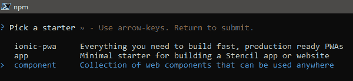

# 作为设计系统工具的模板。

> 原文：<https://dev.to/newtonmunene_yg/stencil-as-a-design-system-tool-3886>

## 简介

如果你是一名产品设计师，你可能听说过设计系统。这是你所在领域的一个重要方面。一些前端开发人员已经知道什么是设计系统，并且可能正在使用它们。我们都见过像谷歌、优步、Airbnb 这样的公司谈论设计系统，我们经常会想，到底有什么好大惊小怪的。

设计系统是使用严格的指导方针和清晰的标准构建的一组/一组组件。根据 [Stencil Js](https://stenciljs.com/docs/what-is-design-system) 的说法，设计系统(DS 从现在开始)由 UI 组件和清晰定义的视觉风格组成，作为代码实现和设计产品发布。当被所有产品团队采用时，一个更有凝聚力的客户体验就出现了。我们来分析一下。

作为公司设计团队的一员，你坐下来讨论下一个产品的设计。你很快意识到，你的下一个产品将不会像你之前的产品一样有视觉吸引力，你之前的产品看起来一点也不像你的第一个产品。这里的问题是你的设计不一致。移动团队正在创造与 web 团队完全不同的东西。这就是设计系统发挥作用的地方。对你的数字产品应该是什么样子有一个清晰的指导方针是非常重要的。原因如下:

#### 1。节省时间

当您已经实现了 DS 时，您就省去了为产品起草设计和模型的时间。当你已经有了可以参考的东西时，一切都会进展得很快。

#### 2。流畅的设计

人类的大脑在熟悉的环境中会自动感到舒适。我们以一个 logo 为例。当一个人看到一个他们熟悉的标志时，他们会立即认出与之相关的实体。和 Google 的材质设计或者 bootstrap 一样。同样的，如果你的产品有一致的设计，用户会立刻产生共鸣。

#### 3。维护

因为组件是模块化的和可重用的，所以维护产品的设计很容易。您只需更新组件，而不必钻研混乱的 javascript 代码。我们有时都会写出混乱的代码。

这只是隐喻的冰山一角。我让你上钩了吗？以下是实现 DS 的方法。

#### 1。评估你当前的设计。

看看你目前的设计，决定你想保留什么，想放弃什么。在此过程中，添加任何其他缺失的内容。

#### 2。实施设计语言/指南。

这包括颜色、字体和版式、间距和边距、形状等。比如圆角，一些独特的字体，5 px 的边距，黄色？实现它。

#### 3。决定一个模式。

你已经有了你想保留的东西和一种设计语言。现在就一个模式达成一致:行动按钮、活动和非活动元素、元素的位置、字体大小等等。

#### 4。记录您的组件。

很多人会使用你的 DS，所以要确保文档是容易理解和全面的。

是时候摆脱无聊了。让我们进入正题。

## 模版 Js

这是由 Ionic 的团队创建的一个工具，帮助他们在内部为 Ionic 框架构建 web 组件。他们最终意识到 Stencil 的潜力，并向公众开放。它是一个创建 web 组件甚至整个 web 应用程序的工具。与现在通用的 Ionic 4 配合使用(由于 stencil js，可以与任何 javascript 框架一起工作，或者根本不用框架)，您可以构建一个完全优化的渐进式 Web 应用程序。我不会在这篇文章中深入讨论 web 组件，但它们正是 Stencil 要实现的目标。我从测试早期就开始使用 Stencil，就在昨天，2019 年 6 月 6 日，他们发布了 stencil one🎊🎉🎆。在他们的博客【https://blog.ionicframework.com/[上了解更多信息。](https://ionicframework.com/blog/introducing-stencil-one-1-0-0/)

### 先决条件

*   NPM 6 或更高版本

### 我们开始吧。

启动你的终端💻并运行:

```
npm init stencil 
```

Enter fullscreen mode Exit fullscreen mode

您将会看到一个提示，让您选择想要的项目类型并为其命名。

[](https://res.cloudinary.com/practicaldev/image/fetch/s--RJj0yIKM--/c_limit%2Cf_auto%2Cfl_progressive%2Cq_auto%2Cw_880/https://cdn.hashnode.com/res/hashnode/image/upload/v1559894932578/jQkoZ4u7i.png)

我想做一个简单的 web 组件。选择它并给它一个名字。我把我的叫做`ds-tutorial`。`cd`进入你的项目。

```
cd ds-tutorial 
```

Enter fullscreen mode Exit fullscreen mode

这里有很多文件和文件夹，让我们看看哪些是重要的。

1.  src——这是你的工作目录，你的应用程序在这里，这是你写大部分代码的地方。
2.  src/components -这是您的组件所在的位置。那里已经有一个默认组件了。
3.  这是你的应用程序的入口 html 文件。打开它，你会发现上面提到的默认组件使用。
4.  定义包提供者和模板使用的依赖关系和其他一些有用的信息。
5.  这包含了你的模板项目的配置。你可以添加服务人员、插件、生成文档等等。点击阅读更多信息

剩下的你一定很熟悉。模板使用 TSX，这是 JSX 类型。JSX 是 javascript 的语法扩展，在 React 中很常见。它不应该吓跑你。使用起来相当简单。它允许我们在 javascript 文件中编写 HTML。

在文本编辑器中打开您的项目。Visual Studio 代码有很棒的语法突出显示和工具。导航至`src/components/my-component/my-component.tsx`并将代码更改为

```
import { Component, Prop, h } from '@stencil/core';

@Component({
  tag: 'my-component',
  styleUrl: 'my-component.css',
  shadow: true
})
export class MyComponent {
  /**
   * Your name
   */
  @Prop() name: string;

  render() {
    return <div>Hello, World! I'm {this.name }</div>;
  }
} 
```

Enter fullscreen mode Exit fullscreen mode

这里有几个。如果你以前用过 angular，你会对 decorators 很熟悉。

```
@Component({
  tag: 'my-component',
  styleUrl: 'my-component.css',
  shadow: true
}) 
```

Enter fullscreen mode Exit fullscreen mode

这个装饰器向模板编译器提供关于组件的元数据。我不会进入细节，但你可以研究装修工。

*   定义你的 web 组件的 HTML 标签。
*   `styleUrl`定义样式表的路径。
*   确定你的组件是否使用原生的 shadow-dom 封装。

在你的班级里，有另一个装饰者

```
@Prop() name: string; 
```

Enter fullscreen mode Exit fullscreen mode

这个装饰器定义了应该传递给组件的属性。将这些属性视为属性。这里有很多其他的装饰者，你可以在这里阅读。

最后是渲染功能。该函数输出将被绘制到屏幕上的组件树。

```
render() {
    return <div>Hello, World! I'm {this.name }</div>;
  } 
```

Enter fullscreen mode Exit fullscreen mode

保存这个文件并打开`src/index.html`
就在打开 body 标签之后，你会找到你的组件。确保标签与您的`my-component.tsx`文件中的标签相匹配。

```
 <my-component name="Your Name"></my-component> 
```

Enter fullscreen mode Exit fullscreen mode

记住名称属性，就像一个正常的属性权利😃？保存此文件并返回到您的控制台。确保您在项目的根目录中，并运行:

```
npm start 
```

Enter fullscreen mode Exit fullscreen mode

现在看奇迹发生。尝试更改`index.html`中 name 属性的值并保存。看看会发生什么。这些变化会立即反映出来。而且速度非常快。现在给`src/components/my-component/my-component.css`加一些造型，看。摆弄这三个文件。当你完成后，到控制台运行:

```
npm run build 
```

Enter fullscreen mode Exit fullscreen mode

这将构建用于生产的组件，并将其保存在 dist 文件夹中。您可以在`stencil.config.js`中对此进行更改。你现在可以把它发布到 NPM 或其他地方。在 components 文件夹中再添加一些组件，您就有了一个 web 组件的集合，一个设计系统😀。Stencil 在后台处理所有困难的事情，因此您可以专注于简单的事情。

### 敲定

您可以随时访问 stencil 网站，了解更高级的概念和用法。这只是让你开始使用模板。使用模板，您可以做更多的事情。我还不到 stencil 功能的四分之一。尝试一下，将你的想象力发挥到极致。