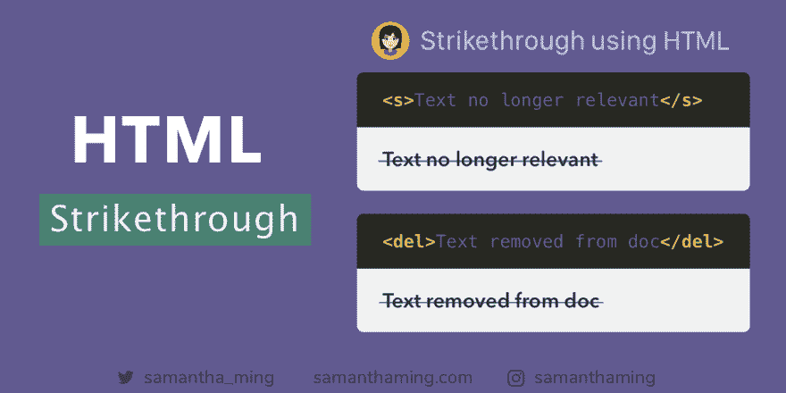

# 使用 HTML5 删除线

> 原文：<https://dev.to/samanthaming/strikethrough-using-html5-3b9h>

[](https://res.cloudinary.com/practicaldev/image/fetch/s--lA7_-18A--/c_limit%2Cf_auto%2Cfl_progressive%2Cq_auto%2Cw_880/https://thepracticaldev.s3.amazonaws.com/i/muwt6sg10m46w8ls0fl5.png)

CSS 非常适合样式化，但是不太适合提供内容的含义。这就是 HTML 语义标签的用途。当你试图删除内容时，通常是有原因的。这个原因可以用合适的 HTML 标签来描述。使用`<del>`或`<s>`来传达，并赋予你的代码语义含义🙌

```
<s>Text no longer relevant</s> 
```

> 不再相关的文本

```
<del>Text removed from document</del> 
```

> ~~从文档中删除的文本~~

## `<s>` vs `<del>`

是的，它们都是删除线。然而，它们传达了关于内容的不同含义。因此它们是不可互换的。你要选择一个能反映你想要达到的目标的。先说定义。

### `<s>`

> 当你试图表现不再相关或不再准确的事物时，使用这个。

✅价格折扣就是一个很好的例子

```
<p><s>$100</s></p>
<p>$999.99</p> 
```

> 特价出售！
> 
> 100 美元
> 899 美元

❌然而，这个标签不应该在指示文档编辑时使用。这就是`<del>`的用武之地。

### `<del>`

> 当您想要指出从文件中删除了某些内容时，请使用此选项

✅这方面的一个很好的例子是对于 Todo List

```
<p>TODO</p>

<ul>
  <li><del>Get a Job</del></li>
  <li>Become a Senior Developer</li>
</ul> 
```

> 待办事项
> 
> *   ~~找份工作~~
> *   成为高级开发人员

### 规则

以下是我如何记住使用哪个的方法。如果内容代表删除的内容，使用`<del>`。对于所有其他情况，使用`<s>`👍

* * *

## [用](#using-raw-ltdelgt-endraw-with-raw-ltinsgt-endraw-)搭配`<ins>`用`<del>`

这里是我认为`<del>`真正闪光的地方。您可以将其与`<ins>`配对，并一起使用它们来创建一个界面，以跟踪和记录文档中发生的更改。

### 示例:文本编辑器

```
<p>My name is
  <del>Smanta</del>
  <ins>Samantha</ins>
</p> 
```

> 我的名字是萨曼莎

### 举例:Git 接口

```
<table>
  <tr>
    <td><del>+ function TEA() {</del></td>
    <td><ins>- function tea() {</ins></td>
  </tr>
</table> 
```

> + ~~功能茶(){~~ -功能茶(){

* * *

## `<strike>`

你可能见过`<strike>`标签。这实际上是 HTML4 中不赞成使用的旧标签。它被 HTML5 中引入的语义更合适的`<s>`和`<del>`标签所取代。

`<del>`和`<s>`得到了很好的支持，甚至在 Internet Explorer 中也是如此。尽管一些浏览器可能仍然支持`<strike>`标签，但最好避免使用🙅‍♀️

* * *

## 无障碍关注

不幸的是，这些特殊的标签不会被大多数屏幕阅读器读取。但是你可以使用`::before`和`::after`属性来声明它。然而，最好不要滥用这种技术，因为有些人故意禁止宣布会产生冗长✨的内容

**`<del>`**T3】

```
del::before,
del::after {
  clip-path: inset(100%);
  clip: rect(1px, 1px, 1px, 1px);
  height: 1px;
  overflow: hidden;
  position: absolute;
  white-space: nowrap;
  width: 1px;
}

del::before {
  content: " [deletion start] ";
}

del::after {
  content: " [deletion end] ";
}

/* MDN */ 
```

**`<s>`**T3】

```
s::before, 
s::after {
  clip-path: inset(100%);
  clip: rect(1px, 1px, 1px, 1px);
  height: 1px;
  overflow: hidden;
  position: absolute;
  white-space: nowrap;
  width: 1px;
}

s::before {
  content: " [start of stricken text] ";
}

s::after {
  content: " [end of stricken text] ";
}

/* MDN */ 
```

* * *

## 社区输入

**💬你见过的 HTML 删除线用例有哪些？**我们来看看社区怎么说的👀

*   *[@its4zahoor](https://twitter.com/its4zahoor/status/1147644230409555969) :* 我在产品促销画面的价格折扣中见过很多。案例:真价实销&显示打折一期

*   [@jamielarchin__](https://twitter.com/jamielarchin__/status/1147768705687969792) :在有密码字段的账户创建表单中，列出密码要求，然后在用户完成每一项后删除。

*   *[@kotpes](https://twitter.com/kotpes/status/1147709273503338496) :* 聊天应用

*   *[@ultrasamad](https://twitter.com/ultrasamad/status/1147751037127839744) :* 在已完成的待办事项中看到

* * *

## 资源

*   [MDN Web Docs: del >](https://developer.mozilla.org/en-US/docs/Web/HTML/Element/del)
*   [MDN 网络文档:s](https://developer.mozilla.org/en-US/docs/Web/HTML/Element/s)
*   [堆栈溢出:s vs del](https://stackoverflow.com/questions/52113995/s-vs-del-in-html)
*   [堆栈溢出:HTML 中 s 和 del 之间的差异](https://stackoverflow.com/questions/16743581/what-is-the-difference-between-s-and-del-in-html-and-do-they-affect-website)
*   [HTML5 Doctor:比较和对比 ins、del 和 s](http://html5doctor.com/ins-del-s/)

* * *

**感谢阅读❤**
问好！[insta gram](https://www.instagram.com/samanthaming/)|[Twitter](https://twitter.com/samantha_ming)|[脸书](https://www.facebook.com/hisamanthaming) | [博客](https://www.samanthaming.com/blog)|[SamanthaMing.com](https://www.samanthaming.com/)