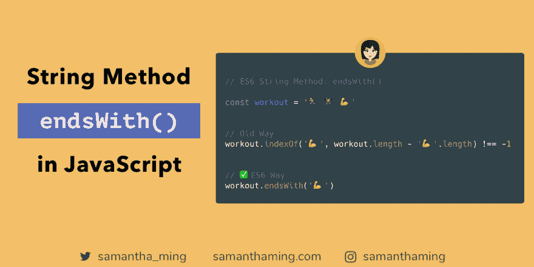

# JavaScript 中的 String endsWith()方法

> 原文：<https://dev.to/samanthaming/string-endswith-method-in-javascript-o98>

[](https://res.cloudinary.com/practicaldev/image/fetch/s--xcsHZFLI--/c_limit%2Cf_auto%2Cfl_progressive%2Cq_auto%2Cw_880/https://thepracticaldev.s3.amazonaws.com/i/2gn204ny6yrvlezfnp6z.png)

需要知道一个字符串是否以什么结尾？简单，使用#ES6 "endsWith "方法。你甚至不需要成为一个开发者，你就能猜到发生了什么。让一门语言更容易被人理解无疑是一条正确的道路💪

```
const workout = '🏃 🏋️ 💪';

// Old Way
workout.indexOf('💪', workout.length - '💪'.length) !== -1;
// true

// ✅ES6 Way
workout.endsWith('💪');
// true 
```

## 参数

`endsWith`方法接受两个参数:

1.  搜索值
2.  长度

### 1。搜索值

这是必填字段。这里是您传递搜索值的地方。这可以是单个字符或更长。让我们看一些例子

**单字符**

```
const name = 'Samantha Ming';

name.endsWith('g'); // true
name.endsWith('n'); // false 
```

**多重人物**

```
const name = 'Samantha Ming';

name.endsWith('ing'); // true
name.endsWith('in'); // false 
```

**多个单词**

```
const name = 'Samantha Ming';

name.endsWith('tha Ming'); // true
name.endsWith('tha M'); // false 
```

### 2。长度

您可以在这里指定想要搜索的字符串的长度。当我第一次读到这个的时候，我很困惑。所以让我们试着理解长度在这里做什么。

首先，我想让你知道我名字的长度。

```
console.log('Samantha'.length); // 8
// The last character is 'a' 
```

现在让我们利用长度参数。

```
const name = 'Samantha Ming';

name.endsWith('a', 8); // true 
```

☝️So:当我说`8`时，我是在告诉`endsWith`抓取`name`字符串的前 8 个字符(从左到右)。在这种情况下，字符串的前 8 个字符。这将是我们用`endsWith`搜索的字符串。

上面的例子类似于这样做:

```
const name = 'Samantha';

name.endsWith('a'); // true 
```

之所以说一开始很困惑，是因为我把自己对`startsWith`的认识拉了过来，这里第二个参数是起始索引。所以我假设带有`endsWith`的第二个参数将遵循相同的模式，它将是反向结束索引😅这就是为什么人们总是说，永远不要“假设”。就在你以为你知道的时候，其实你并不知道。所以要谦虚，永远保持学生心态🤓

如果你感兴趣，这里是我对`startsWith`的代码注释:

[代码注释:以](https://www.samanthaming.com/tidbits/67-es6-startswith-method)开始

## 区分大小写

这里有一个和`startsWith`类似的知识。`endsWith`方法也区分大小写。

```
const name = 'Samantha Ming';

name.endsWith('G'); // false
name.endsWith('g'); // true 
```

## 浏览器支持

浏览器支持太棒了！如果不算 ie 的话😅(对不起，伙计们，但我肯定那里没有什么大的震动😂)

[浏览器支持:endsWith](https://developer.mozilla.org/en-US/docs/Web/JavaScript/Reference/Global_Objects/String/endsWith#Browser_compatibility)

但是没有问题，这里有 polyfill，所以你可以安全地使用`endsWith`,并且在 IE 中支持它。

[MDN Polyfill: endsWith](https://developer.mozilla.org/en-US/docs/Web/JavaScript/Reference/Global_Objects/String/endsWith#Polyfill)

顺便说一句，如果你对 Polyfill 是什么有点困惑。这是泰勒·麦金尼斯的一个非常好的视频。

[用巴别塔编译 vs Polyfills(JavaScript)](https://youtu.be/BXoiuN1a0-E)

## 社区输入

💬你还知道哪些老办法？

**使用正则表达式**

*[@maxstalker](https://twitter.com/MaxStalker/status/1160299155379707914?s=20) :* 我可以用一些咖喱助手函数和一些 regexp
来支持老方法

```
const startsWith = pattern => string =>
  new RegExp(`^${pattern}.*`).test(string);

const endsWith = pattern => string => new RegExp(`.*${pattern}$`).test(string);

const sports = "🏈🎳⛳⛸";
console.log(startsWith("🏈")(sports)); // true
console.log(startsWith("⛸")(sports)); // false

console.log(endsWith("🏈")(sports)); // false
console.log(endsWith("⛸")(sports)); // true 
```

*[@maxstalker](https://twitter.com/MaxStalker/status/1160299155379707914?s=20) :* 或者略短的版本，需要的时候可以内联:

```
const sports = "🏈🎳⛳⛸";

// startsWith
console.log(/^🎳.*/.test(sports)); // false
console.log(/^🏈.*/.test(sports)); // true

// endsWith
console.log(/.*🎳$/.test(sports)); // false
console.log(/.*⛸$/.test(sports)); // true 
```

**使用`slice`**

*[@maxstalker](https://twitter.com/MaxStalker/status/1160653700454637568?s=20) :* 另一种——有点复杂，可能更理论化——的方法是比较部分字符串:

```
const sports = "⛳🎳🏈⚽🎾";
const startPattern = "⛳";
const endPattern = "⚽🎾";

//startsWith
console.log(sports.slice(0, startPattern.length) === "wrong!"); // false
console.log(sports.slice(0, startPattern.length) === startPattern); // true

// endsWith
console.log(sports.slice(-endPattern.length) === "wrong!"); // false
console.log(sports.slice(-endPattern.length) === endPattern); // true 
```

**使用`lastIndexOf`**

```
const workout = '🏃 🏋️ 💪';

workout.lastIndexOf('💪') === workout.length - '💪'.length;
// true 
```

## 资源

*   [MDN Web Docs:end with](https://developer.mozilla.org/en-US/docs/Web/JavaScript/Reference/Global_Objects/String/endsWith)
*   [堆栈溢出:JavaScript 中的 endsWith](https://stackoverflow.com/questions/280634/endswith-in-javascript)
*   [用 JavaScript](https://clubmate.fi/check-if-string-starts-with-or-ends-with-a-given-string-with-javascript/) 检查字符串是以给定的字符串开始还是结束
*   [字符串 startswith，endswith，包含实现](https://siongui.github.io/2012/09/27/javascript-string-startswith-endswith-contains/)
*   [JavaScript 中确定字符串结尾的两种方法](https://www.freecodecamp.org/news/two-ways-to-confirm-the-ending-of-a-string-in-javascript-62b4677034ac/)

* * *

**感谢阅读❤**
问好！[insta gram](https://www.instagram.com/samanthaming/)|[Twitter](https://twitter.com/samantha_ming)|[脸书](https://www.facebook.com/hisamanthaming) | [博客](https://www.samanthaming.com/blog)|[SamanthaMing.com](https://www.samanthaming.com/)