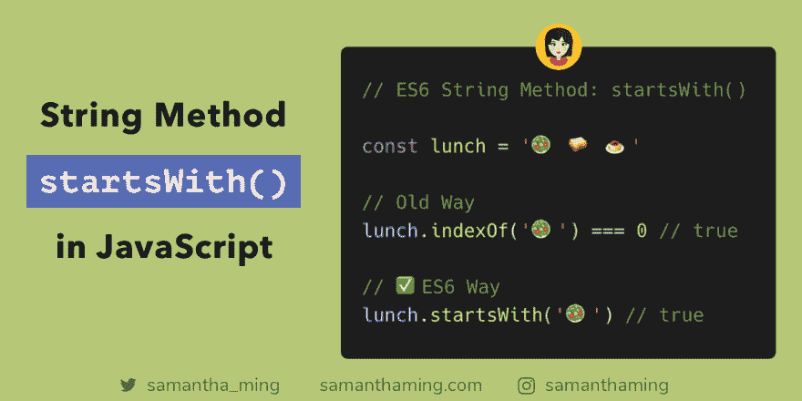

# JavaScript 中的 String startsWith()方法

> 原文：<https://dev.to/samanthaming/string-startswith-method-in-javascript-1m81>

[](https://res.cloudinary.com/practicaldev/image/fetch/s--L7Y16oqk--/c_limit%2Cf_auto%2Cfl_progressive%2Cq_auto%2Cw_880/https://thepracticaldev.s3.amazonaws.com/i/xfluwenv5wb48tsjbjee.png)

如果你需要检查一个字符串是否以另一个字符串开始，使用 ES6 的`startsWith`方法。我真的很喜欢这个方法，因为直觉上它很全面。即使你不知道有任何技术背景，仅仅通过阅读代码，你可以更容易地推断出与`indexOf`相比发生了什么🤓

我非常喜欢 JavaScript 的发展方向。不仅仅是介绍所有这些有用的方法，而是让语言变得更易于人类阅读。这就是我们如何让科技变得更易接近。让它更容易学习。爱死了！😍

```
const lunch = '🥗 🥪 🍮'

// Old Way
lunch.indexOf('🥗') === 0 // true

// ✅ ES6 Way
lunch.startsWith('🥗') // true 
```

## `startsWith`()参数

`startsWith`方法接受两个参数:

1.  搜索值
2.  起始索引

### 1。搜索值

这是必填字段。这里是您传递搜索值的地方。这可以是单个字符或更长。让我们看一些例子

#### 单字符

```
const name = 'Samantha Ming';

name.startsWith('S'); // true
name.startsWith('M'); // false 
```

#### 多个字符

```
const name = 'Samantha Ming';

name.startsWith('Sam'); // true
name.startsWith('Min'); // false 
```

#### 多个单词

```
const name = 'Samantha Ming';

name.startsWith('Samantha M'); // true
name.startsWith('antha Min'); // false 
```

#### 整串

```
const name = 'Samantha Ming';

name.startsWith('Samantha Ming'); // true 
```

#### 超过字符串长度

```
const name = 'Samantha Ming';

name.startsWith('Samantha Ming is the best'); // false ← 😅 
```

### 2。起始索引

所以默认情况下，你的起始索引是`0`。但是有了这个参数，就可以让它从不同的起始位置开始。让我们来看几个例子。

#### 默认指数(0)

```
const name = 'Samantha Ming';

name.startsWith('S'); // true
name.startsWith('S', 0); // true 
```

#### 从第 1 个索引开始

对于编程新手来说。请注意，JavaScript 是零基础的。意味着计数从`0`开始。所以第一个字符在`0`索引处，第二个字符在`1`索引处🤓

```
const name = 'Samantha Ming';

name.startsWith('am', 1); // true
name.startsWith('am'); // false 
```

#### 从第 2 个索引开始

按照我们从零开始的计数，第二个索引等于第三个字符。

```
const name = 'Samantha Ming';

name.startsWith('ma', 2); // true
name.startsWith('ma'); // false 
```

#### 负起始指数

所以负指数不行。我试图聪明地测试负索引是否会像`slice()`一样工作，如果你传递一个负索引，它将是最后一个字符。再次证明，不要以为你能智胜 JavaScript😂

```
const name = 'Samantha Ming';

name.startsWith('g', -1); // false 
```

我猜这就是`endsWith`的作用。我将在未来的花絮中对此进行报道😜

## 区分大小写

需要记住的一件重要事情是`startWith`方法是区分大小写的。

```
const name = 'Samantha Ming';

name.startsWith('sam'); // false 
```

## 浏览器支持

这是所有现代浏览器都支持的。除了....我肯定你猜到了——没有网络浏览器😑。你需要使用 Polyfill 或者像 Babel 这样的编译器。

[浏览器支持](https://developer.mozilla.org/en-US/docs/Web/JavaScript/Reference/Global_Objects/String/startsWith#Browser_compatibility)

## 社区输入

💬你知道的检查字符串是否以某个字母开头的其他方法有哪些？

这是我问社区的问题。有一些非常好的。让我们来看看👀

### 使用搜索

```
const lunch = '🥗🥪☕️';
const search = '🥗';
lunch.slice(0, search.length) === search; 
```

*感谢:[@亚伯拉罕](https://twitter.com/abraham/status/1145064091674914816)T3】*

### 使用正则表达式

```
'some string'.match(/^some/);

// OR
(/^some/).test('some string'); 
```

*感谢:[@ CPT _ silver fox](https://twitter.com/cpt_silverfox/status/1145056609824956416)T3】*

### 使用括号

如果你只是检查一个单数字符，你可以试试这个。但是请注意，当你有超过字符(即。hel)，这个方法不行。

```
const word = 'hello';

word[0] === 'h'; 
```

*感谢:[@中微子 2211](https://twitter.com/neutrino2211/status/1145122176435142656)T3】*

### 性能检查

*[@gwardwell](https://twitter.com/gwardwell/status/1145434844362620929) :* 这里有一个这样的测试(在 JSPerf 上找到的，不是我写的)可以表明`indexOf`把`startsWith`吹走了。

*   [jsPerf: starsWith](https://jsperf.com/string-startswith/62)

## 资源

*   [MDN Web 文档:开始于](https://developer.mozilla.org/en-US/docs/Web/JavaScript/Reference/Global_Objects/String/startsWith)
*   [w3schools:开始于](https://www.w3schools.com/jsref/jsref_startswith.asp)
*   [堆栈溢出:如何检查一个字符串是否以另一个字符串“开头”？](https://stackoverflow.com/questions/646628/how-to-check-if-a-string-startswith-another-string)
*   [如何在 JavaScript 中检查一个字符串是否以另一个开始](https://flaviocopes.com/how-to-check-string-starts-with/)

* * *

**感谢阅读❤**
问好！[insta gram](https://www.instagram.com/samanthaming/)|[Twitter](https://twitter.com/samantha_ming)|[脸书](https://www.facebook.com/hisamanthaming) | [博客](https://www.samanthaming.com/blog)|[SamanthaMing.com](https://www.samanthaming.com/)