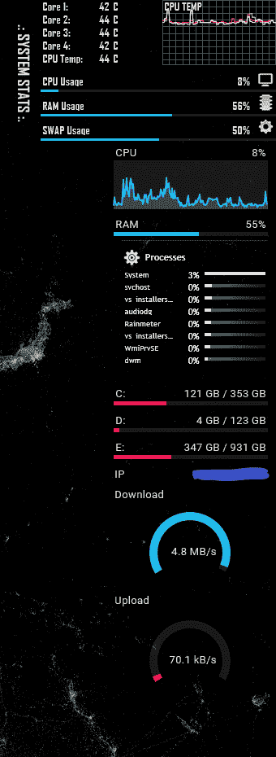

# 使用雨量计一目了然的机器信息

> 原文：<https://dev.to/llotz/style-your-windows-desktop-with-rainmeter-394g>

# 什么是雨量计？

Rainmeter 是一个 windows 应用程序，它允许您在桌面上添加一个包含您想要的任何信息的层。您可以添加应用程序启动器并安装预定义的用户皮肤。有一个不错的社区一直在提供新的皮肤。

# 什么样子？

你想要的方式。我设计它来显示我的工作站的信息。

特别是当我运行一个本地测试环境或者编译东西的时候，我希望能够一目了然地看到我的工作机器的所有信息，而不需要到处查看 taskmanager 之类的东西。雨量计是高度可定制的，性能相当好(正如你在截图中看到的)

要获得更多信息和皮肤，请看

*   [首页](https://www.rainmeter.net/)
*   [为皮肤设计的魔鬼艺术](https://www.deviantart.com/rainmeter/gallery/23941137/Skins)
*   [用户展示其构建的子编辑](https://www.reddit.com/r/Rainmeter/)