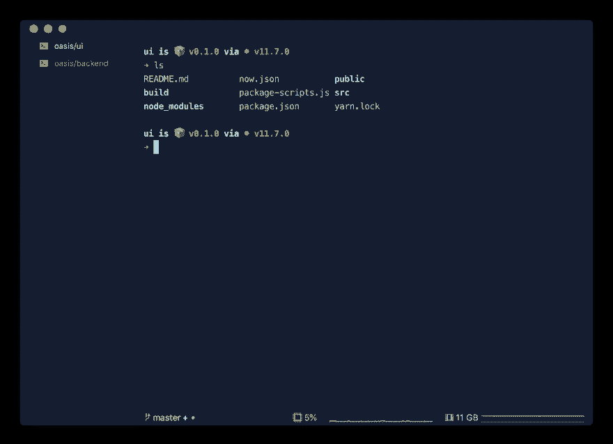
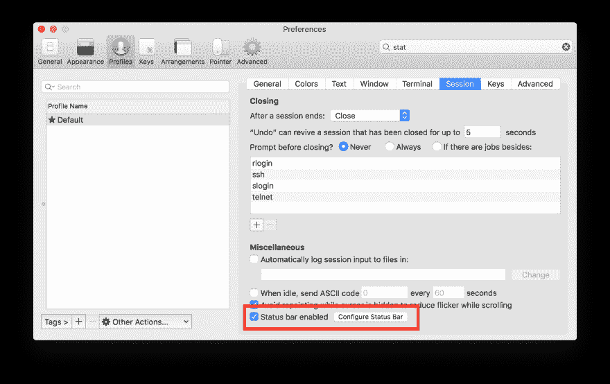

# 带项目的样式终端

> 原文：<https://dev.to/carcruz/styled-terminal-with-iterm-4c8g>

新的 [iTerm2](https://www.iterm2.com) 版本 3.3.1 提供了一个全新的好看的特性。

我刚刚分享了一条关于我的终端外观的推文，并立即开始收到一些关于如何到达那里的问题。

液体错误:内部

好，那我们开始吧！

## 获取开始

免责声明:*如果你已经安装了 iTerm 3.3.1，zsh，oh-my-zsh 和 spaceship_prompt 跳转到配置部分*

#### iTerm2

首先，我们需要下载并安装 [iTerm](https://www.iterm2.com/downloads.html) 。
按照正常申请的步骤操作。

#### ZSH

Zsh 是一个为交互使用而设计的 shell，尽管它也是一种强大的脚本语言

这是一个可能会很痛苦的完整步骤，并且会根据您的配置而有所变化。所以我能做的就是分享我找到的最完整的指南- [安装 zsh](https://github.com/robbyrussell/oh-my-zsh/wiki/Installing-ZSH)

#### 哦-我-zsh

哦，我的 zsh 是一个开源的、社区驱动的框架，用于管理你的 Zsh 配置

使用 Oh-my-zsh 的官方文档来安装它- [安装 oh-my-zsh](https://github.com/robbyrussell/oh-my-zsh#getting-started)

您可以更深入地了解 oh-my-zsh 及其配置，但这不是本文的范围。所以你需要了解的最重要的是他的入口配置文件。在这里你可以控制主题和插件。

#### 飞船-提示

宇宙飞船是一个极简的，强大的和非常可定制的 Zsh 提示

遵循飞船-提示项目- [飞船-提示安装](https://github.com/denysdovhan/spaceship-prompt#installing)中的安装选项

## 配置

好了，现在我们的项目应该看起来不错了。但是我们可以在这里添加一些配置来得到:

#### 左侧面板中的  选项卡

要将选项卡更改为位于左侧，只需转到那里的`iTerm > Preferences > Appearance`，在`General`中您会看到`Tab bar location`，将其设置为`Left`

您还可以自定义图标和会话标题，为此，只需转到`iTerm > Preferences > Profiles`、`General`并在`Basics`部分查看`Icon`和`Title`输入。

#### 状态栏

这是 iTerm 的一个新的超级酷的 ui 改进，让它转到`iTerm > Preferences > Profiles`，然后在左边的子部分转到`Session`。在底部，您可以找到 enabled check 和 configuration 链接，在这里您可以定制将哪些组件放在您的栏上。很简单，只需拖放组件。

要改变酒吧的位置，只需转到`iTerm > Preferences > Appearance`，在`General`你会看到`Status bar location`，将其设置为`Bottom`

#### 自定义飞船-提示

这是一个额外的好处，在我的例子中，我想让 git 分支指示器只显示在状态栏中，所以我必须在飞船提示中禁用它。为此，转到 zsh 配置文件(正常情况下为`~/.zshrc`)并添加这个配置标志

`SPACESHIP_GIT_BRANCH_SHOW="false"`

保存更改并**重启** iTerm

* * *

感谢阅读！如果有任何问题或意见，请留下🙂

🇨🇷✌生活🏼