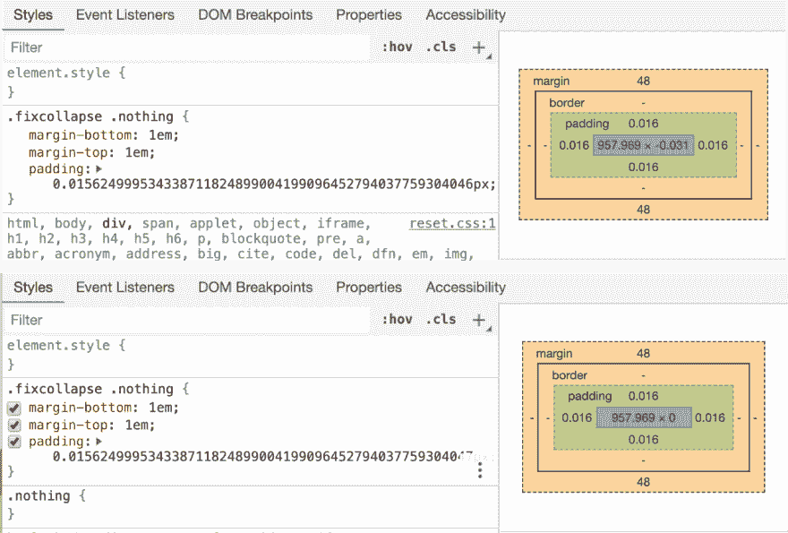
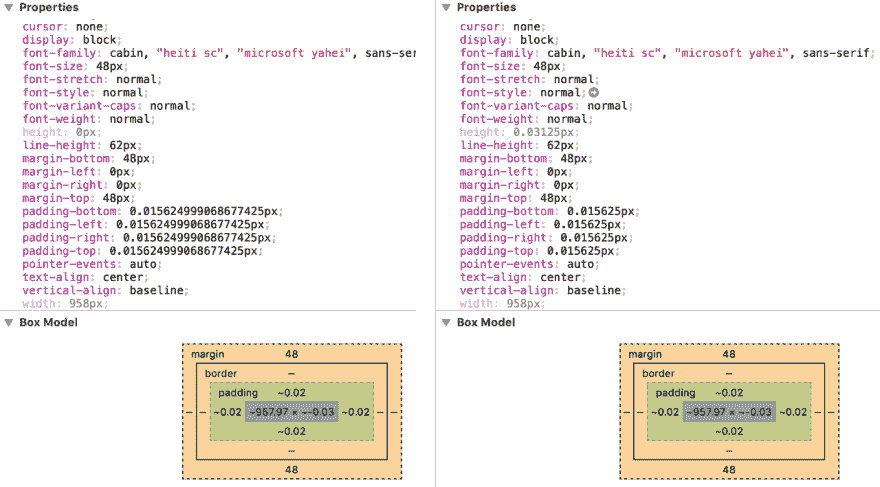

# 子像素渲染和边框

> 原文：<https://dev.to/huijing/sub-pixel-rendering-and-borders-4bhk>

我非常高兴能够在就职演讲上发言。CSS 最近在墨尔本，在活动结束后，我和一位与会者就不同浏览器之间的细边框的亚像素渲染问题进行了一次愉快的聊天。

<figcaption>非官方新加坡 CSS 吉祥物亮相</figcaption>

在我的演讲中，我非常简要地谈到了亚像素渲染的主题，同时也谈到了边距折叠。如果你有一个完全空的盒子，它沿着方块方向的边距会互相折叠。

## 计算出的填充值

然而，向空框中添加任何东西，甚至是边框或一些填充都会阻止这种情况。在那一点上，我很好奇填充值可以低到什么程度，浏览器才会视其为无，我发现对于 Firefox，你可以降低到`0.0083333323709666669px`而不是`0.0083333323709666668px`。

然而，在 Chrome 上，我可以继续下去，但我停在了`0.015624999534338711824899004199096452794037759304047px`。如果你想继续，请随意，并让我知道你能走多远。Safari 一直有相同的小数点，所以我假设 Blink 没有改变 Webkit 的计算。

在用 DevTools 对我笔记本电脑上的 3 个浏览器进行进一步检查后(谁知道 Windows 上的浏览器是否有所不同？)，我注意到关于 DevTools 如何表达计算值的有趣的事情。

Firefox 的盒子模型图似乎正确地表达了填充效果。尽管当填充被渲染为非零值时，内容高度似乎有一些神奇的变化。

<figcaption>Firefox DevTools 试图显示过多小数</figcaption>

至于 Chrome 和 Safari，似乎盒子模型图与我们在浏览器中看到的不一致，并且显示的计算值也有问题。

<figcaption>Chrome 的盒子模型图貌似很混乱</figcaption>

<figcaption>Safari 的计算值似乎有些四舍五入</figcaption>

## 浮点数

顺便说一下，这让我想起了由浮点数组成的计算输出的显示问题。浮点值是有理数的一个很小的子集，它有一个非常大的范围和恒定的精度，这对计算机来说很好。

[IEEE 754](https://ieeexplore.ieee.org/document/8766229) 是浮点运算的技术标准，定义了运算格式、交换规则、舍入规则、运算和异常处理。我猜浏览器在处理亚像素舍入时符合这个标准，但我不能确定。

## 在渲染的边框上

回到关于边界的讨论。我在演示幻灯片中经常使用 [reveal.js](https://github.com/hakimel/reveal.js/) ,默认表格样式在表格行之间使用`1px`边框。在某些分辨率下，使用不同的浏览器，有时不会呈现边框。

这个问题的一个解决方案是使用属性`border-width`的值`thin`。作为复习，这是谈论 CSS 边界的好时机。

作为盒子模型的一部分，边框自 [CSS1](https://www.w3.org/TR/CSS1/) 以来就一直存在。定义边框外观的主要属性是`border-width`、`border-style`和`border-color`。所有 3 个属性都是用来设置盒子所有 4 个边的边框属性的快捷键。

对于`border-width`，您可以使用关键字值，如`thin`、`medium`或`thick`，以及标准的 CSS 长度值。关于这些关键字值的事情是，[规范](https://www.w3.org/TR/css-backgrounds-3/#the-border-width)没有明确定义浏览器应该如何解析它们。

> 没有规定对应于薄、中和厚的长度，但是这些值在整个文档中是恒定的，并且薄≤中≤厚。例如，UA 可以使粗细取决于中等字体大小:当中等字体大小为 17px 或更小时，一种选择可能是 1、3 和 5px。不允许负值。

我没有测试每一个浏览器，只是 Chrome、Firefox 和 Safari，但这三个浏览器确实分别使用了建议的`1px`、`3px`和`5px`。

使用`thin`似乎解决了消失的边界问题的原因很可能是每个浏览器都以适合其自己的渲染引擎计算的方式来解决关键字。所以即使`thin`和`1px`应该有相同的结果，使用`thin`是一个更好的选择。

## 包装完毕

子像素舍入影响浏览器渲染的许多方面，阅读[约翰·雷西格对他的测试案例](https://johnresig.com/blog/sub-pixel-problems-in-css/)的观察很有趣，该案例涉及用百分比值确定大小的孩子。

另一个亚像素舍入问题是由 [Symbiote](https://www.symbiote.com.au/) 的工程师记录的，他们在`line-height`属性上使用`em`或`rem`值时遇到了舍入计算出的文本高度的问题。

这似乎是浏览器渲染的一个长期问题，但似乎没有一个明确的解决方案。如果任何人对亚像素渲染的状态有任何见解，或者可以给我指出合适的人来问，我将非常感谢。🙏