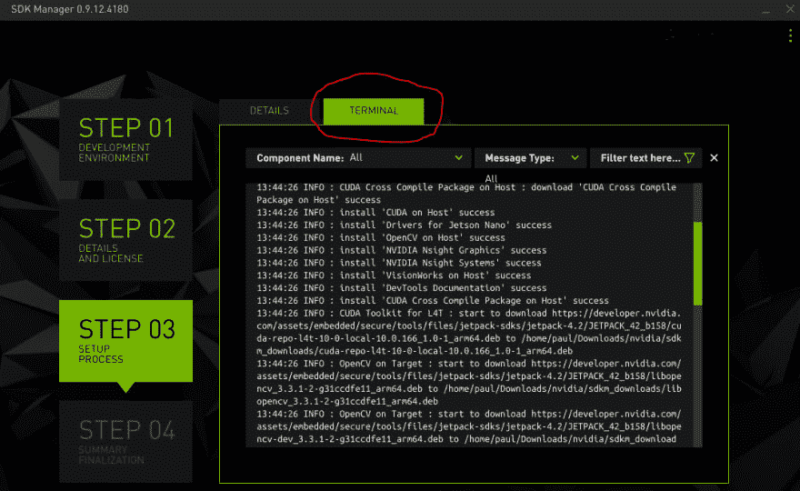

# 借助 Nvidia Jetson 设备上的 GPU 加速，增强您的容器化物联网工作负载

> 原文：<https://dev.to/azure/supercharge-your-containerized-iot-workloads-with-gpu-acceleration-on-nvidia-jetson-devices-4532>

在本文中，我们将介绍在 [Nvidia Jetson 系列设备](https://developer.nvidia.com/buy-jetson)上创建用于物联网解决方案的 GPU 加速容器的步骤。这将使您能够通过暴露对用于容器化流程的板载 GPU 硬件的访问，来执行人工智能和机器学习工作负载的增强处理。当与像 [Azure IoT Edge](https://docs.microsoft.com/en-us/azure/iot-edge/about-iot-edge?WT.mc_id=devto-blog-pdecarlo) 这样以物联网为中心的容器协调器结合使用时，我们可以将这些加速的工作负载部署为模块，这些模块可以直接从云中[配置和部署，然后下载到我们的设备上](https://dev.to/azure/getting-started-with-devops-ci-cd-pipelines-on-nvidia-arm64-devices-4668)。这提供了创建完整的端到端 GPU 加速物联网解决方案的能力，该解决方案可以根据需要安全地远程更新。

# 入门

Nvidia 在其 [Jetson 系列设备产品](https://developer.nvidia.com/buy-jetson)中生产了许多适合物联网解决方案的设备。其中包括结实的 512 核[杰特森 AGX Xavier](https://amzn.to/2XMaSIL) ，中档 256 核[杰特森 TX2](https://amzn.to/2IMGmDV) ，以及入门级的 99 美元 128 核[杰特森 Nano](https://amzn.to/2WFE5zF) 。

要阅读本文，您需要以下设备之一:

*   杰特森·阿格克斯·泽维尔
*   [杰特森 TX2](https://amzn.to/2IMGmDV)
*   [杰特森纳米](https://amzn.to/2WFE5zF)

注意:在本文中，我们将特别使用 Jetson Nano 设备。请记住，将提供的步骤中涉及的过程在技术上适用于整个 Jetson 设备系列，但是，每个平台的细节太复杂，无法在一篇文章中涵盖。因此，如果您使用不同的设备，我们将足够详细地解释整个过程，希望能为您指出正确的方向。

如果你对如何为其他 Nvidia 平台构建类似的 Dockerfiles 示例感兴趣，我强烈建议看看 Ian Davis 发表的 [jetson-containers](https://github.com/idavis/jetson-containers) repo。该存储库包含大量相关信息，在创建该内容的过程中被充分利用。

# 高层概述

要在设备上使用 GPU 驱动程序，我们需要:

*   安装[相关的 GPU 硬件驱动程序(BSP)](https://developer.nvidia.com/embedded/linux-tegra)
*   安装[相关的 CUDA 工具包](https://developer.nvidia.com/cuda-downloads)
*   向容器提供相关的主机 GPU 设备

创建能够访问主机 GPU 资源的容器的过程可能看起来很简单。从技术上讲，这与您想要在主机本身上运行加速工作负载时要遵循的步骤没有什么不同。然而，在实践中，有几个问题使得这个过程有点困难。

*   例如，哪些驱动程序与我的设备相关？(是 TX2/Xavier 还是 Nano 设备)
*   我应该安装哪个版本的 CUDA 工具包？(这些也在每个平台上提供)
*   我如何确保我的容器可以访问适当的设备？(幸运的是，大多数 OPENCL / CUDA 应用程序会在错误消息中告诉您它们需要什么)

BSP 和 CUDA 工具包的可用性使这一过程更加混乱，因为它们没有公开提供下载。如果要在 docker 文件中使用它们，就必须在其他地方检索和托管它们。

如果您点击上面的链接来获取这些软件包，将会出现一些问题。为 BSP 提供的链接不能在 aarch64 上正确提取，因此不加修改就不能在 aarch64 容器中使用。没关系，我们可以重新打包并在其他地方托管它来解决这个问题。

其次，您可能会注意到，没有为 CUDA Toolkit 的 aarch64 兼容安装程序提供链接。这些可以通过[下载并安装 Nvidia SDK 管理器](https://docs.nvidia.com/sdk-manager/download-run-sdkm/index.html)到 X64 / Debian 兼容主机上来获得。从那里，您可以通过监视 SDK 管理器的终端输出来获得适当的链接。

[](https://res.cloudinary.com/practicaldev/image/fetch/s--0iJxPpNo--/c_limit%2Cf_auto%2Cfl_progressive%2Cq_auto%2Cw_880/https://thepracticaldev.s3.amazonaws.com/i/c7fvrni8geqkjm3dle9o.PNG)

还跟着？好消息是，如果您使用的是 Jetson Nano 设备，我将在本文中提供您可以使用的预构建的公共托管 docker 图像。这些可能在其他设备上运行，但由于驱动程序包的差异，不会进行优化。

有些人可能想知道，为什么我们不直接挂载包含相关驱动程序和 SDK 的主机目录呢？例如:

```
docker run -it --rm \

 -v /usr/local/cuda-10.0:/usr/local/cuda-10.0 \

 -v /usr/lib/aarch64-linux-gnu/tegra:/usr/lib/aarch64-linux-gnu/tegra \

 --device=/dev/nvmap \

 --device=/dev/nvhost-ctrl \

 --device=/dev/nvhost-ctrl-gpu \

 my_gpu_accelerated_container 
```

这种方法的问题是，我们的代码现在与主机上可能有也可能没有的配置深度耦合。在生产中最好提供一个包含所有相关依赖项的完整容器，这样我们就可以放心，只要硬件存在，我们就可以成功地运行我们的容器化应用程序。通过这种方式，我们可以在我们的容器中发布 BSP 和 CUDA 更新，而不需要对主机操作系统进行任何更改，很酷吧？

# 建造集装箱

为了构建一个 GPU 加速容器，我们需要考虑如何最好地接近解决方案，以便稍后可以进行更改。Docker 通过其对文件系统更改的分层方法为我们提供了一些现成的细节。每当在 Dockerfile 的`RUN`块中执行一组命令时，就会创建一个层。这些允许我们在先前的层之上组成一组连续的文件系统变化，这些变化可以被 docker 构建系统缓存。Dockerfiles 的精心设计应该允许我们构建一个不会向我们的层中写入过多数据的映像，以允许我们形成一个轻量级的基础来创建额外的容器。

我们还需要考虑如何组织我们的基本图像。如果我们创建一个以适当的方式建立在前面的基础上的基础，它应该允许我们向更大的解决方案添加更改，而不需要从头开始重建。我们希望尽可能避免这种情况，并尽可能利用预先建造的基地。

当我们查看启用 GPU 加速的各个步骤时，隐含着一种设计模式。我们可以为每个步骤创建一个基础映像，即一个仅包含驱动程序的容器，另一个包含安装在驱动程序之上的 CUDA 工具包，另一个根据先前基础中的 CUDA 工具包编译应用程序(OpenCV)等。这将允许我们使用预先存在的基础容器轻松地创建新项目，而不需要重新构建公共层。

按照这种方法，我们将定义如下所述的三个基本映像:

*   **杰特森-纳米-l4t** :包含杰特森 l4t 驱动包的安装
*   **jetson-nano-l4t-cuda** :在 l4t 驱动程序上安装 cuda 工具包 10
*   jetson-nano-l4t-cuda-opencv :针对 cuda 工具包 10 编译 opencv

我们最初的图像，jetson-nano-l4t，将基于[balena lib/jetson-tx2-Ubuntu:bionic](https://hub.docker.com/r/balenalib/jetson-tx2-ubuntu/)。我们也可以基于另一个库存 Ubuntu 基础，如 [arm64v8/ubuntu](https://hub.docker.com/r/arm64v8/ubuntu/) 。这个初始基本服务器将充当初始根文件系统。

我们现在将看看如何单独构建这些基础映像，并对它们如何在幕后操作做一些说明。

## [杰特森-纳米-l4t](https://hub.docker.com/r/toolboc/jetson-nano-l4t)

```
FROM balenalib/jetson-tx2-ubuntu:bionic

ARG URL=https://onedrive.live.com/download?cid=54AD8562A32D8752&resid=54AD8562A32D8752%21376194&authkey=ADUfVNPnEHviFoU
ARG DRIVER_PACK=Jetson-210_Linux_R32.1.0_aarch64.tbz2

RUN apt-get update && apt-get install -y --no-install-recommends \
    bzip2 \
    ca-certificates \
    curl \
    lbzip2 \
    sudo \
    && \
    curl -sSL $URL -o ${DRIVER_PACK} && \
    echo "9138c7dd844eb290a20b31446b757e1781080f63 *./${DRIVER_PACK}" | sha1sum -c --strict - && \
    tar -xpj --overwrite -f ./${DRIVER_PACK} && \
    sed -i '/.*tar -I lbzip2 -xpmf ${LDK_NV_TEGRA_DIR}\/config\.tbz2.*/c\tar -I lbzip2 -xpm --overwrite -f ${LDK_NV_TEGRA_DIR}\/config.tbz2' ./Linux_for_Tegra/apply_binaries.sh && \
    ./Linux_for_Tegra/apply_binaries.sh -r / && \
    rm -rf ./Linux_for_Tegra && \
    rm ./${DRIVER_PACK} \
    && \
    apt-get purge --autoremove -y bzip2 curl lbzip2 && \
    apt-get clean && \
    rm -rf /var/lib/apt/lists/*

ENV LD_LIBRARY_PATH=/usr/lib/aarch64-linux-gnu/tegra:/usr/lib/aarch64-linux-gnu/tegra-egl:${LD_LIBRARY_PATH}

RUN ln -s /usr/lib/aarch64-linux-gnu/tegra/libnvidia-ptxjitcompiler.so.32.1.0 /usr/lib/aarch64-linux-gnu/tegra/libnvidia-ptxjitcompiler.so && \
    ln -s /usr/lib/aarch64-linux-gnu/tegra/libnvidia-ptxjitcompiler.so.32.1.0 /usr/lib/aarch64-linux-gnu/tegra/libnvidia-ptxjitcompiler.so.1 && \
    ln -sf /usr/lib/aarch64-linux-gnu/tegra/libGL.so /usr/lib/aarch64-linux-gnu/libGL.so && \
    ln -s /usr/lib/aarch64-linux-gnu/libcuda.so /usr/lib/aarch64-linux-gnu/libcuda.so.1 && \
    ln -sf /usr/lib/aarch64-linux-gnu/tegra-egl/libEGL.so /usr/lib/aarch64-linux-gnu/libEGL.so 
```

这个 docker 文件下载了一个重新打包的[杰特森·纳农 BSP](https://developer.nvidia.com/embedded/linux-tegra) 的档案。需要一个`sed`操作来指导安装程序覆盖已经存在于根文件系统上的文件。最后，我们将新安装的模块添加到 LD_LIBRARY_PATH，以允许它们被其他应用程序动态链接，并将相关的共享对象符号链接到公共路径名。

## [杰特森-纳米-l4t-cuda](https://hub.docker.com/r/toolboc/jetson-nano-l4t-cuda)

```
FROM toolboc/jetson-nano-l4t

#INSTALL CUDA Toolkit for L4T
ARG URL=https://onedrive.live.com/download?cid=54AD8562A32D8752&resid=54AD8562A32D8752%21376191&authkey=APwtvHgdqlgnJzo
ARG CUDA_TOOLKIT_PKG="cuda-repo-l4t-10-0-local-10.0.166_1.0-1_arm64.deb"

RUN apt-get update && \
    apt-get install -y --no-install-recommends curl && \
    curl -sL ${URL} -o ${CUDA_TOOLKIT_PKG} && \
    echo "5e3eedc3707305f9022d41754d6becde ${CUDA_TOOLKIT_PKG}" | md5sum -c - && \
    dpkg --force-all -i ${CUDA_TOOLKIT_PKG} && \
    rm ${CUDA_TOOLKIT_PKG} && \
    apt-key add var/cuda-repo-*-local*/*.pub && \
    apt-get update && \
    apt-get install -y --allow-downgrades cuda-toolkit-10-0 libgomp1 libfreeimage-dev libopenmpi-dev openmpi-bin && \
    dpkg --purge cuda-repo-l4t-10-0-local-10.0.166  && \
    apt-get clean && \
    rm -rf /var/lib/apt/lists/*

ENV CUDA_HOME=/usr/local/cuda
ENV LD_LIBRARY_PATH=$LD_LIBRARY_PATH:/usr/local/cuda/lib64:/usr/local/cuda/extras/CUPTI/lib64
ENV PATH=$PATH:$CUDA_HOME/bin 
```

这个 docker 文件为 arm64 安装了 CUDA Toolkit 10.0.166_1 以及必要的依赖项。我们设置了 LD_LIBRARY_PATH 以允许已安装模块的动态链接，并创建了 CUDA 工具包二进制文件(nvcc 等)。)供将来的应用程序访问，方法是将 CUDA_HOME/bin 目录添加到 PATH 中。

## [杰特森-纳米-l4t-cuda-opencv](https://hub.docker.com/r/toolboc/jetson-nano-l4t-cuda-opencv)

```
FROM toolboc/jetson-nano-l4t-cuda

#Required for libjasper-dev
RUN echo "deb http://ports.ubuntu.com/ubuntu-ports/ xenial-security main restricted" | sudo tee -a /etc/apt/sources.list

#INSTALL OPENCV dependencies
RUN apt update && apt purge *libopencv* && apt install -y build-essential cmake git libgtk2.0-dev pkg-config libavcodec-dev libavformat-dev libswscale-dev \
    libgstreamer1.0-dev libgstreamer-plugins-base1.0-dev \
    python2.7-dev python3.6-dev python-dev python-numpy python3-numpy \
    libtbb2 libtbb-dev libjpeg-dev libpng-dev libtiff-dev libjasper-dev libdc1394-22-dev \
    libv4l-dev v4l-utils qv4l2 v4l2ucp \
    curl unzip && \
    rm -rf /var/lib/apt/lists/*

#GET OPENCV sources
WORKDIR /usr/local/src
RUN curl -L https://github.com/opencv/opencv/archive/4.1.0.zip -o opencv-4.1.0.zip && \
    curl -L https://github.com/opencv/opencv_contrib/archive/4.1.0.zip -o opencv_contrib-4.1.0.zip && \
    unzip opencv-4.1.0.zip && \
    unzip opencv_contrib-4.1.0.zip && \
    rm -rf opencv*.zip

#INSTALL OPENCV
RUN cd opencv-4.1.0/ && mkdir release && cd release/ && \
    cmake -D WITH_CUDA=ON -D CUDA_ARCH_BIN="5.3" -D CUDA_ARCH_PTX="" -D OPENCV_EXTRA_MODULES_PATH=../../opencv_contrib-4.1.0/modules -D WITH_GSTREAMER=ON -D WITH_LIBV4L=ON -D BUILD_opencv_python2=ON -D BUILD_opencv_python3=ON -D BUILD_TESTS=OFF -D BUILD_PERF_TESTS=OFF -D BUILD_EXAMPLES=OFF -D CMAKE_BUILD_TYPE=RELEASE -D CMAKE_INSTALL_PREFIX=/usr/local .. && \
    make -j3 && \
    make install && \
    rm -rf /usr/local/src/opencv-4.1.0/release 
```

在这个 docker 文件中，我们更新了 sources.list 以允许我们安装 libjasper-dev，因为它在 bionic repos 中不可用。然后我们获得 OpenCV 的 4.1.0 版本，并编译它支持 CUDA、python2 和 python3。我们能够使用 CUDA 支持进行编译，因为该映像基于 toolboc/jetson-nano-l4t-cuda

# 使用 GPU 加速容器

使用这些容器需要使用容器可访问的适当主机 GPU 设备来创建容器。这可以在命令行中使用
来完成

```
docker run \
    --device=/dev/nvhost-ctrl \
    --device=/dev/nvhost-ctrl-gpu \
    --device=/dev/nvhost-prof-gpu \
    --device=/dev/nvmap \
    --device=/dev/nvhost-gpu \
    --device=/dev/nvhost-as-gpu \
    --device=/dev/nvhost-vic \
    --device=/dev/tegra_dc_ctrl \
    <image-name> 
```

或者在[物联网边缘模块](https://docs.microsoft.com/en-us/azure/iot-edge/about-iot-edge?WT.mc_id=devto-blog-pdecarlo)中，通过修改`deployment.template.json`的`HostConfig`部分如下:

```
 "HostConfig": {
                  "Devices": [
                    {
                      "PathOnHost": "/dev/nvhost-ctrl",
                      "PathInContainer":"/dev/nvhost-ctrl",
                      "CgroupPermissions":"rwm"
                    },
                    {
                      "PathOnHost": "/dev/nvhost-ctrl-gpu",
                      "PathInContainer":"dev/nvhost-ctrl-gpu",
                      "CgroupPermissions":"rwm"
                    },
                    {
                      "PathOnHost": "/dev/nvhost-prof-gpu",
                      "PathInContainer":"dev/nvhost-prof-gpu ",
                      "CgroupPermissions":"rwm"
                    },
                    {
                      "PathOnHost": "/dev/nvmap",
                      "PathInContainer":"/dev/nvmap",
                      "CgroupPermissions":"rwm"
                    },
                    {
                      "PathOnHost": "dev/nvhost-gpu",
                      "PathInContainer":"dev/nvhost-gpu",
                      "CgroupPermissions":"rwm"
                    },
                    {
                      "PathOnHost": "/dev/nvhost-as-gpu",
                      "PathInContainer":"/dev/nvhost-as-gpu",
                      "CgroupPermissions":"rwm"
                    },
                    {
                      "PathOnHost": "/dev/nvhost-vic",
                      "PathInContainer":"/dev/nvhost-vic",
                      "CgroupPermissions":"rwm"
                    },
                    {
                      "PathOnHost": "/dev/tegra_dc_ctrl",
                      "PathInContainer":"/dev/tegra_dc_ctrl",
                      "CgroupPermissions":"rwm"
                    }
                  ], 
```

让我们在 Nvidia Jetson Nano 设备上运行:
来验证这一点

```
docker run --rm -it \
    --device=/dev/nvhost-ctrl \
    --device=/dev/nvhost-ctrl-gpu \
    --device=/dev/nvhost-prof-gpu \
    --device=/dev/nvmap \
    --device=/dev/nvhost-gpu \
    --device=/dev/nvhost-as-gpu \
    --device=/dev/nvhost-vic \
    --device=/dev/tegra_dc_ctrl \
    toolboc/jetson-nano-l4t-cuda \
    /bin/bash 
```

这将使您进入一个带有 [jetson-nano-l4t-cuda](https://hub.docker.com/r/toolboc/jetson-nano-l4t-cuda) 基本映像的交互式 bash 会话。

我们将构建包含在 CUDA 工具包中的 deviceQuery 示例，以验证我们的 GPU 可以从容器中访问。为此，在交互式会话中运行以下命令:

```
cd /usr/local/cuda/samples/1_Utilities/deviceQuery
make
./deviceQuery 
```

您应该会收到类似如下的输出:

```
./deviceQuery Starting...

 CUDA Device Query (Runtime API) version (CUDART static linking)

Detected 1 CUDA Capable device(s)

Device 0: "NVIDIA Tegra X1"
  CUDA Driver Version / Runtime Version          10.0 / 10.0
  CUDA Capability Major/Minor version number:    5.3
  Total amount of global memory:                 3957 MBytes (4148756480 bytes)
  ( 1) Multiprocessors, (128) CUDA Cores/MP:     128 CUDA Cores
  GPU Max Clock rate:                            922 MHz (0.92 GHz)
  Memory Clock rate:                             13 Mhz
  Memory Bus Width:                              64-bit
  L2 Cache Size:                                 262144 bytes
  Maximum Texture Dimension Size (x,y,z)         1D=(65536), 2D=(65536, 65536), 3D=(4096, 4096, 4096)
  Maximum Layered 1D Texture Size, (num) layers  1D=(16384), 2048 layers
  Maximum Layered 2D Texture Size, (num) layers  2D=(16384, 16384), 2048 layers
  Total amount of constant memory:               65536 bytes
  Total amount of shared memory per block:       49152 bytes
  Total number of registers available per block: 32768
  Warp size:                                     32
  Maximum number of threads per multiprocessor:  2048
  Maximum number of threads per block:           1024
  Max dimension size of a thread block (x,y,z): (1024, 1024, 64)
  Max dimension size of a grid size    (x,y,z): (2147483647, 65535, 65535)
  Maximum memory pitch:                          2147483647 bytes
  Texture alignment:                             512 bytes
  Concurrent copy and kernel execution:          Yes with 1 copy engine(s)
  Run time limit on kernels:                     Yes
  Integrated GPU sharing Host Memory:            Yes
  Support host page-locked memory mapping:       Yes
  Alignment requirement for Surfaces:            Yes
  Device has ECC support:                        Disabled
  Device supports Unified Addressing (UVA):      Yes
  Device supports Compute Preemption:            No
  Supports Cooperative Kernel Launch:            No
  Supports MultiDevice Co-op Kernel Launch:      No
  Device PCI Domain ID / Bus ID / location ID:   0 / 0 / 0
  Compute Mode:
     < Default (multiple host threads can use ::cudaSetDevice() with device simultaneously) >

deviceQuery, CUDA Driver = CUDART, CUDA Driver Version = 10.0, CUDA Runtime Version = 10.0, NumDevs = 1
Result = PASS 
```

如果你收到类似的消息，恭喜你！您现在可以从一个容器访问 GPU 了！

# 结论

我们已经展示了如何让 Nvidia Jetson 设备上的 GPU 可用于容器化进程。这为增强作为容器分发的物联网解决方案开辟了大量可能性。我们还展示了如何使用这些基本容器在 GPU 支持下编译额外的应用程序。使用这些技术，应该可以将任何主机兼容的 GPU 加速工作负载转换为在容器中运行，使之成为开发 GPU 加速[物联网边缘](https://docs.microsoft.com/en-us/azure/iot-edge/about-iot-edge?WT.mc_id=devto-blog-pdecarlo)工作负载的可行途径。

如果您想查看 Nvidia Jetson 平台(包括 Nano、TX 和 Xavier)的 docker 文件的其他示例，您可以查看 Ian Davis 的 [jetson-containers](https://github.com/idavis/jetson-containers) repo，其中包含 CUDNN、Tensorflow 和 PyTorch 等其他软件包的各种示例配置。

如果您有兴趣了解有关为 Nvidia Jetson 设备开发物联网边缘工作负载的更多信息，您可以查看 Dev.to:

*   [在 Nvidia Jetson 设备上开始物联网边缘开发](https://dev.to/azure/getting-started-with-iot-edge-development-on-nvidia-jetson-devices-2dfl)
*   [通过 Azure IoT Edge 使用认知服务容器](https://dev.to/azure/using-cognitive-services-containers-with-azure-iot-edge-1e5a)
*   [Nvidia arm 64 设备 DevOps CI / CD 管道入门](https://dev.to/azure/getting-started-with-devops-ci-cd-pipelines-on-nvidia-arm64-devices-4668)。

下次见，黑客快乐！