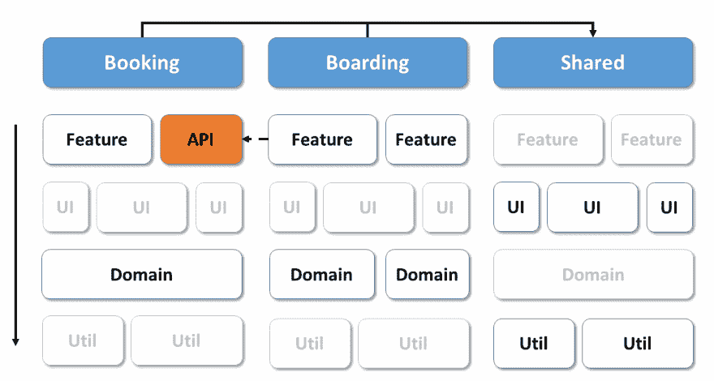
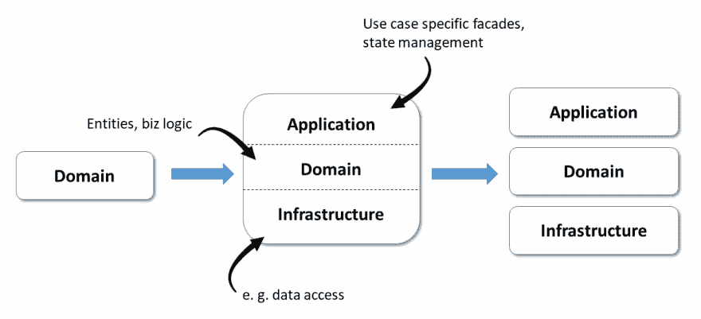
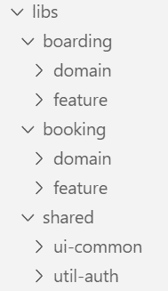
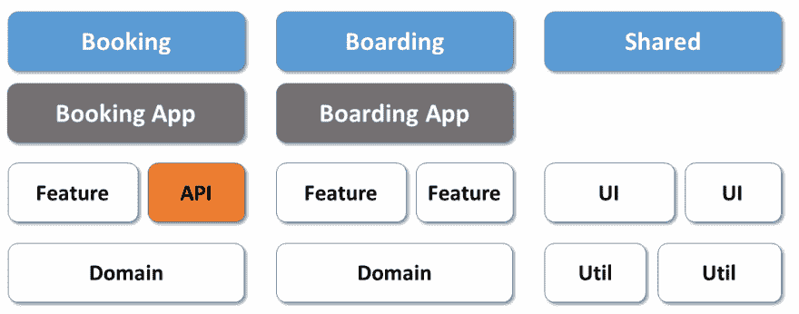

# 具有战术 DDD 和 MonoRepos 的可持续角形建筑？

> 原文：<https://dev.to/angular/sustainable-angular-architectures-with-tactical-ddd-and-monorepos-c61>

商业和工业应用通常是长期的。这些应用程序包括与复杂的后端服务和系统分层的面向客户的应用程序。现在，这些应用程序中的许多都是通过使用 JavaScript 的 web 前端实现的。

那么我们如何构建和维护这样的软件系统呢？

**领域驱动设计(DDD)** 提供了答案！最重要的是，它特别适用于复杂的角解。

在本文中，我们将了解:

*   如何**战术设计(DDD)** 帮助我们将源代码组织成更小的、可管理的、连贯的部分。
*   monorepos 如何帮助实现它们
*   **Facades** 如何帮助隔离您的领域逻辑
*   客户端 DDD 如何为**微前端**铺路

> 所有这些主题也是我们高级[角度建筑工作坊](https://www.softwarearchitekt.at/schulungen/advanced-angular-enterprise-anwendungen-und-architektur/)的一部分。如果你正在用 Angular 实现商业或工业软件，看看它吧！

和往常一样，使用的例子可以在我的 [GitHub 账户](https://github.com/manfredsteyer/angular-ddd)中找到。

> 非常感谢托马斯·伯利森(Thomas Burleson)深入审阅了这篇文章并为之做出了贡献。

## 区域分解

让我们考虑一个我们正在构建的消费者旅游 web 应用程序。我们可以确定几个领域:

[](https://res.cloudinary.com/practicaldev/image/fetch/s--mi7fKkg7--/c_limit%2Cf_auto%2Cfl_progressive%2Cq_auto%2Cw_880/https://www.softwarearchitekt.at/wp-content/uploads/2019/09/domains.png)

为了管理这些领域的复杂性，我们应该利用来自 Angular 社区的**领域驱动的设计**和最佳实践。

领域驱动设计有两种类型

*   **[战略领域设计](https://www.softwarearchitekt.at/aktuelles/sustainable-angular-architectures-1/)**
*   **战术设计**

前一个是关于识别领域和它们之间的通信，而战术设计处理的是构造这些领域。

我已经写过关于 **[战略设计](https://www.softwarearchitekt.at/aktuelles/sustainable-angular-architectures-1/)** 在角度应用中的使用。看看这篇文章，了解一些基本知识。因此，在这里，我将重点关注战术领域设计。

## 运用战术设计

现在让我们来谈谈如何用战术设计来构建我们的应用程序。

### 域组织使用图层

对于域，我们使用列细分(“泳道”)。此外，这些域可以用库的层来组织，这导致行的细分:

[](https://res.cloudinary.com/practicaldev/image/fetch/s--sN7u-ba5--/c_limit%2Cf_auto%2Cfl_progressive%2Cq_auto%2Cw_880/https://www.softwarearchitekt.at/wp-content/uploads/2019/09/domains-layer.png)

注意每一层是如何由一个或多个**库**组成的

> 虽然使用层是一种非常传统的组织域的方式，但是也有像六边形架构或干净架构这样的替代方式。

#### 共享功能呢？

对于那些将被*共享*并跨域使用的方面，使用一个额外的`shared`泳道。共享库非常有用。例如，考虑用于认证或日志记录的共享库。

> 注意:`shared`泳道对应于 DDD 提出的共享内核，也包含了要共享的技术库。

#### 如何防止高耦合？

访问约束定义了哪些库可以使用/依赖于其他库。通常，每一层只允许与底层通信。只有在`shared`区域才允许跨域访问。使用这些限制的好处是可以导致松耦合，从而提高可维护性。

> 为了防止将太多的逻辑放入`shared`区域，这里介绍的方法还使用了为其他域发布构建块的 API。这对应于 DDD 中开放服务的思想。

关于共享部分，可以看到以下两个特征:

*   如灰色块所示，大多数`util`库位于`shared`区域，尤其是在跨系统使用身份验证或日志等方面。
*   这同样适用于确保全系统外观的通用 UI 库。

#### 特定于特性的功能呢？

注意，特定领域的`feature`库并不在`shared`区域中。与功能相关的代码应该放在它自己的域中。

虽然开发人员可能会选择共享功能代码(在域之间)，但是这种做法可能会导致分担责任、更多的协调工作和突破性的变更。因此，应该尽量少分享。

### 代码组织

基于 Nrwl.io 的[企业单库模式](https://go.nrwl.io/angular-enterprise-monorepo-patterns-new-book)，我区分了五类层或库:

| 种类 | 描述 | 示例性内容 |
| --- | --- | --- |
| 特征 | 包含一个用例的组件。 | 搜索飞行组件 |
| 用户界面 | 包含所谓的“哑组件”，它们是用例不可知的，因此是可重用的。 | 日期时间部分、地址部分、地址管道 |
| 美国石油学会(American Petroleum Institute) | 为其他人导出当前子域中的构建基块。 | 飞行 API |
| 领域 | 包含域(泳道)使用的**域模型**(类、接口、类型) |  |
| 跑龙套 | 包括一般实用功能 | 格式日期 |

这个完整的架构矩阵最初是势不可挡的。但是简单回顾一下，几乎所有和我一起工作过的开发人员都认为代码组织有利于代码重用和未来的特性。

### 隔离域

为了隔离领域逻辑，我们将它隐藏在 facades 后面，facades 以特定于用例的方式表示它:

[](https://res.cloudinary.com/practicaldev/image/fetch/s--drIwp5rO--/c_limit%2Cf_auto%2Cfl_progressive%2Cq_auto%2Cw_880/https://i.imgur.com/sjxc4we.png)

这个 facade 还可以处理状态管理。有两篇优秀的文章可供深入研究这些领域:

*   [Ngrx + Facades:更好的状态管理](https://medium.com/@thomasburlesonIA/ngrx-facades-better-state-management-82a04b9a1e39)
*   [具有 RxJS 的基于推送的架构](https://medium.com/@thomasburlesonIA/push-based-architectures-with-rxjs-81b327d7c32d)

虽然立面目前在角度环境中非常流行，但这个想法也与 DDD(在那里它们被称为应用服务)密切相关。

将*基础设施需求*从实际的领域逻辑中分离出来是很重要的。

在 SPA 中，基础设施关注的是——至少在大多数时候——与服务器的异步通信和数据交换。保持这种分离导致三个附加层:

*   应用服务/外观，
*   实际的领域层，以及
*   基础设施层。

当然，这些层现在也可以打包到它们自己的库中。为了简单起见，也可以将它们存储在一个单独的库中，该库被相应地细分。如果这些层通常一起使用，并且只需要为了单元测试而交换，那么这个决定是有意义的。

### 在 Monorepos 中实现

一旦我们的架构的组件被确定，问题就来了，如何在 Angular 的世界中实现它们。谷歌自己也使用的一种非常常见的方法是使用单向回购。它是一个包含软件系统所有库的代码库。

虽然用 Angular CLI 创建的项目现在可以用作 monorepo，但流行的工具 [Nx](https://nx.dev/) 提供了一些额外的可能性，这对大型企业解决方案尤其有价值。这些包括之前讨论过的在图书馆之间引入[访问限制的方法](https://www.softwarearchitekt.at/aktuelles/sustainable-angular-architectures-2/)。这防止了每个库互相访问，从而导致整个系统高度耦合。

要在 monorepo 中创建库，一条指令就足够了:

```
ng generate library domain --directory boarding 
```

Enter fullscreen mode Exit fullscreen mode

> 因为你只是用了`ng generate library`而不是`ng generate module`，所以对你来说没有更多的努力。然而，您得到了更清晰的结构、改进的可维护性和更少的耦合。

Nx 提供的开关`directory`指定了一个可选的子目录，库将放在这个子目录中。这样，他们就可以按域进行**分组:**

[](https://res.cloudinary.com/practicaldev/image/fetch/s--0FVTA2dA--/c_limit%2Cf_auto%2Cfl_progressive%2Cq_auto%2Cw_880/https://www.softwarearchitekt.at/wp-content/uploads/2019/09/folder.png)

库的名称也反映了层。
如果一个层有几个库，使用这些名称作为前缀是有意义的。这导致了诸如`feature-search`或`feature-edit`的名称。

为了隔离实际的域模型，此处显示的示例将域库进一步分为三层:

[](https://res.cloudinary.com/practicaldev/image/fetch/s--0FVTA2dA--/c_limit%2Cf_auto%2Cfl_progressive%2Cq_auto%2Cw_880/https://www.softwarearchitekt.at/wp-content/uploads/2019/09/folder.png)

#### 构建在一个 Monorepo 内

通过查看 git 提交日志，Nx 还可以识别哪些库受到最新代码变更的影响*。*

这个变更信息仅用于重新编译受**影响的**库，或者仅运行受**影响的**测试。很明显，这为作为一个整体存储在存储库中的大型系统节省了大量时间。

### 实体和你的战术设计

战术设计为构造领域层提供了许多想法。在这一层的中心，有**实体**反映真实世界的领域和结构。

下面的清单显示了一个枚举和两个实体，它们符合面向对象语言(如 Java 或 C#)的惯例。

```
public enum BoardingStatus {
  WAIT_FOR_BOARDING,
  BOARDED,
  NO_SHOW
}

public class BoardingList {

  private int id;
  private int flightId;
  private List<BoardingListEntry> entries;
  private boolean completed;

  // getters and setters

  public void setStatus (int passengerId, BoardingStatus status) {
    // Complex logic to update status
  }

}

public class BoardingListEntry {

  private int id;
  private boarding status status;

  // getters and setters
} 
```

Enter fullscreen mode Exit fullscreen mode

和 OO-land 一样，这些实体使用信息隐藏来确保它们的状态保持一致。您可以用私有字段和操作它们的公共方法来实现这一点。

这些实体不仅封装数据，还封装业务规则。至少方法`setStatus`指明了这种情况。只有在业务规则不能被有意义地容纳在一个实体中的情况下，DDD 才定义所谓的域服务。

> 在 DDD 中，只表示数据结构的实体是不受欢迎的。社区称之为贬值[无血(贫血)](https://martinfowler.com/bliki/AnemicDomainModel.html)。

### 战术 DDD 与功能编程

从面向对象的角度来看，前面的方法是有意义的。然而，对于 JavaScript 和 TypeScript 这样的语言，面向对象就不那么重要了。

Typescript 是一种多范式语言，函数式编程在其中发挥了重要作用。有关功能性 DDD 的书籍可在此处找到:

*   [领域建模完成](https://pragprog.com/book/swdddf/domain-modeling-made-functional)，
*   [功能和反应域建模](https://www.amzn.com/1617292249)。

使用函数式编程，先前考虑的实体模型将因此被分成数据部分和逻辑部分。[领域驱动设计提炼出了](https://www.amzn.com/0134434420)，它是 DDD 的标准作品之一，主要依赖于面向对象程序设计，它也承认这种规则的改变在 FP 的世界里是必要的:

```
export type BoardingStatus = 'WAIT_FOR_BOARDING' | 'BOARDED' | 'NO_SHOW' ;

export interface BoardingList {
    readonly id: number;
    readonly flightId: number;
    readonly entries: BoardingListEntry [];
    readonly completed: boolean;
}

export interface BoardingListEntry {
    readonly passengerId: number;
    readonly status: BoardingStatus;
} 
```

Enter fullscreen mode Exit fullscreen mode

```
export function updateBoardingStatus (
                   boardingList: BoardingList,
                   passengerId: number,
                   status: BoardingStatus): Promise <BoardingList> {

        // Complex logic to update status

} 
```

Enter fullscreen mode Exit fullscreen mode

在这里，实体也使用公共属性。这种做法在 FP 中相当普遍；过度使用只委托给私有属性的 getters 和 setters，经常被嘲讽！

然而，更有趣的是函数世界如何避免不一致状态的问题。答案非常简单:数据结构最好是不可变的 T2。示例中的关键字`readonly`强调了这一点。

想要改变这样的对象的程序的一部分必须克隆它，并且如果程序的其他部分已经为了他们自己的目的首先验证了一个对象，他们可以假定它仍然有效。

> 使用不可变数据结构的一个奇妙的副作用是变更检测性能得到了优化。不再需要*深度比较*。相反，一个*改变的*对象实际上是一个新的实例，因此对象引用将不再相同。

### 战术 DDD 用蕴

为了跟踪领域模型的组件，战术 DDD 将实体组合成集合。在最后一个示例中，`BoardingList`和`BoardingListEntry`形成了这样一个集合。

聚合的所有组件的状态必须作为一个整体保持一致。例如，在上面概述的例子中，可以指定如果没有状态为`WAIT_FOR_BOARDING`的`BoardingListEntry`，则`BoardingList`中的`completed`只能设置为`true`。

此外，不同的聚合可能不会通过对象引用相互引用。相反，他们可以使用 id。这将防止集料之间不必要的耦合。因此，大的结构域可以被分解成更小的聚集体组。

> [领域驱动的设计提炼](https://www.amzn.com/0134434420)建议尽可能地减少聚集。首先，将每个实体视为一个聚合，然后毫不延迟地将需要更改的聚合合并在一起。

## 立面

(又名应用服务)用于以用例特定的方式表示领域逻辑。提供了几个优点:

*   封装复杂性
*   关注国家管理
*   简化的 API

独立于 DDD，这个想法已经在 Angular 的世界里流行了一段时间了。

对于我们的例子，我们可以创建下面的外观:

```
@Injectable ({providedIn: 'root'})
export class FlightFacade {

    private notifier = new BehaviorSubject<Flight[]>([]);    
    public  flights$ = this.notifier.asObservable();

    constructor(private flightService: FlightService) { }

    search(from: string, to: string, urgent: boolean): void {
        this.flightService
            .find(from, to, urgent)
            .subscribe (
              (flights) => this.notifier.next(flights),
              (err) => console.error ('err', err);
            );
    }
} 
```

Enter fullscreen mode Exit fullscreen mode

注意外观中 RxJS 和 observables 的使用。这意味着 facade 可以在条件变化时自动传递更新的航班信息。Facades 的另一个优点是能够在以后需要时透明地引入 Redux 和`@ngrx/store`。这可以在不影响任何外部应用程序组件的情况下完成。

> 对于外观的消费者来说，它是自己管理状态还是委托给状态管理库来管理状态并不重要。

鼓励开发人员阅读/观看 Thomas Burleson 关于此主题的作品:

*   博客文章[使用 RxJS + Facades](https://medium.com/@thomasburlesonIA/push-based-architectures-with-rxjs-81b327d7c32d) 的基于推送的架构，或者
*   YouTube 视频[采用 RxJS 的基于推送的架构](https://www.youtube.com/watch?v=HnNytR32Otk&t=1s)

### 无状态立面

虽然使服务器端服务无状态是一个很好的实践，但是对于 web/客户机层的服务来说，这个目标通常是不可实现的。

一个 web SPA 有状态，这就是它对用户友好的原因！

为了避免 UX 问题，Angular 应用程序不希望一遍又一遍地从服务器重新加载所有信息。因此，画出的外观包含了装载的飞行(在前面讨论过的可观察范围内)。

## 域事件

除了性能改进之外，使用可观测量还提供了进一步的优势。可观测量允许进一步解耦，因为发送方和接收方不需要直接相互了解。

这也非常适合 DDD，在那里使用**域事件**现在是架构的一部分。如果应用程序的某个部分发生了有趣的事情，它会发送一个域事件，应用程序的其他部分可以对此做出反应。

在所示的例子中，域事件可以指示乘客现在正在登机。如果系统的其他部分对此感兴趣，他们可以执行特定的逻辑。

> 对于熟悉 Redux 或 Ngrx 的 Angular 开发者来说:域事件可以表示为*分派的动作*！

## 领域驱动设计和微前端？

众所周知，领域驱动设计的思想为微服务架构铺平了道路。因此，客户端 DDD 可以用作微前端的基础。

是否创建部署整体、微前端或两者之间的任何东西，取决于 monorepo 的使用。如果 monorepo 为每个域获得一个自己的应用程序，就向微前端迈出了一大步:

[](https://res.cloudinary.com/practicaldev/image/fetch/s--1LJQIGzy--/c_limit%2Cf_auto%2Cfl_progressive%2Cq_auto%2Cw_880/https://i.imgur.com/keOLDU3.png)

上面讨论的访问限制确保了松散的耦合，甚至允许以后分割成多个存储库。然后，您可以在微服务架构的经典意义上谈论微前端。然而，在这种情况下，团队必须负责版本控制和分发共享库，这在微服务中是很常见的。

关于这个话题的更多想法可以在我的博客文章[中找到，这是关于切割你的领域，而不是(首先是)关于微前端！](https://www.softwarearchitekt.at/aktuelles/its-about-cutting-your-domain-not-first-and-foremost-about-micro-frontends/)。

## 结论

现代的单页应用程序(spa)通常不仅仅是数据传输对象(dto)的接收者。它们通常包含重要的领域逻辑，这增加了复杂性。来自 DDD 的想法帮助开发人员管理和扩展由此产生的复杂性。

由于打字稿的对象功能性质和流行的习惯，一些规则变化是必要的。例如，我们通常使用不变量，并将数据结构与操作它们的逻辑分开。

这里概述的实现基于以下思想:

*   monorepos 与按结构域分组的多个文库的使用有助于构建基本结构。
*   库之间的访问限制阻止了域之间的耦合。
*   外观为单个用例准备领域模型，并负责维护状态。
*   如果需要，Redux 可以用在门面后面，而不会被应用程序的其他部分注意到。

此外，团队还通过使用客户端 DDD 为微前端创造了条件。

> 如果你想看所有这些主题的实际应用，请查看我们的[角度建筑工作坊](https://www.softwarearchitekt.at/schulungen/advanced-angular-enterprise-anwendungen-und-architektur/)。