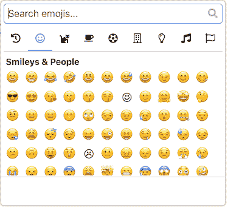

# 苗条表情选择器:表情选择器苗条组件

> 原文：<https://dev.to/joeattardi/svelte-emoji-selector-emoji-picker-svelte-component-dne>

又一个表情符号项目？为什么不呢！在过去的几周里，我一直在和斯维特玩。我从 https://emojipicker.app 中改编了一些代码，为苗条的应用程序构建了一个表情选择器。

它具有搜索、肤色变化等功能，并且会保存你最近使用的表情符号。

不幸的是，npm 包名`svelte-emoji-picker`已经被占用了，所以我选择了`svelte-emoji-selector`。

在这里演示！[https://joeattardi.github.io/svelte-emoji-selector/](https://joeattardi.github.io/svelte-emoji-selector/)

代码在这里！[https://github.com/joeattardi/svelte-emoji-selector](https://github.com/joeattardi/svelte-emoji-selector)