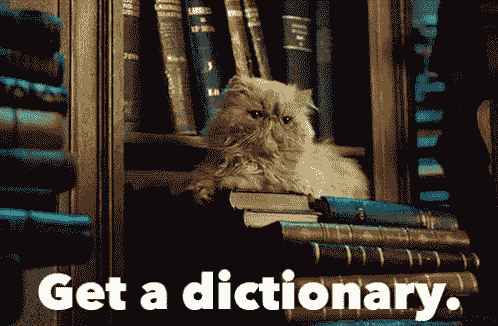

# 在 Python 字典中交换键和值

> 原文：<https://dev.to/petercour/swap-keys-and-values-in-a-python-dictionary-1njn>

[](https://res.cloudinary.com/practicaldev/image/fetch/s--BWrKkQh_--/c_limit%2Cf_auto%2Cfl_progressive%2Cq_66%2Cw_880/https://media.tenor.cimg/e4d895552f3844d1bb4c6a4c5c3105ec/tenor.gif)

字典是一对一的映射。每个键都有一个值。
用 Python 说可以

```
dict = {'a': 1, 'b': 2, 'c': 3} 
```

然后你可以得到这样的值

```
print(dict['b']) 
```

那太好了。但是如果你想翻整本字典呢？其中键是值，值和键。

### 互换数值

您可以用一个 liner 轻松地交换 Python 中的键、字典对。

```
dict = {value:key for key, value in dict.items()} 
```

所以实际上你可以有这样的东西:

```
dict = {'a': 1, 'b': 2, 'c': 3}
print(dict)

dict = {value:key for key, value in dict.items()}
print(dict) 
```

这将输出

```
{'a': 1, 'c': 3, 'b': 2}
{1: 'a', 2: 'b', 3: 'c'} 
```

所以一艘班轮

```
dict = {value:key for key, value in dict.items()} 
```

翻了整本字典。不错的把戏:)

学 Python？

*   [https://pythonbasics.org/](https://pythonbasics.org/)
*   [https://pythonprogramminglanguage.com/](https://pythonprogramminglanguage.com/)