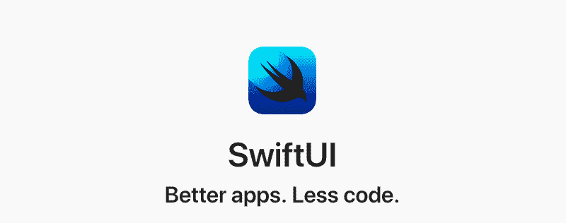

# SwiftUI 备忘单

> 原文：<https://dev.to/sadmansamee/swiftui-cheat-sheet-34ga>

# SwiftUI 备忘单

[](https://res.cloudinary.com/practicaldev/image/fetch/s--0ui8tk5S--/c_limit%2Cf_auto%2Cfl_progressive%2Cq_auto%2Cw_880/https://raw.githubusercontent.com/SimpleBoilerplates/SwiftUI-Cheat-Sheet/master/assets/image.png)

这最初发表在 Github 的[这里是](https://github.com/SimpleBoilerplates/SwiftUI-Cheat-Sheet)

### 目录

*   [SwiftUI 备忘单](#swiftui-cheat-sheet)
    *   [目录](#table-of-contents)
*   [教程](#tutorial)
*   [swift ui 中的 UIKIT 等价物](#uikit-equivalent-in-swiftui)
*   [视图](#view)
    *   [正文](#text)
    *   [图像](#image)
    *   [形状](#shape)
*   [布局](#layout)
    *   [背景](#background)

    *   [谢谢](#hstack)
    *   [ZStack](#zstack)
*   [输入](#input)
    *   [切换](#toggle)
    *   [按钮](#button)
    *   [文本字段](#textfield)
    *   [滑块](#slider)
    *   [日期选择器](#date-picker)
    *   [分段控制](#segmented-control)
    *   [轻点](#tap)
    *   [手势](#gesture)
*   [列表](#list)
*   [集装箱](#containers)
    *   [导航视图](#navigationview)
    *   [组](#group)
*   [警报和行动表](#alerts-and-action-sheets)
*   [导航](#navigation)
*   [使用 UIKIT](#work-with-uikit)
    *   [导航至视图控制器](#navigate-to-viewcontroller)
    *   [一起使用 UIKit 和 SwiftUI 视图](#use-uikit-and-swiftui-views-together)

# 教程

*   [SwiftUI 教程(官方)](https://developer.apple.com/tutorials/swiftui/creating-and-combining-views)
*   [swift ui 简介:构建您的第一个应用程序(官方)](https://developer.apple.com/videos/play/wwdc2019/204/)
*   [SwiftUI 基础(官方)](https://developer.apple.com/videos/play/wwdc2019/216)
*   [SwiftUI -如何设置项目](https://medium.com/@martinlasek/swiftui-getting-started-372389fff423)

# UIKIT 等同于 SwiftUI

| UIKIT | swift ui |
| --- | --- |
| UILabel | [正文](#text) |
| UIImageView | [图像](#image) |
| UITextField | [文本字段](#textfield) |
| UITextView | 无对等物(使用[文本](#text) |
| unis switch | [切换](#toggle) |
| UISlider | [滑块](#slider) |
| UIButton | [按钮](#button) |
| UITableView | [列表](#list) |
| UICollectionView | 无等效项(可通过[列表](#list)实现) |
| UINavigationController | [导航视图](#navigationview) |
| 带有样式的 UIAlertController。警报 | [警报](#alerts-and-action-sheets) |
| 带有样式的 UIAlertController。行动表 | 动作表 |
| 带水平轴的 UIStackView 视图 | [谢谢](#hstack) |
| 带垂直轴的 UIStackView 视图 |  |
| UISegmentedControl | [分段控制](#segmented-control) |
| UIStepper | 跳舞者 |
| UIDatePicker | [日期选择器](#date-picker) |
| 非属性字符串 | 无对等物(使用[文本](#text) |

# 视图

### 文本

要在 UI 中显示文本,只需编写

```
Text("Hello World") 
```

添加风格

```
Text("Hello World")
    .font(.largeTitle)
    .foregroundColor(Color.green)
    .lineSpacing(50)
    .lineLimit(nil)
    .padding() 
```

若要格式化文本视图中的文本

```
static let dateFormatter: DateFormatter = {
    let formatter = DateFormatter()
    formatter.dateStyle = .long
    return formatter
    }()

    var now = Date()

    var body: some View {
        Text("Task due date: \(now, formatter: Self.formatter)")
    } 
```

### 图像

显示图像

```
Image("hello_world") //image name is hello_world 
```

使用系统图标

```
Image(systemName: "cloud.heavyrain.fill") 
```

您可以向系统图标集添加样式

```
Image(systemName: "cloud.heavyrain.fill")
    .foregroundColor(.red)
    .font(.largeTitle) 
```

给图像添加样式

```
Image("hello_world")
    .resizable() //it will sized so that it fills all the available space
    .aspectRatio(contentMode: .fill)
    .padding(.bottom) 
```

### 形状

创建矩形

```
Rectangle()
    .fill(Color.red)
    .frame(width: 200, height: 200) 
```

创建圆

```
Circle()
    .fill(Color.blue)
    .frame(width: 50, height: 50) 
```

# 布局

### 背景

将图像用作背景

```
Text("Hello World")
    .font(.largeTitle)
    .background(
        Image("hello_world")
            .resizable()
            .frame(width: 100, height: 100)) 
```

渐变背景

```
Text("Hello World")
    .background(LinearGradient(gradient: Gradient(colors: [.white, .red, .black]), startPoint: .leading, endPoint: .trailing), cornerRadius: 0) 
```

### 醒脑

垂直显示子视图

```
VStack {
    Text("Hello")
    Text("World")
} 
```

造型

```
VStack (alignment: .leading, spacing: 20){
    Text("Hello")
    Divider()
    Text("World")
} 
```

### 谢谢

水平显示子视图

```
HStack {
    Text("Hello")
    Text("World")
} 
```

### ZStack

使用 ZStack
创建重叠内容

```
ZStack() {
    Image("hello_world")
    Text("Hello World")
        .font(.largeTitle)
        .background(Color.black)
        .foregroundColor(.white)
} 
```

# 输入

### 切换

切换允许用户在真和假状态之间移动

```
 @State var isShowing = true //state

    Toggle(isOn: $isShowing) {
        Text("Hello World")
    }.padding() 
```

### 按钮

创建按钮

```
Button(action: {
    // do something
}) {
    Text("Click Me")
} 
```

创建图像按钮

```
Button(action: {
    // do something
}) {
    Image("hello_world")
} 
```

### 文本字段

它严重依赖于状态，简单地创建一个状态并传递它，因为它将绑定到它

```
@State var fullName: String = "Joe" //create State

TextField($fullName) // passing it to bind
    .textFieldStyle(.roundedBorder) //adds border 
```

创建安全文本字段

```
@State var password: String = "" //create State

SecureField($password) // passing it to bind
    .textFieldStyle(.roundedBorder) //adds border 
```

### 滑块

```
@State var value: Double = 0 //create State

Slider(value: $value, from: -100, through: 100, by: 1) 
```

### 日期选择器

```
@State var selectedDate = Date()
DatePicker(
            $selectedDate,
            maximumDate: Date(),
            displayedComponents: .date
        ) 
```

### 分段控制

```
@State var favoriteColor = 0
var colors = ["Red", "Green", "Blue"]

SegmentedControl(selection: $favoriteColor) {
    ForEach(0..<colors.count) { index in
        Text(self.colors[index]).tag(index)
    }
} 
```

### 轻点

对于单次点击

```
Text("Tap me!")
    .tapAction {
       print("Tapped!")
} 
```

双击

```
Text("Tap me!")
    .tapAction (count: 2){
       print("Tapped!")
} 
```

### 手势

手势如**点击手势**，**长按手势**，**拖动手势**

```
Text("Tap")
    .gesture(
        TapGesture()
            .onEnded { _ in

            }
        )

Text("Long Press")
    .gesture(
        DragGesture(minimumDistance: 50)
            .onEnded { _ in

            }
        )

Text("Drag Me")
   .gesture(
        LongPressGesture(minimumDuration: 2)
            .onEnded { _ in

            }
        ) 
```

# 列表

创建静态可滚动的**列表**

```
List {
    Text("Hello world")
    Text("Hello world")
    Text("Hello world")
} 
```

创建动态**列表**

```
let names = ["Thanos", "Iron man", "Ant man"]
List(names) { name in
        Text(name)
    } 
```

添加章节

```
 List {
    Section(header: Text("Good Hero")) {
        Text("Thanos")
    }

    Section(header: Text("Bad Heros")) {
        Text("Iron man")
    }
} 
```

添加*使其成组。listStyle(。*分组)

```
 List {
    Section(header: Text("Good Hero")) {
        Text("Thanos")
    }

    Section(header: Text("Bad Heros")) {
        Text("Iron man")
    }
}.listStyle(.grouped) 
```

# 容器

### 导航视图

**NavigationView** 有点像 **UINavigationController** ，它处理视图之间的导航，显示标题，将导航栏放在顶部。

```
NavigationView {
    Text("Hello")
        .navigationBarTitle(Text("World"), displayMode: .inline)
} 
```

对于大标题，使用*。大型*

向**导航视图**
添加栏项目

```
NavigationView {
    Text("Hello")
        .navigationBarTitle(Text("World"), displayMode: .inline)
        .navigationBarItems(trailing:
                Button(action: {
                    print("Going to Setting")
                }) {
                    Text("Setting")
                })
} 
```

### 组

组创建几个视图作为一个视图，也是为了避免堆栈的 10 个视图的最大限制。

```
 VStack {
        Group {
            Text("Hello")
            Text("Hello")
            Text("Hello")
        }
        Group {
            Text("Hello")
            Text("Hello")
        }
    } 
```

# 警报和行动表

显示警报

```
Alert(title: Text("Title"), message: Text("message"), dismissButton: .default(Text("Ok!"))) 
```

显示行动表

```
ActionSheet(title: Text("Title"), message: Text("Message"), buttons: [.default(Text("Ok!"), onTrigger: {

    })]) 
```

# 导航

通过**导航按钮**
导航

```
NavigationView {
    NavigationButton(destination: SecondView()) {
        Text("Show")
    }.navigationBarTitle(Text("First View"))
} 
```

点击列表项目
进行导航

```
let names = ["Thanos", "Iron man", "Ant man"]
List(names) { name in
    NavigationButton(destination: HeroView(name: name)) {
        Text(name)
    }
} 
```

通过**演示按钮**
导航

```
PresentationButton(Text("Tap"), destination: HeroView()) 
```

# 使用 UIKIT 工作

### 导航至 ViewController

> 可以从 SwiftUI 中使用 UIKIT 组件，或者从 UIKIT 中调用 SwiftUI 视图作为视图控制器。

假设您有一个名为 SuperVillainViewController 的视图控制器，并且想要从 SwiftUI 视图调用，那么 View Controller 需要实现 uiviewcontrollerpresentable

```
struct SuperVillainViewController: UIViewControllerRepresentable {
    var controllers: [UIViewController]
    func makeUIViewcontroller(context: Context)  SuperVillainViewController {
        // you could have a custom constructor here, I'm just keeping it simple
        let vc = SuperVillainViewController()
        retrun vc
    }
} 
```

现在你可以像
一样使用它了

```
NavigationButton(destination: SuperVillainViewController()) {
        Text("Click")
} 
```

### 一起使用 UIKit 和 SwiftUI 视图

> 要在 SwiftUI 中使用 UIView 子类，您可以将另一个视图包装在一个 SwiftUI 视图中，该视图符合 UIViewRepresentable 协议。([参考](https://developer.apple.com/tutorials/swiftui/creating-and-combining-views#use-uikit-and-swiftui-views-together)

例如

```
 import SwiftUI
import MapKit

struct MapView: UIViewRepresentable {
    func makeUIView(context: Context) -> MKMapView {
        MKMapView(frame: .zero)
    }

    func updateUIView(_ view: MKMapView, context: Context) {
        let coordinate = CLLocationCoordinate2D(
            latitude: 34.011286, longitude: -116.166868)
        let span = MKCoordinateSpan(latitudeDelta: 2.0, longitudeDelta: 2.0)
        let region = MKCoordinateRegion(center: coordinate, span: span)
        view.setRegion(region, animated: true)
    }
}

struct MapView_Preview: PreviewProvider {
    static var previews: some View {
        MapView()
    }
} 
```