# 面向初学者的同步和异步 JavaScript

> 原文：<https://dev.to/2nit/synchronous-and-asynchronous-javascript-for-beginners-5f9p>

本文由我们的 dev Bartosz 创作。这也是更大的系列的下一部分，所有以前的部分你可以在这里找到:)。

自从我上一次发布关于 Javascript 的帖子以来，已经有很多水过去了。为下一部分找时间不容易。但是...我成功了，想分享一些困扰我很久的事情。

如果你读过我的帖子，你可能记得我提到过 javascript 是同步工作的，并且是一种[单线程语言](https://www.2n.pl/blog/javascript-part-6)。那么这种异步性呢？AJAX 请求呢？从外部 API 异步获取数据怎么样？我决定回顾所有这些，并将其分解成最小的部分，以最平易近人的方式呈现出来。以一种我很想学习的方式。让我们开始吧。

## 单线程同步

我知道我已经写了，但是我希望所有的东西都在手边。我希望在阅读完我想告诉你的内容后，你不会觉得有必要去别处寻找 Javascript 的同步和异步方面的基础知识。

[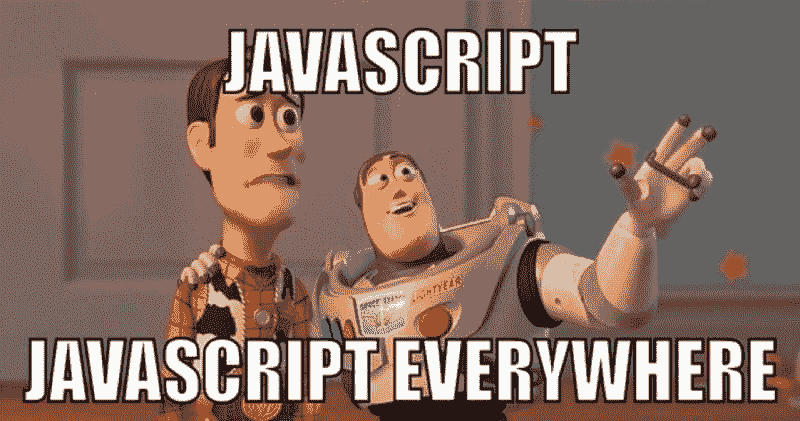](https://res.cloudinary.com/practicaldev/image/fetch/s--kFZxysdL--/c_limit%2Cf_auto%2Cfl_progressive%2Cq_auto%2Cw_880/https://thepracticaldev.s3.amazonaws.com/i/vwq29i5h7hd3qwva6hhn.jpg)

那么 Javascript 的这种单线程和同步性呢？这可以归结为语言的两个非常重要的功能。也就是说，不管我们的代码有多少行，我们写的所有东西都会一行接一行地执行，一次一个命令。Javascript 有一个线程，在这个线程中，我们编写的命令被执行，只有在前一个线程完成时，下一个线程才会被执行。结束了。嘿，但是异步...-你可能会问。我知道，我知道，但是请等一会儿。现在是我最喜欢的 console.logs 的时候了。

[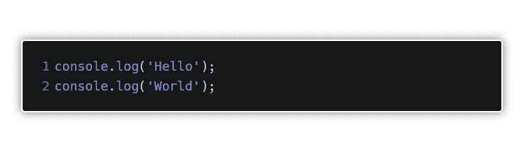](https://res.cloudinary.com/practicaldev/image/fetch/s--IAosSQdi--/c_limit%2Cf_auto%2Cfl_progressive%2Cq_auto%2Cw_880/https://thepracticaldev.s3.amazonaws.com/i/kmr9ewrk3lzm51lij7fj.png)

即使在这种情况下，当我们不执行复杂的任务时，命令 *console.log('World')* 也会在第一个- *console.log ('Hello')* 完成后才执行。一个线程，同步。然而，我最喜欢的例子是下面的，虽然看起来它应该返回 true，但它没有。

[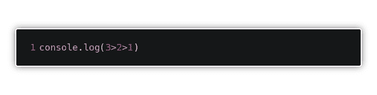](https://res.cloudinary.com/practicaldev/image/fetch/s--cB7_Zmxl--/c_limit%2Cf_auto%2Cfl_progressive%2Cq_auto%2Cw_880/https://thepracticaldev.s3.amazonaws.com/i/e0nn30cevve61et3nrew.png)

这是因为 JavaScript 引擎没有把这个表达式 *(3 > 2 > 1)* 作为一个整体来看待。当然，在第一步，它估计 *3 > 2* ，由于基本的数学运算，返回*真值*。这个*真值*被解析为数字 1，因为我们不知道真值是否大于数字 1。最后，引擎查看为假的 *1 > 1* ，因此整个表达式的结果为假。
所以再一次概括地说——单线程，同步。

在这个激动人心的介绍之后，这实际上只是一个提醒，我们将转移到...又一次重复我之前帖子已经写过的内容([执行上下文:执行阶段](https://www.2n.pl/blog/javascript-part-5)、[提升、执行上下文:创建阶段](https://www.2n.pl/blog/javascript-part-4)、[调用、执行栈](https://www.2n.pl/blog/javascript-part-7))。执行上下文和执行堆栈(也称为调用堆栈)。第一个在我们每次调用函数时出现，它包含关于变量的信息。后者只是一个堆栈，被调用函数的执行上下文被推到这个堆栈上。然而，在这种情况下，没有文字能像几行代码一样描述它。

[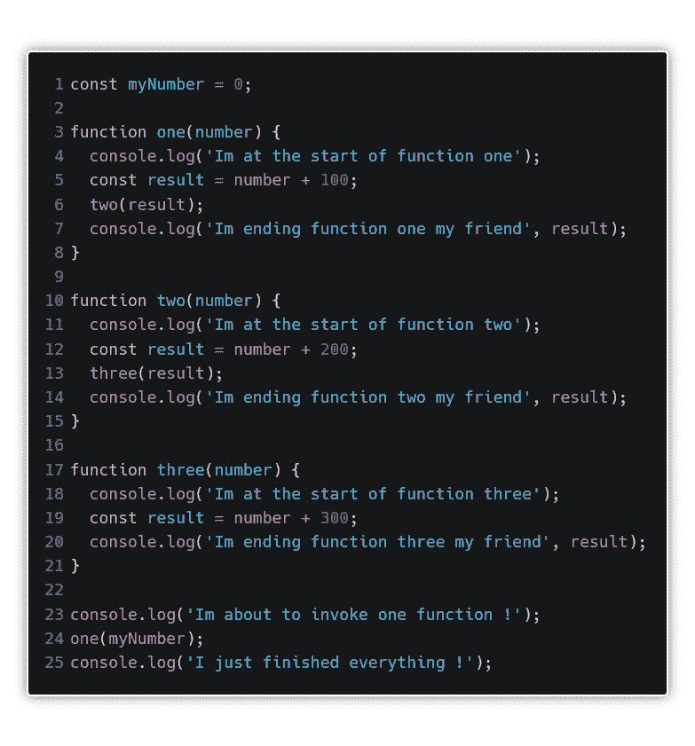](https://res.cloudinary.com/practicaldev/image/fetch/s--c8YGDjs2--/c_limit%2Cf_auto%2Cfl_progressive%2Cq_auto%2Cw_880/https://thepracticaldev.s3.amazonaws.com/i/n7uvnwq9ty9heoocpt7p.png)

为什么有这么多控制台日志？嗯，我认为没有什么比记录此刻发生的事情更好的了。当我们运行脚本时，所有的变量和函数语句都会被存储在内存中([吊装](https://www.2n.pl/blog/javascript-part-4)各位)，然后代码就开始执行了(执行阶段)。我将使用 chrome 开发工具，并设置一些断点，这样我们就可以随时暂停脚本的执行。

如您所见，我在每个函数的开头和结尾设置了它们，日志会通知我们函数代码何时开始执行，何时结束。由于代码是从上到下执行的，所以在第 23 行之前什么都不会发生...然后 boom，第一个 console.log 出现了。

[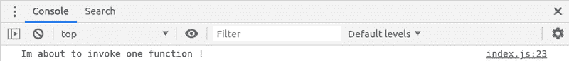](https://res.cloudinary.com/practicaldev/image/fetch/s--BogmIDWd--/c_limit%2Cf_auto%2Cfl_progressive%2Cq_auto%2Cw_880/https://thepracticaldev.s3.amazonaws.com/i/0l3xu4io3twb8hlfqts2.png)

断点设置在函数一的开头(注意！断点在标记行之前暂停，在本例中是在 console.log 之前！)通知我们 console.log('我将要调用一个函数！')和一个(myNumber)被执行。另一方面，console.log('我刚做完所有的事！')没有显示，尽管它是下面的一行。为什么？为什么看起来好像我们在第四线？因为被调用函数的执行上下文被推送到堆栈上，之后的一切对 JavaScript 引擎来说都无关紧要。

[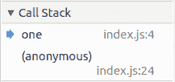](https://res.cloudinary.com/practicaldev/image/fetch/s--kTF7WSfz--/c_limit%2Cf_auto%2Cfl_progressive%2Cq_auto%2Cw_880/https://thepracticaldev.s3.amazonaws.com/i/bvp3i4bumo0btrtmh56q.png)

这里我们有一个蓝色的箭头，它显示了当前执行代码的执行上下文。好了，现在让我们进入下一个断点。会在 7 号线吗？

[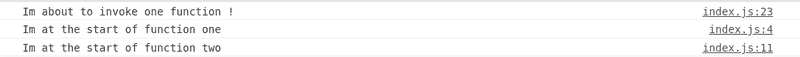](https://res.cloudinary.com/practicaldev/image/fetch/s--Nm29taal--/c_limit%2Cf_auto%2Cfl_progressive%2Cq_auto%2Cw_880/https://thepracticaldev.s3.amazonaws.com/i/40a22axsyd1nnw9cfkhf.png)

事实证明，我们已经在函数 2 中了，在这个函数被调用之后，什么都没有了。所以…

...必须等待。另一方面，函数二的执行上下文位于堆栈上。

[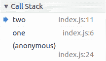](https://res.cloudinary.com/practicaldev/image/fetch/s--s81-gtAQ--/c_limit%2Cf_auto%2Cfl_progressive%2Cq_auto%2Cw_880/https://thepracticaldev.s3.amazonaws.com/i/01wkuiqun3vemol2bs7f.png)

在这个例子中，函数三被调用，所有的工作都和第一个例子一样。最后一个 console.log 必须等待，因为我们已经到达了函数三的执行上下文。

[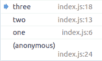](https://res.cloudinary.com/practicaldev/image/fetch/s--9Bd6VE-H--/c_limit%2Cf_auto%2Cfl_progressive%2Cq_auto%2Cw_880/https://thepracticaldev.s3.amazonaws.com/i/05o15iwvvdr21lfdljcs.png)

这里的事情很简单。我们没有调用任何东西(在函数 3 中)，所以现在整个事情都结束了。在控制台中，我们有:

[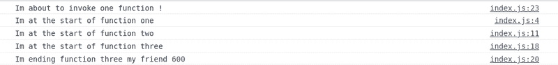](https://res.cloudinary.com/practicaldev/image/fetch/s--7Hp-KIUX--/c_limit%2Cf_auto%2Cfl_progressive%2Cq_auto%2Cw_880/https://thepracticaldev.s3.amazonaws.com/i/preeacnzkahclzpyt4az.png)

好了，剩下的代码呢？我们会忘记吗？当然不是。因为我们在这个阶段不会创建新的执行上下文，所以当所有的事情都完成后，它会自动从我们的堆栈中弹出...

...我们将回到…

[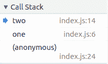](https://res.cloudinary.com/practicaldev/image/fetch/s--S2WY0bSd--/c_limit%2Cf_auto%2Cfl_progressive%2Cq_auto%2Cw_880/https://thepracticaldev.s3.amazonaws.com/i/dctfrfpgtu1226j0w4hn.png)

所以我们又回到了函数二的执行上下文中，结果是仍然有事情要做。关闭的 console.log 被打印出来，如上所述，我们从堆栈中弹出执行上下文。最后一个还在。

[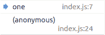](https://res.cloudinary.com/practicaldev/image/fetch/s--ZSX37u8J--/c_limit%2Cf_auto%2Cfl_progressive%2Cq_auto%2Cw_880/https://thepracticaldev.s3.amazonaws.com/i/ul2b9uw6rdt6t6b21fxa.png)

在这里，剩下的一切都将完成。

而且既然都做了，栈也空了！唷，我们身后有很多照片，所以也许现在是时候做一些不重复的事情了？！

我在上面提到过，我想把所有的东西都放在一个帖子里，但是我决定做这个“小”提醒还有一个原因。现在想象一下，当访问各种网站时，上面讨论的例子是网站运行的唯一方式。必须做点什么才能开始下一件事。你可能会同意，从用户的角度来看，这是非常麻烦的。一个很好的例子就是这样。

[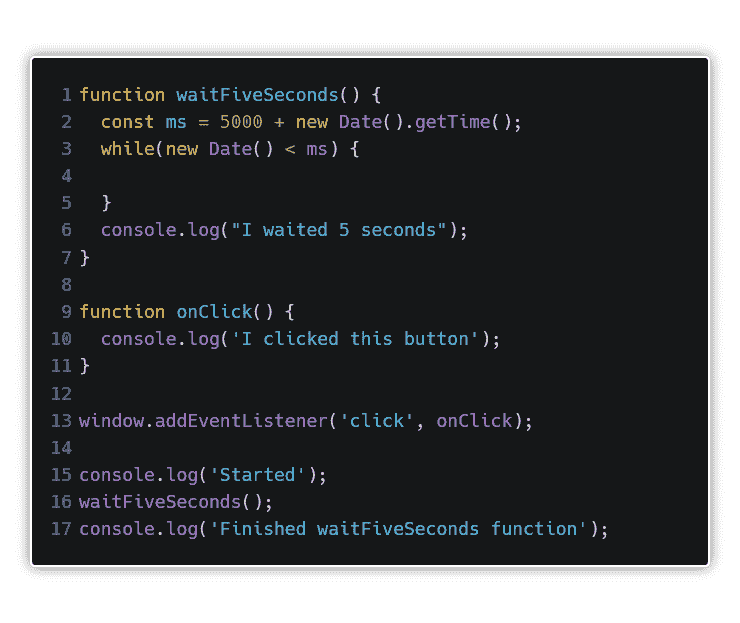](https://res.cloudinary.com/practicaldev/image/fetch/s--7B3aQvd_--/c_limit%2Cf_auto%2Cfl_progressive%2Cq_auto%2Cw_880/https://thepracticaldev.s3.amazonaws.com/i/hnci14c6d4hkd406nk1y.png)

函数 waitFiveSeconds 做了它被调用的事情——它等待五秒钟。因为 JavaScript 是单线程和同步的，所以在前 5 秒内我们点击鼠标多少次都没有关系。最终，结果会是:

[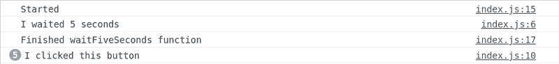](https://res.cloudinary.com/practicaldev/image/fetch/s--GGgvrK4N--/c_limit%2Cf_auto%2Cfl_progressive%2Cq_auto%2Cw_880/https://thepracticaldev.s3.amazonaws.com/i/vtwpyxo14gv2t2sw1epn.png)

相信我，我很努力了。正如我上面写的，这将是非常乏味的。然而，幸运的是，浏览器中的 JavaScript 活动更加复杂，在主线程和唯一的 JavaScript 线程中发生的事情并不是浏览器中实际发生的唯一事情。那太无聊了，对吗？

然而，上面的例子向我们展示了什么？主要是阻塞主 JavaScript 线程中应该发生的事情是非常危险的。如果需要一些时间来执行的东西会在堆栈上着陆，这很容易破坏用户访问我们网站的体验。既然我们已经知道不应该这样做，那我们还能做什么呢？答案很简单——异步回调。

[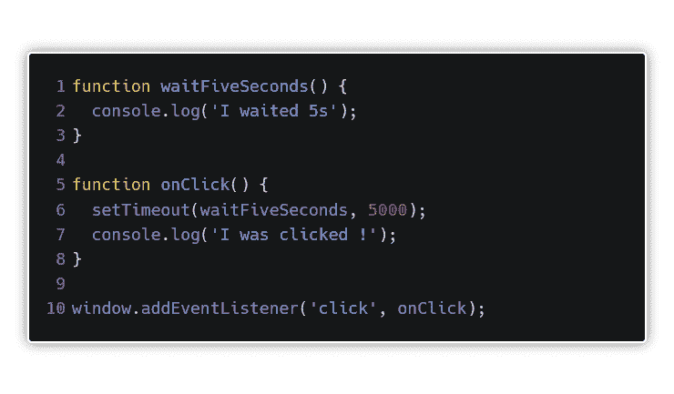](https://res.cloudinary.com/practicaldev/image/fetch/s--opJxtJOz--/c_limit%2Cf_auto%2Cfl_progressive%2Cq_auto%2Cw_880/https://thepracticaldev.s3.amazonaws.com/i/0qa3c16opok6pxeu0cif.png)

在上面的例子中，我们有两个函数。一个在单击时调用(on click ),并调用 setTimeout()。在我们的例子中，setTimeout 接受两个参数。第一个是我们想要调用的函数(也称为回调函数)。第二个告诉调用传递的回调需要多长时间。这一次，单击浏览器窗口将导致以下结果:

[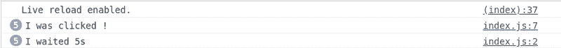](https://res.cloudinary.com/practicaldev/image/fetch/s--fStFh7-v--/c_limit%2Cf_auto%2Cfl_progressive%2Cq_auto%2Cw_880/https://thepracticaldev.s3.amazonaws.com/i/fs3hwh9kq500r98c4hyp.png)

在上面的例子中，我们有两个函数。一个是在单击时调用的(on click)，这意味着 setTimeout()。在我们的例子中，setTimeout 接受两个参数。第一个是我们想要调用的函数(也称为回调函数)。第二个告诉调用传递的回调需要多长时间。这一次，单击浏览器窗口将得到类似这样的内容:

[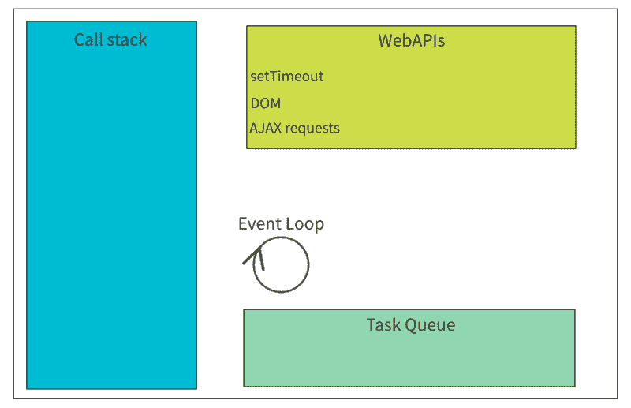](https://res.cloudinary.com/practicaldev/image/fetch/s--YUQFv5p7--/c_limit%2Cf_auto%2Cfl_progressive%2Cq_auto%2Cw_880/https://thepracticaldev.s3.amazonaws.com/i/q1s1e2dest4yboft69sn.png)

正如我上面提到的，浏览器中会发生很多事情，其中一些是事件循环、任务队列和 web APIs。后者，如 ajax 请求、setTimeout 或 DOM(文档本身)与堆栈和任务队列通信。让我们以最后一段代码为例。有些人可能会感到惊讶，代码似乎没有等待 waitFiveSeconds 函数就消失了。这是因为 setTimeout 使用计时器 API。整个动作从堆栈中取出的时间相当于我们作为第二个参数给出的毫秒数。此外，setTimeout 回调是异步的。当然，并不是 JavaScript 中的所有回调都是这样的。更何况大部分都是同步的。例如我们传递给 map()或 filter()这样的数组方法的回调。然而，有些行为是异步的。示例中最简单也是最常用的是 setTimeout。它让我们模拟从服务器获取数据。

[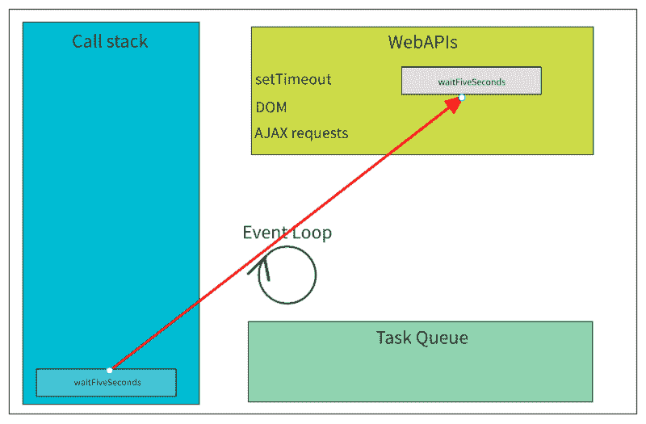](https://res.cloudinary.com/practicaldev/image/fetch/s--a3Okuou2--/c_limit%2Cf_auto%2Cfl_progressive%2Cq_auto%2Cw_880/https://thepracticaldev.s3.amazonaws.com/i/jwgewbljyjqvx0df07ok.png)

由于 waitFiveSeconds 函数暂时从堆栈中释放，“我被点击了！”出现在控制台上。5s 后，函数 waitFiveSeconds 将从 web APIs 被推送到任务队列

[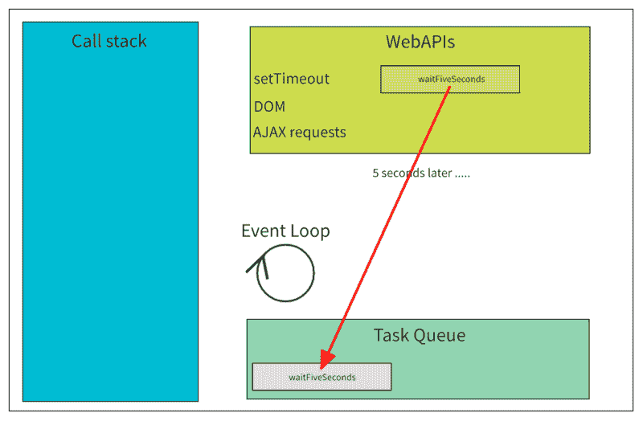](https://res.cloudinary.com/practicaldev/image/fetch/s--pclZoBmz--/c_limit%2Cf_auto%2Cfl_progressive%2Cq_auto%2Cw_880/https://thepracticaldev.s3.amazonaws.com/i/31icsilgkvlqi6b0rg3j.png)

任务队列只不过是一个将任务推送到其上的队列。没有什么可以阻止你排队完成多个任务。当然，我们不希望异步函数被遗忘，所以我们必须以某种方式将它们重定向回堆栈。幸运的是，我们不必亲自解决它——如果我们的堆栈是空的(意味着什么也不做，没有执行上下文被创建),并且我们的任务队列不是空的，那么第一件事被推出任务队列。由于 waitFiveSeconds 函数暂时从堆栈中释放，“我被点击了！”出现在控制台上。5s 后，函数 waitFiveSeconds 将从 web APIs 被推送到任务队列。

[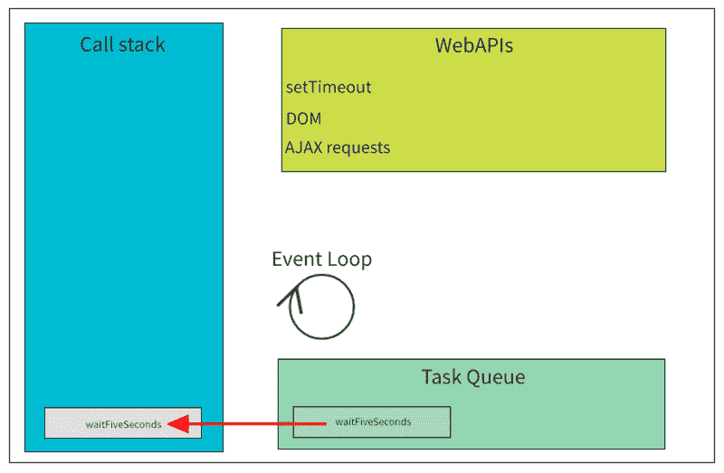](https://res.cloudinary.com/practicaldev/image/fetch/s--4DKQeZzS--/c_limit%2Cf_auto%2Cfl_progressive%2Cq_auto%2Cw_880/https://thepracticaldev.s3.amazonaws.com/i/mv6pkpwnkw3ara75dc39.png)

使用 setTimeout 最常见的例子是当我们将第二个参数设置为 0 时。最后一段代码稍微改动一下，你觉得会怎么样？

[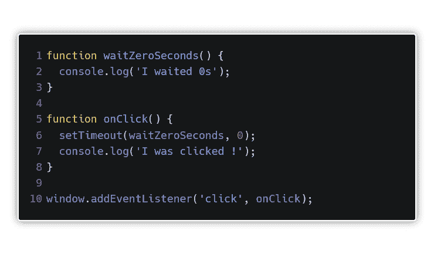](https://res.cloudinary.com/practicaldev/image/fetch/s--DpCiHNBJ--/c_limit%2Cf_auto%2Cfl_progressive%2Cq_auto%2Cw_880/https://thepracticaldev.s3.amazonaws.com/i/hq49614e0ji0m4tm49dj.png)

准确地说，结果与上一个非常相似。

这是因为函数 waitZeroSeconds 已经被推迟，只有当堆栈变空时才会执行。考虑到在点击之后，我们的栈不能是空的，因为函数 onClick 的执行上下文在它上面。只有在所有已经初始化的内容都弹出堆栈后(在我们的例子中是 console . log(' I is clicked ')，才会执行 waitZeroSeconds 函数。

既然我们已经了解了浏览器中的 JavaScript 异步性以及同步 JavaScript 如何处理这种情况，那么让我们来看一个例子，其中我们有两个对外部 API 的简单查询，以及两个外部的 console.logs。

[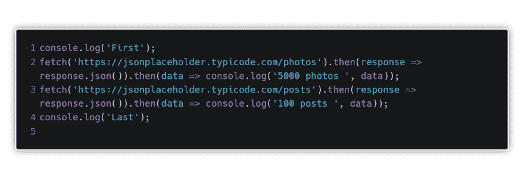](https://res.cloudinary.com/practicaldev/image/fetch/s--WwRDtlec--/c_limit%2Cf_auto%2Cfl_progressive%2Cq_auto%2Cw_880/https://thepracticaldev.s3.amazonaws.com/i/eexouyqyadqzxzqcba8x.png)

Fetch 是 XMLHttpRequest 的现代替代品，它异步发生。它用于向 API 发送检索数据的请求。

事情很简单。开始时，在控制台中我们会看到:

[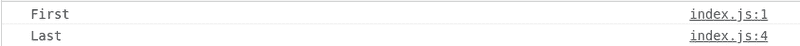](https://res.cloudinary.com/practicaldev/image/fetch/s--Aes50baS--/c_limit%2Cf_auto%2Cfl_progressive%2Cq_auto%2Cw_880/https://thepracticaldev.s3.amazonaws.com/i/crn2km4rwni87aun911x.png)

因为我们知道 fetch 是异步工作的，所以在清除堆栈后，我们将得到一个 console.logs。然而，问题是以什么样的顺序呢？(提示:检查表示提取的数据量的数字)。

那又怎样？

[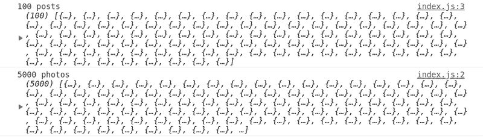](https://res.cloudinary.com/practicaldev/image/fetch/s--hwyrSnN9--/c_limit%2Cf_auto%2Cfl_progressive%2Cq_auto%2Cw_880/https://thepracticaldev.s3.amazonaws.com/i/uca671ntvhw9ycksnr3y.png)

一切都很好很简单，对吗？差不多了。在上面的例子中，出现了一个想法——如果我们想首先获得数据并在第二个查询中使用它，该怎么办？让我们看看另一个案例。

请注意，我们不知道帖子的 id，也不知道将请求发送到端点.../ posts / 1 才能真正得到它。然后我们想使用保存的 id 并检索所有属于这个 id 的评论。

不幸的是，我们没有成功。这是因为我们的堆栈中只有一个查询，没有关于 id 的信息。现在我们将稍微修改一下上面的代码。

[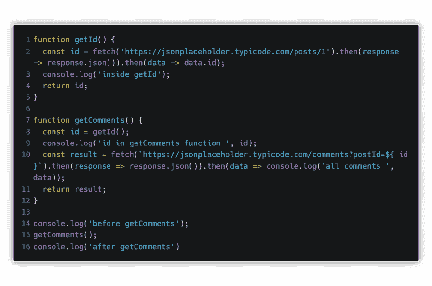](https://res.cloudinary.com/practicaldev/image/fetch/s--ZOkN062E--/c_limit%2Cf_auto%2Cfl_progressive%2Cq_auto%2Cw_880/https://thepracticaldev.s3.amazonaws.com/i/ldgwr72k0t45hotttv3v.png)

巩固知识是基础，所以我再描述一遍顺序。

1.  获取评论前
2.  内部 getId
3.  getComments 函数中的 id
4.  获得评论后
5.  所有评论

我们能做些什么来正确地获得关于评论的数据？解决方案很少，但最新/最流行的是使用 async / await。

[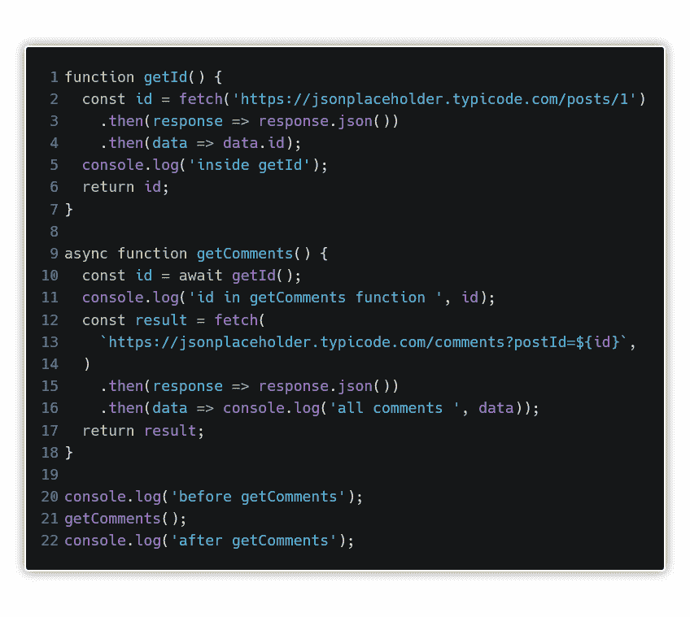](https://res.cloudinary.com/practicaldev/image/fetch/s--qIuXXVW9--/c_limit%2Cf_auto%2Cfl_progressive%2Cq_auto%2Cw_880/https://thepracticaldev.s3.amazonaws.com/i/xhjg2rqho8nihwfp3h7i.png)

[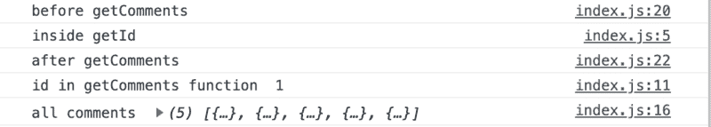](https://res.cloudinary.com/practicaldev/image/fetch/s--CKchWKUu--/c_limit%2Cf_auto%2Cfl_progressive%2Cq_auto%2Cw_880/https://thepracticaldev.s3.amazonaws.com/i/lxh9o6p2r5h9jhotb9w5.png)

简单愉快对吗？我们唯一做的是添加两个关键字——async/await。然而，到底发生了什么？这里我们将不得不进入 Javascript 中称为 Promise 的领域。有哪些承诺？首先这些是对象，其次是相当具体的对象。最重要的是，它们只是简单的承诺，以类似于日常生活的形式出现。我们每个人都曾在生命中的某个时刻许下承诺。对父母说，我们会打扫房间，对雇主说，我们会准时到办公室。每个承诺都有两个阶段。第一阶段是我喜欢称之为短暂的阶段。看起来我们做出了承诺，我们会在今天结束前把垃圾拿出去。既然我们还有时间，我们的承诺就在州里

[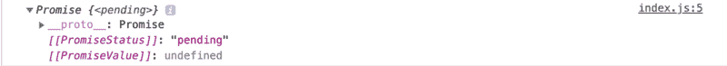](https://res.cloudinary.com/practicaldev/image/fetch/s--2ycRDOdO--/c_limit%2Cf_auto%2Cfl_progressive%2Cq_auto%2Cw_880/https://thepracticaldev.s3.amazonaws.com/i/h29ngcnxtx44s9bkuivw.png)

那就是等待最后的结果。在这种情况下，该值将未定义。下一阶段将告诉我们是否能够在一天结束前把这些不幸的垃圾拿出去。如果是的，我们的任务已经成功，那么状态将很容易猜测-。

[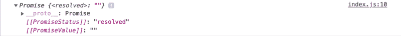](https://res.cloudinary.com/practicaldev/image/fetch/s--vAKr3DF1--/c_limit%2Cf_auto%2Cfl_progressive%2Cq_auto%2Cw_880/https://thepracticaldev.s3.amazonaws.com/i/2vrzlj45a8l662qp8w77.png)

例如，这里的值只是一个空字符串。然而，如果我们忘记了，我们没有履行承诺，那么状态将是(也是一个空字符串)。

[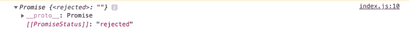](https://res.cloudinary.com/practicaldev/image/fetch/s--HaMDojqC--/c_limit%2Cf_auto%2Cfl_progressive%2Cq_auto%2Cw_880/https://thepracticaldev.s3.amazonaws.com/i/fzb4pwm07buam2lac4wg.png)

根据状态的不同，可能会发生不同的事情。让我们从一个简单的例子开始。

[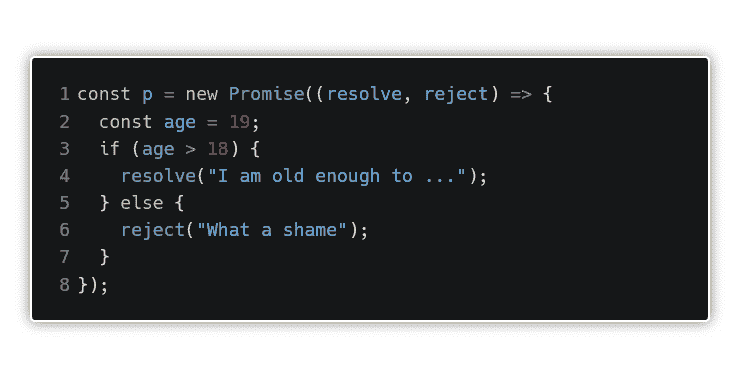](https://res.cloudinary.com/practicaldev/image/fetch/s--r5R4pa2N--/c_limit%2Cf_auto%2Cfl_progressive%2Cq_auto%2Cw_880/https://thepracticaldev.s3.amazonaws.com/i/7wraunpinwa91p1mrjge.png)

“这到底是怎么回事”——你可能会问？嗯，通过 new Promise，我们创建了一个新的对象，它接受带有两个参数的回调函数——resolve 和 reject，我们稍后会根据我们是 18 岁以上还是 18 岁以下来使用这两个参数。你可以很容易地猜到，当我们履行承诺时，决心将帮助我们处理变量，当我们不履行承诺时，决心将拒绝变量。看起来很简单，对吧？现在我们继续。如果你答应了什么...好吧，然后呢？在这里，关键字“then()”溜了进来。履行的承诺将成为已解决的承诺对象。“then()”获取这个值，并使用回调函数以某种方式处理它。让我们稍微修改一下代码，然后使用 then()。

[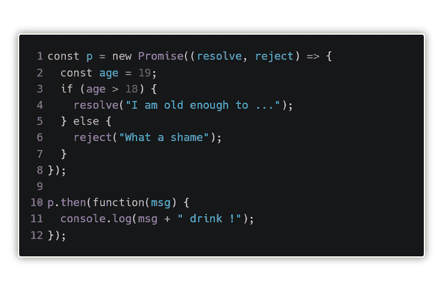](https://res.cloudinary.com/practicaldev/image/fetch/s--Tq_5c65R--/c_limit%2Cf_auto%2Cfl_progressive%2Cq_auto%2Cw_880/https://thepracticaldev.s3.amazonaws.com/i/p1khbguerbmbowvy933v.png)

看啊。在 then()中，我们使用了带有 msg 参数的回调。因为我们已经知道承诺会实现，所以 msg 会接受我们在 resolve()中拥有的参数的值。在我们的例子中，它将是一个字符串——“我已经足够大了……”。由于这一点，我们将获得

现在让我们看看当我们将变量中的年龄改为小于 18 岁时会发生什么，假设是 17 岁。

我们弄错了。这是因为 then()用于处理您的已解决承诺。另一方面，如果我们想要捕捉一个我们未能实现的承诺(被拒绝)，我们将使用 catch()。所以让我们在代码中加入 catch()，保持 17 岁的年龄。

[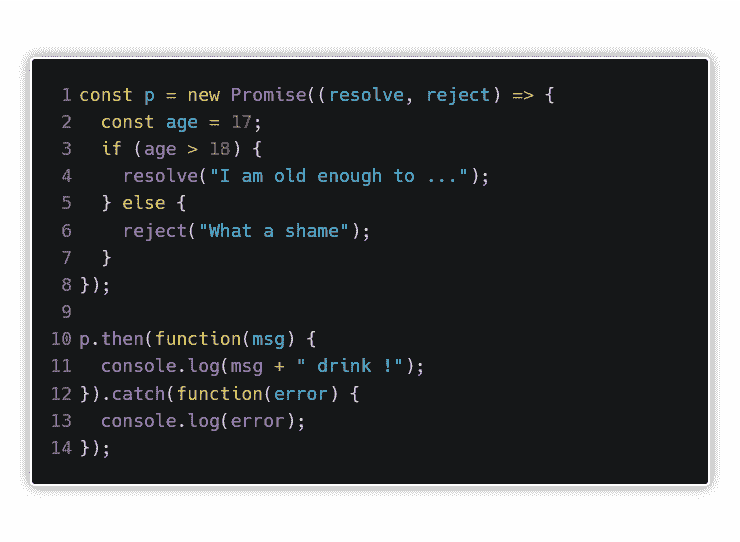](https://res.cloudinary.com/practicaldev/image/fetch/s--4MjYPJR0--/c_limit%2Cf_auto%2Cfl_progressive%2Cq_auto%2Cw_880/https://thepracticaldev.s3.amazonaws.com/i/iaavrlxc0toc2qi4rr6a.png)

它看起来会像这样。当然原理是一样的。在错误参数中，我们得到了一个参数，但这次是 reject()字符串“真可惜”。是的，结果会是:

正如我建议的。一切都相当简单和透明。好，我们再加一个承诺..

[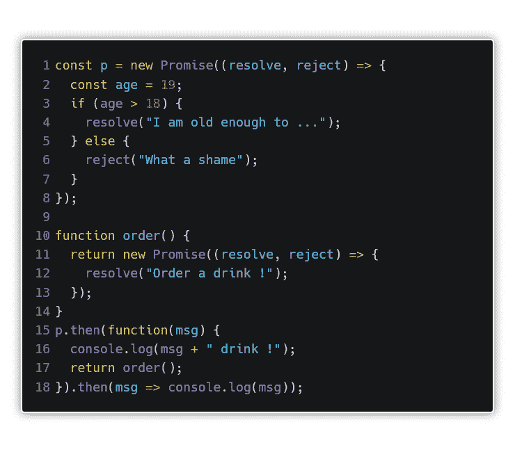](https://res.cloudinary.com/practicaldev/image/fetch/s--th44E-pF--/c_limit%2Cf_auto%2Cfl_progressive%2Cq_auto%2Cw_880/https://thepracticaldev.s3.amazonaws.com/i/iqx22ry8lhpl98eha5cr.png)

如您所见，我们已经创建了 order 函数，它将返回一个承诺。它与前一个承诺相同，唯一的区别是在这种情况下它总是被解析，所以它的值是 resolve()中的一个参数。但更有趣的是底部是什么。在第 17 行，我们调用了函数 order。由于在 then()中我们返回了 promise，所以我们可以再次使用 then()(在最后我们返回了 promise)，但这一次履行 Promise 的结果将是 resolve()中给出的参数，这是在函数顺序中。

[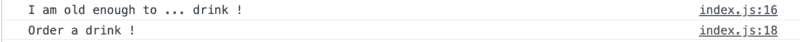](https://res.cloudinary.com/practicaldev/image/fetch/s--LZglS9RP--/c_limit%2Cf_auto%2Cfl_progressive%2Cq_auto%2Cw_880/https://thepracticaldev.s3.amazonaws.com/i/s5e21s08lylzhwzey2k7.png)

那么这一切是怎么回事呢？这给了我们什么？嗯，多亏了这个，我们可以把承诺链接起来，把之前承诺的结果传递给下一个。此外，结果将总是通过(解决或拒绝的承诺)，这在与外部 API 的通信中非常有帮助。我会稍微修改一下前面的代码，添加一些返回承诺的函数，并将它们链接起来。

通过捕获回调函数参数中的值，我们可以传递所有的东西。让我也提一下，值得记住的是，我们应该总是使用 catch()来确定什么时候意外失败。由于使用了承诺，我们不必为每个函数调用 catch()。在任何一个承诺链的末尾加 1 个 catch()就够了。好了，在简短描述了承诺之后，让我们回到 async / await，感谢它让我们能够首先获得帖子的 id，然后用它从 API 获取更多信息。那么 async / await 做什么呢？让我们回到前面的例子。

为什么会成功？我们已经收到了预期的结果，因为 await 停止了函数的进一步执行，直到我们得到响应。因此，只有当函数 getId 能够从第 11 行返回 Id、console.log 时，函数中的所有内容才会完成。这是一件非常重要的事情。只有当我们知道动作会阻塞主 javascript 线程，从而阻止用户与应用程序交互时，我们才应该使用它。好吧，但它还能给我们什么？嗯，async / await 引入了几个使代码可读性更好的工具。

这里我们有一个早期的代码，有一些变化。我们移除了所有 then()，代码看起来更好了，对吗？使用 await，我们不仅停止了函数代码的进一步执行，还获得了对 Promise 从 fetch 返回的答案的直接访问。

如你所见，我履行了我的承诺。我试图在一篇文章中包含所有相关信息。当然，您还可以添加更多的内容，但是最后，我认为如果一个开发新手想要学习更多关于 Javascript 中异步是如何工作的，那么他在这里已经有了几乎所有需要的信息。