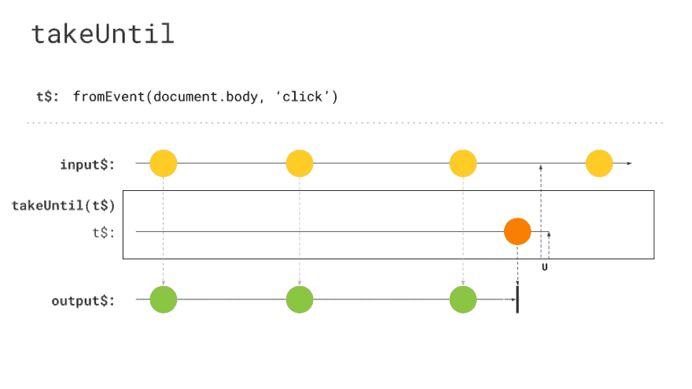

# 抓紧时间，抓紧时间，抓紧什么？

> 原文：<https://dev.to/rxjs/takewhile-takeuntil-takewhat-5006>

你可能已经知道，有些情况下你确实想取消订阅你的`Observables`。
有几种方法可以做到这一点。在几个项目中，我偶然发现混合使用 [`takeWhile`](https://rxjs.dev/api/operators/takeWhile) & [`takeUntil`](https://rxjs.dev/api/operators/takeUntil) 。这就提出了一个问题，为什么会有两个听起来相似，作用相似的东西？

## 关于拍摄时间

让我们看一个简单的例子。我们看到的第一个代码片段是使用`takeWhile`取消对`Observable`的订阅。

[https://stackblitz.com/edit/rxjs-dev-takewhile?embed=1&&](https://stackblitz.com/edit/rxjs-dev-takewhile?embed=1&&)

在这个例子中，我有两个不同的`Observables`。第一个是使用[间隔操作符](https://rxjs.dev/api/index/function/interval)创建的。这将发出通知，直到传递给`takeWhile`的条件为假。在`takeWhile`中，我们使用一个布尔变量来描述用户是否已经点击。只要在屏幕上的某个地方点击一下，我们就会取消订阅我们的`interval` -Observable。为了确定用户是否已经点击，我们使用了用来自事件操作符创建的第二个`Observable`。此外，我们使用 [tap 操作符](https://rxjs.dev/api/operators/tap)，在控制台中记录通知。我们可以看到，一旦没有新的日志进入，我们的可观察对象就被取消订阅。

## 关于 takeUntil

[https://stackblitz.com/edit/rxjs-dev-takeuntil?embed=1&&](https://stackblitz.com/edit/rxjs-dev-takeuntil?embed=1&&)

从高层次的角度来看，代码片段看起来没有什么不同。我们现在直接使用了`click` -Observable，而不是布尔属性来描述我们的`Observable`的状态。
我们将这个`Observable`实例传递给`takeUntil`操作者，只要用户点击某个地方，我们的`interval`可观察对象就会被取消订阅。

## 问题

总而言之，这两个代码片段看起来相似，行为也相似，对吗？哦，不！让我们来看看描述这些运算符的大理石图，因为这将突出这两个运算符之间的差异。

[](https://res.cloudinary.com/practicaldev/image/fetch/s--f1F89WRE--/c_limit%2Cf_auto%2Cfl_progressive%2Cq_auto%2Cw_880/https://raw.githubusercontent.com/rxjs-blog/blog/master/blog-posts/takeuntil-takewhile/assets/takeUntil.png) 
*takeUntil 大理石图，由 [Michael Hladky](https://twitter.com/Michael_Hladky)* 好心提供

[](https://res.cloudinary.com/practicaldev/image/fetch/s--sOoL_NXW--/c_limit%2Cf_auto%2Cfl_progressive%2Cq_auto%2Cw_880/https://raw.githubusercontent.com/rxjs-blog/blog/master/blog-posts/takeuntil-takewhile/assets/takeWhile.png) 
*takeWhile 大理石图，由 [Michael Hladky](https://twitter.com/Michael_Hladky)* 好心提供

这里的问题是,`takeWhile`打算接受一个传入的通知并检查它的特定条件，这可能会导致取消订阅。重要的事实是，`takeWhile`是由传入通知触发的，之后可能会取消订阅。相比之下，`takeUntil`是由通过的`Observable`触发的。这就是为什么`takeWhile`可能会引发几个问题。所以肯定的是，它需要一个新的通知来取消订阅。想象一下有一个长寿的`Observable`。使用`takeWhile`比使用`takeUntil`更需要一个通知。另外，这个额外的通知可以在您的`Observable`中启动多个流程。想象有这样的代码:

```
longLivingObservable$
  .pipe(
    tap(() => this.startAnimation()),
    switchMap(val => this.makeHttpCall(val)),
    takeWhile(val => this.alive),
  )
  .subscribe(); 
```

Enter fullscreen mode Exit fullscreen mode

那么这段代码有什么问题呢？我们的组件已经被销毁了，由于需要通知，在取消订阅开始之前需要通知，我们将启动一个动画并触发一个 HTTP 调用。这可能是不想要的，之后我们会检查是否要取消订阅我们的`Observable`。除了这些操作完全多余的事实，它还可能破坏我们的应用程序或污染我们的国家。

此外，如果我们的`Observable`没有发出附加值，那么`takeWhile`将永远不会被触发，因此我们的`Observable`将永远不会被取消订阅。这可以被认为是内存泄漏，因为我们的`Observable`保持订阅状态。

*现在也许有人会说:“好吧，我可以在可观察管道的最开始移动`takeWhile`操作符！”*

这是真的，你可以这样做，你将保存不需要的操作，这是一个好的开始，但你不会取消订阅内在的观察。所以如果`makeHttpCall`返回的`Observable`是一个长寿的`Observable`，如果`takeWhile`在管道中的`switchMap`之前，它不会退订。顺便说一下，`takeUntil`也是如此，所以确保在管道的最末端有一个取消订阅操作符。

## 解

不要误会，`takeWhile`是一个很神奇的算子，但只是如果你真的用传入值来确定，要不要退订！使用`takeWhile`时，不依赖于“全局”状态。
对于那些场景，坚持使用`takeUntil`并使用主题实例来触发它。

`takeWhile`的一个真实用例是长轮询机制。想象一下获取一个描述流程的资源。该过程可以成功完成或者继续进行。当然，您只是想在过程尚未完成时继续轮询。这种场景的代码可能如下所示。

```
longPolling$.pipe(takeWhile(process => process.completed)).subscribe(() => handleNotCompleted()); 
```

Enter fullscreen mode Exit fullscreen mode

对于这样一个场景，我们使用传入的遗嘱来确定我们是否想要继续订阅，`takeWhile`是理想的！如果我们有一个外部触发器，坚持使用`takeUntil`。

## 总结起来

*   当传入值使您想要取消订阅时，请使用 takeWhile
*   使用 takeUntil 当有外部事件确定您想要取消订阅时
*   使用他们两个作为您的`Observable`管道中的最后一个操作符
    *   [这有一个 tslint 规则](https://github.com/cartant/rxjs-tslint-rules)

## 特别感谢

我真的很感谢所有帮助我写这篇博文的人。
这出去是为了:

*   乔迪·兰根
*   迈克尔·赫拉迪克
*   蒂姆·德施里弗
*   托拜厄斯·斯特鲁克迈尔
*   [曼弗雷德·斯特耶](https://twitter.com/ManfredSteyer)
*   [桑德伊利亚](https://twitter.com/esosanderelias)
*   [Wes Grimes](https://twitter.com/wesgrimes)