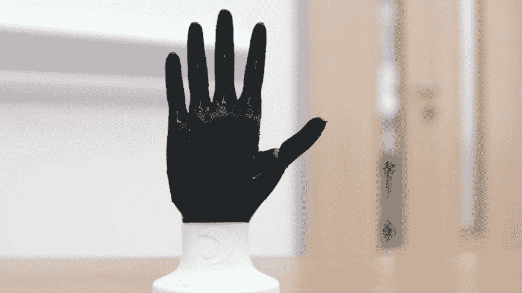

# 技术和医学

> 原文：<https://dev.to/chetchopra/technology-and-medicine-2mk8>

# 为什么

这里的为什么是关于为什么我选择写这个话题。虽然我觉得这个话题已经被很好的探讨过了。我也觉得许多人可以从重新探索技术如何影响医学面貌中受益。我希望让读者了解事情是如何加速的，并在需要时给他们带来希望。

**本文将遵循以下格式**

*   增加外联/沟通
*   三维打印
*   大数据

## 增加外联和沟通

正如我们都可能猜到的那样，看医生要等多长时间，他们是非常忙碌的人。在技术真正在医疗领域发挥作用之前，医生很难轻松接触到患者，反之亦然。现在，通过互联网和网络应用的力量，专注于改善患者和医生之间联系的技术已经出现。

在过去，人们可能不得不等待邮件或电话来讨论测试结果。邮件的问题是你必须等几天才能收到，而打电话你只能了解这么多细节。

现在，像 Medici 和 SoundCare 这样的应用程序已经消除了这些障碍，并改善了患者和医生之间的整体沟通。这些应用程序允许安全的消息传递、预约请求、实验室结果共享、记录个人信息，甚至语音通信。这使得患者可以很容易地询问与健康相关的问题，并且让医生在比以前更短的时间内回答这些问题。

除了能够通过应用程序方便地联系到您的医生，技术还增加了医疗社区内的外联和交流。

让我们玩一点假装。你现在是一名医生(万岁)，一名患者带着一个你似乎无法诊断的问题来了。在过去，医生可能会继续与诊断作斗争，或者只是让病人在没有诊断的情况下回家。现在，作为一名医生，你可以使用 Epocrates 和 Medscape 等医疗参考应用程序来帮助诊断。如果这也不起作用，你可以通过论坛、博客或电子邮件联系来自世界各地的广大医生群体。某个地方的某个人可能已经看到了类似的东西，随着科技的发展，这个人已经不再是问题了。

## 3D 打印

3D 打印在许多行业的应用越来越多，医疗行业也不例外。

Kaiser Permanente 的洛杉矶医疗中心正在完善 3D 打印的使用，以复制患者体内有问题区域的多维模型。外科医生可以在进行实际手术之前处理模型并模拟各种可能的手术复制品。

3D 打印不仅仅是帮助外科医生准备手术，它也帮助残疾人。一只假手可能要几千美元；然而，一个 3D 打印的假肢只需 50 美元就可以制造出来。3D 打印材料还不能取代传统制造的假体的长期耐用性。然而，这种情况很快就会改变。与此同时，技术正在使具有成本效益的假肢成为现实，并鼓励来自世界各地的创意人员参与他们的设计。

研究人员还在研究 3D 打印骨骼和器官作为人体替代品的能力。目前正在对人造心脏、肾脏和肝脏结构以及其他主要器官进行研究。一些打印器官正在接近临床实施的功能要求，主要包括中空结构如膀胱，以及血管结构如尿管。所以现在还没有，但是我们可以想象未来有人可以给你打印一个肾，而不是把他们的肾给你。

## 大数据

大数据这几年越来越大。在现代，数据似乎就是一切，尤其是在医疗行业。它可以帮助诊断患者，还可以根据收集的数据提供更准确的诊断。

IBM 研究团队表示，在 2011 年赢得一场危险游戏的超级计算机现在正被用来帮助医生做出更准确的诊断和推荐治疗方法。

### 资源

[https://www . hunimed . eu/news/technology-changing-world-medicine/](https://www.hunimed.eu/news/technology-changing-world-medicine/)
T3】https://www.amputee-coalition.org/3d-printed-prosthetics/
[https://en.wikipedia.org/wiki/Organ_printing](https://en.wikipedia.org/wiki/Organ_printing)